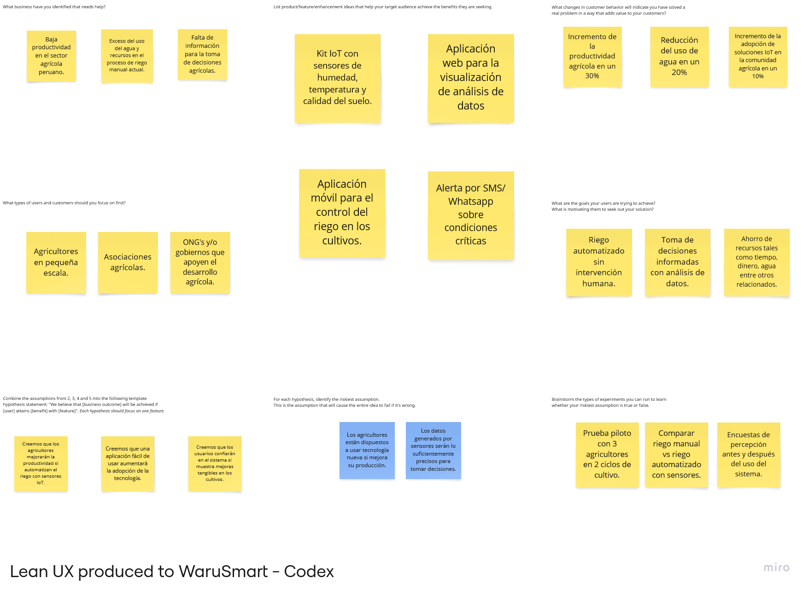

# 
WaruSmart-Codex-Report

  <h3>Universidad Peruana de Ciencias Aplicadas</h3>

  

  <h5>Ingeniería de Software - 7mo ciclo</h5>
  <h5>Desarrollo de Soluciones IOT - 1ASI0572</h5>
  <h5>NRC: 2947</h5>
  <h5>Docente: Angel Augusto Velasquez Nuñez</h5>
  <h5>Startup: Codex</h5>
  <h5>Producto: WaruSmart</h5>

## 
Team Members

<table>
  <thead>
    <tr>
      <th>Nombre</th>
      <th>Código</th>
    </tr>
  </thead>
  <tbody>
    <tr><td>Anderson Walter Macedo Calsina</td><td>U20201C179</td></tr>
    <tr><td>Cabrera Camizan, Jeferson Smith</td><td>U20211C211</td></tr>
    <tr><td>More Rondon, Christopher Sebastian</td><td>U202212199</td></tr>
    <tr><td>Quispe Condori, Fernando Daniel</td><td>U20221C628</td></tr>
    <tr><td>Velasquez Pizarro, Jair</td><td>U202218114</td></tr>
    <tr><td>Pingus Rodriguez, Carlos Daniel</td><td>U202113280</td></tr>
    <tr><td>Herrera Castillo, Victor Raul</td><td>U20201E188</td></tr>
  </tbody>
</table>

  <h5>Ciclo 2025-10</h5>

### Registro de Informes

| Versión | Fecha     | Autor(es)                                                                                      | Descripción de modificación                                                                 |
|---------|-----------|------------------------------------------------------------------------------------------------|---------------------------------------------------------------------------------------------|
| 0.1     | 04/04/25  | Anderson Walter Macedo Calsina                                                                 | Redacción del Perfil Inicial                                                               |
| 0.2     | 06/04/25  | Cabrera Camizan, Jeferson Smith                                                                | Proceso Lean UX, Mapeo de Eventos, Recolección de Testimonios, Contextos Delimitados       |
| 0.3     | 09/04/25  | More Rondon, Christopher Sebastian                                                              | Modelo C4, Encuesta Inicial                                                                |
| 0.4     | 10/04/25  | Quispe Condori, Fernando Daniel                                                                 | Perfil de Startup, Perfil de Solución, Entrevistas, Mapeo de Impacto, Cartografía de Contexto |
| 0.5     | 11/04/25  | Velasquez Pizarro, Jair                                                                         | Precisión del Context Mapping, Reconocimiento de Ámbitos Delimitados                      |
| 0.6     | 12/04/25  | Pingus Rodriguez, Carlos Daniel                                                                 | Ajustes en el Impact Mapping, Primeros Casos de Uso                                        |
| 0.7     | 14/04/25  | Herrera Castillo, Victor Raul                                                                   | Ajuste de Hipótesis UX, Preparación de Cuestionarios                                       |
| 0.8     | 17/04/25  | Anderson Walter Macedo Calsina, More Rondon, Christopher Sebastian                              | Correcciones al Modelo C4, Creación de Perfiles de Usuario                                 |
| 0.9     | 20/04/25  | Quispe Condori, Fernando Daniel, Velasquez Pizarro, Jair                                        | Escenario As-Is, Elaboración de Mapas de Empatía                                           |
| 1.0     | 22/04/25  | Anderson Walter Macedo Calsina, Cabrera Camizan, Jeferson Smith, More Rondon, Christopher Sebastian, Quispe Condori, Fernando Daniel, Velasquez Pizarro, Jair, Pingus Rodriguez, Carlos Daniel, Herrera Castillo, Victor Raul | Versión final de TB1: Portada, Historial de Cambios, Introducción, Necesidades, Detalles Técnicos, Propuesta de Solución |

### Project Report Collaboration Insights

URL del repositorio para el reporte del proyecto: https://github.com/upc-pre-202510-1asi0572-2947-codex/WaruSmart-Codex-Report/tree/develop

TB1
Para el desarrollo del informe perteneciente a la entrega TB1, se dividió la implementación de secciones de la siguiente forma
para cada integrante del equipo:

| Integrante | Tareas Asignadas |
| ---------- | ---------------- |
| Anderson Walter Macedo Calcina | analisis competitivo, estrategias y tacticas, registro de entrevistas |
| Cabrera Camizan, Jeferson Smith | --- |
| More Rondon, Christopher Sebastian | Needfinding, diseño de entrevistas, estructura del informe |
| Quispe Condori, Fernando Daniel | --- |
| Velasquez Pizarro, Jair | --- |
| Pingus Rodriguez, Carlos Daniel | --- |
| Herrera Castillo, Victor Raul | --- |

# Contenido
## Tabla de Contenidos
### Capítulo I: Introducción

- [1.1 Startup Profile](#11-startup-profile)
  - [1.1.1 Descripción de la Startup](#111-descripción-de-la-startup)
  - [1.1.2 Perfiles de integrantes del equipo](#112-perfiles-de-integrantes-del-equipo)
- [1.2 Solution Profile](#12-solution-profile)
  - [1.2.1 Antecedentes y problemática](#121-antecedentes-y-problemática)
  - [1.2.2 Lean UX Process](#122-lean-ux-process)
    - [1.2.2.1 Lean UX Problem Statements](#1221-lean-ux-problem-statements)
    - [1.2.2.2 Lean UX Assumptions](#1222-lean-ux-assumptions)
    - [1.2.2.3 Lean UX Hypothesis Statements](#1223-lean-ux-hypothesis-statements)
    - [1.2.2.4 Lean UX Canvas](#1224-lean-ux-canvas)
- [1.3 Segmentos Objetivo](#13-segmentos-objetivo)

### Capítulo II: Requirements Elicitation & Analysis

- [2.1 Competidores](#21-competidores)
  - [2.1.1 Análisis competitivo](#211-análisis-competitivo)
  - [2.1.2 Estrategias y tácticas frente a competidores](#212-estrategias-y-tácticas-frente-a-competidores)
- [2.2 Entrevistas](#22-entrevistas)
  - [2.2.1 Diseño de entrevistas](#221-diseño-de-entrevistas)
  - [2.2.2 Registro de entrevistas](#222-registro-de-entrevistas)
  - [2.2.3 Análisis de entrevistas](#223-análisis-de-entrevistas)
- [2.3 Needfinding](#23-needfinding)
  - [2.3.1 User Personas](#231-user-personas)
  - [2.3.2 User Task Matrix](#232-user-task-matrix)
  - [2.3.3 User Journey Mapping](#233-user-journey-mapping)
  - [2.3.4 Empathy Mapping](#234-empathy-mapping)
  - [2.3.5 As-Is Scenario Mapping](#235-as-is-scenario-mapping)
- [2.4 Ubiquitous Language](#24-ubiquitous-language)

### Capítulo III: Requirements Specification

- [3.1 To-Be Scenario Mapping](#31-to-be-scenario-mapping)
- [3.2 User Stories](#32-user-stories)
- [3.3 Impact Mapping](#33-impact-mapping)
- [3.4 Product Backlog](#34-product-backlog)

### Capítulo IV: Solution Software Design

- [4.1 Strategic-Level Domain-Driven Design](#41-strategic-level-domain-driven-design)
  - [4.1.1 EventStorming](#411-eventstorming)
    - [4.1.1.1 Candidate Context Discovery](#4111-candidate-context-discovery)
    - [4.1.1.2 Domain Message Flows Modeling](#4112-domain-message-flows-modeling)
    - [4.1.1.3 Bounded Context Canvases](#4113-bounded-context-canvases)
  - [4.1.2 Context Mapping](#412-context-mapping)
  - [4.1.3 Software Architecture](#413-software-architecture)
    - [4.1.3.1 System Landscape Diagram](#4131-system-landscape-diagram)
    - [4.1.3.2 Context Level Diagrams](#4132-context-level-diagrams)
    - [4.1.3.3 Container Level Diagrams](#4133-container-level-diagrams)
    - [4.1.3.4 Deployment Diagrams](#4134-deployment-diagrams)
- [4.2 Tactical-Level DDD](#42-tactical-level-ddd)
  - [4.2.1 Bounded Context: IAM](#421-bounded-context-iam)
    - [4.2.1.1 Domain Layer](#4211-domain-layer)
    - [4.2.1.2 Interface Layer](#4212-interface-layer)
    - [4.2.1.3 Application Layer](#4213-application-layer)
    - [4.2.1.4 Infrastructure Layer](#4214-infrastructure-layer)
    - [4.2.1.5 Component Level Diagrams](#4215-component-level-diagrams)
    - [4.2.1.6 Code Level Diagrams](#4216-code-level-diagrams)
      - [4.2.1.6.1 Class Diagrams](#42161-class-diagrams)
      - [4.2.1.6.2 Database Design Diagram](#42162-database-design-diagram)
  - [4.2.2 Bounded Context: Subscription & Payments](#422-bounded-context-subscription-&-payments)
    - [4.2.2.1 Domain Layer](#4221-domain-layer)
    - [4.2.2.2 Interface Layer](#4222-interface-layer)
    - [4.2.2.3 Application Layer](#4223-application-layer)
    - [4.2.2.4 Infrastructure Layer](#4224-infrastructure-layer)
    - [4.2.2.5 Component Level Diagrams](#4225-component-level-diagrams)
    - [4.2.2.6 Code Level Diagrams](#4226-code-level-diagrams)
      - [4.2.2.6.1 Class Diagrams](#42261-class-diagrams)
      - [4.2.2.6.2 Database Design Diagram](#42262-database-design-diagram)
  - [4.2.3 Bounded Context: Crops Management (Notification)](#423-bounded-contex-crops-management-(notifications))
    - [4.2.3.1 Domain Layer](#4231-domain-layer)
    - [4.2.3.2 Interface Layer](#4232-interface-layer)
    - [4.2.3.3 Application Layer](#4233-application-layer)
    - [4.2.3.4 Infrastructure Layer](#4234-infrastructure-layer)
    - [4.2.3.5 Component Level Diagrams](#4235-component-level-diagrams)
    - [4.2.3.6 Code Level Diagrams](#4236-code-level-diagrams)
      - [4.2.3.6.1 Class Diagrams](#42361-class-diagrams)
      - [4.2.3.6.2 Database Design Diagram](#42362-database-design-diagram)
  - [4.2.4 Bounded Context: Irrigation Management](#424-bounded-contex-irrigation-management)
    - [4.2.4.1 Domain Layer](#4241-domain-layer)
    - [4.2.4.2 Interface Layer](#4242-interface-layer)
    - [4.2.4.3 Application Layer](#4243-application-layer)
    - [4.2.4.4 Infrastructure Layer](#4244-infrastructure-layer)
    - [4.2.4.5 Component Level Diagrams](#4245-component-level-diagrams)
    - [4.2.4.6 Code Level Diagrams](#4246-code-level-diagrams)
      - [4.2.4.6.1 Class Diagrams](#42461-class-diagrams)
      - [4.2.4.6.2 Database Design Diagram](#42462-database-design-diagram)
  - [4.2.5 Bounded Context: Crop Reports Management](#425-bounded-contex-crop-reports-management)
    - [4.2.5.1 Domain Layer](#4251-domain-layer)
    - [4.2.5.2 Interface Layer](#4252-interface-layer)
    - [4.2.5.3 Application Layer](#4253-application-layer)
    - [4.2.5.4 Infrastructure Layer](#4254-infrastructure-layer)
    - [4.2.5.5 Component Level Diagrams](#4255-component-level-diagrams)
    - [4.2.5.6 Code Level Diagrams](#4256-code-level-diagrams)
      - [4.2.5.6.1 Class Diagrams](#42561-class-diagrams)
      - [4.2.5.6.2 Database Design Diagram](#42562-database-design-diagram)
  
### Capítulo V: Solution UI/UX Design

- [5.1 Style Guidelines](#51-style-guidelines)
  - [5.1.1 General Style Guidelines](#511-general-style-guidelines)
  - [5.1.2 Web, Mobile and IoT Guidelines](#512-web-mobile-and-iot-guidelines)
- [5.2 Information Architecture](#52-information-architecture)
  - [5.2.1 Organization Systems](#521-organization-systems)
  - [5.2.2 Labeling Systems](#522-labeling-systems)
  - [5.2.3 SEO & Meta Tags](#523-seo--meta-tags)
  - [5.2.4 Searching Systems](#524-searching-systems)
  - [5.2.5 Navigation Systems](#525-navigation-systems)
- [5.3 Landing Page UI Design](#53-landing-page-ui-design)
  - [5.3.1 Wireframe](#531-wireframe)
  - [5.3.2 Mock-up](#532-mock-up)
- [5.4 Applications UX/UI Design](#54-applications-uxui-design)
  - [5.4.1 Wireframes](#541-wireframes)
  - [5.4.2 Wireflow Diagrams](#542-wireflow-diagrams)
  - [5.4.3 Mock-ups](#543-mock-ups)
  - [5.4.4 User Flow Diagrams](#544-user-flow-diagrams)
- [5.5 Applications Prototyping](#55-applications-prototyping)

### Capítulo VI: Product Implementation, Validation & Deployment

- [6.1 Software Configuration Management](#61-software-configuration-management)
  - [6.1.1 Environment Setup](#611-environment-setup)
  - [6.1.2 Source Code Management](#612-source-code-management)
  - [6.1.3 Style Guide & Conventions](#613-style-guide--conventions)
  - [6.1.4 Deployment Setup](#614-deployment-setup)
- [6.2 Implementation: Sprints](#62-implementation-sprints)
  - [6.2.X Sprint n](#62x-sprint-n)
    - [Sprint Planning](#sprint-planning)
    - [Sprint Backlog](#sprint-backlog)
    - [Development Evidence](#development-evidence)
    - [Testing Suite](#testing-suite)
    - [Execution Evidence](#execution-evidence)
    - [Documentation Evidence](#documentation-evidence)
    - [Deployment Evidence](#deployment-evidence)
    - [Team Collaboration Insights](#team-collaboration-insights)
- [6.3 Validation Interviews](#63-validation-interviews)
  - [6.3.1 Diseño de Entrevistas](#631-diseño-de-entrevistas)
  - [6.3.2 Registro de Entrevistas](#632-registro-de-entrevistas)
  - [6.3.3 Evaluaciones según heurísticas](#633-evaluaciones-según-heurísticas)
- [6.4 Video About-the-Product](#64-video-about-the-product)

- [Conclusiones y recomendaciones](#conclusiones-y-recomendaciones)

- [Video about the team](#video-about-the-team)

- [Bibliografía](#bibliografia)

- [Anexos](#anexos)

## Student Outcome

| **Criterio específico**                                                                  | **Acciones realizadas** | **Conclusiones** |
| ----------------------------------------------------------------------------------------------- | ----------------------------- | ---------------------- |
| Trabaja en equipo para proporcionar liderazgo en forma conjunta                                 | Anderson Walter Macedo Calsina: **TB1:** Para esta entrega, se coordinó como equipo los puntos a trabajar de forma colaborativa y cumplí con las actividades como el análisis de los competidores, el registro de entrevistas y las estrategias y tácticas a seguir. | ---                    |
| Crea un entorno colaborativo e inclusivo, establece metas, planifica tareas y cumple objetivos. | Anderson Walter Macedo Calsina: **TB1:** En esta entrega realice el analisis de otras empresas con sus soluciones tecnologicas, comparandolas y afrontando las fortalezas y aprovehando las debilidad, ademas se identificaron las oportunidades y amenazas para la organizacion. | ---                    |

# Capítulo I: Introducción.

## 1.1 **Startup Profile.**

### 1.1.1   Descripción del startup

WaruSmart es una startup peruana creada por estudiantes de la Universidad Peruana de Ciencias Aplicadas (UPC) que desarrolla soluciones IoT para optimizar el riego en el sector agrícola mediante sensores de humedad, temperatura, clima, entre otros. Permitiendo a los agricultores gestionar el riego de forma automática o manual, visualizar datos en tiempo real a través de una app móvil y web, recibir alertas por condiciones críticas y acceder a un historial de datos por parcela, con un modelo de negocio basado en la venta de kits IoT y suscripciones para funciones avanzadas.

### 1.1.2   Perfiles de integrantes del equipo

| Perfil                                                                                                                                                                                                                                                                                                                                                                                                                                                            | Foto                                              |
| ----------------------------------------------------------------------------------------------------------------------------------------------------------------------------------------------------------------------------------------------------------------------------------------------------------------------------------------------------------------------------------------------------------------------------------------------------------------- | ------------------------------------------------- |
| Nombre: Fernando Daniel Quispe Condori Carrera: Ingeniería de Software Código: U20221C628 Descripción: Soy Fernando Daniel Quispe Condori, tengo 20 años y curso la carrera de Ingeniería de Software. Cuento con las habilidades técnicas para apoyar a mi equipo en el desarrollo de nuestra solución IoT en el contexto actual, así mismo cuento cono habilidades para la gestión de equipos y colaborar efectivamente como un equipo. |  |
| Nombre: Anderson Walter Macedo Calsina Carrera: Ingeniería de Software Código: U20201C179 Descripción: Soy Anderson Walter Macedo Calsina, tengo 22 años y actualmente estoy estudiando Ingeniería de Software en la UPC. Me gusta colaborar con mis compañeros y contribuir en proyectos conjuntos. Estoy dispuesto a contribuir a mi equipo en el desarrollo del proyecto con los conocimientos que he ido adquiriendo.                    ||
| Nombre: Christopher Sebastian More Rondon Carrera Ingeniería de Software: Código: U202212199 Descripción: Soy estudiante del septimo ciclo de Ingenieria de Software, actualmente tengo 20 años. Soy un estudiante que colabora constantemente en el desarrollo de los projectos, asi como dar soluciones creativas a los problemas que surgan durante la creacion de estos. Siempre me esfuerzo por entregar un buen trabajo.                 |  |
| Nombre:Jair Velasquez Pizarro   Carrera: Ingeniería de Software  Código: U202218114   Descripción: Estoy cursando el séptimo ciclo de la carrera de Ingeniería de Software. Manejo los lenguajes de TypeScript, Java, JavaScript a nivel intermedio, cuento con experiencia en desarrollo FullStack como tambien habilidades de trabajo en equipo para colaborar de forma efectiva.                                                                                                                                                                                                                                                                                     |                                                   |
| Nombre: Carlos Daniel Pingus Rodriguez<brr />Carrera: Ingenierría de Software Código: U202113280  Descripción: Soy estudiante de la carrera de ingeniería de Software. Me gusta la tecnología y como esta misma ha cambiado significativamente en mi tiempo de vida. Me considero alguien responsable y comprometido con los proyectos; Trato de estar a la par con mis compañeros y compartir con ellos mis conocimientos en ciertos temas específicos.  |      |
| Nombre:Carrera: Código: Descripción:                                                                                                                                                                                                                                                                                                                                                                                                                       |                                                   |
| Nombre:Victor Raul Herrera Castillo Carrera: Ingeneria de Software Código: U20201E188 Descripción: Soy un estudiante de la carrera de ingeniería de software, apasionado por la tecnología y sus oportunidades en el ámbito de la ciencia, me gusta leer y enseñar a otras personas los conocimientos que aprendí durante el desarrollo de mi carrera.||

## 1.2 **Solution Profile.**

### 1.2.1   Antecedentes y problemática

##### Antecedentes

En el contexto actual peruano, la agricultura enfrenta desafíos significativos debido al cambio climático, la escasez de agua y la necesidad de aumentar la productividad para satisfacer la creciente demanda de alimentos. Según la FAO, el sector agrícola consume aproximadamente el 70% del agua dulce disponible a nivel mundial, lo que resalta la importancia de optimizar el uso de este recurso. En Perú, donde la agricultura es una actividad económica clave, muchos agricultores aún dependen de métodos tradicionales de riego que no son eficientes y generan desperdicio de agua. Además, el acceso limitado a tecnologías avanzadas dificulta la adopción de prácticas de agricultura inteligente, especialmente en comunidades rurales.

##### Problemática

La problemática principal radica en la falta de herramientas accesibles y efectivas para gestionar el riego de manera eficiente en los campos de cultivo. Esto genera un uso excesivo de agua, costos elevados y una menor productividad agrícola. **Los agricultores necesitan soluciones tecnológicas que les permitan monitorear en tiempo real las condiciones del suelo y el clima, automatizar el riego y recibir alertas ante situaciones críticas.** Sin embargo, las opciones disponibles en el mercado suelen ser costosas o complejas, lo que limita su adopción por parte de pequeños y medianos agricultores. Esta brecha tecnológica afecta no solo la sostenibilidad del sector agrícola, sino también la seguridad alimentaria y el desarrollo económico de las comunidades rurales.

##### Aplicación de las 5 W’s y 2 H’s

-**Who**: Los actores clave involucrados son los agricultores individuales, y los pertenecientes a cooperativas agrarias. Estos grupos han sido identificados en estudios del Ministerio de Agricultura de Perú y del Instituto Nacional de Innovación Agraria como pilares fundamentales para la adopción de tecnologías que impulsen la transformación digital y la eficiencia en el manejo de recursos hídricos. https://www.gob.pe/institucion/midagri/noticias/815784-midagri-inicia-la-transformacion-digital-de-la-agricultura-familiar

-**What**: La propuesta se centra en la optimización del riego a través de una solución IoT accesible y eficiente. Investigaciones publicadas por la FAO y estudios sobre agricultura inteligente en América Latina resaltan la capacidad de estas tecnologías para transformar prácticas tradicionales en métodos de riego más precisos, contribuyendo a una gestión sostenible y a una mayor productividad. https://www.fao.org/family-farming/detail/es/c/1612596/

-**Where**: La implementación se orienta hacia campos de cultivo en Perú, particularmente en zonas rurales donde el acceso a tecnologías avanzadas es limitado. Informes del Banco Mundial y análisis de desarrollo regional destacan que estas áreas requieren intervención tecnológica para mejorar la eficiencia en el uso de recursos y enfrentar desafíos climáticos.

-**When**: La necesidad de esta solución es urgente en el contexto actual marcado por el cambio climático y la creciente demanda de alimentos. Reportes del IPCC y estudios de la FAO subrayan que el momento presente es crítico para implementar soluciones innovadoras que mitiguen el impacto ambiental y aseguren la producción alimentaria a largo plazo.

-**Why**: La motivación principal es reducir el desperdicio de agua, aumentar la productividad agrícola y promover la sostenibilidad en el sector. Comparativas de técnicas de riego y análisis del Ministerio de Agricultura evidencian cómo una gestión más inteligente del agua puede generar beneficios económicos y medioambientales para los agricultores y la sociedad en general.

-**How**: La solución propuesta utiliza sensores IoT para medir variables críticas como la humedad del suelo, temperatura y condiciones climáticas, combinados con un sistema de automatización del riego y una plataforma digital para monitoreo en tiempo real. Casos de éxito en el ámbito del smart farming y estudios técnicos en publicaciones especializadas demuestran la viabilidad y eficacia de esta integración tecnológica.

-**How Much**: El enfoque de monetización se basa en la venta de kits IoT y la oferta de suscripciones accesibles para acceder a funciones avanzadas del sistema. Modelos de negocio analizados en reportes de financiamiento agrícola y tendencias de inversiones en AgTech confirman que esta estructura permite un equilibrio entre financiación inicial y sostenibilidad económica a través de ingresos recurrentes.

### 1.2.2 Lean UX Process

#### 1.2.2.1 Lean UX Problem Statements

A continuación se presentan los statements del proceso Lean UX donde se incluyen aspectos como domain, customer segments, pain points, gap, visión/strategy e initial segment.

WaruSmart, nuestra herramienta de riego automatizado, fue diseñada para ofrecer a los agricultores, una solución para el control del riego, automatizando este proceso a través de soluciones IoT de manera eficiente y sencilla. El objetivo es garantizar un proceso agrícola automatizado, evitando las fallas humanas que puedan existir, y de esta manera ofrecer servicios de visualización de una data organizada y precisa sobre la gestión de sus cultivos para la toma de mejores decisiones.

La adopción de las tecnologías IoT en la agricultura puede ser un desafío debido a la desconfianza o falta de experiencia en el sector entre los agricultores. A pesar de esto, estudios muestran que quienes utilizan herramientas digitales para gestionar sus cultivos tienden a lograr mejores resultados, como mayores rendimientos y menor desperdicio de recursos. Por lo tanto, nuestro desafío es: **¿Cómo podemos automatizar el proceso de riego agrícola, superando las barreras de confianza y asegurando que los agricultores vean beneficios tangibles, como una mayor productividad y eficiencia?**

Para abordar esta pregunta, necesitamos centrarnos en las siguientes directrices:

- **Enfoque centrado en el cliente:** La solución debe ser fácil de usar y entender para agricultores con cualquier nivel de experiencia tecnológica, siempre priorizando el feedback y mejoras que nuestros clientes puedan brindarnos.
- **Alcance claro:** Nos centraremos en la automatización del riego de cultivos con tecnologías IoT, excluyendo la gestión operativa (cantidad de cultivos, tipos, productos usados, etc.).
- **Medidas de éxito:** El éxito se medirá por la reducción de tiempo en el proceso de riego y la mejora en la cantidad de producción y calidad de producto, recopilando datos que nos permitan visualizar el estado de mejora de los cultivos de nuestros clientes.

#### 1.2.2.2 Lean UX Assumptions

##### **Business Assumptions:**

1. **Creemos que nuestros usuarios necesitan** una gestión automatizada e inteligente del riego de sus cultivos, permitiendo monitorear condiciones ambientales y ajustar el riego en tiempo real.
2. **Estas necesidades se pueden satisfacer con** el desarrollo de WaruSmart, una solución IoT integrada con sensores y una interfaz web que garantice el registro preciso y la automatización del riego.
3. **Nuestros clientes iniciales serán** agricultores que buscan modernizar sus métodos tradicionales de riego, desde pequeños productores hasta empresas agrícolas en expansión, cooperativas y ONG's.
4. **El valor más importante que quiere un cliente de nuestros servicios es** la seguridad de que sus cultivos reciben la cantidad óptima de agua en el momento justo, reduciendo desperdicios y aumentando la productividad.
5. **El cliente también va a obtener** datos en tiempo real, alertas automáticas y análisis estadísticos del desempeño de sus cultivos, facilitando decisiones informadas para la optimización de recursos.
6. **Vamos a obtener la mayoría de los clientes mediante** alianzas estratégicas con asociaciones agrícolas, demostraciones en campo y campañas dirigidas en foros y redes sociales especializadas en tecnología agrícola.
7. **Vamos a obtener ingresos mediante** un modelo de suscripción escalonado que ofrezca planes básicos y avanzados, complementado con la venta de kits de sensores IoT y dispositivos de automatización.
8. **Nuestra competencia en el mercado será** soluciones tradicionales de riego manual y otras plataformas digitales con menor integración IoT, análisis en tiempo real y/o que contengan otras tecnologías
9. **Vamos a tener ventaja frente a nuestra competencia debido a** la integración completa de sensores precisos, análisis predictivo y una interfaz intuitiva, accesible tanto para agricultores novatos como experimentados.
10. **El mayor riesgo del producto es** no lograr que el sector agrícola, usualmente reacio a cambios, confíe en nuevas tecnologías. Este reto se mitigará mediante soporte técnico continuo y capacitaciones prácticas.
11. **Lo resolveremos realizando** pruebas de campo, incorporando feedback de los usuarios y actualizando la plataforma de manera iterativa para garantizar un sistema robusto, confiable y adaptable a las necesidades reales de los agricultores.

##### **User Assumptions**

**¿Quién es el usuario?**
El usuario de WaruSmart es un agricultor que busca modernizar y optimizar el riego de sus cultivos. Este segmento abarca tanto a agricultores tradicionales que desean incursionar en la digitalización, como a productores profesionales(cooperativas, entre otros) que quieren maximizar la eficiencia del uso del agua.

**¿Qué problema tiene nuestro producto que resolver?**
El principal reto es la gestión manual del riego, que propicia ineficiencias y errores en la asignación de recursos hídricos. WaruSmart aborda este problema ofreciendo automatización, monitoreo en tiempo real y alertas predictivas para asegurar un riego óptimo y evitar la pérdida de agua en base a sensores de calidad del aire, temperatura y calidad del suelo.

**¿Qué características son importantes?**Es crucial que la plataforma tenga:

- Integración de sensores IoT para monitoreo en tiempo real.
- Funcionalidades de alerta y notificaciones ante condiciones críticas.
- Herramientas de análisis y visualización de datos históricos para la toma de decisiones.
- Un ecosistema amigable con el usuario agrícola, fácil de entender y manejar.

**¿Dónde encaja nuestro producto en su trabajo o vida?**
WaruSmart se integra en las labores diarias del agricultor, facilitando la supervisión remota y el control automatizado del riego, lo que permite dedicar más tiempo a otras tareas esenciales y optimizar la producción así como la calidad agrícola.

**¿Cuándo y cómo es usado nuestro producto?**
El sistema se utiliza durante el ciclo completo del cultivo. Los sensores envían datos continuamente, permitiendo ajustes inmediatos al riego y un control constante de las condiciones ambientales, desde la preparación del terreno hasta la cosecha.

**¿Cómo debe verse nuestro producto y cómo debe comportarse?**
El sistema WaruSmart es un producto de confianza, respaldado por datos precisos. La aplicación ofrecerá una interfaz web robusta y responsiva, que facilitará una navegación intuitiva y garantizará la integridad de cada registro y alerta. Así se asegura una experiencia de usuario de alta calidad y la provisión de datos confiables para análisis avanzados.

##### **Feature Assumptions**

- **Creemos que** la integración de análisis predictivo basado en datos históricos permitirá a los agricultores anticipar las necesidades de riego y optimizar recursos de manera proactiva.
- **Creemos que** la incorporación de notificaciones y alertas automáticas incrementará la efectividad del monitoreo, evitando situaciones de riego excesivo o insuficiente.
- **Creemos que** la posibilidad de visualizar gráficos y tendencias en tiempo real empoderará a los usuarios para tomar decisiones informadas sobre el manejo de sus cultivos.

#### 1.2.2.3 Lean UX Hypothesis Statements

##### Lean UX Hypothesis Statements

**Hypothesis Statement 01:**
**Creemos** que automatizar el riego mediante sensores IoT aumentará la eficiencia en el uso del agua, beneficiando tanto a agricultores tradicionales como modernos.
**Sabremos** que hemos tenido éxito cuando se registre una reducción del consumo de agua en al menos un 20% y una mejora significativa en la productividad de los cultivos en un 30%.

**Hypothesis Statement 02:**
**Creemos** que una interfaz limpia e intuitiva facilitará la adopción del sistema al eliminar barreras tecnológicas para usuarios de distintos niveles de experiencia.
**Sabremos** que hemos tenido éxito cuando al menos el 70% de los usuarios califiquen la interfaz como "muy fácil de usar" en las encuestas de satisfacción.

**Hypothesis Statement 03:**
**Creemos** que la integración de alertas en tiempo real y análisis predictivo reducirá errores manuales y optimizará la productividad de los cultivos.
**Sabremos** que hemos tenido éxito cuando se observe una disminución del 30% en la incidencia de errores durante el riego.

**Hypothesis Statement 04:**
**Hipotetizamos** que el modelo de negocio basado en suscripciones y venta de kits IoT es viable y sostenible, permitiendo la expansión y mejora continua de la plataforma.
**Sabremos** que hemos tenido éxito cuando se registre un crecimiento mensual en ingresos del 15% y se establezcan alianzas estratégicas que impulsen la adopción del sistema.

#### 1.2.2.4 Lean UX Canvas.

A continuación se presenta el Lean UX Canvas realizado para nuestra solución:

Lean UX Canvas:

### 1.3 **Segmentos Objetivos.**

#### Agricultores Individuales

- Representan productores que gestionan sus cultivos de manera autónoma.
- Buscan soluciones tecnológicas para automatizar y optimizar el riego, reduciendo desperdicios y mejorando la productividad.
- Valoran interfaces simples, alertas en tiempo real y herramientas de análisis que faciliten la toma de decisiones.
- Requieren soporte técnico y capacitaciones que faciliten la transición hacia tecnologías IoT.

#### Cooperativas Agrarias

- Agrupaciones de agricultores que comparten conocimientos, gastos y ganancias.
- Interesadas en impulsar políticas públicas y proyectos de impacto social que favorezcan el desarrollo agrario.
- Buscan soluciones que permitan un monitoreo centralizado y análisis de datos para implementar estrategias de mejora en comunidades rurales.
- Actúan como facilitadoras en la difusión y adopción de innovaciones tecnológicas en el sector agrícola.

# Capítulo II: Requirements Elicitation & Analysis.

## 2.1 **Competidores.**

### 2.1.1   Análisis competitivo.

|                                                         | WaruSmart                                                                                                                                                                                                                                   | Agrobit                                                                                                                                                                              | Netafirm                                                                                                                                                                                                                                                                | Irritec                                                                                                                                                                                                 |
| ------------------------------------------------------- | ------------------------------------------------------------------------------------------------------------------------------------------------------------------------------------------------------------------------------------------- | ------------------------------------------------------------------------------------------------------------------------------------------------------------------------------------ | ----------------------------------------------------------------------------------------------------------------------------------------------------------------------------------------------------------------------------------------------------------------------- | ------------------------------------------------------------------------------------------------------------------------------------------------------------------------------------------------------- |
| PERFIL                                                  |                                                                                                                                                                                                                                             |                                                                                                                                                                                      |                                                                                                                                                                                                                                                                         |                                                                                                                                                                                                         |
| Overview                                                | Solución digital peruana enfocada en la gestión eficiente del riego para agricultores individuales y cooperativas agrarias.                                                                                                               | Plataforma integral de gestión agrícola que combina datos agronómicos y geo-espaciales para optimizar operaciones desde la siembra hasta la distribución.                        | Empresa israelí líder en soluciones de riego por goteo y fertirrigación, ofreciendo tecnologías avanzadas para maximizar la eficiencia hídrica y nutricional en cultivos a nivel mundial.                                                                          | Empresa italiana especializada en sistemas de riego y fertirrigación, proporcionando soluciones sostenibles y eficientes para la agricultura moderna.                                                  |
| Ventaja competitiva ¿Qué valor ofrece a los clientes? | Solución accesible y adaptada a pequeños y medianos agricultores peruanos, con enfoque en facilidad de uso.                                                                                                                               | Integración de Machine Learning y Big Data para ofrecer planificación inteligente, monitoreo predictivo y trazabilidad con enfoque en sostenibilidad y eficiencia operativa.       | Tecnología de punta con sistemas como DripNet PC™, que integra monitoreo, análisis y control del riego en una sola plataforma, adaptándose a diversas condiciones agrícolas y ofreciendo recomendaciones en tiempo real basadas en modelos dinámicos de cultivos. | Amplia gama de productos de riego que combinan innovación y sostenibilidad, adaptándose a diferentes tipos de cultivos y condiciones, con un enfoque en la eficiencia del uso del agua y la energía. |
| PERFIL DE MARKETING                                     |                                                                                                                                                                                                                                             |                                                                                                                                                                                      |                                                                                                                                                                                                                                                                         |                                                                                                                                                                                                         |
| M4ercado Objetivo                                       | Agricultores individuales y cooperativas agrarias en Perú.                                                                                                                                                                                 | Empresas agrícolas que buscan digitalizar y optimizar sus procesos productivos, con un enfoque en cultivos extensivos, intensivos, frutihortícolas y forestales.                   | Agricultores de todos los tamaños a nivel global, desde pequeños productores hasta grandes explotaciones agrícolas, que buscan soluciones eficientes de riego y fertirrigación.                                                                                     | Agricultores y empresas agrícolas que requieren soluciones de riego eficientes y sostenibles, adaptadas a diversas condiciones y tipos de cultivos.                                                    |
| Estrategias de Marketing                                | Alianzas estratégicas con asociaciones agrícolas, demostraciones en campo y campañas dirigidas en redes sociales y foros especializados. Se incluirán capacitaciones prácticas y soporte técnico como parte del proceso de adopción. | Implementación de pilotos gratuitos en parcelas de agricultores locales para demostrar los beneficios del sistema. Los casos de éxito se usan como referencia en nuevas campañas. | Participación en ferias agrícolas, demostraciones en campo y alianzas con distribuidores locales. Además, ofrecen capacitaciones y soporte técnico para garantizar la correcta implementación de sus sistemas.                                                     | Presencia en ferias y eventos agrícolas, colaboraciones con distribuidores y enfoque en la sostenibilidad como valor diferencial en sus campañas de marketing.                                        |
| PERFIL DE PRODUCTO                                      |                                                                                                                                                                                                                                             |                                                                                                                                                                                      |                                                                                                                                                                                                                                                                         |                                                                                                                                                                                                         |
| Productos & Servicios                                   | Kits IoT para riego, plataforma web y móvil para monitoreo y control, alertas y análisis de datos.                                                                                                                                        | Plataforma digital que integra planificación, monitoreo y análisis de datos para optimizar la producción agrícola.                                                               | Sistemas de riego por goteo, fertirrigación y soluciones digitales como DripNet PC™ para el monitoreo y control del riego.                                                                                                                                            | Sistemas de riego por goteo, microaspersión y soluciones de fertirrigación adaptadas a diferentes cultivos y condiciones agrícolas.                                                                  |
| Precios & Costos                                        | Modelo de suscripción escalonado con kits IoT accesibles para pequeños y medianos agricultores.                                                                                                                                           | Modelo de suscripción basado en el tamaño y necesidades de la operación agrícola.                                                                                                | Precios variables según el tamaño y complejidad del sistema de riego requerido, con opciones personalizadas para diferentes tipos de agricultores.                                                                                                                    | Precios competitivos con opciones personalizadas según las necesidades del cliente y el tipo de cultivo.                                                                                               |
| Canales de distribución (Web y/o Móvil)               | Plataforma web y aplicación móvil para Android e iOS.                                                                                                                                                                                     | Plataforma web y aplicación móvil con funcionalidades online y offline para facilitar el trabajo en campo.                                                                         | Distribuidores autorizados, ventas directas y presencia en línea a través de su sitio web oficial.                                                                                                                                                                    | Distribuidores autorizados y ventas directas a través de su red comercial y sitio web oficial.                                                                                                         |
| ANALISIS SWOT                                           |                                                                                                                                                                                                                                             |                                                                                                                                                                                      |                                                                                                                                                                                                                                                                         |                                                                                                                                                                                                         |
| Fortalezas                                              | Adaptación al contexto local, facilidad de uso, soporte técnico cercano.                                                                                                                                                                  | Integración de tecnologías avanzadas, enfoque en sostenibilidad y amplia experiencia en el sector agrícola.                                                                       | Liderazgo en innovación tecnológica, amplia experiencia global y soluciones adaptadas a diferentes condiciones agrícolas.                                                                                                                                            | Amplia gama de productos, enfoque en sostenibilidad y presencia internacional en el mercado de sistemas de riego.                                                                                       |
| Debilidades                                             | Limitada experiencia en el mercado, recursos limitados para expansión.                                                                                                                                                                     | Dependencia de la conectividad y posibles barreras tecnológicas en zonas rurales.                                                                                                   | Costos iniciales elevados para pequeños agricultores y necesidad de capacitación para el uso de tecnologías avanzadas.                                                                                                                                               | Menor presencia en algunos mercados emergentes y necesidad de adaptación a diferentes normativas locales.                                                                                              |
| Oportunidades                                           | Creciente demanda de soluciones tecnológicas en la agricultura peruana, apoyo gubernamental.                                                                                                                                               | Expansión en mercados emergentes y creciente interés en la digitalización del sector agrícola.                                                                                   | Aumento de la conciencia sobre la eficiencia hídrica y la necesidad de soluciones sostenibles en la agricultura.                                                                                                                                                       | Creciente demanda de sistemas de riego eficientes y sostenibles en diversas regiones del mundo.                                                                                                         |
| Amenazas                                                | Competencia de grandes empresas, resistencia al cambio por parte de agricultores tradicionales.                                                                                                                                             | Competencia de plataformas similares y posibles barreras de entrada en nuevos mercados.                                                                                              | Competencia creciente en el mercado de tecnologías de riego y cambios en las regulaciones ambientales.                                                                                                                                                                 | Fluctuaciones en los precios de los insumos y competencia de nuevas tecnologías emergentes.                                                                                                            |

### 2.1.2   Estrategias y tácticas frente a competidores.

**AFRONTAR LAS FORTALEZAS (de la competencia):**

- *Diferenciación por enfoque local:* Mientras Netafim e Irritec operan a nivel global, WaruSmart puede destacarse por su conocimiento profundo del contexto agrícola peruano, ofreciendo soluciones adaptadas a las realidades locales.
- *Atención personalizada:* Brindar soporte técnico cercano y capacitaciones prácticas ayuda a compensar la experiencia tecnológica de competidores como Agrobit.

**APROVECHAR LAS DEBILIDADES (de la competencia):**

- *Accesibilidad económica:* Frente a los altos costos de implementación de tecnologías avanzadas como las de Netafim e Irritec, WaruSmart puede posicionarse como una opción más asequible para pequeños y medianos agricultores.
- *Facilidad de uso:* La simplicidad en el diseño de la plataforma permite a WaruSmart destacarse frente a herramientas más complejas como las de Agrobit, facilitando la adopción en zonas rurales con menos experiencia tecnológica.

**OPORTUNIDADES Y AMENAZAS DE LA COMPETENCIA:**

- *Oportunidades:*

  - Establecer alianzas con cooperativas agrícolas y entidades gubernamentales para fortalecer su red de apoyo y validación.
  - Innovar continuamente en nuevas funcionalidades adaptadas al contexto peruano, como monitoreo offline, alertas por SMS, o integración con fuentes de datos locales (clima, suelos, etc.).
- *Amenazas:*

  - Entrada de nuevos competidores con soluciones tecnológicas más sofisticadas o con mayores recursos financieros.
  - Cambios en políticas gubernamentales que puedan afectar la inversión en innovación agrícola o restringir el uso de ciertas tecnologías.

## 2.2 **Entrevistas**

### 2.2.1   Diseño de entrevistas.

A continuacion se mostrara las preguntas que se le realizaron a los entrevistados en busca de obtener la mejor informacion posible para nuestra solucion

<h4>PREGUNTAS GENERALES:</h4>

1. Presentese con su nombre, lugar de residencia y edad 

2. ¿Suele hacer uso de la tecnología en el día a día? 

3. ¿Tiene dificultades al usar aparatos digitales?

<h4>PREGUNTAS PARA AGRICULTORES INDIVIDUALES:</h4>

4. ¿De que manera lleva el registros de los riegos a sus cultivos?

5. ¿Que datos considera mas relevantes para el cuidado de sus cultivo?

6. ¿En alguna ocasion ha tenido problemas con el registro del riego a sus cultivos?. Si es asi, ¿le ha provocado perdidas economica o de tiempo?

7. ¿Alguna vez ha experimentado problemas para regar sus plantaciones?. Si es asi, ¿que suele hacer en esas situaciones?

8. (Comentar la propuesta) ¿Estaria interesado en este sistema para ayudarle con el riego? ¿Por qué?

9. ¿Cuanto estaria dispuesto a pagar por el servicio?

10. ¿Cree que esta clase de herramientas podrían facilitar el trabajo a otros agricultores?

<h4>PREGUNTAS PARA MIEMBROS DE COOPERATIVAS AGRARIAS:</h4>

4. ¿Como registran las necesidades de los cultivos de la cooperativa?

5. ¿Los miembros suelen tener problemas para la gestion de sus cultivos?

6. ¿De que manera se organizan para conseguir los materiales necesarios con los que cuidar los cultivos?

7. ¿Han tenido perdidas por las dificultades de organizar tantos cultivos?

8. ¿Suelen usar herramientas para facilitar el cuidado de cultivos?. Si es asi, ¿cuales?

9. (Comentar la propuesta) ¿Cree que este sistema ayudaria a facilitar su trabajo?

10. ¿Cuanto estarian dispuestos a pagar por el sistema?

### 2.2.2   Registro de entrevistas.

**Segmento1**

| Nombre de entrevistado  | Moises Luque  |
|-----------------|-----------------|
| Edad   | 47  |
| Departamento   | Aucallama, Huaral |
|  | El entrevistado llevaba el registro de riegos en un cuaderno, aunque a veces olvidaba anotarlo, lo que le generaba errores y pequeñas perdidas. Considera importantes datos como la cantidad de agua, el clima y el estado del suelo. Ha tenido dificultades por falta de agua o algunas fallas , lo que lo obligaba a regar manualmente. Le interesa una solución que organice la información y brinde alertas, y estaría dispuesto a pagar una cuota mensual accesible. Cree que esta herramienta sería útil para otros agricultores que aún trabajan de forma manual. |
| Duracion de entrevista: 0:00 - 3:35 | https://upcedupe-my.sharepoint.com/:v:/g/personal/u20201c179_upc_edu_pe/EXuW4XXkLIhItSs9_jN5i7MBJRmzug7Giqo9J9O6CYVrsA?e=wWy2zc&nav=eyJyZWZlcnJhbEluZm8iOnsicmVmZXJyYWxBcHAiOiJTdHJlYW1XZWJBcHAiLCJyZWZlcnJhbFZpZXciOiJTaGFyZURpYWxvZy1MaW5rIiwicmVmZXJyYWxBcHBQbGF0Zm9ybSI6IldlYiIsInJlZmVycmFsTW9kZSI6InZpZXcifX0%3D |

**Segmento 2**

Entrevista 1:

| Nombre de entrevistado  | Alexis Patazca |
|-----------------|-----------------|
| Edad   | 26 |
| Departamento   | Tuman, Chiclayo |
|  | El entrevistado se encarga de gestionar los recursos y coordinar con los miembros de la cooperativa, y nos cuenta que ellos registran las necesidades de los cultivos de forma manual y no cuentan con una plataforma centralizada, lo que genera descoordinación en el riego y manejo de insumos. Han tenido pérdidas por errores en la gestión, y aunque usan herramientas básicas como apps del clima, no tienen un sistema integral. Se muestra positivo frente a la integracion de una solución tecnológica que centralice la información, optimice el riego y reduzca pérdidas, y estarían dispuestos a pagar una cuota mensual razonable por su implementación. |
| Duracion de entrevista: 0:00 - 6:31 | https://upcedupe-my.sharepoint.com/:v:/g/personal/u20201c179_upc_edu_pe/Eew00ixSHLFDvgsPnLMhqOcBbEDKzovC0kNLTlTFV6ShiA?e=hQq3b1&nav=eyJyZWZlcnJhbEluZm8iOnsicmVmZXJyYWxBcHAiOiJTdHJlYW1XZWJBcHAiLCJyZWZlcnJhbFZpZXciOiJTaGFyZURpYWxvZy1MaW5rIiwicmVmZXJyYWxBcHBQbGF0Zm9ybSI6IldlYiIsInJlZmVycmFsTW9kZSI6InZpZXcifX0%3D |

Entrevista 2:

Enlace: https://upcedupe-my.sharepoint.com/:v:/g/personal/u202212199_upc_edu_pe/EQJ9VAEAlDRKtV-VMyun3isBah1thfQJ_2VMx9JMb9Ac4g?e=ScuGHq&nav=eyJyZWZlcnJhbEluZm8iOnsicmVmZXJyYWxBcHAiOiJTdHJlYW1XZWJBcHAiLCJyZWZlcnJhbFZpZXciOiJTaGFyZURpYWxvZy1MaW5rIiwicmVmZXJyYWxBcHBQbGF0Zm9ybSI6IldlYiIsInJlZmVycmFsTW9kZSI6InZpZXcifX0%3D

Resumen: El entrevistado manifesta que se encuentra dispuesto a utilizar soluciones tecnologicas, sin embargo tambien expresa su dificultad para usarlas, necesitando de una interfaz intuitiva

### 2.2.3   Análisis de entrevistas.

## 2.3 **Needfinding.**

### 2.3.1   User Personas.

Representacion ficticia de un usuario perteneciente a cada segmento objetivo, la cual nos muestra informacion sobre el contexto en el que vive, junto con sus necesidades

**SEGMENTO AGRICULTORES:**

**SEGMENTO COOPERATIVAS:**

### 2.3.2   User Task Matrix.

Lista de actividades realizadas por el usuario para cumplir con su objetivo, junto a la importancia y frecuencia de dicha actividad. Para este cuadro, se coloca al usuario en el contexto del cuidado de sus cultivos

| Tareas                                      | Agricultores Importancia | Agricultores Frecuencia | Cooperativas Importancia | Cooperativas Frecuencia |
| ------------------------------------------- | :----------------------: | :---------------------: | :----------------------: | :---------------------: |
| Realizar el riego de los cultivos           |           Alta           |          Alta          |           Alta           |          Alta          |
| Escuchar o indagar recomendaciones          |           Alta           |          Media          |           Alta           |          Media          |
| Verificar humedad del cultivo               |           Alta           |          Media          |           Alta           |          Alta          |
| Conocimiento de problemas en los cultivos   |           Alta           |          Alta          |           Alta           |          Alta          |
| Determinar etapa del desarrollo del cultivo |           Alta           |          Alta          |          Media          |          Media          |
| Revisión de calidad en la cosecha          |           Alta           |          Media          |           Alta           |          Alta          |
| Revisar el registro de los cultivos         |           Alta           |          Alta          |          Media          |          Media          |

### 2.3.3   User Journey Mapping.

Grafico que muestra el viaje del usuario para solucionar su problematica

**SEGMENTO AGRICULTORES:**

**SEGMENTO COOPERATIVAS:**

### 2.3.4   Empathy Mapping.

Grafivo realizado para visualizar la problematica del usuario junto con que piensa al respecto

**SEGMENTO AGRICULTORES:**

**SEGMENTO COOPERATIVAS:**

### 2.3.5   As-Is Scenario Mapping.

Tabla que muestra las principales actividades del usuario, junto con el como reacciona a estas antes de contar con nuestra solucion

[Link al Miro para visualizar los diagramas As-Is Scenario Mapping](https://miro.com/app/board/uXjVI9w10sk=/?share_link_id=975896572769)

**SEGMENTO AGRICULTORES:**

Herramienta: Miro

**SEGMENTO COOPERATIVAS:**

Herramienta: Miro

## 2.4 **Ubiquitous Language.**

* **Irrigation System (Sistema de Riego)**: Conjunto de dispositivos y tecnologías que permiten distribuir agua a los cultivos de forma controlada y eficiente.
* **Water Consumption (Consumo de Agua)**: Cantidad de agua utilizada en los procesos de riego de los cultivos, relacionada con el uso eficiente del recurso hídrico.
* **Soil Moisture (Humedad del Suelo)**: Nivel de humedad presente en el suelo, fundamental para determinar el momento adecuado para regar.
* **Smart Irrigation (Riego Inteligente)**: Técnica que emplea sensores y controladores automáticos para optimizar el uso del agua según condiciones específicas del suelo y clima.
* **IoT Sensor (Sensor IoT)**: Dispositivo conectado que recopila datos como temperatura, humedad y otras variables ambientales en tiempo real para apoyar decisiones agrícolas.
* **Climate Data (Datos Climáticos)**: Información sobre el estado del clima, como la temperatura o precipitaciones, utilizada para ajustar el riego según las condiciones ambientales.
* **Water Efficiency (Eficiencia del Agua)**: Relación entre la cantidad de agua utilizada y los beneficios obtenidos en el cultivo; se busca maximizarla para evitar el desperdicio del recurso.
* **Agricultural Cooperative (Cooperativa Agraria)**: Grupo de agricultores que se organiza para mejorar su producción, compartir recursos y facilitar la adopción de nuevas tecnologías.
* **Irrigation Management (Gestión de Riego)**: Conjunto de decisiones y acciones que permiten planificar, monitorear y controlar el riego en los campos agrícolas para mejorar su eficiencia.
* **Automated Control System (Sistema de Control Automatizado)**: Sistema que permite programar y controlar de manera automática el funcionamiento del riego, mejorando la precisión y reduciendo la intervención manual.
* **Water Scarcity (Escasez de Agua)**: Situación en la que la disponibilidad de agua es insuficiente para satisfacer la demanda agrícola, afectando directamente la productividad.

# Capítulo III: Requirements Specification.

## 3.1 **To-Be Scenario Mapping.**

Tabla que muestra las principales actividades del usuario, junto con el como reacciona a estas luego de utilizar nuestra solucion

[Link al Miro para visualizar los diagramas As-Is Scenario Mapping](https://miro.com/app/board/uXjVI9w10sk=/?share_link_id=975896572769)

**SEGMENTO AGRICULTORES:**

Herramienta: Miro

 
 

**SEGMENTO COOPERATIVAS:**

Herramienta: Miro

## 3.2 **User Stories.**

|Epic/Story ID|Título|Descripción|Criterio de aceptación|Epic ID|
| :- | :- | :- | :- | :-: |
|
**Epic 1: Landing Page informativa**

**Como** visitante interesado (agricultor, cooperativa o público en general) ` `**Quiero** acceder a una página web informativa ` `**Para** conocer qué hace la solución, cómo me beneficia y cómo puedo acceder
|||||
|E1-US101|Navegación entre secciones|
**Como** visitante del sitio web

**Quiero** contar con una barra de navegación accesible

**Para** navegar rapidamente entre las secciones informativas de la landing page
|
**Escenario 1: Exploracion de la Landing**

**Dado que** el visitante está explorando la landing page **Cuando** selecciona una opción de la barra de navegación

**Entonces** es llevado directamente a la sección correspondiente (cómo funciona, beneficios, testimonios, contacto) 

**Escenario 2: Volver al Inicio**

**Dado que** el visitante desea volver al inicio

**Cuando** hace clic en el logotipo o en la opción "Inicio" de la barra

**Entonces** es redirigido a la parte superior de la página

 
|1|
|E1-US102|Conocer cómo funciona la solución|
**Como** visitante interesado en optimizar el riego

**Quiero** acceder a una sección que explique cómo funciona la solución IoT

**Para** entender cómo puede ayudarme a gestionar mejor mis cultivos
|
**Escenario 1: Información del funcionamiento general**

**Dado que** el visitante se encuentra en la landing page

**Cuando** accede a la sección de "¿Cómo funciona?"

**Entonces** se le muestra información clara sobre el funcionamiento general del sistema (aplicación + sensores)

**Escenario 2: Uso de la tecnología**

**Dado que** el visitante busca información sobre el uso de la tecnología

**Cuando** revisa la explicación

**Entonces** comprende que incluye sensores, monitoreo remoto y automatización del riego
|1|
|E1-US103|Visualizar beneficios segmentados|
**Como** visitante del segmento agricultor o cooperativa

**Quiero** conocer los beneficios específicos de la solución según mi perfil

**Para** evaluar si es útil para mi actividad agrícola
|
**Escenario 1: Visualización beneficios agricultor**

**Dado que** un visitante del segmento agricultor explora la página

**Cuando** visualiza los beneficios

**Entonces** reconoce que puede reducir riesgos por riego ineficiente

**Escenario 2: Visualización beneficios cooperativa**

**Dado que** un visitante del segmento cooperativa explora la página

**Cuando** visualiza los beneficios

**Entonces** reconoce que puede reducir costos y aumentar su productividad

|1|
|E1-US104|Sección testimonios de usuarios|
**Como** visitante del sitio web

**Quiero** leer testimonios de agricultores o cooperativas que usan la solución

**Para** tener confianza en su efectividad
|
**Escenario 1: Visualización seccion de testimonios**

**Dado que** el visitante está explorando el sitio

**Cuando** accede a la sección de testimonios

**Entonces** puede leer al menos dos experiencias reales con resultados medibles
|1|
|E1-US105|Sección contactarse|
**Como** visitante interesado en la solución

**Quiero** tener la opción de contactarme o solicitar acceso

**Para** obtener más información o comenzar a usar el sistema
|
**Escenario 1: Visualización de la seccion contacto**

**Dado que** el visitante quiere más detalles sobre precios o implementación

**Cuando** accede a la sección de contacto

**Entonces** puede enviar su información y mensaje para ser contactado
|1|
|
**Epic 2: Monitoreo en tiempo real de campos**

**Como** agricultor o cooperativa ` `**Quiero** visualizar el estado actual del cultivo y sus condiciones ambientales ` `**Para** tomar decisiones informadas y prevenir riesgos

|||||
|E2-US201|Visualización de temperatura y humedad del suelo|
**Como** agricultor

**Quiero** visualizar en tiempo real la temperatura y humedad del suelo

**Para** tomar decisiones sobre el riego y prevención de enfermedades
|
**Escenario 1: Datos visibles**

**Dado que** el usuario accede al panel de monitoreo

**Cuando** hay conexión con los sensores

**Entonces** se muestran los valores actualizados de temperatura y humedad del suelo

**Escenario 2: Error en la visualización** 

**Dado que** el usuario intenta ver los datos

**Cuando** ocurre un error de conexión con el sensor

**Entonces** se muestra un mensaje de alerta indicando que no hay datos disponibles

|2|
|E2-US202|Visualización de humedad ambiental y temperatura del aire|
**Como** agricultor

**Quiero** consultar en tiempo real la humedad ambiental y la temperatura del aire

**Para** identificar condiciones climáticas que afectan el rendimiento del cultivo
|
**Escenario 1: Datos climáticos en tiempo real**

**Dado que** el usuario está en el panel de monitoreo

**Cuando** el sistema recibe datos del sensor meteorológico

**Entonces** se actualizan los valores de humedad y temperatura del aire

**Escenario 2: Falta de datos climáticos**

**Dado que** el sensor meteorológico está inactivo

**Cuando** el usuario intenta ver los datos

**Entonces** se notifica al usuario que no se han recibido datos recientes
|2|
|E2-US203|Vista general del estado del cultivo|
**Como** agricultor

**Quiero** ver una vista general del estado del cultivo en un panel **Para** tener una rápida evaluación del estado de mis campos
|
**Escenario 1: Panel con resumen de condiciones**

**Dado que** el usuario accede al panel principal

**Cuando** el sistema obtiene los datos de sensores

**Entonces** se muestra un resumen con los principales indicadores del cultivo

**Escenario 2: Visualización de múltiples campos**

**Dado que** el usuario tiene más de un campo registrado

**Cuando** accede al panel

**Entonces** puede cambiar entre los campos y ver el estado de cada uno

|2|
|E2-US204|Alertas por condiciones anómalas|
**Como** agricultor

**Quiero** recibir alertas cuando los valores de humedad o temperatura estén fuera de rango

**Para** tomar acciones preventivas rápidamente
|
**Escenario 1: Generación de alerta por exceso de temperatura** 

**Dado que** la temperatura del aire supera el umbral configurado

**Cuando** el sensor detecta ese valor

**Entonces** el sistema genera una alerta en el panel y la envía por notificación

**Escenario 2: Generación de alerta por baja humedad del suelo** 

**Dado que** la humedad del suelo está por debajo del límite mínimo

**Cuando** se detecta esa condición **Entonces** se muestra una alerta con una recomendación de riego
|2|
|E2-US205|Registro histórico de condiciones ambientales|
**Como** agricultor

**Quiero** acceder al historial de condiciones climáticas y del suelo

**Para** analizar patrones y mejorar mi planificación agrícola
|
**Escenario 1: Consulta de historial por fecha** 

**Dado que** el usuario desea revisar datos anteriores

**Cuando** selecciona un rango de fechas

**Entonces** el sistema muestra los registros históricos del cultivo

**Escenario 2: Visualización gráfica de tendencias** 

**Dado que** el usuario accede al historial de datos

**Cuando** se selecciona un parámetro (ej. humedad)

**Entonces** se muestra un gráfico con la evolución del parámetro en el tiempo
|2|
|
**Epic 3: Automatización y control del riego**

**Como** agricultor ` `**Quiero** automatizar el riego en base a condiciones monitoreadas ` `**Para** optimizar el uso de agua y reducir el desperdicio
|||||
|E3-US301|Activación automática del riego por baja humedad del suelo|
**Como** agricultor

**Quiero** que el sistema active automáticamente el riego cuando la humedad del suelo sea baja

**Para** asegurar que los cultivos reciban el agua necesaria sin intervención manual
|
**Escenario 1: Activación automática por humedad baja**

**Dado que** la humedad del suelo está por debajo del umbral definido

**Cuando** el sensor detecta dicha condición **Entonces** el sistema activa el riego automáticamente

**Escenario 2: Verificación de activación automática**

**Dado que** el riego ha sido activado automáticamente

**Cuando** el agricultor revisa el historial de eventos

**Entonces** puede ver el registro de activación con fecha, hora y duración
|3|
|E3-US302|Configuración manual de umbrales para riego automático|
**Como** agricultor

**Quiero** establecer umbrales personalizados para la humedad del suelo

**Para** adaptar el sistema de riego automático a las necesidades específicas de mis cultivos
|
**Escenario 1: Guardado de umbrales personalizados** ` `**Dado que** el usuario ingresa nuevos valores de umbral ` `**Cuando** guarda la configuración ` `**Entonces** el sistema registra los valores y los aplica al monitoreo

**Escenario 2: Validación de umbrales ingresados**

**Dado que** el usuario establece umbrales fuera del rango permitido

**Cuando** intenta guardar la configuración **Entonces** el sistema muestra un mensaje de error indicando los valores válidos
|3|
|E3-US303|Control manual del riego desde la plataforma|
**Como** agricultor

**Quiero** tener la opción de activar o desactivar manualmente el sistema de riego

**Para** responder a condiciones específicas no detectadas por los sensores
|
**Escenario 1: Activación manual del rieg**o

**Dado que** el usuario desea regar los cultivos

**Cuando** presiona el botón de activación manual

**Entonces** el sistema inicia el riego y registra la acción

**Escenario 2: Desactivación manual del riego**

**Dado que** el riego está en curso

**Cuando** el usuario presiona el botón de desactivación

**Entonces** el sistema detiene el riego y actualiza el estado del sistema
|3|
|E3-US304|Visualización del estado actual del sistema de riego|
**Como** agricultor

**Quiero** ver si el sistema de riego está activo o inactivo en tiempo real

**Para** tener claridad sobre el estado actual sin necesidad de ir al campo
|
**Escenario 1: Estado del riego actualizado en tiempo real**

**Dado que** el usuario accede al panel de riego

**Cuando** el sistema está activo o inactivo

**Entonces** se muestra el estado actual con una indicación clara

**Escenario 2: Actualización automática del estado**

**Dado que** el estado del sistema cambia por activación o desactivación

**Cuando** ocurre el cambio

**Entonces** el panel se actualiza sin necesidad de recargar la página
|3|
|E3-US305|Notificaciones de riego iniciado o detenido|
**Como** agricultor

**Quiero** recibir notificaciones cuando el sistema de riego se inicie o se detenga

**Para** estar informado de las acciones realizadas, incluso si no estoy conectado
|
**Escenario 1: Notificación al iniciar riego automático**

**Dado que** el sistema activa el riego automáticamente

**Cuando** se inicia el proceso

**Entonces** el usuario recibe una notificación con los detalles del evento

**Escenario 2: Notificación al detener el riego**

**Dado que** el riego ha sido detenido (automática o manualmente)

**Cuando** ocurre la desactivación

**Entonces** el usuario recibe una notificación confirmando que el riego ha sido detenido
|3|
|
**Epic 4: Panel de análisis y reportes**

**Como** agricultor o cooperativa ` `**Quiero** revisar reportes sobre consumo de agua, alertas y productividad ` `**Para** evaluar decisiones pasadas y planificar mejoras
|||||
|E4-US401|Visualización de reportes de consumo de agua|
**Como** agricultor

**Quiero** acceder a reportes sobre el consumo de agua de mis cultivos

**Para** evaluar la eficiencia hídrica en diferentes periodos
|
**Escenario 1: Acceso al reporte mensual de consumo**

**Dado que** el usuario accede al panel de reportes

**Cuando** selecciona un mes específico

**Entonces** el sistema muestra el total de litros de agua utilizados por cultivo y por día

**Escenario 2: Comparación de consumo entre periodos**

**Dado que** el usuario selecciona dos periodos distintos

**Cuando** activa la opción de comparación

**Entonces** el sistema muestra la diferencia de consumo entre esos periodos
|4|
|E4-US402|Visualización de alertas generadas en un periodo|
**Como** agricultor

**Quiero** revisar las alertas registradas en el sistema

**Para** identificar eventos críticos que afectaron mis cultivos
|
**Escenario 1: Consulta de alertas por fecha**

**Dado que** el usuario selecciona un rango de fechas

**Cuando** solicita el reporte de alertas

**Entonces** el sistema muestra una lista con las alertas registradas y su tipo

**Escenario 2: Detalle de una alerta específica**

**Dado que** el usuario hace clic en una alerta

**Cuando** accede a su detalle

**Entonces** el sistema muestra la hora exacta, causa, y acción tomada (si la hubo)

|4|
|E4-US403|Reporte de productividad por cultivo|
**Como** agricultor

**Quiero** ver un reporte que muestre el rendimiento de cada tipo de cultivo

**Para** tomar decisiones informadas sobre qué sembrar la próxima temporada
|
**Escenario 1: Rendimiento de cultivo por hectárea**

**Dado que** el usuario accede al reporte de productividad

**Cuando** visualiza los datos

**Entonces** el sistema muestra el rendimiento en toneladas por hectárea

**Escenario 2: Comparación de productividad histórica**

**Dado que** el usuario selecciona varias campañas anteriores

**Cuando** compara los rendimientos

**Entonces** el sistema muestra una gráfica comparativa por tipo de cultivo
|4|
|E4-US404|Exportación de reportes en formatos descargables|
**Como** agricultor

**Quiero** descargar los reportes en formato PDF o Excel

**Para** archivarlos o compartirlos fácilmente con otros miembros de la cooperativa
|
**Escenario 1: Descarga en formato PDF**

**Dado que** el usuario visualiza un reporte

**Cuando** selecciona la opción de exportar como PDF

**Entonces** el sistema genera y descarga el archivo en ese formato

**Escenario 2: Descarga en formato Excel**

**Dado que** el usuario visualiza un reporte

**Cuando** selecciona la opción de exportar como Excel

**Entonces** el sistema genera y descarga el archivo .xlsx con los datos estructurados
|4|
|E4-US405|Visualización de tendencias y recomendaciones|
**Como** agricultor

**Quiero** visualizar gráficas con tendencias históricas y recomendaciones automáticas

**Para** ajustar mis prácticas agrícolas basándome en datos reales
|
**Escenario 1: Gráfica de tendencia de consumo de agua**

**Dado que** el usuario accede al panel de tendencias

**Cuando** selecciona un rango de tiempo

**Entonces** el sistema muestra una gráfica con la tendencia del consumo diario

**Escenario 2: Recomendaciones automáticas según rendimiento**

**Dado que** el sistema ha analizado los datos de productividad

**Cuando** el usuario consulta recomendaciones

**Entonces** el sistema sugiere ajustes de cultivo o riego basados en el rendimiento observado
|4|
|
**Epic 5: Infraestructura técnica y APIs**

**Como** developer ` `**Quiero** construir servicios backend y APIs RESTful ` `**Para** permitir el funcionamiento de los dispositivos, apps y reportes del sistema
|||||
|E5-US501|Exponer API REST para obtener datos de sensores|
**Como** developer

**Quiero** crear un endpoint REST para consultar los datos registrados por sensores

**Para** que las aplicaciones cliente puedan mostrar datos en tiempo real
|
**Escenario 1: Consulta exitosa de datos de sensores**

**Dado que** el cliente realiza una petición GET al endpoint /api/sensors/data con un token válido

**Cuando** la petición incluye parámetros válidos como fecha y tipo de sensor

**Entonces** la API devuelve un array de datos con timestamp, valor y unidad correspondiente

**Escenario 2: Petición con token inválido o expirado**

**Dado que** el cliente usa un token inválido

**Cuando** realiza la solicitud al endpoint

**Entonces** el sistema responde con un código 401 y un mensaje de autenticación fallida
|5|
|E5-US502|Servicio de almacenamiento de registros de sensores|
**Como** developer

**Quiero** implementar un servicio que almacene periódicamente los datos enviados por sensores

**Para** asegurar que la información se persista correctamente en la base de datos
|
**Escenario 1: Almacenamiento exitoso de datos**

**Dado que** un sensor envía datos a través del endpoint POST /api/sensors/data **Cuando** los datos están bien formados y autenticados

**Entonces** el sistema guarda los registros correctamente en la base de datos y responde con 201

**Escenario 2: Validación de estructura de datos inválida**

**Dado que** un sensor envía un JSON con campos faltantes

**Cuando** el backend valida la estructura

**Entonces** responde con un error 400 y detalla los campos que faltan o son incorrectos
|5|
|E5-US503|Endpoint para reportes consolidados|
**Como** developer

**Quiero** construir un endpoint que devuelva un reporte consolidado de consumo, alertas y productividad

**Para** alimentar los paneles de análisis del frontend
|
**Escenario 1: Reporte consolidado por campo**

**Dado que** el frontend hace una petición GET a /api/reports/summary?fieldId=12

**Cuando** el campo existe y hay datos disponibles

**Entonces** el backend responde con un objeto JSON que contiene estadísticas resumidas de consumo, alertas y producción

**Escenario 2: Solicitud de reporte con campo inexistente**

**Dado que** el parámetro fieldId no corresponde a un campo válido

**Cuando** se realiza la solicitud

**Entonces** el sistema devuelve un 404 con el mensaje “Campo no encontrado”
|5|
|E5-US504|Middleware para autenticacion y autorizacion de APIs|
**Como** developer

**Quiero** implementar middleware para autenticar usuarios y validar permisos

**Para** asegurar que solo usuarios autorizados accedan a los endpoints
|
**Escenario 1: Usuario autorizado accede al endpoint**

**Dado que** el middleware valida correctamente el token JWT del usuario

**Cuando** el usuario accede a un recurso privado

**Entonces** se le permite continuar con la ejecución del endpoint

**Escenario 2: Usuario sin permisos accede a un recurso restringido**

**Dado que** el token JWT pertenece a un usuario sin los permisos necesarios

**Cuando** intenta acceder a un endpoint restringido

**Entonces** el sistema responde con 403 “Acceso denegado”
|5|
|E5-US505|Servicio de integracion con dispositivos IoT|
**Como** developer

**Quiero** crear un servicio que reciba datos desde dispositivos IoT vía MQTT y los procese

**Para** integrarlos con el sistema general y persistir su información
|
**Escenario 1: Recepción de datos MQTT exitos**a

**Dado que** un dispositivo IoT publica datos en un topic MQTT configurado

**Cuando** el servicio MQTT los recibe

**Entonces** procesa y guarda los datos correctamente en la base de datos

**Escenario 2: Error en el procesamiento de datos del dispositivo**

**Dado que** los datos recibidos por MQTT tienen formato inválido

**Cuando** el servicio intenta procesarlos

**Entonces** registra el error y envía una notificación al sistema de monitoreo

|5|

## 3.3 **Impact Mapping.**
**Segmento agricultor**

**Segmento cooperativa**

## 3.4 **Product Backlog.**

Enlace al tablero de Trello: https://trello.com/b/K9h167PW/warusmart

<table border="1">
  <thead>
    <tr>
      <th>User story ID</th>
      <th>Título</th>
      <th>Story Points (1 / 2 / 3 / 5 / 8)</th>
      <th>Sprint</th>
    </tr>
  </thead>
  <tbody>
    <tr>
      <td>E1-US101</td>
      <td>Navegación entre secciones</td>
      <td>2</td>
      <td>1</td>
    </tr>
    <tr>
      <td>E1-US103</td>
      <td>Visualizar beneficios segmentados</td>
      <td>2</td>
      <td>1</td>
    </tr>
    <tr>
      <td>E1-US102</td>
      <td>Conocer cómo funciona la solución</td>
      <td>2</td>
      <td>1</td>
    </tr>
    <tr>
      <td>E1-US105</td>
      <td>Sección contactarse</td>
      <td>2</td>
      <td>1</td>
    </tr>
    <tr>
      <td>E1-US104</td>
      <td>Sección testimonios de usuarios</td>
      <td>2</td>
      <td>1</td>
    </tr>
    <tr>
      <td>E5-US501</td>
      <td>Exponer API REST para obtener datos de sensores</td>
      <td>5</td>
      <td>1</td>
    </tr>
    <tr>
      <td>E5-US502</td>
      <td>Servicio de almacenamiento de registros de sensores</td>
      <td>5</td>
      <td>1</td>
    </tr>
    <tr>
      <td>E2-US201</td>
      <td>Visualización de temperatura y humedad del suelo</td>
      <td>3</td>
      <td>2</td>
    </tr>
    <tr>
      <td>E2-US202</td>
      <td>Visualización de humedad ambiental y temperatura del aire</td>
      <td>3</td>
      <td>2</td>
    </tr>
    <tr>
      <td>E2-US204</td>
      <td>Alertas por condiciones anómalas</td>
      <td>8</td>
      <td>2</td>
    </tr>
    <tr>
      <td>E2-US205</td>
      <td>Registro histórico de condiciones ambientales</td>
      <td>5</td>
      <td>2</td>
    </tr>
    <tr>
      <td>E2-US203</td>
      <td>Vista general del estado del cultivo</td>
      <td>8</td>
      <td>2</td>
    </tr>
    <tr>
      <td>E3-US303</td>
      <td>Control manual del riego desde la plataforma</td>
      <td>5</td>
      <td>2</td>
    </tr>
    <tr>
      <td>E3-US301</td>
      <td>Activación automática del riego por baja humedad del suelo</td>
      <td>8</td>
      <td>3</td>
    </tr>
    <tr>
      <td>E3-US302</td>
      <td>Configuración manual de umbrales para riego automático</td>
      <td>5</td>
      <td>3</td>
    </tr>
    <tr>
      <td>E3-US305</td>
      <td>Notificaciones de riego iniciado o detenido</td>
      <td>5</td>
      <td>3</td>
    </tr>
    <tr>
      <td>E3-US304</td>
      <td>Visualización del estado actual del sistema de riego</td>
      <td>3</td>
      <td>3</td>
    </tr>
    <tr>
      <td>E5-US504</td>
      <td>Middleware para autenticación y autorización de APIs</td>
      <td>5</td>
      <td>3</td>
    </tr>
    <tr>
      <td>E5-US505</td>
      <td>Servicio de integración con dispositivos IoT</td>
      <td>8</td>
      <td>3</td>
    </tr>
    <tr>
      <td>E4-US401</td>
      <td>Visualización de reportes de consumo de agua</td>
      <td>3</td>
      <td>4</td>
    </tr>
    <tr>
      <td>E4-US402</td>
      <td>Visualización de alertas generadas en un período</td>
      <td>5</td>
      <td>4</td>
    </tr>
    <tr>
      <td>E5-US503</td>
      <td>Endpoint para reportes consolidados</td>
      <td>5</td>
      <td>4</td>
    </tr>
        <tr>
      <td>E4-US403</td>
      <td>Reporte de productividad por cultivo</td>
      <td>3</td>
      <td>4</td>
    </tr>
        <tr>
      <td>E4-US405</td>
      <td>Visualización de tendencias y recomendaciones</td>
      <td>8</td>
      <td>4</td>
    </tr>
        <tr>
      <td>E4-US404</td>
      <td>Exportación de reportes en formatos descargables</td>
      <td>5</td>
      <td>4</td>
    </tr>
  </tbody>
</table>

# Capítulo IV: Solution Software Design

## 4.1 StrategicLevel Domain-Driven Design

### 4.1.1 EventStorming
EventStorming es una técnica colaborativa e iterativa de modelado que permite explorar en profundidad una problemática compleja y de gran escala, facilitando la identificación de la mayor cantidad de detalles y desafíos posibles.

**Enlace del miro:** https://miro.com/app/board/uXjVI9vdzpc=/

#### 4.1.1.1 Candidate Contex Discovery
**Step 1: Unstructured Exploration**

En la primera etapa del EventStorming, se realiza una sesión de exploración libre donde se buscan todos los eventos relevantes del dominio del negocio. Es importante expresar estos eventos como acciones que ya sucedieron, describiendo hechos que ocurrieron dentro del sistema o proceso.

Realizamos una lluvia de ideas para identificar todos los eventos, datos y acciones relevantes que el sistema IoT para la gestión de riego en cultivos debería manejar utilizando sensores de humedad, temperatura y aplicaciones web. Se incluyeron eventos relacionados con la activación de sensores ambientales y el monitoreo de condiciones del suelo, como la detección de niveles críticos de humedad y cambios de temperatura, para garantizar el adecuado control del riego. También se consideraron acciones del sistema, como el envío de alertas a los agricultores, la generación de recomendaciones de riego y la configuración de zonas de irrigación.

**Step 2: Timelines**

En este segundo paso, se revisan los eventos de dominio generados y se organizan en el orden en que ocurren dentro del dominio. Primero, se debe construir un happy path, es decir, un escenario en el que todo funciona correctamente y el proceso comercial es exitoso. Una vez que se ha completado este camino ideal, se pueden agregar escenarios alternativos que contemplen variaciones, fallos, o situaciones excepcionales.

Hemos organizado la información generada en la fase de exploración no estructurada mediante flujos de eventos específicos, identificando así cómo debería reaccionar el sistema ante distintas situaciones relacionadas con el monitoreo ambiental y la gestión del riego agrícola. Cada flujo visualiza un conjunto de eventos y acciones correlacionadas, desde la activación de sensores de humedad y temperatura hasta la generación de recomendaciones de riego y el envío de alertas a los agricultores. Se detallan diferentes escenarios como la detección de niveles críticos de humedad, cambios inusuales en la temperatura o interrupciones en los sensores. Además, se incluye la actualización de datos en distintas plataformas (nube, aplicaciones móviles y web) y la generación de reportes diarios sobre las condiciones ambientales y las actividades de riego.

**Step 3: Paint Points**

Después de organizar los eventos en una línea de tiempo, aprovechamos esta vista general para identificar puntos de interés a lo largo del proceso. Estos puntos de interés pueden incluir cuellos de botella, pasos manuales que podrían ser automatizados

Hemos identificado y documentado los puntos críticos y decisiones clave en cada flujo de eventos. Estos flujos se detallan con preguntas esenciales que deben ser resueltas para garantizar el correcto funcionamiento del sistema, como la manera de detectar un nivel crítico de humedad, la validación de cambios anómalos de temperatura o la confirmación de una condición ambiental normal. Además, se analiza cómo se registran y actualizan los datos en la nube, y cómo se generan alertas y recomendaciones en caso de condiciones desfavorables para el cultivo.

**Step 4: Pivotal Points**

En esta etapa, se identifican los puntos de pivote, que son eventos o acciones que pueden cambiar el rumbo del proceso. Estos puntos son cruciales para entender cómo el sistema puede adaptarse a diferentes situaciones y cómo se pueden tomar decisiones en función de los datos recopilados.

Hemos identificado los puntos críticos (pivotal points) que son esenciales para la correcta operación y toma de decisiones del sistema IoT de gestión de riego agrícola. Estos puntos representan momentos donde se requiere validar decisiones importantes para asegurar que el sistema actúe de manera adecuada frente a las condiciones ambientales detectadas. Por ejemplo, se definieron puntos de verificación como la detección de niveles críticos de humedad, la confirmación de variaciones anómalas de temperatura, la actualización de datos en la nube y la generación automática de recomendaciones de riego o alertas a los agricultores.

**Step 5: Commands**

En esta etapa, se definen los comandos que el sistema debe ejecutar en respuesta a los eventos y puntos de pivote identificados. Estos comandos son acciones específicas que el sistema debe llevar a cabo para garantizar un funcionamiento eficiente y efectivo.

Estructuramos las funcionalidades y acciones clave del sistema IoT para la gestión de riego agrícola, identificando los actores involucrados y sus interacciones con el sistema. Se definieron procesos específicos para la activación de sensores de humedad y temperatura, la recolección de datos ambientales, su visualización en paneles de control y su almacenamiento en la base de datos en la nube. Asimismo, se detallaron los flujos para la creación y modificación de zonas de riego, la programación de sistemas de irrigación, la generación de alertas en caso de condiciones críticas y la emisión de recomendaciones automáticas de riego.

**Step 6: Policies**

En esta etapa, se definen las políticas que rigen el comportamiento del sistema y cómo se deben manejar diferentes situaciones. Estas políticas son reglas o directrices que guían la toma de decisiones dentro del sistema.

Definimos y organizamos las políticas de activación de sensores, recolección y envío de datos ambientales, generación de alertas y administración de usuarios y suscripciones. Se establecieron los eventos que disparan acciones automáticas como la activación de sensores de humedad y temperatura, la detección de condiciones críticas en los cultivos, la generación de recomendaciones de riego y el envío de notificaciones a los agricultores. También se estructuraron las políticas para gestionar fallos de sensores, sincronización de datos con plataformas en la nube y actualizaciones de programación de riego en función de las condiciones detectadas.

**Step 7: Read Models**

En esta etapa, se definen los modelos de lectura que el sistema utilizará para presentar la información a los usuarios. Estos modelos son representaciones de los datos que se mostrarán en las interfaces de usuario y deben ser diseñados para facilitar la comprensión y el análisis de la información.

Identificamos los modelos de lectura (Read Models) necesarios para presentar la información recolectada a partir de los eventos y comandos ya establecidos. Cada Read Model fue definido en función de las necesidades de consulta específicas del sistema, permitiendo estructurar vistas claras y actualizadas de datos críticos como las condiciones ambientales, el estado de los cultivos, las programaciones de riego y las alertas generadas. Estos modelos incluyen aspectos como la visualización histórica de humedad y temperatura, el registro de recomendaciones de riego, la lista de sensores activos o desconectados, y el seguimiento de reportes diarios sincronizados con la nube. Además, se estructuraron modelos para la gestión de usuarios y suscripciones, detallando qué información debe mostrarse y cómo debe actualizarse en función de los cambios en el sistema.

**Step 8: External Systems**

En esta etapa, se identifican los sistemas externos con los que el sistema debe interactuar. Estos sistemas pueden incluir bases de datos, servicios web, aplicaciones móviles y otros componentes que son necesarios para el funcionamiento del sistema.

Incorporamos eventos relacionados con la activación de sensores y el inicio de la recolección de datos ambientales, representados dentro del flujo general. Además, se añadieron interacciones específicas con diferentes sistemas externos, como plataformas IoT para la gestión de sensores de humedad y temperatura, servicios de almacenamiento en la nube, gateways de notificaciones y pasarelas de pago para la administración de suscripciones. Se destacaron políticas automáticas para la recolección y envío de datos, así como la generación de alertas ante condiciones críticas.

**Step 9: Aggregates**

En esta etapa, se definen los agregados que representan las entidades principales del sistema. Estos agregados son grupos de entidades y objetos de valor que están relacionados entre sí y que deben ser tratados como una unidad coherente.

Cada diagrama inicia con la activación de los sensores y la recolección de datos ambientales correspondientes (humedad y temperatura), procediendo a la detección de condiciones normales o críticas en los cultivos. Si se detecta una anomalía, se sigue una política de recolección de datos y de generación de alertas, que conlleva la emisión de recomendaciones de riego o notificaciones de alerta hacia los agricultores a través de distintas plataformas (web, aplicación móvil). Además, se introdujo el flujo de inicio de sesión y gestión de cuentas para configurar el sistema y asociar usuarios a sus cultivos, facilitando la personalización de configuraciones de sensores, zonas de riego y el control de notificaciones. Cada flujo de eventos y comandos está agrupado bajo agregados específicos, que encapsulan de manera consistente la evolución de los datos ambientales, las programaciones de riego, las alertas y la administración de usuarios, permitiendo mantener la integridad y coherencia del sistema en cada una de sus interacciones principales.

**Step 10: Bounded Contexts**

Finalmente, se identifican los contextos delimitados (bounded contexts) que representan áreas específicas del dominio donde se aplican ciertas reglas y políticas. Estos contextos ayudan a organizar el sistema en módulos más manejables y comprensibles.

Identificamos y agrupamos los eventos del sistema Warusmart en distintos Bounded Contexts para delimitar áreas funcionales específicas dentro del dominio agrícola. Identification and Authentication Management se encarga de la autenticación, el inicio de sesión, la asignación de roles y la gestión de cuentas de usuarios, asegurando el acceso seguro y la asociación entre agricultores y cultivos. Subscriptions and Payments administra todo el ciclo de vida de las suscripciones, desde la activación hasta la renovación o cancelación, incluyendo la interacción con plataformas de pago externas como PayPal. Crops Management (Notif) abarca el registro y actualización de cultivos, la asignación de sensores a zonas agrícolas, y la emisión de alertas y notificaciones ante condiciones ambientales críticas. Irrigation Management gestiona la configuración de zonas de riego, la programación y ejecución (manual o automática) del sistema de irrigación, y el seguimiento del historial de riego. Finalmente, Data Analytics Management se enfoca en el procesamiento de datos provenientes de los sensores, la visualización de información histórica, la generación de recomendaciones de riego, el envío de reportes y la sincronización de datos en la nube. Esta estructuración por contextos permite mantener una arquitectura modular, escalable y alineada con los principios de diseño orientado al dominio, facilitando el desarrollo y mantenimiento del sistema.

#### 4.1.1.2 Domain Message Flows Modeling

#### 4.1.1.3 Bounded Context Canvases

**Enlace del miro:** https://miro.com/app/board/uXjVI9vdzpc=/

### 4.1.2 Context Mapping

### 4.1.3 Software Architecture

#### 4.1.3.1 Software Architecture System Landscape Diagram

#### 4.1.3.2 Software Architecture Context Level Diagrams

#### 4.1.3.2 Software Architecture Container Level Diagrams

#### 4.1.3.2 Software Architecture Deployment Diagrams

## 4.2. Tactical-Level Domain-Driven Design

### 4.2.1. Bounded Context: IAM (Identity and Access Management)

En este apartado se describe el diseño del bounded context correspondiente al **IAM (Identity and Access Management)**, que es una parte esencial del sistema Warusmart. Este contexto se encarga de todo lo relacionado con la gestión de identidades y accesos de los usuarios que interactúan con la plataforma.

El bounded context (IAM) nos permite registrar y administrar usuarios, así como definir qué puede hacer cada uno dentro del sistema mediante roles y permisos. Gracias a este módulo, garantizamos que cada persona solo acceda a las funcionalidades que le corresponden, lo cual es fundamental para mantener la seguridad, la integridad de los datos y la correcta operación del sistema.

Este contexto también facilita futuras integraciones con servicios externos de autenticación y maneja perfiles como administradores, técnicos y agricultores, quienes tienen diferentes niveles de acceso.

---

### Diccionario de Clases

#### Clase: `User`

Esta clase representa a cada usuario que accede al sistema. Contiene sus credenciales y el rol que determina qué funcionalidades puede usar dentro de la plataforma.

| Nombre     | User |
|------------|------|
| Relaciones | Role, Session |
| Descripción | Representa a un usuario registrado con credenciales de acceso, datos personales y su rol asignado. |

##### Atributos

| Nombre     | Tipo de Dato | Visibilidad |
|------------|--------------|-------------|
| Id         | int          | private     |
| Username   | string       | private     |
| Password   | string       | private     |
| FullName   | string       | private     |
| Role       | Role         | private     |
| IsActive   | boolean      | private     |

##### Métodos

- `getUserDetails()` – Devuelve la información del usuario.
- `updatePassword()` – Permite actualizar la contraseña.
- `deactivateUser()` – Desactiva la cuenta de usuario.
- `assignRole()` – Asigna un nuevo rol al usuario.

---

#### Clase: `Role`

Esta clase define los distintos roles posibles dentro del sistema, como "Administrador" o "Agricultor", y contiene los permisos asociados a cada uno.

| Nombre     | Role |
|------------|------|
| Relaciones | Permission |
| Descripción | Representa un rol del sistema con un conjunto de permisos asignados. |

##### Atributos

| Nombre      | Tipo de Dato     | Visibilidad |
|-------------|------------------|-------------|
| Id          | int              | private     |
| Name        | string           | private     |
| Permissions | List<Permission> | private     |

##### Métodos

- `addPermission()` – Agrega un permiso al rol.
- `removePermission()` – Elimina un permiso del rol.
- `getPermissions()` – Devuelve la lista de permisos asociados.

#### 4.2.1.1 Domain Layer

#### 4.2.1.2 Interface Layer

#### 4.2.1.3 Application Layer

#### 4.2.1.4 Infraestructure Layer

#### 4.2.1.5 Bounded Context Softwre Architecture Component Level Diagrams

#### 4.2.1.6 Bounded Context Softwre Architecture Code Level Diagrams

##### 4.2.1.6.1 Bounded Context Domain Layer Class Diagrams

##### 4.2.1.6.2 Bounded Context Database Design Diagrams

### 4.2.2 Bounded Context: Subscriptions and Payments

Este contexto está enfocado en la gestión de las **suscripciones** de los usuarios y todo lo relacionado con los **pagos** dentro de la plataforma Warusmart. Se encarga de controlar los planes de servicio que puede adquirir un usuario, el historial de pagos, los estados de cada suscripción y su vigencia.

El dominio de Subscriptions and Payments permite actualizar los datos de pago, verificar si una cuenta tiene una suscripción activa y llevar un control claro sobre los niveles de servicio contratados. Este módulo es clave para garantizar el funcionamiento basado en modelos de negocio escalables y segmentados por características de los usuarios (por ejemplo, cuentas gratuitas, básicas o premium).

También permite automatizar la renovación de suscripciones, cancelar servicios si se detectan pagos vencidos y dar seguimiento a las fechas de pago de manera transparente tanto para usuarios como para administradores.

---

### Diccionario de Clases

#### Clase: `Subscription`

Esta clase representa la suscripción activa de una cuenta. Guarda información como el tipo de plan, estado y fechas importantes.

| Nombre     | Subscription |
|------------|--------------|
| Relaciones | SubscriptionTier, SubscriptionStatus |
| Descripción | Representa una suscripción con detalles sobre el plan, el estado y la fecha de pago. |

##### Atributos

| Nombre             | Tipo de Dato         | Visibilidad |
|--------------------|----------------------|-------------|
| Id                 | int                  | private     |
| Tier               | SubscriptionTier     | private     |
| PaymentDate        | Date                 | private     |
| SubscriptionStatus | SubscriptionStatus   | private     |
| LastPaidPeriod     | Date                 | private     |

##### Métodos

- `getSubscriptionDetails()` – Devuelve la información actual de la suscripción.
- `updatePaymentDate()` – Actualiza la fecha del último pago.
- `changeTier()` – Cambia el tipo de plan (ej. de Básico a Premium).
- `updateStatus()` – Actualiza el estado de la suscripción.
- `cancelSubscription()` – Cancela la suscripción activa.

---

#### Clase: `SubscriptionTier`

Define los distintos niveles de suscripción disponibles en la plataforma (por ejemplo: Básico, Avanzado, Premium).

| Nombre     | SubscriptionTier |
|------------|------------------|
| Relaciones | - |
| Descripción | Representa el plan al que está suscrito un usuario, con sus beneficios y costo asociados. |

##### Atributos

| Nombre   | Tipo de Dato | Visibilidad |
|----------|--------------|-------------|
| Id       | int          | private     |
| Name     | string       | private     |
| Price    | float        | private     |
| Features | string[]     | private     |

##### Métodos

- `getTierDetails()` – Devuelve información del plan.
- `updateFeatures()` – Actualiza la lista de beneficios incluidos.
- `updatePrice()` – Modifica el precio del plan.

---

#### Clase: `SubscriptionStatus`

Define los estados posibles de una suscripción (activa, suspendida, cancelada, vencida).

| Nombre     | SubscriptionStatus |
|------------|--------------------|
| Relaciones | - |
| Descripción | Indica el estado actual de una suscripción. Es usado para controlar el acceso a funcionalidades. |

##### Atributos

| Nombre   | Tipo de Dato | Visibilidad |
|----------|--------------|-------------|
| Id       | int          | private     |
| Name     | string       | private     |

##### Métodos

- `isActive()` – Devuelve `true` si la suscripción está activa.
- `markAsCancelled()` – Marca la suscripción como cancelada.
- `markAsSuspended()` – Marca la suscripción como suspendida.

#### 4.2.2.1 Domain Layer

#### 4.2.2.2 Interface Layer

#### 4.2.2.3 Application Layer

#### 4.2.2.4 Infraestructure Layer

#### 4.2.2.5 Bounded Context Softwre Architecture Component Level Diagrams

#### 4.2.2.6 Bounded Context Softwre Architecture Code Level Diagrams

##### 4.2.2.6.1 Bounded Context Domain Layer Class Diagrams

##### 4.2.2.6.2 Bounded Context Database Design Diagrams

### 4.2.3 Bounded Context: Crops Management (Notification)

#### 4.2.3.1 Domain Layer

#### 4.2.3.2 Interface Layer

#### 4.2.3.3 Application Layer

#### 4.2.3.4 Infraestructure Layer

#### 4.2.3.5 Bounded Context Softwre Architecture Component Level Diagrams

#### 4.2.3.6 Bounded Context Softwre Architecture Code Level Diagrams

##### 4.2.3.6.1 Bounded Context Domain Layer Class Diagrams

##### 4.2.3.6.2 Bounded Context Database Design Diagrams

### 4.2.4 Bounded Context: Irrigation Management

#### 4.2.4.1 Domain Layer

#### 4.2.4.2 Interface Layer

#### 4.2.4.3 Application Layer

#### 4.2.4.4 Infraestructure Layer

#### 4.2.4.5 Bounded Context Softwre Architecture Component Level Diagrams

#### 4.2.4.6 Bounded Context Softwre Architecture Code Level Diagrams

##### 4.2.4.6.1 Bounded Context Domain Layer Class Diagrams

##### 4.2.4.6.2 Bounded Context Database Design Diagrams

### 4.2.5 Bounded Context: Crops Reports Management

#### 4.2.5.1 Domain Layer

#### 4.2.5.2 Interface Layer

#### 4.2.5.3 Application Layer

#### 4.2.5.4 Infraestructure Layer

#### 4.2.5.5 Bounded Context Softwre Architecture Component Level Diagrams

#### 4.2.5.6 Bounded Context Softwre Architecture Code Level Diagrams

##### 4.2.5.6.1 Bounded Context Domain Layer Class Diagrams

##### 4.2.5.6.2 Bounded Context Database Design Diagrams

# Conclusiones

## Conclusiones y recomendaciones

## Video About-the-Team

# Bibliografía

# Anexos
