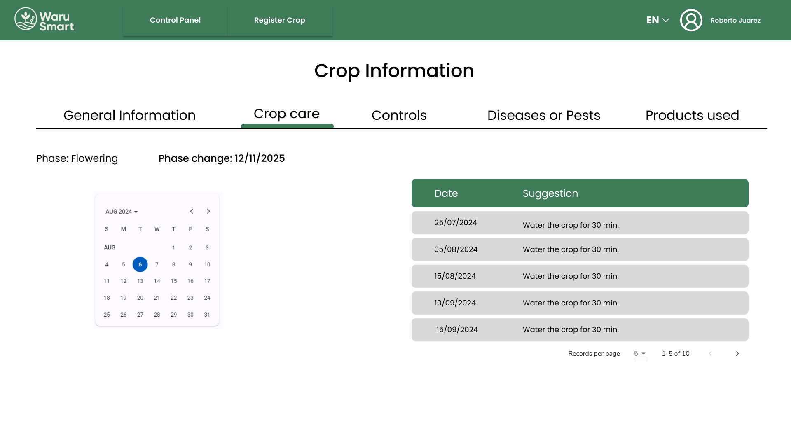
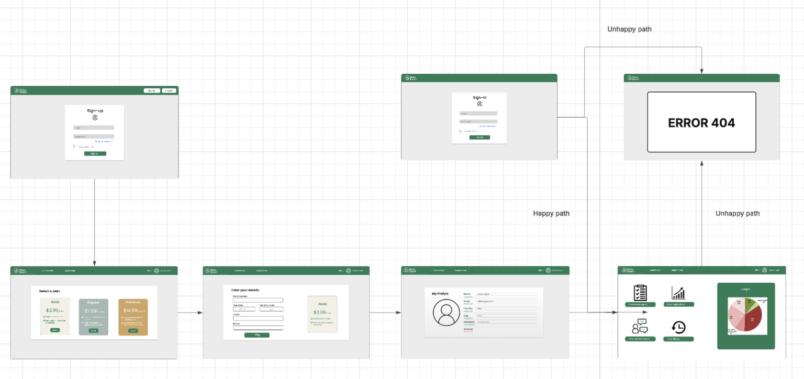

<div align="center">

# WaruSmart-Codex-Report 

  <h3>Universidad Peruana de Ciencias Aplicadas</h3>


<h5>Ingeniería de Software - 7mo ciclo</h5>
  <h5>Desarrollo de Soluciones IOT - 1ASI0572</h5>
  <h5>
NRC: 2947</h5>
  <h5>Docente: Angel Augusto Velasquez Nuñez</h5>
  <h5>Startup: Codex</h5>
  <h5>Producto: WaruSmart</h5>
</div>

## Team Members 

<div align="center">

<table>
  <thead>
    <tr>
      <th>Nombre</th>
      <th>Código</th>
    </tr>
  </thead>
  <tbody>
    <tr><td>Anderson Walter Macedo Calsina</td><td>U20201C179</td></tr>
    <tr><td>Cabrera Camizan, Jeferson Smith</td><td>U20211C211</td></tr>
    <tr><td>More Rondon, Christopher Sebastian</td><td>U202212199</td></tr>
    <tr><td>Quispe Condori, Fernando Daniel</td><td>U20221C628</td></tr>
    <tr><td>Velasquez Pizarro, Jair</td><td>U202218114</td></tr>
    <tr><td>Pingus Rodriguez, Carlos Daniel</td><td>U202113280</td></tr>
    <tr><td>Herrera Castillo, Victor Raul</td><td>U20201E188</td></tr>
  </tbody>
</table>

</div>

<div align="center">
  <h5>Ciclo 2025-10</h5>
</div>

<div style="page-break-after: always;"></div>

### Registro de Informe

| Versión | Fecha    | Autor(es)                                                                                                                                                                                                                     | Descripción de modificación                                                                                                      |
|---------|----------|------------------------------------------------------------------------------------------------------------------------------------------------------------------------------------------------------------------------------|----------------------------------------------------------------------------------------------------------------------------------|
| 0.1     | 04/04/25 | Anderson Walter Macedo Calsina                                                                                                                                                                                                | Redacción del Perfil Inicial                                                                                                     |
| 0.2     | 06/04/25 | Jeferson Smith Cabrera Camizan                                                                                                                                                                                                | Proceso Lean UX, Mapeo de Eventos, Recolección de Testimonios, Contextos Delimitados                                             |
| 0.3     | 09/04/25 | Christopher Sebastian More Rondon                                                                                                                                                                                             | Modelo C4, Encuesta Inicial                                                                                                      |
| 0.4     | 10/04/25 | Fernando Daniel Quispe Condori                                                                                                                                                                                                | Perfil de Startup, Perfil de Solución, Entrevistas, Mapeo de Impacto, Cartografía de Contexto                                    |
| 0.5     | 11/04/25 | Jair Velasquez Pizarro                                                                                                                                                                                                         | Precisión del Context Mapping, Reconocimiento de Ámbitos Delimitados                                                             |
| 0.6     | 12/04/25 | Carlos Daniel Pingus Rodriguez                                                                                                                                                                                                | Ajustes en el Impact Mapping, Primeros Casos de Uso                                                                              |
| 0.7     | 14/04/25 | Victor Raul Herrera Castillo                                                                                                                                                                                                  | Ajuste de Hipótesis UX, Preparación de Cuestionarios                                                                             |
| 0.8     | 17/04/25 | Anderson Walter Macedo Calsina, Christopher Sebastian More Rondon                                                                                                                                                             | Correcciones al Modelo C4, Creación de Perfiles de Usuario                                                                       |
| 0.9     | 20/04/25 | Fernando Daniel Quispe Condori, Jair Velasquez Pizarro                                                                                                                                                                         | Escenario As-Is, Elaboración de Mapas de Empatía                                                                                 |
| 1.0     | 22/04/25 | Todos los miembros                                                                                                                                                                                                            | Versión final de TB1: Portada, Historial de Cambios, Introducción, Necesidades, Detalles Técnicos, Propuesta de Solución         |
| 1.1     | 12/09/25 | Christopher Sebastian More Rondon, Fernando Daniel Quispe Condori                                                                                                                                                             | Elaboración de User Journey Mapping y actualización de User Task Matrix                                                          |
| 1.2     | 15/09/25 | Jeferson Smith Cabrera Camizan, Victor Raul Herrera Castillo                                                                                                                                                                  | Sistematización y análisis de entrevistas, identificación de patrones de necesidad                                               |
| 1.3     | 20/09/25 | Carlos Daniel Pingus Rodriguez, Jair Velasquez Pizarro                                                                                                                                                                         | Revisión y ajustes del Impact Mapping; construcción del escenario To-Be y validación con hallazgos previos                       |
| 1.4     | 23/09/25 | Anderson Walter Macedo Calsina, Fernando Daniel Quispe Condori                                                                                                                                                                | Desarrollo de User Stories priorizadas con sus respectivos criterios de aceptación                                               |
| 1.5     | 25/09/25 | Victor Raul Herrera Castillo, Jeferson Smith Cabrera Camizan                                                                                                                                                                  | Definición estructurada del Product Backlog y priorización mediante MoSCoW                                                       |
| 2.0     | 28/09/25 | Todos los miembros                                                                                                                                                                                                            | Finalización de TP1: Consolidación de artefactos de diseño, implementación inicial de la Landing Page, planificación de Sprint 1 |
| 2.1     | 02/10/24 | Cancho Coila Diego                                                                                                                                                                                                              | Sprint Planning 1: Preparación del entorno y gestión de tareas                                                                   |
| 2.2     | 08/10/24 | Arenas Conde José Anthony                                                                                                                                                                                                      | Implementación de Landing Page, secciones esenciales y pruebas de usabilidad                                                     |
| 2.3     | 11/10/24 | Lagos Aguilar, Luis Eduardo                                                                                                                                                                                                     | Configuración del entorno de desarrollo, gestión de código fuente                                                                |
| 2.4     | 14/10/24 | Guerrero Castillo, Anthony Jeandet                                                                                                                                                                                              | Revisión del Sprint 1, evidencias y pruebas de accesibilidad                                                                     |
| 2.5     | 16/10/24 | Chamorro Torres, Samuel Rolando                                                                                                                                                                                                | Despliegue de Landing Page y preparación para Sprint 2                                                                           |
| 2.6     | 20/10/24 | Cancho Coila Diego                                                                                                                                                                                                              | Sprint Planning 2: Definición de REST Endpoints y configuración UI                                                               |
| 2.7     | 23/10/24 | Arenas Conde José Anthony                                                                                                                                                                                                      | Integración de componentes UI y gestión de grupos                                                                                |
| 2.8     | 25/10/24 | Lagos Aguilar, Luis Eduardo                                                                                                                                                                                                     | Desarrollo de funcionalidades de cuenta y pruebas de integración                                                                 |
| 2.9     | 30/10/24 | Guerrero Castillo, Anthony Jeandet                                                                                                                                                                                              | Configuración de pruebas y validación de datos en tiempo real con esas nuevas actividades                                        |
| 3.0     | 03/11/24 | Todos los miembros                                                                                                                                                                                                            | Finalización de TB2: Implementación de funcionalidades clave de gestión de usuarios y cuentas                                    |
| 3.1     | 09/07/25  | Victor Raul Herrera Castillo, Jair Velasquez Pizarro       | Desarrollo del Sprint Planning 3 definición de objetivos del sprint, backlog y responsables técnicos                             |
| 3.2     | 11/07/25  | Carlos Daniel Pingus Rodriguez, Jeferson Smith Cabrera     | Integración del sistema de sensores IoT es mediante Rest y microservicio Edge                                                    |
| 3.3     | 13/07/25  | Anderson Walter Macedo Calsina                             | Desarrollo de lógica de alertas críticas y visualización de métricas ambientales                                                 |
| 3.4     | 14/07/25  | Christopher Sebastian More Rondon                          | Implementación de gráficos interactivos y mejoras en la experiencia de usuario en frontend                                       |
| 3.5     | 15/07/25  | Fernando Daniel Quispe Condori                             | Optimización de interfaz móvil, navegación fluida y vista de alertas                                                             |
| 3.6     | 17/07/25  | Jair Velasquez Pizarro, Carlos Daniel Pingus Rodriguez     | Validación funcional de automatización en campo y retroalimentación técnica                                                      |
| 3.7     | 18/07/25  | Victor Raul Herrera Castillo, Fernando Daniel Quispe       | Recopilación de feedback de agricultores reales y ajustes a funcionalidades clave                                                |
| 3.8     | 20/07/25  | Jeferson Smith Cabrera Camizan, Anderson Walter Macedo     | Documentación técnica del sistema IoT, interfaz y despliegue web/móvil                                                           |
| 3.9     | 22/07/25  | Christopher More, Jair Velasquez, Victor Herrera           | Pruebas finales, mejoras de rendimiento, evidencia de integración total                                                          |
| 4.0     | 23/07/25  | Todos los miembros                                         | Finalización de TF: validación en campo, despliegue completo del sistema WaruSmart                                               |


### Project Report Collaboration Insights

**URL del repositorio para el reporte del proyecto:** https://acortar.link/CRGD3H
**Link de los repositorios de la oraganización:** https://acortar.link/XId2ym

**TB1**

En esta primera entrega (TB1), el objetivo principal fue la creación de WaruSmart, nuestra solución para la automatización de riego agrícola. Todos los miembros del equipo participaron activamente en la elaboración del informe, utilizando herramientas colaborativas como GitHub, Mural, Jira, UXPressia y Miro. A continuación, se presentarán los diagramas de flujo que reflejan las contribuciones de cada miembro del equipo.

| Integrante                         | Tareas Asignadas                                                                      |
| ---------------------------------- |---------------------------------------------------------------------------------------|
| Anderson Walter Macedo Calcina     | Analisis competitivo, estrategias y tacticas, registro de entrevistas                 |
| Cabrera Camizan, Jeferson Smith    | EventStorming, Candidate Context Discovery, Bounded Context Canvases yContext Mapping |
| More Rondon, Christopher Sebastian | Needfinding, diseño de entrevistas, estructura del informe                            |
| Quispe Condori, Fernando Daniel    | Solutio Profile - Bounded context canvases - Diagram Flow MeSSAGES                    |
| Velasquez Pizarro, Jair            | User Stories - Impact Mapping - Product Backlog                                       |
| Pingus Rodriguez, Carlos Daniel    | Definición de Bounded Contexts                                                        |
| Herrera Castillo, Victor Raul      | Diagramas C4                                                                          |


Este gráfico muestra la cantidad de commits realizados por cada integrante durante el desarrollo del TB1 de WaruSmart.

El gráfico ofrece una representación visual de las contribuciones registradas en nuestro repositorio y la cantidad de interacción de los miembros del equipo a lo largo del tiempo.

Estas evidencias reflejan una colaboración equilibrada y efectiva, con cada miembro aportando de manera significativa al avance y desarrollo de la solución.

**TP1**

En esta primera entrega de TP1, el objetivo principal fue la presentación de la versión final de la landing page, la primera versión de la aplicación web y los avances iniciales del backend de WaruSmart, nuestra solución para la automatización del riego agrícola. Durante este periodo, nos enfocamos en el desarrollo de la interfaz de usuario y la estructura básica del backend, con el fin de sentar las bases para futuras integraciones y mejoras. La landing page se completó con todos los elementos esenciales, y la primera versión de la aplicación web fue configurada con las funcionalidades iniciales.

Todos los miembros del equipo participaron activamente en el avance del proyecto, utilizando herramientas colaborativas como GitHub, Mural, Jira, UXPressia y Miro. A continuación, se presentan los diagramas de flujo que muestran las tareas realizadas por cada miembro del equipo.

| Integrante                         | Tareas Asignadas                                                                                               |
| ---------------------------------- | -------------------------------------------------------------------------------------------------------------- |
| Anderson Walter Macedo Calsina     | Desarrollo de backend, configuración inicial del servidor y estructura de la base de datos                     |
| Cabrera Camizan, Jeferson Smith    | Diseño e implementación de la landing page, optimización de la interfaz web y funciones básicas                |
| More Rondon, Christopher Sebastian | Desarrollo de la interfaz frontend, integración de la primera versión web, pruebas de usabilidad               |
| Quispe Condori, Fernando Daniel    | Implementación inicial de la automatización en el backend, conexión básica con la base de datos                |
| Velasquez Pizarro, Jair            | Redacción y desarrollo de User Stories, documentación del avance y preparación para la integración del backend |
| Pingus Rodriguez, Carlos Daniel    | Arquitectura básica del sistema backend y planificación de la integración de sensores IoT                      |
| Herrera Castillo, Victor Raul      | Modelado de la arquitectura del sistema y diagramas iniciales para la infraestructura del backend y la web     |


Este gráfico ilustra las contribuciones de cada miembro durante el desarrollo del TP1 de WaruSmart.

La imagen proporciona una representación visual de las actividades registradas en nuestro repositorio y la interacción de los miembros a lo largo del proceso de trabajo.

Estas evidencias reflejan una colaboración equilibrada y eficiente, donde cada miembro ha aportado significativamente al progreso y desarrollo de la solución.

**TB2**

En esta segunda entrega (TB2), el objetivo principal fue la implementación de funcionalidades clave de WaruSmart, nuestra solución para la automatización del riego agrícola. Durante este periodo, se presentaron nuevas versiones para el desarrollo web y las primeras implementaciones de sistemas IoT, como edge computing y el backend. Además, comenzamos con el desarrollo de la aplicación Android, utilizando herramientas especializadas como JetBrains y sus IDE para Python en el backend, Vite en el desarrollo web, WebStorm para el frontend, y Android Studio para el desarrollo nativo de la aplicación móvil.

Todos los miembros del equipo participaron activamente en el avance del proyecto, utilizando herramientas colaborativas como GitHub, Mural, Jira, UXPressia y Miro. A continuación, se presentan los diagramas de flujo que muestran las tareas realizadas por cada miembro del equipo.

| Integrante                         | Tareas Asignadas                                                                                              |
| ---------------------------------- | ------------------------------------------------------------------------------------------------------------- |
| Anderson Walter Macedo Calsina     | Desarrollo de backend, implementación de APIs con Python, uso de JetBrains para la codificación del servidor  |
| Cabrera Camizan, Jeferson Smith    | Diseño e implementación de los sistemas IoT (sensores), integración de Vite para optimización web             |
| More Rondon, Christopher Sebastian | Desarrollo de interfaz frontend, integración con WebStorm, optimización de la experiencia de usuario          |
| Quispe Condori, Fernando Daniel    | Implementación de sistemas de automatización, desarrollo de diagramas de flujo en el backend y edge computing |
| Velasquez Pizarro, Jair            | Redacción y desarrollo de User Stories, integración con el backend y gestión de tareas del Product Backlog    |
| Pingus Rodriguez, Carlos Daniel    | Desarrollo de la arquitectura del sistema IoT y optimización de los sensores y dispositivos de riego          |
| Herrera Castillo, Victor Raul      | Modelado de la arquitectura, diagramas C4 y planificación de infraestructura para backend y IoT               |


Este gráfico ilustra las contribuciones de cada miembro durante el desarrollo del TB2 de WaruSmart.

La imagen proporciona una representación visual de las actividades registradas en nuestro repositorio y la interacción de los miembros a lo largo del proceso de trabajo.

Estas evidencias reflejan una colaboración equilibrada y eficiente, donde cada miembro ha aportado significativamente al progreso y desarrollo de la solución.

**TF – Trabajo Final**

En esta entrega final (TF), el enfoque principal fue consolidar el desarrollo completo de WaruSmart, nuestra solución IoT para la automatización del riego agrícola. Este periodo se caracterizó por la integración definitiva entre los módulos web, móvil y sistemas embebidos (IoT), realizando validaciones funcionales en campo con agricultores reales, y mejorando el rendimiento y la experiencia de usuario en todas las plataformas.

Además, se documentaron los procesos técnicos clave y se recolectaron evidencias de despliegue, validación de sensores, visualización de métricas y funcionamiento del sistema bajo condiciones reales. También se trabajó en la optimización de la interfaz móvil, la generación de alertas en tiempo real y el monitoreo visual histórico desde el frontend. Las herramientas empleadas incluyeron JetBrains para backend en C#, Vue-Vite y WebStorm para frontend, Android Studio para móvil, y Arduino Ide entre sensores y el sistema central.

Todos los miembros del equipo participaron activamente en esta fase crítica, manteniendo una colaboración constante mediante herramientas como GitHub, Trello, UXPressia y Miro. A continuación, se detallan las tareas desarrolladas por cada integrante del equipo durante el cierre técnico del proyecto:

| Integrante                         | Tareas Asignadas                                                                                                   |
| ---------------------------------- |--------------------------------------------------------------------------------------------------------------------|
| Anderson Walter Macedo Calsina     | Optimización de APIs en C#, pruebas de rendimiento y despliegue del backend                                        |
| Cabrera Camizan, Jeferson Smith    | Integración final del sistema IoT con sensores físicos, validación en campo, ajustes en microservicios Edge        |
| More Rondon, Christopher Sebastian | Mejoras en la interfaz web, implementación de gráficos históricos, pruebas de usabilidad en múltiples dispositivos |
| Quispe Condori, Fernando Daniel    | Validación funcional con agricultores, mejoras en interfaz móvil y documentación de prototipos                     |
| Velasquez Pizarro, Jair            | Ajuste de alertas, pruebas en tiempo real, coordinación técnica del Product Backlog final                          |
| Pingus Rodriguez, Carlos Daniel    | Revisión de arquitectura IoT, verificación de flujo de datos desde sensores al dashboard                           |
| Herrera Castillo, Victor Raul      | Actualización de diagramas C4, documentación de infraestructura, consolidación del sistema para cierre del TF      |


Este gráfico ilustra las contribuciones de cada miembro durante la culminación del TF de WaruSmart.

La imagen proporciona una representación visual de las actividades registradas en nuestro repositorio y la interacción de los miembros a lo largo del proceso final de desarrollo.

Estas evidencias reflejan una colaboración sólida, un alto grado de responsabilidad técnica y el cumplimiento de todos los objetivos planteados para el cierre del proyecto WaruSmart.


# Contenido

## 📚 Tabla de Contenidos

#### [Capítulo I: Introducción](#introducción)
  - [1.1 Startup Profile](#startup-profile)
    - [1.1.1 Descripción de la Startup](#descripción-de-la-startup)
    - [1.1.2 Perfiles de integrantes del equipo](#perfiles-de-integrantes-del-equipo)
  - [1.2 Solution Profile](#solution-profile)
    - [1.2.1 Antecedentes y problemática](#antecedentes-y-problemática)
    - [1.2.2 Lean UX Process](#lean-ux-process)
      - [1.2.2.1 Lean UX Problem Statements](#lean-ux-problem-statements)
      - [1.2.2.2 Lean UX Assumptions](#lean-ux-assumptions)
      - [1.2.2.3 Lean UX Hypothesis Statements](#lean-ux-hypothesis-statements)
      - [1.2.2.4 Lean UX Canvas](#lean-ux-canvas)
  - [1.3 Segmentos Objetivo](#segmentos-objetivo)

#### [Capítulo II: Requirements Elicitation & Analysis](#requirements-elicitation--analysis)
  - [2.1 Competidores](#competidores)
    - [2.1.1 Análisis competitivo](#análisis-competitivo)
    - [2.1.2 Estrategias y tácticas frente a competidores](#estrategias-y-tácticas-frente-a-competidores)
  - [2.2 Entrevistas](#entrevistas)
    - [2.2.1 Diseño de entrevistas](#diseño-de-entrevistas)
    - [2.2.2 Registro de entrevistas](#registro-de-entrevistas)
    - [2.2.3 Análisis de entrevistas](#análisis-de-entrevistas)
  - [2.3 Needfinding](#needfinding)
    - [2.3.1 User Personas](#user-personas)
    - [2.3.2 User Task Matrix](#user-task-matrix)
    - [2.3.3 User Journey Mapping](#user-journey-mapping)
    - [2.3.4 Empathy Mapping](#empathy-mapping)
    - [2.3.5 As-is Scenario Mapping](#as-is-scenario-mapping)
  - [2.4 Ubiquitous Language](#ubiquitous-language)

#### [Capítulo III: Requirements Specification](#requirements-specification)
  - [3.1 To-Be Scenario Mapping](#to-be-scenario-mapping)
  - [3.2 User Stories](#user-stories)
  - [3.3 Impact Mapping](#impact-mapping)
  - [3.4 Product Backlog](#product-backlog)

#### [Capítulo IV: Solution Software Design](#solution-software-design)
  - [4.1 Strategic-Level Domain-Driven Design](#strategic-level-domain-driven-design)
    - [4.1.1 EventStorming](#eventstorming)
      - [4.1.1.1 Candidate Context Discovery](#candidate-context-discovery)
      - [4.1.1.2 Domain Message Flows Modeling](#domain-message-flows-modeling)
      - [4.1.1.3 Bounded Context Canvases](#bounded-context-canvases)
    - [4.1.2 Context Mapping](#context-mapping)
    - [4.1.3 Software Architecture](#software-architecture)
      - [4.1.3.1 System Landscape Diagram](#system-landscape-diagram)
      - [4.1.3.2 Context Level Diagrams](#context-level-diagrams)
      - [4.1.3.3 Container Level Diagrams](#container-level-diagrams)
      - [4.1.3.4 Deployment Diagrams](#deployment-diagrams)
  - [4.2 Tactical-Level Domain-Driven Design](#tactical-level-domain-driven-design)
    - [4.2.X Bounded Context: Nombre del Contexto](#bounded-context-nombre-del-contexto)
      - [4.2.X.1 Domain Layer](#domain-layer)
      - [4.2.X.2 Interface Layer](#interface-layer)
      - [4.2.X.3 Application Layer](#application-layer)
      - [4.2.X.4 Infrastructure Layer](#infrastructure-layer)
      - [4.2.X.5 Component Level Diagrams](#component-level-diagrams)
      - [4.2.X.6 Code Level Diagrams](#code-level-diagrams)
        - [4.2.X.6.1 Domain Layer Class Diagrams](#domain-layer-class-diagrams)
        - [4.2.X.6.2 Database Design Diagram](#database-design-diagram)

#### [Capítulo V: Solution UI/UX Design](#solution-uiux-design)
  - [5.1 Style Guidelines](#style-guidelines)
    - [5.1.1 General Style Guidelines](#general-style-guidelines)
    - [5.1.2 Web, Mobile and IoT Style Guidelines](#web-mobile-and-iot-style-guidelines)
  - [5.2 Information Architecture](#information-architecture)
    - [5.2.1 Organization Systems](#organization-systems)
    - [5.2.2 Labeling Systems](#labeling-systems)
    - [5.2.3 SEO Tags and Meta Tags](#seo-tags-and-meta-tags)
    - [5.2.4 Searching Systems](#searching-systems)
    - [5.2.5 Navigation Systems](#navigation-systems)
  - [5.3 Landing Page UI Design](#landing-page-ui-design)
    - [5.3.1 Wireframe](#wireframe)
    - [5.3.2 Mock-up](#mock-up)
  - [5.4 Applications UX/UI Design](#applications-uxui-design)
    - [5.4.1 Wireframes](#wireframes)
    - [5.4.2 Wireflow Diagrams](#wireflow-diagrams)
    - [5.4.3 Mock-ups](#mock-ups)
    - [5.4.4 User Flow Diagrams](#user-flow-diagrams)
  - [5.5 Applications Prototyping](#applications-prototyping)

#### [Capítulo VI: Product Implementation, Validation & Deployment](#product-implementation-validation--deployment)
  - [6.1 Software Configuration Management](#software-configuration-management)
    - [6.1.1 Development Environment Configuration](#development-environment-configuration)
    - [6.1.2 Source Code Management](#source-code-management)
    - [6.1.3 Code Style Guide & Conventions](#code-style-guide--conventions)
    - [6.1.4 Deployment Configuration](#deployment-configuration)
  - [6.2 Landing Page, Services & Applications Implementation](#landing-page-services--applications-implementation)
    - [6.2.1 Sprint 1](#sprint-1)
      - [6.2.1.1 Sprint Planning 1](#sprint-planning-1)
      - [6.2.1.2 Sprint Backlog 1](#sprint-backlog-1)
      - [6.2.1.3 Development Evidence](#development-evidence)
      - [6.2.1.4 Testing Suite Evidence](#testing-suite-evidence)
      - [6.2.1.5 Execution Evidence](#execution-evidence)
      - [6.2.1.6 Services Documentation Evidence](#services-documentation-evidence)
      - [6.2.1.7 Software Deployment Evidence](#deployment-evidence)
      - [6.2.1.8 Team Collaboration Insights](#team-collaboration-insights)
    - [6.2.2 Sprint 2](#sprint-2)
      - [6.2.2.1 Sprint Planning 2](#sprint-planning-2)
      - [6.2.2.2 Sprint Backlog 2](#sprint-backlog-2)
      - [6.2.2.3 Development Evidence](#development-evidence)
      - [6.2.2.4 Testing Suite Evidence](#testing-suite-evidence)
      - [6.2.2.5 Execution Evidence](#execution-evidence)
      - [6.2.2.6 Services Documentation Evidence](#services-documentation-evidence)
      - [6.2.2.7 Software Deployment Evidence](#deployment-evidence)
      - [6.2.2.8 Team Collaboration Insights](#team-collaboration-insights)
    - [6.2.3 Sprint 3](#sprint-3)
      - [6.2.3.1 Sprint Planning 3](#sprint-planning-3)
      - [6.2.3.2 Sprint Backlog 3](#sprint-backlog-3)
      - [6.2.3.3 Development Evidence](#development-evidence)
      - [6.2.3.4 Testing Suite Evidence](#testing-suite-evidence)
      - [6.2.3.5 Execution Evidence](#execution-evidence)
      - [6.2.3.6 Services Documentation Evidence](#services-documentation-evidence)
      - [6.2.3.7 Software Deployment Evidence](#deployment-evidence)
      - [6.2.3.8 Team Collaboration Insights](#team-collaboration-insights)
  - [6.3 Validation Interviews](#validation-interviews)
    - [6.3.1 Diseño de Entrevistas](#diseño-de-entrevistas)
    - [6.3.2 Registro de Entrevistas](#registro-de-entrevistas)
    - [6.3.3 Evaluaciones según heurísticas](#evaluaciones-según-heurísticas)
  - [6.4 Video About-the-Product](#video-about-the-product)
  - [6.5 Aspect Leaders and Collaborators](#aspect-leaders-and-collaborators)

#### [Conclusiones y Recomendaciones](#conclusiones-y-recomendaciones)
  - [Conclusiones del Proyecto](#conclusiones-del-proyecto)
  - [Recomendaciones para trabajos futuros](#recomendaciones-para-trabajos-futuros)
  - [Video About-the-Team](#video-about-the-team)


| **Criterio específico** | **Acciones realizadas**                                                                                                                                                                                                                                                                                                                                                                                                                                                                                                                                                                                                                                                                                                                                                                                                                                                                                                                                                                                                                                                                                                                                                                                                                                                                                                                                                                                                                                                                                                                                                                                                                                                                                                                                                                                                                                                                                                                                                                                                                                                                                                                                                                                                                                                                                                                                                                                                                                                                                                                                                                                                                                                                                                                                                                                                                                                                                                                                                                                                                                                                                                                                                                                                                                                                                                                                                                                                                                                                                                                                                                                                                                                                                                                                                                                                                                                                                                                                                                                                                                                                                                                                                                                                                                                                                                                                                                                                                                                                                                                                                                                                                                                                                                                                                                                                                                                                                                                                                                                                                                                                                                                                                                                                                                                                                                                                                                                                                                                                                                                                                                                                                                                                                                                                                                                                                                                                                                                                                                                                                                                                                                                                                                                                                                                                                                                                                                                                                                                                                                                                                                                                                                                                                                                                                                                                                                                                                                                                                                                                                                                                                                                                                                                                                            | **Conclusiones**                                                                                                                                                                                                                                                                                                                                                                                                                                                                                                                                                                                                                                                                                                                                                                                                                                                                                                                                                                                                                                                                                                                                                                                                                                                                                                                                                                                                                                                                                                                                                                                                                                                                                                                                                                                                                                                                                                                                                                                                                                                                                       |
|-------------------------|----------------------------------------------------------------------------------------------------------------------------------------------------------------------------------------------------------------------------------------------------------------------------------------------------------------------------------------------------------------------------------------------------------------------------------------------------------------------------------------------------------------------------------------------------------------------------------------------------------------------------------------------------------------------------------------------------------------------------------------------------------------------------------------------------------------------------------------------------------------------------------------------------------------------------------------------------------------------------------------------------------------------------------------------------------------------------------------------------------------------------------------------------------------------------------------------------------------------------------------------------------------------------------------------------------------------------------------------------------------------------------------------------------------------------------------------------------------------------------------------------------------------------------------------------------------------------------------------------------------------------------------------------------------------------------------------------------------------------------------------------------------------------------------------------------------------------------------------------------------------------------------------------------------------------------------------------------------------------------------------------------------------------------------------------------------------------------------------------------------------------------------------------------------------------------------------------------------------------------------------------------------------------------------------------------------------------------------------------------------------------------------------------------------------------------------------------------------------------------------------------------------------------------------------------------------------------------------------------------------------------------------------------------------------------------------------------------------------------------------------------------------------------------------------------------------------------------------------------------------------------------------------------------------------------------------------------------------------------------------------------------------------------------------------------------------------------------------------------------------------------------------------------------------------------------------------------------------------------------------------------------------------------------------------------------------------------------------------------------------------------------------------------------------------------------------------------------------------------------------------------------------------------------------------------------------------------------------------------------------------------------------------------------------------------------------------------------------------------------------------------------------------------------------------------------------------------------------------------------------------------------------------------------------------------------------------------------------------------------------------------------------------------------------------------------------------------------------------------------------------------------------------------------------------------------------------------------------------------------------------------------------------------------------------------------------------------------------------------------------------------------------------------------------------------------------------------------------------------------------------------------------------------------------------------------------------------------------------------------------------------------------------------------------------------------------------------------------------------------------------------------------------------------------------------------------------------------------------------------------------------------------------------------------------------------------------------------------------------------------------------------------------------------------------------------------------------------------------------------------------------------------------------------------------------------------------------------------------------------------------------------------------------------------------------------------------------------------------------------------------------------------------------------------------------------------------------------------------------------------------------------------------------------------------------------------------------------------------------------------------------------------------------------------------------------------------------------------------------------------------------------------------------------------------------------------------------------------------------------------------------------------------------------------------------------------------------------------------------------------------------------------------------------------------------------------------------------------------------------------------------------------------------------------------------------------------------------------------------------------------------------------------------------------------------------------------------------------------------------------------------------------------------------------------------------------------------------------------------------------------------------------------------------------------------------------------------------------------------------------------------------------------------------------------------------------------------------------------------------------------------------------------------------------------------------------------------------------------------------------------------------------------------------------------------------------------------------------------------------------------------------------------------------------------------------------------------------------------------------------------------------------------------------------------------------------------------------------------------------------------------|--------------------------------------------------------------------------------------------------------------------------------------------------------------------------------------------------------------------------------------------------------------------------------------------------------------------------------------------------------------------------------------------------------------------------------------------------------------------------------------------------------------------------------------------------------------------------------------------------------------------------------------------------------------------------------------------------------------------------------------------------------------------------------------------------------------------------------------------------------------------------------------------------------------------------------------------------------------------------------------------------------------------------------------------------------------------------------------------------------------------------------------------------------------------------------------------------------------------------------------------------------------------------------------------------------------------------------------------------------------------------------------------------------------------------------------------------------------------------------------------------------------------------------------------------------------------------------------------------------------------------------------------------------------------------------------------------------------------------------------------------------------------------------------------------------------------------------------------------------------------------------------------------------------------------------------------------------------------------------------------------------------------------------------------------------------------------------------------------------|
| Trabaja en equipo para proporcionar liderazgo en forma conjunta | **Victor Herrera Castillo:**<br>**TB1:** Coordiné tareas asignadas sobre entrevistas y estrategias del sistema, organizando al equipo para que cada uno supiera qué hacer y asegurando que la información recogida nos ayudara a mejorar el enfoque del proyecto.<br>**TP1:** Lideré la definición de criterios de aceptación y el orden de prioridades en las User Stories, ayudando al equipo a entender mejor qué debía hacerse primero y cómo debía funcionar cada parte del sistema.<br>**TB2:** Coordiné la integración del frontend y backend, asegurándome de que ambos funcionen bien juntos y que la información se muestre correctamente para el usuario, manteniendo una estructura ordenada en todo el sistema. <br> **TF:** Durante el Trabajo Final, coordiné la integración del frontend y backend, asegurándome de que ambos funcionen correctamente de forma conjunta y que la información se muestre adecuadamente para el usuario final. Esta acción reflejó un liderazgo técnico compartido, promoviendo decisiones colaborativas en la estructura del sistema y asegurando que todos los integrantes comprendieran cómo debían acoplarse los distintos módulos desarrollados. <br><br>**Anderson Walter Macedo Calsina:**<br>**TB1:** Apoyé en el análisis de competidores, revisando sus fortalezas y debilidades, y ayudé a coordinar las entrevistas para obtener información clave que nos permitiera mejorar nuestra propuesta.<br>**TP1:** Guié la creación del modelo C4 del sistema, explicando cómo se relacionan los componentes principales y ayudando al equipo a visualizar mejor la estructura general de la solución.<br>**TB2:** Supervisé la integración técnica de la landing page y los servicios durante el Sprint 2, asegurándome de que todo funcione correctamente y se conecte bien con el resto del sistema. <br> **TF:** Supervisé la integración técnica de la landing page y los servicios, lo que implicó liderar tareas específicas y coordinar con otros miembros del equipo para garantizar una experiencia coherente en todo el sistema. Mi participación activa en la revisión de integración mostró un enfoque de liderazgo distribuido, resolviendo problemas técnicos junto al equipo y fomentando decisiones conjuntas. <br><br>**Carlos Daniel Pingus Rodriguez:**<br>**TB1:** Me encargué de delimitar el alcance técnico del proyecto, definiendo hasta dónde llegarían las funciones del sistema y asegurando que el equipo tuviera claridad sobre lo que se debía desarrollar.<br>**TP1:** Realicé la revisión del Impact Mapping y de los escenarios To-Be, asegurándome de que los objetivos del sistema estén bien alineados con las necesidades del usuario y proponiendo mejoras en los pasos futuros del proyecto.<br>**TB2:** Apoyé en el despliegue de los servicios backend y en la ejecución de pruebas funcionales, verificando que todo funcione correctamente antes de la entrega del sistema. <br> **TF:** Apoyé en el despliegue de los servicios backend y en la ejecución de pruebas funcionales, brindando soporte continuo a los demás integrantes. Al asumir responsabilidades críticas del sistema, facilité la toma de decisiones técnicas colectivas y promoví un entorno donde el liderazgo se compartió según la experiencia de cada uno. <br><br>**Fernando Daniel Quispe Condori:**<br>**TB1:** Organicé sesiones de avance con el equipo para revisar el progreso, resolver dudas y asegurar que todo el trabajo se mantuviera alineado y consistente con los objetivos del proyecto.<br>**TP1:** Coordiné la elaboración del User Journey Map, guiando al equipo para identificar cada paso que realiza el usuario dentro del sistema y así mejorar su experiencia de uso.<br>**TB2:** Conduje la validación de los prototipos funcionales, organizando sesiones de revisión con el equipo, y coordiné la grabación del video del producto para mostrar de forma clara su funcionamiento y beneficios. <br> **TF:** Conduje la validación de los prototipos funcionales organizando sesiones de revisión con el equipo. Coordiné además la grabación del video del producto, asegurando una presentación clara del sistema. Estas acciones evidencian un liderazgo conjunto enfocado en alinear criterios funcionales, comunicación visual y coordinación interna efectiva.<br><br>**Christopher Sebastian More Rondon:**<br>**TB1:** Me encargué del proceso de Needfinding, recopilando necesidades clave de los usuarios, y revisé el informe del proyecto para asegurar que toda la información estuviera clara y bien estructurada.<br>**TP1:** Realicé la actualización de la User Task Matrix, detallando las tareas del usuario paso a paso para facilitar el diseño de una solución centrada en sus necesidades.<br>**TB2:** Integré funcionalidades clave en la aplicación web y realicé validaciones cruzadas usando datos reales, asegurando que el sistema respondiera correctamente a escenarios comunes y mejorando su confiabilidad. <br> **TF:** Integré funcionalidades clave en la aplicación web y realicé validaciones cruzadas con datos reales. Aporté al liderazgo compartido al identificar fallos, proponer soluciones y colaborar con los responsables de cada módulo, promoviendo un desarrollo más confiable y coordinado. <br><br>**Jair Velasquez Pizarro:**<br>**TB1:** Me encargué de levantar los requerimientos funcionales iniciales del sistema, identificando las necesidades básicas de los usuarios y transformándolas en funcionalidades claras y alcanzables.<br>**TP1:** Propuse mejoras técnicas en los artefactos del proyecto y participé activamente en sesiones de retroalimentación, contribuyendo a optimizar el diseño y funcionalidad del sistema.<br>**TB2:** Implementé las validaciones finales en el backend para asegurar su correcto funcionamiento y coordiné con el equipo de desarrollo móvil para lograr una integración fluida entre ambas plataformas.<br> **TF:** Implementé las validaciones finales en el backend y coordiné con el equipo de desarrollo móvil para una integración fluida entre ambas plataformas. Esta tarea involucró liderazgo conjunto en decisiones técnicas, promoviendo la cooperación entre responsables de cada tecnología para cumplir con la visión general del sistema. <br><br>**Jeferson Smith Cabrera Camizan:**<br>**TB1:** Lideré el proceso de Event Storming para organizar las ideas del sistema, ayudando al equipo a entender mejor los eventos y cómo se relacionan entre sí.<br>**TP1:** Organicé la priorización del backlog junto al equipo, decidiendo qué tareas eran más importantes para avanzar de forma ordenada en el desarrollo.<br>**TB2:** Coordiné el control de versiones del proyecto y supervisé el merge final del código para asegurar que todo estuviera listo y funcional en la entrega. <br> **TF:** Coordiné el control de versiones del proyecto y supervisé el merge final del código. Aseguré la cohesión del desarrollo distribuido, fomentando un liderazgo compartido al revisar contribuciones, resolver conflictos y tomar decisiones en conjunto con el equipo para entregar una versión final funcional. | **TB1:** El liderazgo conjunto fue clave para establecer una base sólida en el trabajo del equipo, permitiendo que cada integrante asumiera roles estratégicos desde las primeras actividades del proyecto. Esta distribución equitativa de responsabilidades fortaleció la comunicación y el compromiso grupal, haciendo posible la toma de decisiones informadas y compartidas.<br><br>**TP1:** Durante esta fase se profundizó la colaboración y el liderazgo distribuido. Los integrantes asumieron la guía de aspectos clave como la definición de arquitecturas, modelado de procesos y planificación, facilitando una visión compartida del proyecto. La confianza en las capacidades del equipo aumentó, mejorando la eficiencia en la ejecución.<br><br>**TB2:** En esta entrega, el liderazgo conjunto se manifestó con mayor madurez al coordinar la integración de componentes desarrollados en paralelo. La colaboración efectiva permitió detectar inconsistencias, tomar decisiones técnicas en conjunto y lograr una armonización en las funcionalidades del sistema. Este tipo de liderazgo fue esencial para enfrentar la complejidad del proyecto en etapas más avanzadas. <br> <br> **TF:** Durante el desarrollo del Trabajo Final, el equipo demostró un liderazgo compartido sólido y maduro, reflejado en la coordinación efectiva de tareas críticas como la integración de componentes, despliegue del sistema y validación funcional. Cada integrante asumió la dirección de aspectos específicos según sus fortalezas técnicas, promoviendo decisiones conjuntas y resolución colaborativa de problemas. Esta distribución estratégica del liderazgo permitió mantener la cohesión del proyecto, mejorar la calidad del producto entregado y enfrentar con éxito los desafíos propios de las etapas avanzadas del desarrollo. La experiencia fortaleció la capacidad del equipo para liderar de forma horizontal, valorando el aporte de cada miembro y promoviendo un entorno donde todos tomaron decisiones informadas y con impacto positivo en los resultados finales. |
| Crea un entorno colaborativo e inclusivo, establece metas, planifica tareas y cumple objetivos | **Victor Herrera Castillo:**<br>**TB1:** Definí funcionalidades del sistema junto al equipo, fomentando un ambiente de escucha activa donde todas las ideas fueran consideradas.<br>**TP1:** Organicé el backlog del proyecto estableciendo metas claras, lo que permitió al equipo trabajar con un enfoque definido y avanzar de manera ordenada.<br>**TB2:** Utilicé la herramienta Jira para dar seguimiento al avance del equipo y revisar los hitos importantes del proyecto, ayudando a mantenernos organizados y cumplir con los plazos establecidos. <br> **TF:** Utilicé la herramienta Jira para dar seguimiento al avance del equipo y revisar los hitos importantes del proyecto. Esta práctica ayudó a mantener al equipo organizado, con objetivos claros y plazos definidos. Fomenté un ambiente donde se valoraban todas las ideas, promoviendo una dinámica de trabajo inclusiva y orientada a resultados. <br><br>**Anderson Walter Macedo Calsina:**<br>**TB1:** Coordiné el análisis de diferentes soluciones tecnológicas con el equipo, comparando sus ventajas y desventajas para elegir la más adecuada para nuestro proyecto.<br>**TP1:** Facilité sesiones de priorización con el equipo, ayudando a organizar las tareas según su importancia y asegurando que todos tuvieran claridad sobre el enfoque del sprint.<br>**TB2:** Asigné tareas grupales enfocándome en que cada integrante contribuyera al cumplimiento de las metas técnicas del proyecto, distribuyendo el trabajo de forma equilibrada y clara. <br> **TF:** Asigné tareas grupales de forma equilibrada, enfocándome en que cada integrante pudiera aportar a los objetivos técnicos del proyecto según sus habilidades. Coordiné reuniones de planificación que promovieron la inclusión de todas las voces del equipo, facilitando así la ejecución ordenada y colaborativa del Trabajo Final. <br><br>**Carlos Daniel Pingus Rodriguez:**<br>**TB1:** Trabajé junto al equipo en la delimitación colaborativa de los bounded contexts, definiendo claramente qué partes del sistema se encargarían de cada función para evitar confusiones y mejorar la organización del proyecto.<br>**TP1:** Participé en el planeamiento del escenario To-Be de manera colaborativa, proponiendo ideas y escuchando aportes del equipo para construir una visión clara y compartida del sistema ideal.<br>**TB2:** Gestioné las dependencias técnicas entre el backend y los dispositivos embebidos, asegurando que ambos se comunicaran correctamente y que el sistema funcionara de forma integrada. <br> **TF:** Gestioné las dependencias técnicas entre el backend y los dispositivos embebidos, colaborando con otros miembros para asegurar una integración fluida. Esta labor técnica se complementó con una planificación constante que permitió cumplir los objetivos establecidos y resolver los desafíos en equipo de forma eficiente. <br><br>**Fernando Daniel Quispe Condori:**<br>**TB1:** Realicé la planificación de tareas contando con el apoyo del equipo, organizando el trabajo de manera clara para avanzar juntos y cumplir los objetivos del proyecto.<br>**TP1:** Coordiné sesiones de ideación basadas en datos compartidos, donde el equipo propuso mejoras y soluciones a partir de la información recolectada, fomentando un trabajo colaborativo y enfocado.<br>**TB2:** Coordiné sesiones de mejora continua con el equipo para revisar avances, identificar problemas y ajustar tareas, asegurando que se cumplieran los entregables establecidos en cada sprint.<br> **TF:** Coordiné sesiones de mejora continua con el equipo para revisar avances, identificar problemas y replanificar tareas según fuera necesario. Estas sesiones fortalecieron el ambiente colaborativo, permitiendo que todos los integrantes participaran en la toma de decisiones y se comprometieran con el cumplimiento de los objetivos. <br><br>**Christopher Sebastian More Rondon:**<br>**TB1:** Participé en la identificación de funcionalidades necesarias para el sistema, analizando las necesidades del usuario y proponiendo soluciones junto al equipo.<br>**TP1:** Brindé apoyo en el diseño del flujo de experiencia de usuario, asegurando que cada paso fuera claro y fácil de seguir, y que reflejara las necesidades reales de los usuarios.<br>**TB2:** Colaboré activamente en la validación del diseño en múltiples dispositivos, verificando que la interfaz se adaptara correctamente y ofreciera una buena experiencia en cada plataforma. <br> **TF:** Colaboré activamente en la validación del diseño en múltiples dispositivos, promoviendo la mejora continua del producto. Mi participación también incluyó el ajuste de tareas en función del feedback recibido, lo que fortaleció la planificación compartida y la ejecución ordenada del sistema. <br><br>**Jair Velasquez Pizarro:**<br>**TB1:** Coordiné con el equipo la definición de funcionalidades requeridas, asegurando que cada módulo cubriera las necesidades del usuario y se integrara adecuadamente en el sistema.<br>**TP1:** Contribuí en la construcción de artefactos de diseño técnico, como diagramas y estructuras del sistema, para guiar el desarrollo y facilitar la comprensión del equipo.<br>**TB2:** Realicé el monitoreo del progreso del equipo usando Trello y apliqué ajustes en las tareas cuando fue necesario, asegurando que el trabajo avanzara según lo planeado. <br> **TF:** Realicé el monitoreo del progreso del equipo usando Trello, ajustando tareas y tiempos cuando fue necesario para asegurar un avance coherente. Este seguimiento constante ayudó a mantener al equipo enfocado y a cumplir con los objetivos planteados, reforzando un entorno inclusivo y de mejora continua. <br><br>**Jeferson Smith Cabrera Camizan:**<br>**TB1:** Impulsé un flujo de trabajo colaborativo para definir eventos, comandos y contextos del sistema, permitiendo una construcción más ordenada y entendible entre todos los integrantes.<br>**TP1:** Participé en la planificación del backlog, organizando las tareas según prioridades y tiempos, y asegurando que el equipo tuviera claridad sobre qué debía desarrollarse en cada etapa.<br>**TB2:** Supervisé el cumplimiento de metas técnicas en cada módulo del sistema, asegurándome de que se avanzara según lo planificado y resolviendo dudas o dificultades técnicas con el equipo. <br> **TF:** Supervisé el cumplimiento de metas técnicas en cada módulo del sistema, resolviendo dudas técnicas con el equipo y promoviendo una cultura de apoyo mutuo. Esta coordinación facilitó un entorno de trabajo colaborativo y orientado al logro de metas comunes, con una distribución clara de responsabilidades.                                                                                                                                                                                                                                                                                                                                                                                                                                                                                                                                                                                                                                                                                                                                                         | **TB1:** La planificación inicial estuvo marcada por una fuerte cohesión y un entorno inclusivo donde cada integrante tuvo espacio para aportar ideas y discutir propuestas. Esta apertura facilitó la identificación clara de metas y permitió una ejecución inicial organizada, con roles distribuidos de forma equitativa y responsable.<br><br>**TP1:** El equipo logró consolidar una estructura colaborativa efectiva. Se promovió la participación activa mediante el uso de herramientas de gestión y sesiones de planificación, logrando una ejecución que respetó tanto los tiempos como los entregables propuestos. La planificación conjunta generó sentido de pertenencia y compromiso grupal.<br><br>**TB2:** En esta etapa, la colaboración se evidenció en la implementación sinérgica de funcionalidades, uso de tableros para planificación compartida y reuniones de seguimiento. La definición clara de metas permitió afrontar retos técnicos complejos sin comprometer la cohesión. Se fortaleció el entorno inclusivo al valorar constantemente las opiniones técnicas y estratégicas de todos los miembros, resultando en un equipo eficiente, comprometido y coordinado. <br> <br> **TF:** En la etapa del Trabajo Final, el equipo consolidó un entorno de trabajo altamente colaborativo e inclusivo, en el que cada integrante participó activamente en la planificación y cumplimiento de los objetivos propuestos. Se utilizaron herramientas de gestión como Jira y Trello para organizar las tareas, realizar seguimientos constantes y alinear los esfuerzos individuales con las metas del proyecto. La comunicación efectiva y el respeto por las ideas de todos los miembros fueron claves para mantener un ambiente equitativo, donde cada propuesta fue valorada y discutida colectivamente. Esta cultura de colaboración permitió resolver imprevistos de forma ágil, reforzó el compromiso del equipo y aseguró el cumplimiento de los entregables en cada sprint, alcanzando así los resultados esperados con calidad y eficiencia.                           |


# Capítulo I: Introducción.

## 1.1 **Startup Profile.**

### 1.1.1   Descripción del startup

WaruSmart es una startup peruana creada por estudiantes de la Universidad Peruana de Ciencias Aplicadas (UPC) que desarrolla soluciones IoT para optimizar el riego en el sector agrícola mediante sensores de humedad, temperatura, clima, entre otros. Permitiendo a los agricultores gestionar el riego de forma automática o manual, visualizar datos en tiempo real a través de una app móvil y web, recibir alertas por condiciones críticas y acceder a un historial de datos por parcela, con un modelo de negocio basado en la venta de kits IoT y suscripciones para funciones avanzadas.

### 1.1.2   Perfiles de integrantes del equipo

| Perfil | Foto |
|--------|------|
| Nombre: Fernando Daniel Quispe Condori<br />Carrera: Ingeniería de Software<br />Código: U20221C628<br />Descripción: Soy Fernando Daniel Quispe Condori, tengo 20 años y curso la carrera de Ingeniería de Software. Cuento con las habilidades técnicas para apoyar a mi equipo en el desarrollo de nuestra solución IoT en el contexto actual, así mismo cuento con habilidades para la gestión de equipos y colaborar efectivamente como un equipo. |  |
| Nombre: Anderson Walter Macedo Calsina<br />Carrera: Ingeniería de Software<br />Código: U20201C179<br />Descripción: Soy Anderson Walter Macedo Calsina, tengo 22 años y actualmente estoy estudiando Ingeniería de Software en la UPC. Me gusta colaborar con mis compañeros y contribuir en proyectos conjuntos. Estoy dispuesto a contribuir a mi equipo en el desarrollo del proyecto con los conocimientos que he ido adquiriendo. |  |
| Nombre: Christopher Sebastian More Rondon<br />Carrera: Ingeniería de Software<br />Código: U202212199<br />Descripción: Soy estudiante del séptimo ciclo de Ingeniería de Software, actualmente tengo 20 años. Soy un estudiante que colabora constantemente en el desarrollo de los proyectos, así como dar soluciones creativas a los problemas que surgen durante la creación de estos. Siempre me esfuerzo por entregar un buen trabajo. |  |
| Nombre: Jair Velasquez Pizarro<br />Carrera: Ingeniería de Software<br />Código: U202218114<br />Descripción: Estoy cursando el séptimo ciclo de la carrera de Ingeniería de Software. Manejo los lenguajes de TypeScript, Java, JavaScript a nivel intermedio, cuento con experiencia en desarrollo FullStack como también habilidades de trabajo en equipo para colaborar de forma efectiva. |  |
| Nombre: Carlos Daniel Pingus Rodriguez<br />Carrera: Ingeniería de Software<br />Código: U202113280<br />Descripción: Soy estudiante de la carrera de Ingeniería de Software. Me gusta la tecnología y cómo esta misma ha cambiado significativamente en mi tiempo de vida. Me considero alguien responsable y comprometido con los proyectos; trato de estar a la par con mis compañeros y compartir con ellos mis conocimientos en ciertos temas específicos. |  |
| Nombre: Jeferson Smith Cabrera Camizan<br />Carrera: Ingeniería de Software<br />Código: U20211C211<br />Descripción: Estudiante universitario de la carrera de Ingeniería de Software. Me gusta trabajar en conjunto para el desarrollo del proyecto. Cuento con conocimientos en lenguajes HTML, CSS, JS, C++ y Agile Project Management. |  |
| Nombre: Victor Raul Herrera Castillo<br />Carrera: Ingeniería de Software<br />Código: U20201E188<br />Descripción: Soy un estudiante de la carrera de Ingeniería de Software, apasionado por la tecnología y sus oportunidades en el ámbito de la ciencia. Me gusta leer y enseñar a otras personas los conocimientos que aprendí durante el desarrollo de mi carrera. |  |

## 1.2 **Solution Profile.**

### 1.2.1   Antecedentes y problemática

##### Antecedentes

En el contexto actual peruano, la agricultura enfrenta desafíos significativos debido al cambio climático, la escasez de agua y la necesidad de aumentar la productividad para satisfacer la creciente demanda de alimentos. Según la FAO, el sector agrícola consume aproximadamente el 70% del agua dulce disponible a nivel mundial, lo que resalta la importancia de optimizar el uso de este recurso. En Perú, donde la agricultura es una actividad económica clave, muchos agricultores aún dependen de métodos tradicionales de riego que no son eficientes y generan desperdicio de agua. Además, el acceso limitado a tecnologías avanzadas dificulta la adopción de prácticas de agricultura inteligente, especialmente en comunidades rurales.

##### Problemática

La problemática principal radica en la falta de herramientas accesibles y efectivas para gestionar el riego de manera eficiente en los campos de cultivo. Esto genera un uso excesivo de agua, costos elevados y una menor productividad agrícola. **Los agricultores necesitan soluciones tecnológicas que les permitan monitorear en tiempo real las condiciones del suelo y el clima, automatizar el riego y recibir alertas ante situaciones críticas.** Sin embargo, las opciones disponibles en el mercado suelen ser costosas o complejas, lo que limita su adopción por parte de pequeños y medianos agricultores. Esta brecha tecnológica afecta no solo la sostenibilidad del sector agrícola, sino también la seguridad alimentaria y el desarrollo económico de las comunidades rurales.

##### Aplicación de las 5 W’s y 2 H’s

-**Who**: Los actores clave involucrados son los agricultores individuales, y los pertenecientes a cooperativas agrarias. Estos grupos han sido identificados en estudios del Ministerio de Agricultura de Perú y del Instituto Nacional de Innovación Agraria como pilares fundamentales para la adopción de tecnologías que impulsen la transformación digital y la eficiencia en el manejo de recursos hídricos. https://www.gob.pe/institucion/midagri/noticias/815784-midagri-inicia-la-transformacion-digital-de-la-agricultura-familiar

-**What**: La propuesta se centra en la optimización del riego a través de una solución IoT accesible y eficiente. Investigaciones publicadas por la FAO y estudios sobre agricultura inteligente en América Latina resaltan la capacidad de estas tecnologías para transformar prácticas tradicionales en métodos de riego más precisos, contribuyendo a una gestión sostenible y a una mayor productividad. https://www.fao.org/family-farming/detail/es/c/1612596/

-**Where**: La implementación se orienta hacia campos de cultivo en Perú, particularmente en zonas rurales donde el acceso a tecnologías avanzadas es limitado. Informes del Banco Mundial y análisis de desarrollo regional destacan que estas áreas requieren intervención tecnológica para mejorar la eficiencia en el uso de recursos y enfrentar desafíos climáticos.

-**When**: La necesidad de esta solución es urgente en el contexto actual marcado por el cambio climático y la creciente demanda de alimentos. Reportes del IPCC y estudios de la FAO subrayan que el momento presente es crítico para implementar soluciones innovadoras que mitiguen el impacto ambiental y aseguren la producción alimentaria a largo plazo.

-**Why**: La motivación principal es reducir el desperdicio de agua, aumentar la productividad agrícola y promover la sostenibilidad en el sector. Comparativas de técnicas de riego y análisis del Ministerio de Agricultura evidencian cómo una gestión más inteligente del agua puede generar beneficios económicos y medioambientales para los agricultores y la sociedad en general.

-**How**: La solución propuesta utiliza sensores IoT para medir variables críticas como la humedad del suelo, temperatura y condiciones climáticas, combinados con un sistema de automatización del riego y una plataforma digital para monitoreo en tiempo real. Casos de éxito en el ámbito del smart farming y estudios técnicos en publicaciones especializadas demuestran la viabilidad y eficacia de esta integración tecnológica.

-**How Much**: El enfoque de monetización se basa en la venta de kits IoT y la oferta de suscripciones accesibles para acceder a funciones avanzadas del sistema. Modelos de negocio analizados en reportes de financiamiento agrícola y tendencias de inversiones en AgTech confirman que esta estructura permite un equilibrio entre financiación inicial y sostenibilidad económica a través de ingresos recurrentes.

### 1.2.2 Lean UX Process

#### 1.2.2.1 Lean UX Problem Statements

A continuación se presentan los statements del proceso Lean UX donde se incluyen aspectos como domain, customer segments, pain points, gap, visión/strategy e initial segment.

WaruSmart, nuestra herramienta de riego automatizado, fue diseñada para ofrecer a los agricultores, una solución para el control del riego, automatizando este proceso a través de soluciones IoT de manera eficiente y sencilla. El objetivo es garantizar un proceso agrícola automatizado, evitando las fallas humanas que puedan existir, y de esta manera ofrecer servicios de visualización de una data organizada y precisa sobre la gestión de sus cultivos para la toma de mejores decisiones.

La adopción de las tecnologías IoT en la agricultura puede ser un desafío debido a la desconfianza o falta de experiencia en el sector entre los agricultores. A pesar de esto, estudios muestran que quienes utilizan herramientas digitales para gestionar sus cultivos tienden a lograr mejores resultados, como mayores rendimientos y menor desperdicio de recursos. Por lo tanto, nuestro desafío es: **¿Cómo podemos automatizar el proceso de riego agrícola, superando las barreras de confianza y asegurando que los agricultores vean beneficios tangibles, como una mayor productividad y eficiencia?**

Para abordar esta pregunta, necesitamos centrarnos en las siguientes directrices:

- **Enfoque centrado en el cliente:** La solución debe ser fácil de usar y entender para agricultores con cualquier nivel de experiencia tecnológica, siempre priorizando el feedback y mejoras que nuestros clientes puedan brindarnos.
- **Alcance claro:** Nos centraremos en la automatización del riego de cultivos con tecnologías IoT, excluyendo la gestión operativa (cantidad de cultivos, tipos, productos usados, etc.).
- **Medidas de éxito:** El éxito se medirá por la reducción de tiempo en el proceso de riego y la mejora en la cantidad de producción y calidad de producto, recopilando datos que nos permitan visualizar el estado de mejora de los cultivos de nuestros clientes.

#### 1.2.2.2 Lean UX Assumptions

##### **Business Assumptions:**

1. **Creemos que nuestros usuarios necesitan** una gestión automatizada e inteligente del riego de sus cultivos, permitiendo monitorear condiciones ambientales y ajustar el riego en tiempo real.
2. **Estas necesidades se pueden satisfacer con** el desarrollo de WaruSmart, una solución IoT integrada con sensores y una interfaz web que garantice el registro preciso y la automatización del riego.
3. **Nuestros clientes iniciales serán** agricultores que buscan modernizar sus métodos tradicionales de riego, desde pequeños productores hasta empresas agrícolas en expansión, cooperativas y ONG's.
4. **El valor más importante que quiere un cliente de nuestros servicios es** la seguridad de que sus cultivos reciben la cantidad óptima de agua en el momento justo, reduciendo desperdicios y aumentando la productividad.
5. **El cliente también va a obtener** datos en tiempo real, alertas automáticas y análisis estadísticos del desempeño de sus cultivos, facilitando decisiones informadas para la optimización de recursos.
6. **Vamos a obtener la mayoría de los clientes mediante** alianzas estratégicas con asociaciones agrícolas, demostraciones en campo y campañas dirigidas en foros y redes sociales especializadas en tecnología agrícola.
7. **Vamos a obtener ingresos mediante** un modelo de suscripción escalonado que ofrezca planes básicos y avanzados, complementado con la venta de kits de sensores IoT y dispositivos de automatización.
8. **Nuestra competencia en el mercado será** soluciones tradicionales de riego manual y otras plataformas digitales con menor integración IoT, análisis en tiempo real y/o que contengan otras tecnologías
9. **Vamos a tener ventaja frente a nuestra competencia debido a** la integración completa de sensores precisos, análisis predictivo y una interfaz intuitiva, accesible tanto para agricultores novatos como experimentados.
10. **El mayor riesgo del producto es** no lograr que el sector agrícola, usualmente reacio a cambios, confíe en nuevas tecnologías. Este reto se mitigará mediante soporte técnico continuo y capacitaciones prácticas.
11. **Lo resolveremos realizando** pruebas de campo, incorporando feedback de los usuarios y actualizando la plataforma de manera iterativa para garantizar un sistema robusto, confiable y adaptable a las necesidades reales de los agricultores.

##### **User Assumptions**

**¿Quién es el usuario?**
El usuario de WaruSmart es un agricultor que busca modernizar y optimizar el riego de sus cultivos. Este segmento abarca tanto a agricultores tradicionales que desean incursionar en la digitalización, como a productores profesionales(cooperativas, entre otros) que quieren maximizar la eficiencia del uso del agua.

**¿Qué problema tiene nuestro producto que resolver?**
El principal reto es la gestión manual del riego, que propicia ineficiencias y errores en la asignación de recursos hídricos. WaruSmart aborda este problema ofreciendo automatización, monitoreo en tiempo real y alertas predictivas para asegurar un riego óptimo y evitar la pérdida de agua en base a sensores de calidad del aire, temperatura y calidad del suelo.

**¿Qué características son importantes?**Es crucial que la plataforma tenga:

- Integración de sensores IoT para monitoreo en tiempo real.
- Funcionalidades de alerta y notificaciones ante condiciones críticas.
- Herramientas de análisis y visualización de datos históricos para la toma de decisiones.
- Un ecosistema amigable con el usuario agrícola, fácil de entender y manejar.

**¿Dónde encaja nuestro producto en su trabajo o vida?**
WaruSmart se integra en las labores diarias del agricultor, facilitando la supervisión remota y el control automatizado del riego, lo que permite dedicar más tiempo a otras tareas esenciales y optimizar la producción así como la calidad agrícola.

**¿Cuándo y cómo es usado nuestro producto?**
El sistema se utiliza durante el ciclo completo del cultivo. Los sensores envían datos continuamente, permitiendo ajustes inmediatos al riego y un control constante de las condiciones ambientales, desde la preparación del terreno hasta la cosecha.

**¿Cómo debe verse nuestro producto y cómo debe comportarse?**
El sistema WaruSmart es un producto de confianza, respaldado por datos precisos. La aplicación ofrecerá una interfaz web robusta y responsiva, que facilitará una navegación intuitiva y garantizará la integridad de cada registro y alerta. Así se asegura una experiencia de usuario de alta calidad y la provisión de datos confiables para análisis avanzados.

##### **Feature Assumptions**

- **Creemos que** la integración de análisis predictivo basado en datos históricos permitirá a los agricultores anticipar las necesidades de riego y optimizar recursos de manera proactiva.
- **Creemos que** la incorporación de notificaciones y alertas automáticas incrementará la efectividad del monitoreo, evitando situaciones de riego excesivo o insuficiente.
- **Creemos que** la posibilidad de visualizar gráficos y tendencias en tiempo real empoderará a los usuarios para tomar decisiones informadas sobre el manejo de sus cultivos.

#### 1.2.2.3 Lean UX Hypothesis Statements

##### Lean UX Hypothesis Statements

**Hypothesis Statement 01:**
**Creemos** que automatizar el riego mediante sensores IoT aumentará la eficiencia en el uso del agua, beneficiando tanto a agricultores tradicionales como modernos.
**Sabremos** que hemos tenido éxito cuando se registre una reducción del consumo de agua en al menos un 20% y una mejora significativa en la productividad de los cultivos en un 30%.

**Hypothesis Statement 02:**
**Creemos** que una interfaz limpia e intuitiva facilitará la adopción del sistema al eliminar barreras tecnológicas para usuarios de distintos niveles de experiencia.
**Sabremos** que hemos tenido éxito cuando al menos el 70% de los usuarios califiquen la interfaz como "muy fácil de usar" en las encuestas de satisfacción.

**Hypothesis Statement 03:**
**Creemos** que la integración de alertas en tiempo real y análisis predictivo reducirá errores manuales y optimizará la productividad de los cultivos.
**Sabremos** que hemos tenido éxito cuando se observe una disminución del 30% en la incidencia de errores durante el riego.

**Hypothesis Statement 04:**
**Hipotetizamos** que el modelo de negocio basado en suscripciones y venta de kits IoT es viable y sostenible, permitiendo la expansión y mejora continua de la plataforma.
**Sabremos** que hemos tenido éxito cuando se registre un crecimiento mensual en ingresos del 15% y se establezcan alianzas estratégicas que impulsen la adopción del sistema.

#### 1.2.2.4 Lean UX Canvas.

A continuación se presenta el Lean UX Canvas realizado para nuestra solución, dónde se visualiza la recopilación del proceso Lean UX realizado previamente:


Enlace a herramienta Miro: https://miro.com/welcomeonboard/UWFFNVNNeFJxOGd3MEl5eCt6T3ZBQTNwckIvdkdGdEMrTmNPV2lDc3ZXMFBMVlUxL1ZwcW1ncVBIOTJRU1hicCtLUnMxaUhBaUZkZkdPaGUxaitTNjYyOCtJazNuTUdzMGFheCsrNFY2eHFsZ3JZakdXS1JYd2xYNFNRVFRRQ2p0R2lncW1vRmFBVnlLcVJzTmdFdlNRPT0hdjE=?share_link_id=648998225080 

Lean UX Canvas:El Lean UX Canvas de WaruSmart resume los problemas, usuarios, soluciones y beneficios clave identificados durante el proceso de diseño. Plantea hipótesis centradas en mejorar la productividad agrícola mediante riego automatizado y decisiones basadas en datos, y propone validarlas a través de pruebas piloto y comparaciones con métodos tradicionales.

### 1.3 **Segmentos Objetivos.**

#### Agricultores Individuales

- Representan productores que gestionan sus cultivos de manera autónoma.
- Buscan soluciones tecnológicas para automatizar y optimizar el riego, reduciendo desperdicios y mejorando la productividad.
- Valoran interfaces simples, alertas en tiempo real y herramientas de análisis que faciliten la toma de decisiones.
- Requieren soporte técnico y capacitaciones que faciliten la transición hacia tecnologías IoT.

#### Cooperativas Agrarias

- Agrupaciones de agricultores que comparten conocimientos, gastos y ganancias.
- Interesadas en impulsar políticas públicas y proyectos de impacto social que favorezcan el desarrollo agrario.
- Buscan soluciones que permitan un monitoreo centralizado y análisis de datos para implementar estrategias de mejora en comunidades rurales.
- Actúan como facilitadoras en la difusión y adopción de innovaciones tecnológicas en el sector agrícola.

# Capítulo II: Requirements Elicitation & Analysis.

## 2.1 **Competidores.**

### 2.1.1   Análisis competitivo.

El análisis competitivo permite identificar las fortalezas, debilidades y estrategias clave de las principales soluciones similares en el mercado. Esta comparación proporciona una visión clara del posicionamiento de WaruSmart frente a otras propuestas tecnológicas de riego agrícola, considerando aspectos como perfil, propuesta de valor, estrategias de marketing, productos y análisis FODA. A través de esta evaluación se busca destacar las ventajas diferenciales de WaruSmart y detectar oportunidades de mejora en el entorno competitivo.

|                                                         | WaruSmart                                                                                                                                                                                                                                   | Agrobit                                                                                                                                                                              | Netafirm                                                                                                                                                                                                                                                                | Irritec                                                                                                                                                                                                 |
| ------------------------------------------------------- | ------------------------------------------------------------------------------------------------------------------------------------------------------------------------------------------------------------------------------------------- | ------------------------------------------------------------------------------------------------------------------------------------------------------------------------------------ | ----------------------------------------------------------------------------------------------------------------------------------------------------------------------------------------------------------------------------------------------------------------------- | ------------------------------------------------------------------------------------------------------------------------------------------------------------------------------------------------------- |
| PERFIL                                                  |                                                                                                                                                                                                                                             |                                                                                                                                                                                      |                                                                                                                                                                                                                                                                         |                                                                                                                                                                                                         |
| Overview                                                | Solución digital peruana enfocada en la gestión eficiente del riego para agricultores individuales y cooperativas agrarias.                                                                                                               | Plataforma integral de gestión agrícola que combina datos agronómicos y geo-espaciales para optimizar operaciones desde la siembra hasta la distribución.                        | Empresa israelí líder en soluciones de riego por goteo y fertirrigación, ofreciendo tecnologías avanzadas para maximizar la eficiencia hídrica y nutricional en cultivos a nivel mundial.                                                                          | Empresa italiana especializada en sistemas de riego y fertirrigación, proporcionando soluciones sostenibles y eficientes para la agricultura moderna.                                                  |
| Ventaja competitiva ¿Qué valor ofrece a los clientes? | Solución accesible y adaptada a pequeños y medianos agricultores peruanos, con enfoque en facilidad de uso.                                                                                                                               | Integración de Machine Learning y Big Data para ofrecer planificación inteligente, monitoreo predictivo y trazabilidad con enfoque en sostenibilidad y eficiencia operativa.       | Tecnología de punta con sistemas como DripNet PC™, que integra monitoreo, análisis y control del riego en una sola plataforma, adaptándose a diversas condiciones agrícolas y ofreciendo recomendaciones en tiempo real basadas en modelos dinámicos de cultivos. | Amplia gama de productos de riego que combinan innovación y sostenibilidad, adaptándose a diferentes tipos de cultivos y condiciones, con un enfoque en la eficiencia del uso del agua y la energía. |
| PERFIL DE MARKETING                                     |                                                                                                                                                                                                                                             |                                                                                                                                                                                      |                                                                                                                                                                                                                                                                         |                                                                                                                                                                                                         |
| M4ercado Objetivo                                       | Agricultores individuales y cooperativas agrarias en Perú.                                                                                                                                                                                 | Empresas agrícolas que buscan digitalizar y optimizar sus procesos productivos, con un enfoque en cultivos extensivos, intensivos, frutihortícolas y forestales.                   | Agricultores de todos los tamaños a nivel global, desde pequeños productores hasta grandes explotaciones agrícolas, que buscan soluciones eficientes de riego y fertirrigación.                                                                                     | Agricultores y empresas agrícolas que requieren soluciones de riego eficientes y sostenibles, adaptadas a diversas condiciones y tipos de cultivos.                                                    |
| Estrategias de Marketing                                | Alianzas estratégicas con asociaciones agrícolas, demostraciones en campo y campañas dirigidas en redes sociales y foros especializados. Se incluirán capacitaciones prácticas y soporte técnico como parte del proceso de adopción. | Implementación de pilotos gratuitos en parcelas de agricultores locales para demostrar los beneficios del sistema. Los casos de éxito se usan como referencia en nuevas campañas. | Participación en ferias agrícolas, demostraciones en campo y alianzas con distribuidores locales. Además, ofrecen capacitaciones y soporte técnico para garantizar la correcta implementación de sus sistemas.                                                     | Presencia en ferias y eventos agrícolas, colaboraciones con distribuidores y enfoque en la sostenibilidad como valor diferencial en sus campañas de marketing.                                        |
| PERFIL DE PRODUCTO                                      |                                                                                                                                                                                                                                             |                                                                                                                                                                                      |                                                                                                                                                                                                                                                                         |                                                                                                                                                                                                         |
| Productos & Servicios                                   | Kits IoT para riego, plataforma web y móvil para monitoreo y control, alertas y análisis de datos.                                                                                                                                        | Plataforma digital que integra planificación, monitoreo y análisis de datos para optimizar la producción agrícola.                                                               | Sistemas de riego por goteo, fertirrigación y soluciones digitales como DripNet PC™ para el monitoreo y control del riego.                                                                                                                                            | Sistemas de riego por goteo, microaspersión y soluciones de fertirrigación adaptadas a diferentes cultivos y condiciones agrícolas.                                                                  |
| Precios & Costos                                        | Modelo de suscripción escalonado con kits IoT accesibles para pequeños y medianos agricultores.                                                                                                                                           | Modelo de suscripción basado en el tamaño y necesidades de la operación agrícola.                                                                                                | Precios variables según el tamaño y complejidad del sistema de riego requerido, con opciones personalizadas para diferentes tipos de agricultores.                                                                                                                    | Precios competitivos con opciones personalizadas según las necesidades del cliente y el tipo de cultivo.                                                                                               |
| Canales de distribución (Web y/o Móvil)               | Plataforma web y aplicación móvil para Android e iOS.                                                                                                                                                                                     | Plataforma web y aplicación móvil con funcionalidades online y offline para facilitar el trabajo en campo.                                                                         | Distribuidores autorizados, ventas directas y presencia en línea a través de su sitio web oficial.                                                                                                                                                                    | Distribuidores autorizados y ventas directas a través de su red comercial y sitio web oficial.                                                                                                         |
| ANALISIS SWOT                                           |                                                                                                                                                                                                                                             |                                                                                                                                                                                      |                                                                                                                                                                                                                                                                         |                                                                                                                                                                                                         |
| Fortalezas                                              | Adaptación al contexto local, facilidad de uso, soporte técnico cercano.                                                                                                                                                                  | Integración de tecnologías avanzadas, enfoque en sostenibilidad y amplia experiencia en el sector agrícola.                                                                       | Liderazgo en innovación tecnológica, amplia experiencia global y soluciones adaptadas a diferentes condiciones agrícolas.                                                                                                                                            | Amplia gama de productos, enfoque en sostenibilidad y presencia internacional en el mercado de sistemas de riego.                                                                                       |
| Debilidades                                             | Limitada experiencia en el mercado, recursos limitados para expansión.                                                                                                                                                                     | Dependencia de la conectividad y posibles barreras tecnológicas en zonas rurales.                                                                                                   | Costos iniciales elevados para pequeños agricultores y necesidad de capacitación para el uso de tecnologías avanzadas.                                                                                                                                               | Menor presencia en algunos mercados emergentes y necesidad de adaptación a diferentes normativas locales.                                                                                              |
| Oportunidades                                           | Creciente demanda de soluciones tecnológicas en la agricultura peruana, apoyo gubernamental.                                                                                                                                               | Expansión en mercados emergentes y creciente interés en la digitalización del sector agrícola.                                                                                   | Aumento de la conciencia sobre la eficiencia hídrica y la necesidad de soluciones sostenibles en la agricultura.                                                                                                                                                       | Creciente demanda de sistemas de riego eficientes y sostenibles en diversas regiones del mundo.                                                                                                         |
| Amenazas                                                | Competencia de grandes empresas, resistencia al cambio por parte de agricultores tradicionales.                                                                                                                                             | Competencia de plataformas similares y posibles barreras de entrada en nuevos mercados.                                                                                              | Competencia creciente en el mercado de tecnologías de riego y cambios en las regulaciones ambientales.                                                                                                                                                                 | Fluctuaciones en los precios de los insumos y competencia de nuevas tecnologías emergentes.                                                                                                            |

### 2.1.2   Estrategias y tácticas frente a competidores.

**AFRONTAR LAS FORTALEZAS (de la competencia):**

- *Diferenciación por enfoque local:* Mientras Netafim e Irritec operan a nivel global, WaruSmart puede destacarse por su conocimiento profundo del contexto agrícola peruano, ofreciendo soluciones adaptadas a las realidades locales.
- *Atención personalizada:* Brindar soporte técnico cercano y capacitaciones prácticas ayuda a compensar la experiencia tecnológica de competidores como Agrobit.

**APROVECHAR LAS DEBILIDADES (de la competencia):**

- *Accesibilidad económica:* Frente a los altos costos de implementación de tecnologías avanzadas como las de Netafim e Irritec, WaruSmart puede posicionarse como una opción más asequible para pequeños y medianos agricultores.
- *Facilidad de uso:* La simplicidad en el diseño de la plataforma permite a WaruSmart destacarse frente a herramientas más complejas como las de Agrobit, facilitando la adopción en zonas rurales con menos experiencia tecnológica.

**OPORTUNIDADES Y AMENAZAS DE LA COMPETENCIA:**

- *Oportunidades:*

  - Establecer alianzas con cooperativas agrícolas y entidades gubernamentales para fortalecer su red de apoyo y validación.
  - Innovar continuamente en nuevas funcionalidades adaptadas al contexto peruano, como monitoreo offline, alertas por SMS, o integración con fuentes de datos locales (clima, suelos, etc.).
- *Amenazas:*

  - Entrada de nuevos competidores con soluciones tecnológicas más sofisticadas o con mayores recursos financieros.
  - Cambios en políticas gubernamentales que puedan afectar la inversión en innovación agrícola o restringir el uso de ciertas tecnologías.

## 2.2 **Entrevistas**

### 2.2.1   Diseño de entrevistas.

A continuacion se mostrara las preguntas que se le realizaron a los entrevistados en busca de obtener la mejor informacion posible para nuestra solucion

<h4>PREGUNTAS GENERALES:</h4>
<p>1. Presentese con su nombre, lugar de residencia y edad </p>
<p>2. ¿Suele hacer uso de la tecnología en el día a día? </p>
<p>3. ¿Tiene dificultades al usar aparatos digitales?</p>

<h4>PREGUNTAS PARA AGRICULTORES INDIVIDUALES:</h4>
<p>4. ¿De que manera lleva el registros de los riegos a sus cultivos?</p>
<p>5. ¿Que datos considera mas relevantes para el cuidado de sus cultivo?</p>
<p>6. ¿En alguna ocasion ha tenido problemas con el registro del riego a sus cultivos?. Si es asi, ¿le ha provocado perdidas economica o de tiempo?</p>
<p>7. ¿Alguna vez ha experimentado problemas para regar sus plantaciones?. Si es asi, ¿que suele hacer en esas situaciones?</p>
<p>8. (Comentar la propuesta) ¿Estaria interesado en este sistema para ayudarle con el riego? ¿Por qué?</p>
<p>9. ¿Cuanto estaria dispuesto a pagar por el servicio?</p>
<p>10. ¿Cree que esta clase de herramientas podrían facilitar el trabajo a otros agricultores?</p>

<h4>PREGUNTAS PARA MIEMBROS DE COOPERATIVAS AGRARIAS:</h4>
<p>4. ¿Como registran las necesidades de los cultivos de la cooperativa?</p>
<p>5. ¿Los miembros suelen tener problemas para la gestion de sus cultivos?</p>
<p>6. ¿De que manera se organizan para conseguir los materiales necesarios con los que cuidar los cultivos?</p>
<p>7. ¿Han tenido perdidas por las dificultades de organizar tantos cultivos?</p>
<p>8. ¿Suelen usar herramientas para facilitar el cuidado de cultivos?. Si es asi, ¿cuales?</p>
<p>9. (Comentar la propuesta) ¿Cree que este sistema ayudaria a facilitar su trabajo?</p>
<p>10. ¿Cuanto estarian dispuestos a pagar por el sistema?</p>

### 2.2.2   Registro de entrevistas.

Con el objetivo de validar la necesidad de una solución tecnológica en el riego agrícola, se realizaron entrevistas cualitativas a agricultores individuales y representantes de cooperativas agrarias de distintas regiones del Perú. Estas entrevistas permitieron identificar comportamientos, problemas, expectativas y actitudes frente al uso de tecnología en el campo, así como el nivel de disposición hacia una solución como WaruSmart. A continuación, se presenta un resumen de los testimonios recogidos.

**Segmento1: Agricultores individuales**

Entrevista 1: Moisés Luque

Edad: 47

Departamento: Aucallama, Huaral


Enlace: https://acortar.link/gcr8v5

Resumen:
Moisés Luque, agricultor de 47 años residente en Aucallama, comenta que utiliza su celular a diario, aunque en ocasiones tiene dificultades para manejarlo. Para llevar el registro de los riegos de sus cultivos, solía anotar las fechas y horas en un cuaderno, aunque reconoce que no siempre era constante con este hábito. Considera que los datos más importantes para el cuidado de sus cultivos son la cantidad de agua, el clima, el tipo de cultivo y el estado de la tierra. Ha tenido problemas en el pasado por no registrar adecuadamente los riegos, lo que le llevaba a regar de más o de menos, afectando el cultivo. También ha enfrentado dificultades técnicas, como la falta de agua o fallas en el sistema de riego, obligándolo a regar manualmente con ayuda, lo cual era más lento y menos eficiente. Al conocer la propuesta de WaruSmart, expresó interés, especialmente porque le permitiría organizar mejor los datos y recibir alertas sobre cuándo y cuánto regar. Afirmó que estaría dispuesto a pagar por el servicio si el precio es accesible y el sistema funciona bien, sugiriendo incluso una cuota mensual mínima. Finalmente, cree que esta herramienta también sería de gran ayuda para otros agricultores, ya que muchos aún trabajan de manera manual y tienen dificultades con el uso de tecnología.

Entrevista 2: Walter Cayrampoma

Edad: 43

Departamento: Moche, La Libertad


Enlace: https://acortar.link/M1FgEG

Resumen:
Walter Cayrampoma, agricultor de 43 años natural de Moche, La Libertad, trabaja en el rubro agrícola desde hace varios años. Menciona que usa con frecuencia su celular, sobre todo para comunicarse y ver videos en YouTube sobre agricultura. Aunque al principio tuvo dificultades con la tecnología, actualmente se siente cómodo usándola, aunque a veces aún recurre a sus hijos para resolver dudas. Lleva el registro de riegos en un cuaderno, anotando datos como el momento del riego, el área trabajada y el consumo de agua. Considera que los datos más importantes para el cuidado de sus cultivos son el clima, el tipo de suelo, la frecuencia de riego y la presencia de plagas. Ha tenido problemas con el registro del riego, como olvidar regar ciertas partes o hacerlo dos veces, lo que genera desperdicio de agua o plantas mal cuidadas. También ha enfrentado dificultades técnicas, como baja presión de agua o fallas en la bomba. Al conocer la propuesta de WaruSmart, le pareció interesante porque le permitiría tener un mejor control, ahorrar agua y tiempo. Indicó que estaría dispuesto a pagar por el servicio si realmente le conviene, y cree que esta herramienta también podría facilitar el trabajo de otros agricultores que no llevan un control exacto.


Entrevista 3: Aldair Maita

Edad: 27 años

Departamento: La Joya, Arequipa


Enlace: https://acortar.link/kwPXHQ

Resumen: Aldair, de 27 años, nos comenta que usa su celular para mirar redes sociales en su dia a dia, no tiene dificultades para manejarlo. Menciona que lleva sus registros de los riegos de manera manual en su propio terreno, desde un cuaderno, hasta un celular para tomar los apuntes necesarios. Considera que los datos mas importantes es ver los ciclos de los riegos el clima y el suelo, dependiendo que pueden haber. A veces ha tenido problemas con sus cultivos, y a veces se le olvida regar o dar mantenimiento a sus cultivos, emplea mucho tiempo en dichas actividades. Tiene problemas de agua en su comunidad, y le es complicado a el y sus vecinos, porque es necesario este recurso para los cultivos. Le interesaria los beneficios que puede ofrecer WaruSmart, que le puedo agilizar y facilitar el riego en su campo, y estaria dispuesto a pagar si le resulta verdaderamente util. Ademas señala que esta herramienta puede ser muy util para los demas agricultores menos experiementados que necesitan esta ayuda, e incluso a los mas experimentados a agilizar su trabajo.


**Segmento 2: Cooperativas Agrarias**

Entrevista 1: Alexis Patazca

Edad: 26

Departamento: Tumán, Chiclayo


Enlace a la entrevista:
https://acortar.link/Mz1z6d

Resumen:
Alexis Patazca, de 26 años, trabaja en zonas agrícolas de Tumán, Chiclayo. Usa tecnología diariamente sin dificultad. Representa a una cooperativa agraria donde aún predomina la gestión manual por falta de conocimientos tecnológicos entre otros miembros. La cooperativa no tiene una plataforma centralizada, lo que genera errores de coordinación y pérdidas. Él se encarga de ciertas gestiones y comenta que organizan la compra de materiales de forma periódica con proveedores comunes, cada miembro tiene un rol específico. Utilizan algunas apps para el clima, pero no cuentan con un sistema integral. Al conocer la propuesta de WaruSmart, se mostró interesado, destacando que ayudaría a reducir pérdidas, optimizar el riego y centralizar la información. Considera que los miembros de la cooperativa también estarían interesados si se les capacita adecuadamente. Sobre el precio, sugiere que podría contemplarse una cuota mensual entre 100 y 300 soles, dependiendo de la organización y roles internos.

Entrevista 2: Adela Vilca

Edad: 52

Departamento: Juli, Puno


(Assets/interviews/Entrevista-WaruSmart-Adela.png)

Enlace: https://acortar.link/PPE2q8

Resumen:
Adela Vilca, una mujer de 52 años que vive en Juli, Puno, es miembro de una cooperativa agraria. Usa tecnología de forma básica, principalmente el celular para comunicarse por WhatsApp y ver videos de agricultura, aunque presenta dificultades con algunas aplicaciones y suele recibir ayuda de sus hijos. En su cooperativa registran las necesidades de los cultivos en cuadernos y las discuten en reuniones. Mencionó que los miembros enfrentan problemas en la gestión, sobre todo cuando hay fenómenos climáticos como lluvias o sequías, ya que no siempre saben qué necesita cada cultivo. Para organizar la compra de materiales, se reúnen y hacen listas para comprar en grupo. Han tenido pérdidas por desorganización o retrasos en el cuidado de los cultivos. Usan herramientas básicas como bombas manuales y mangueras, pero no cuentan con tecnología avanzada. Al conocer la propuesta de WaruSmart, Adela expresó que le parecería útil, especialmente si el sistema brinda alertas para regar. Estaría dispuesta a pagar entre 50 y 100 soles, siempre que realmente les facilite el trabajo.


Entrevista 3:  Fabrizio Mori

Edad: 24 años


Enlace: https://acortar.link/OAlrEE

Resumen:
Fabrizio Mori comenta que utiliza tecnología, aunque no de forma diaria, y reconoce que algunos dispositivos le resultan complejos. En su comunidad, cada agricultor gestiona sus cultivos manualmente, lo que a veces dificulta la organización y puede llevar a pérdidas. Para adquirir materiales, cada uno calcula lo necesario y comparten los gastos. Ha enfrentado pérdidas debido a la falta de coordinación y menciona que sí usa herramientas y técnicas para facilitar el trabajo. Al conocer la propuesta de WaruSmart para detectar la humedad y condiciones del suelo y así optimizar el riego, expresó interés, indicando que sería de gran ayuda si funciona correctamente. Además, estaría dispuesto a pagar por este sistema si contribuye al cuidado eficiente de los cultivos.

### 2.2.3   Análisis de entrevistas.

**Análisis del segmento de agricultores individuales**

Los entrevistados de este segmento tienen experiencia directa y continua en la agricultura. El 100% menciona que, aunque usan dispositivos móviles, enfrentan dificultades tecnológicas ocasionales, especialmente con herramientas digitales complejas, evidenciando una brecha digital leve pero con predisposición a aprender y adaptarse. El registro manual de los cultivos es común, todos llevan el control de riegos en cuadernos, aunque esta práctica es inconstante y propensa a errores como riego duplicado o faltante, lo que afecta el rendimiento de sus cultivos por exceso o falta de agua y mala gestión. Respecto a la información clave para sus cultivos, mencionan principalmente la cantidad y frecuencia de riego, condiciones del clima, tipo de suelo y el cultivo. Han tenido problemas técnicos frecuentes en sus sistemas de riego, como baja presión o bombas defectuosas, lo que genera retrasos y la necesidad de regar manualmente. Frente a la propuesta de WaruSmart, el 100% ha mostrado alto interés y consideran que un sistema automatizado que detecte humedad y alerte sobre riegos sería muy útil para organizar sus cultivos, ahorrar recursos y evitar errores. El 100% está dispuesto a pagar si el costo es accesible y el sistema funciona confiablemente, sugiriendo desde cuotas mensuales simbólicas hasta evaluación previa del servicio. Finalmente, coinciden en que otros agricultores de su comunidad también se beneficiarían de esta solución, ya que muchos dependen de métodos tradicionales y comparten limitaciones tecnológicas y organizativas.

**Analisis del segmento de Cooperativas Agrarias**

En este segmento los entrevistados pertenecen a cooperativas agrarias en diferentes comunidades, el 100 % utiliza tecnología aunque con distintos niveles de habilidad: dos personas (66 %) manejan su celular y algunas apps sin dificultad diaria, mientras que una persona (33 %) presenta dificultades con algunas aplicaciones y depende de ayuda familiar para usarlas. La gestión del riego y los cultivos es mayormente manual y descentralizada, lo que genera problemas de coordinación y pérdidas económicas, situación reconocida por todos los entrevistados. Los tres coinciden en que la falta de una plataforma centralizada provoca errores en la compra de insumos y en el seguimiento del riego. Además, el 66 % utiliza aplicaciones básicas para consultar el clima o comunicarse, pero ninguna cuenta con un sistema integral para gestionar cultivos. Al conocer la propuesta de WaruSmart, el 100 % mostró interés, destacando beneficios como la centralización de la información, optimización del riego y reducción de pérdidas. Dos de ellos (66 %) mencionaron que la capacitación será clave para que los miembros adopten la tecnología. En cuanto a la disposición a pagar, los rangos varían desde los 50 a 300 soles mensuales según el tamaño y necesidades de cada cooperativa. En resumen, este segmento evidencia la necesidad de soluciones digitales integrales, accesibles y con soporte adecuado para mejorar la gestión agrícola cooperativa, especialmente en riego y compras, con un alto interés en adoptar tecnologías que faciliten el trabajo y reduzcan pérdidas.


## 2.3 **Needfinding.**

### 2.3.1   User Personas.

Representacion ficticia de un usuario perteneciente a cada segmento objetivo, la cual nos muestra informacion sobre el contexto en el que vive.

**SEGMENTO AGRICULTORES:**

Podemos identificar que es un trabajador que ama su trabajo, por lo que desea encontrar su eficacia mediante diversas
herramientas. A pesar de no tener mucho conocimiento en aparatos digitales, está dispuesto a usarlos para la agricultura.

Enlace: https://uxpressia.com/w/laUMU/p/rVOfE
<div></div>


**SEGMENTO COOPERATIVAS:**

Podemos observar como el usuario desea apoyar a los miembros de su cooperativa, por lo que busca convencer a todos de que
una herramienta tecnológica puede ayudarlos a ser más eficases.

Enlace: https://uxpressia.com/w/laUMU/p/XGV1z
<div></div>


### 2.3.2   User Task Matrix.

Lista de actividades realizadas por el usuario para cumplir con su objetivo, junto a la importancia y frecuencia de dicha actividad. Para este cuadro, se coloca al usuario en el contexto del cuidado de sus cultivos

| Tareas                                      | Agricultores Importancia | Agricultores Frecuencia | Cooperativas Importancia | Cooperativas Frecuencia |
| ------------------------------------------- | :----------------------: | :---------------------: | :----------------------: | :---------------------: |
| Realizar el riego de los cultivos           |           Alta           |          Alta          |           Alta           |          Alta          |
| Escuchar o indagar recomendaciones          |           Alta           |          Media          |           Alta           |          Media          |
| Verificar humedad del cultivo               |           Alta           |          Media          |           Alta           |          Alta          |
| Conocimiento de problemas en los cultivos   |           Alta           |          Alta          |           Alta           |          Alta          |
| Determinar etapa del desarrollo del cultivo |           Alta           |          Alta          |          Media          |          Media          |
| Revisión de calidad en la cosecha          |           Alta           |          Media          |           Alta           |          Alta          |
| Revisar el registro de los cultivos         |           Alta           |          Alta          |          Media          |          Media          |

Podemos identificar que ambos segmentos objetivos tienen necesidades similares para las tareas. También podemos notar que el agricultor independiente suele darle más importancia
al registro del cultivo, esto debido a que es un único trabajador.

### 2.3.3   User Journey Mapping.

Grafico que muestra el viaje del usuario para solucionar su problematica, lo cual nos sirve para identificar el como cambia su estado de ánimo durante este proceso,
así como también muestra las necesidades que van surgiendo.

**SEGMENTO AGRICULTORES:**

Podemos identificar como el usuario va alegrandose conforme conoce más sobre nuestra solución, sin embargo, también muestra que necesita 
de una landing page que lo mantenga bien informado sobre las funciones,

Enlace: https://uxpressia.com/w/laUMU/m/xWrem
<div></div>


**SEGMENTO COOPERATIVAS:**

Si bien el usuario agradece el usar la herramienta, también es necesario que nuestra solución sea fácil de usar para efitar frustraciones por parte del usuario

Enlace: https://uxpressia.com/w/laUMU/m/l3kWu
<div></div>


### 2.3.4   Empathy Mapping.

Grafico realizado para visualizar la problematica del usuario junto con lo que piensa al respecto

**SEGMENTO AGRICULTORES:**

El usuario se encuentra frustrado debido a que pierde dinero por las dificultades de cuidar a sus cultivos, al mismo tiempo que desea encontrar una solucion a este problema

Enlace: https://uxpressia.com/w/laUMU/p/29x5e
<div></div>


**SEGMENTO COOPERATIVAS:**

El usuario se encuentra frustrado por los cultivos perdios, al mismo tiempo que siente incertidumbre sobre como se  adaptaran sus companeros a esta nueva teconolgia
<div></div>

Enlace: https://uxpressia.com/w/laUMU/p/Mh4C4


### 2.3.5   As-Is Scenario Mapping.

Tabla que muestra las principales actividades del usuario, junto con el como reacciona a estas antes de contar con nuestra solucion

**SEGMENTO AGRICULTORES:**

El agricultor encuentra dificultades para cuidar sus cultivos con las tecnicas que posee, por lo que pierde varios debido a la complejidad de cuidat tantos.

Herramienta: Miro

**SEGMENTO COOPERATIVAS:**

Los miembros de la cooperativa se encuentran con dificultades en el cuidado de sus cultivos, lo que provoca que gasten mucho dinero o no ganene demasiado, y el resto de miembros tambien se vea afectado.

Herramienta: Miro

[Link al Miro para visualizar los diagramas As-Is Scenario Mapping](https://miro.com/app/board/uXjVI9w10sk=/?share_link_id=975896572769)

## 2.4 **Ubiquitous Language.**

* **Irrigation System (Sistema de Riego)**: Conjunto de dispositivos y tecnologías que permiten distribuir agua a los cultivos de forma controlada y eficiente.
* **Water Consumption (Consumo de Agua)**: Cantidad de agua utilizada en los procesos de riego de los cultivos, relacionada con el uso eficiente del recurso hídrico.
* **Soil Moisture (Humedad del Suelo)**: Nivel de humedad presente en el suelo, fundamental para determinar el momento adecuado para regar.
* **Smart Irrigation (Riego Inteligente)**: Técnica que emplea sensores y controladores automáticos para optimizar el uso del agua según condiciones específicas del suelo y clima.
* **IoT Sensor (Sensor IoT)**: Dispositivo conectado que recopila datos como temperatura, humedad y otras variables ambientales en tiempo real para apoyar decisiones agrícolas.
* **Climate Data (Datos Climáticos)**: Información sobre el estado del clima, como la temperatura o precipitaciones, utilizada para ajustar el riego según las condiciones ambientales.
* **Water Efficiency (Eficiencia del Agua)**: Relación entre la cantidad de agua utilizada y los beneficios obtenidos en el cultivo; se busca maximizarla para evitar el desperdicio del recurso.
* **Agricultural Cooperative (Cooperativa Agraria)**: Grupo de agricultores que se organiza para mejorar su producción, compartir recursos y facilitar la adopción de nuevas tecnologías.
* **Irrigation Management (Gestión de Riego)**: Conjunto de decisiones y acciones que permiten planificar, monitorear y controlar el riego en los campos agrícolas para mejorar su eficiencia.
* **Automated Control System (Sistema de Control Automatizado)**: Sistema que permite programar y controlar de manera automática el funcionamiento del riego, mejorando la precisión y reduciendo la intervención manual.
* **Water Scarcity (Escasez de Agua)**: Situación en la que la disponibilidad de agua es insuficiente para satisfacer la demanda agrícola, afectando directamente la productividad.

# Capítulo III: Requirements Specification.

## 3.1 **To-Be Scenario Mapping.**

Tabla que muestra las principales actividades del usuario, junto con el como reacciona a estas luego de utilizar nuestra solucion

[Link al Miro para visualizar los diagramas As-Is Scenario Mapping](https://miro.com/app/board/uXjVI9w10sk=/?share_link_id=975896572769)

**SEGMENTO AGRICULTORES:**

Se espera que los agricultores individuales puedan monitorear con mayor facilidad sus cultivos, lo que les permitirá sentirse mejor al mejorar su rentabilidad.


Herramienta: Miro

<br>
<br>

**SEGMENTO COOPERATIVAS:**

Se espera que las cooperativas agrarias puedan llevar un mejor control de sus gastos, así como tener una mejor gestión de las condiciones de sus cultivos, lo que conlleva a que tengan mejores ganancias.


Herramienta: Miro

## 3.2 **User Stories.**

| Epic/Story ID                                                                                                                                                                                                                                                                                                           | Título                                                      | Descripción                                                                                                                                                                                                                                                      | Criterio de aceptación                                                                                                                                                                                                                                                                                                                                                                                                                                                                                                                                                                                                                                                                                                                         | Epic ID |
| :---------------------------------------------------------------------------------------------------------------------------------------------------------------------------------------------------------------------------------------------------------------------------------------------------------------------- | :----------------------------------------------------------- | :---------------------------------------------------------------------------------------------------------------------------------------------------------------------------------------------------------------------------------------------------------------- | :---------------------------------------------------------------------------------------------------------------------------------------------------------------------------------------------------------------------------------------------------------------------------------------------------------------------------------------------------------------------------------------------------------------------------------------------------------------------------------------------------------------------------------------------------------------------------------------------------------------------------------------------------------------------------------------------------------------------------------------------- | :-----: |
| <p>**Epic 1: Landing Page informativa** </p><p>**Como** visitante interesado (agricultor, cooperativa o público en general)<br>**Quiero** acceder a una página web informativa <br>**Para** conocer qué hace la solución, cómo me beneficia y cómo puedo acceder </p> |                                                              |                                                                                                                                                                                                                                                                   |                                                                                                                                                                                                                                                                                                                                                                                                                                                                                                                                                                                                                                                                                                                                                 |        |
 | E1-US01                                                                                                                                                                                                                                                                                                                | Navegación entre secciones                                  | <p>**Como** visitante del sitio web </p><p>**Quiero** contar con una barra de navegación accesible </p><p>**Para** navegar rapidamente entre las secciones informativas de la landing page </p>                                | <p>**Escenario 1: Exploracion de la Landing** </p><p>**Dado que** el visitante está explorando la landing page <br>**Cuando** selecciona una opción de la barra de navegación </p><p>**Entonces** es llevado directamente a la sección correspondiente (cómo funciona, beneficios, testimonios, contacto) </p><p></p><p>**Escenario 2: Volver al Inicio** </p><p>**Dado que** el visitante desea volver al inicio </p><p>**Cuando** hace clic en el logotipo o en la opción "Inicio" de la barra </p><p>**Entonces** es redirigido a la parte superior de la página </p><p> </p>                                                               |    1    |
 | E1-US02                                                                                                                                                                                                                                                                                                                | Conocer cómo funciona la solución                          | <p>**Como** visitante interesado en optimizar el riego </p><p>**Quiero** acceder a una sección que explique cómo funciona la solución IoT </p><p>**Para** entender cómo puede ayudarme a gestionar mejor mis cultivos </p>  | <p>**Escenario 1: Información del funcionamiento general** </p><p>**Dado que** el visitante se encuentra en la landing page </p><p>**Cuando** accede a la sección de "¿Cómo funciona?"</p><p>**Entonces** se le muestra información clara sobre el funcionamiento general del sistema (aplicación + sensores)</p><p></p><p>**Escenario 2: Uso de la tecnología** </p><p>**Dado que** el visitante busca información sobre el uso de la tecnología </p><p>**Cuando** revisa la explicación </p><p>**Entonces** comprende que incluye sensores, monitoreo remoto y automatización del riego </p>                                                 |    1    |
 | E1-US03                                                                                                                                                                                                                                                                                                                | Visualizar beneficios segmentados                            | <p>**Como** visitante del segmento agricultor o cooperativa </p><p>**Quiero** conocer los beneficios específicos de la solución según mi perfil </p><p>**Para** evaluar si es útil para mi actividad agrícola </p>         | <p>**Escenario 1: Visualización beneficios agricultor** </p><p>**Dado que** un visitante del segmento agricultor explora la página </p><p>**Cuando** visualiza los beneficios </p><p>**Entonces** reconoce que puede reducir riesgos por riego ineficiente </p><p></p><p>**Escenario 2: Visualización beneficios cooperativa** </p><p>**Dado que** un visitante del segmento cooperativa explora la página </p><p>**Cuando** visualiza los beneficios </p><p>**Entonces** reconoce que puede reducir costos y aumentar su productividad </p><p></p>                                                                                                 |    1    |
 | E1-US04                                                                                                                                                                                                                                                                                                                | Sección testimonios de usuarios                             | <p>**Como** visitante del sitio web </p><p>**Quiero** leer testimonios de agricultores o cooperativas que usan la solución </p><p>**Para** tener confianza en su efectividad </p>                                              | <p>**Escenario 1: Visualización seccion de testimonios** </p><p>**Dado que** el visitante está explorando el sitio </p><p>**Cuando** accede a la sección de testimonios </p><p>**Entonces** puede leer al menos dos experiencias reales con resultados medibles </p>                                                                                                                                                                                                                                                                                                                                                                                                                             |    1    |
 | E1-US05                                                                                                                                                                                                                                                                                                                | Sección contactarse                                         | <p>**Como** visitante interesado en la solución </p><p>**Quiero** tener la opción de contactarme o solicitar acceso </p><p>**Para** obtener más información o comenzar a usar el sistema </p>                               | <p>**Escenario 1: Visualización de la seccion contacto** </p><p>**Dado que** el visitante quiere más detalles sobre precios o implementación </p><p>**Cuando** accede a la sección de contacto </p><p>**Entonces** puede enviar su información y mensaje para ser contactado </p>                                                                                                                                                                                                                                                                                                                                                                                                              |    1    |
 | <p>**Epic 2: Monitoreo en tiempo real de campos** </p><p>**Como** agricultor o cooperativa <br>**Quiero** visualizar el estado actual del cultivo y sus condiciones ambientales <br>**Para** tomar decisiones informadas y prevenir riesgos </p><p></p>                   |                                                              |                                                                                                                                                                                                                                                                   |                                                                                                                                                                                                                                                                                                                                                                                                                                                                                                                                                                                                                                                                                                                                                 |        |
 | E2-US06                                                                                                                                                                                                                                                                                                                | Visualización de temperatura y humedad del suelo            | <p>**Como** agricultor o cooperativa </p><p>**Quiero** visualizar en tiempo real la temperatura y humedad del suelo </p><p>**Para** tomar decisiones sobre el riego y prevención de enfermedades </p>                                        | <p>**Escenario 1: Datos visibles** </p><p>**Dado que** el usuario accede al panel de monitoreo </p><p>**Cuando** hay conexión con los sensores </p><p>**Entonces** se muestran los valores actualizados de temperatura y humedad del suelo </p><p></p><p>**Escenario 2: Error en la visualización** </p><p>**Dado que** el usuario intenta ver los datos </p><p>**Cuando** ocurre un error de conexión con el sensor </p><p>**Entonces** se muestra un mensaje de alerta indicando que no hay datos disponibles </p><p></p><p></p><p></p><p></p>                                                                                               |    2    |
 | E2-US07                                                                                                                                                                                                                                                                                                                | Visualización de humedad ambiental y temperatura del aire   | <p>**Como** agricultor o cooperativa </p><p>**Quiero** consultar en tiempo real la humedad ambiental y la temperatura del aire </p><p>**Para** identificar condiciones climáticas que afectan el rendimiento del cultivo </p>                | <p>**Escenario 1: Datos climáticos en tiempo real** </p><p>**Dado que** el usuario está en el panel de monitoreo </p><p>**Cuando** el sistema recibe datos del sensor meteorológico </p><p>**Entonces** se actualizan los valores de humedad y temperatura del aire </p><p></p><p>**Escenario 2: Falta de datos climáticos** </p><p>**Dado que** el sensor meteorológico está inactivo </p><p>**Cuando** el usuario intenta ver los datos </p><p>**Entonces** se notifica al usuario que no se han recibido datos recientes </p>                                                                                                                    |    2    |
 | E2-US08                                                                                                                                                                                                                                                                                                                | Vista general del estado del cultivo                         | <p>**Como** agricultor </p><p>**Quiero** ver una vista general del estado del cultivo en un panel <br>**Para** tener una rápida evaluación del estado de mis campos </p>                                                      | <p>**Escenario 1: Panel con resumen de condiciones** </p><p>**Dado que** el usuario accede al panel principal </p><p>**Cuando** el sistema obtiene los datos de sensores </p><p>**Entonces** se muestra un resumen con los principales indicadores del cultivo </p><p></p><p>**Escenario 2: Visualización de múltiples campos** </p><p>**Dado que** el usuario tiene más de un campo registrado </p><p>**Cuando** accede al panel </p><p>**Entonces** puede cambiar entre los campos y ver el estado de cada uno </p><p></p><p></p>                                                                                                                |    2    |
 | E2-US09                                                                                                                                                                                                                                                                                                                | Alertas por condiciones anómalas                            | <p>**Como** agricultor </p><p>**Quiero** recibir alertas cuando los valores de humedad o temperatura estén fuera de rango </p><p>**Para** tomar acciones preventivas rápidamente </p>                                         | <p>**Escenario 1: Generación de alerta por exceso de temperatura** </p><p>**Dado que** la temperatura del aire supera el umbral configurado </p><p>**Cuando** el sensor detecta ese valor </p><p>**Entonces** el sistema genera una alerta en el panel y la envía por notificación </p><p></p><p>**Escenario 2: Generación de alerta por baja humedad del suelo** </p><p>**Dado que** la humedad del suelo está por debajo del límite mínimo </p><p>**Cuando** se detecta esa condición <br>**Entonces** se muestra una alerta con una recomendación de riego </p>                                                                               |    2    |
 | E2-US10                                                                                                                                                                                                                                                                                                               | Registro histórico de condiciones ambientales en la web      | <p>**Como** agricultor o cooperativa en la aplicacion web</p><p>**Quiero** acceder al historial de condiciones climáticas y del suelo </p><p>**Para** analizar patrones y mejorar mi planificación agrícola </p>                                               | <p>**Escenario 1: Consulta de historial por fecha** </p><p>**Dado que** el usuario desea revisar datos anteriores </p><p>**Cuando** selecciona un rango de fechas </p><p>**Entonces** el sistema muestra los registros históricos del cultivo </p><p></p><p>**Escenario 2: Visualización gráfica de tendencias** </p><p>**Dado que** el usuario accede al historial de datos </p><p>**Cuando** se selecciona un parámetro (ej. humedad)</p><p>**Entonces** se muestra un gráfico con la evolución del parámetro en el tiempo </p>                                                                                                                  |    2    |
E2-US11                                                                                                                                                                                                                                                                                                                | Visualización consolidada de estado de cultivos para cooperativas          | <p>**Como** cooperativa que gestiona varios agricultores </p><p>**Quiero** visualizar en un panel el estado actual de los cultivos de todos los agricultores que gestiono </p><p>**Para** supervisar la salud general de los cultivos y detectar áreas que requieren intervención </p>                                        | <p>**Escenario 1: Panel consolidado con estado de todos los cultivos** </p><p>**Dado que** la cooperativa accede al panel de monitoreo </p><p>**Cuando** el sistema recibe datos en tiempo real de los sensores de todos los agricultores asociados </p><p>**Entonces** se muestra un resumen con indicadores (temperatura, humedad y alertas) agrupados por campo y agricultor. </p><p></p><p>**Escenario 2: Filtro y búsqueda por agricultor o campo** </p><p>**Dado que** la cooperativa quiere revisar un agricultor o campo específico </p><p>**Cuando** utiliza filtros o búsqueda en el panel </p><p>**Entonces** se actualiza la vista mostrando solo los cultivos seleccionados. </p><p></p><p></p><p></p><p></p>                                                                                               |    2    |
E2-US12                                                                                                                                                                                                                                                                                                                | Gestión y revisión de alertas para cooperativas          | <p>**Como** cooperativa que gestiona varios agricultores </p><p>**Quiero** recibir y revisar alertas generadas en cualquiera de los cultivos bajo mi gestión </p><p>**Para** coordinar con los agricultores las acciones correctivas necesarias y prevenir daños mayores </p>                                        | <p>**Escenario 1: Recepción de alertas múltiples** </p><p>**Dado que** la cooperativa tiene varios campos asociados </p><p>**Cuando** uno o más sensores detectan condiciones anómalas en cualquiera de los campos </p><p>**Entonces** el sistema genera alertas visibles en un panel centralizado con detalle de ubicación, tipo de alerta y prioridad. </p><p></p><p>**Escenario 2: Confirmación y seguimiento de alertas** </p><p>**Dado que** que la cooperativa revisa una alerta recibida </p><p>**Cuando** marca la alerta como atendida o en seguimiento </p><p>**Entonces** el sistema registra el estado para seguimiento y reporte </p><p></p><p></p><p></p><p></p>                                                                                               |    2    |
 | E2-US29                                                                                                                                                                                                                                                                                                               | Registro histórico de condiciones ambientales en movil      | <p>**Como** agricultor o cooperativa en la aplicacion movil</p><p>**Quiero** acceder al historial de condiciones climáticas y del suelo </p><p>**Para** analizar patrones y mejorar mi planificación agrícola </p>                                               | <p>**Escenario 1: Consulta de historial por fecha** </p><p>**Dado que** el usuario desea revisar datos anteriores </p><p>**Cuando** selecciona un rango de fechas </p><p>**Entonces** el sistema muestra los registros históricos del cultivo </p><p></p><p>**Escenario 2: Visualización gráfica de tendencias** </p><p>**Dado que** el usuario accede al historial de datos </p><p>**Cuando** se selecciona un parámetro (ej. humedad)</p><p>**Entonces** se muestra un gráfico con la evolución del parámetro en el tiempo </p>                                                                                                                  |    2    |
 | <p>**Epic 3: Automatización y control del riego** </p><p>**Como** cooperativa o agicultor <br>**Quiero** automatizar el riego en base a condiciones monitoreadas <br>**Para** optimizar el uso de agua y reducir el desperdicio </p>                                                    |                                                              |                                                                                                                                                                                                                                                                   |                                                                                                                                                                                                                                                                                                                                                                                                                                                                                                                                                                                                                                                                                                                                                 |        |
 | E3-US13                                                                                                                                                                                                                                                                                                                | Activación automática del riego por baja humedad del suelo | <p>**Como** agricultor  </p><p>**Quiero** que el sistema active automáticamente el riego cuando la humedad del suelo sea baja </p><p>**Para** asegurar que los cultivos reciban el agua necesaria sin intervención manual </p> | <p>**Escenario 1: Activación automática por humedad baja** </p><p>**Dado que** la humedad del suelo está por debajo del umbral definido </p><p>**Cuando** el sensor detecta dicha condición <br>**Entonces** el sistema activa el riego automáticamente </p><p></p><p>**Escenario 2: Verificación de activación automática** </p><p>**Dado que** el riego ha sido activado automáticamente </p><p>**Cuando** el agricultor revisa el historial de eventos </p><p>**Entonces** puede ver el registro de activación con fecha, hora y duración </p>                                                                                              |    3    |
 | E3-US14                                                                                                                                                                                                                                                                                                                | Configuración manual de umbrales para riego automático     | <p>**Como** agricultor o cooperativa </p><p>**Quiero** establecer umbrales personalizados para la humedad del suelo </p><p>**Para** adaptar el sistema de riego automático a las necesidades específicas de mis cultivos </p>               | <p>**Escenario 1: Guardado de umbrales personalizados** <br>**Dado que** el usuario ingresa nuevos valores de umbral <br>**Cuando** guarda la configuración <br>**Entonces** el sistema registra los valores y los aplica al monitoreo </p><p></p><p>**Escenario 2: Validación de umbrales ingresados** </p><p>**Dado que** el usuario establece umbrales fuera del rango permitido </p><p>**Cuando** intenta guardar la configuración <br>**Entonces** el sistema muestra un mensaje de error indicando los valores válidos </p>                                                                                                                     |    3    |
 | E3-US15                                                                                                                                                                                                                                                                                                                | Control manual del riego desde la plataforma                 | <p>**Como** agricultor o cooperativa </p><p>**Quiero** tener la opción de activar o desactivar manualmente el sistema de riego </p><p>**Para** responder a condiciones específicas no detectadas por los sensores </p>                      | <p>**Escenario 1: Activación manual del rieg**o </p><p>**Dado que** el usuario desea regar los cultivos </p><p>**Cuando** presiona el botón de activación manual </p><p>**Entonces** el sistema inicia el riego y registra la acción </p><p></p><p>**Escenario 2: Desactivación manual del riego** </p><p>**Dado que** el riego está en curso </p><p>**Cuando** el usuario presiona el botón de desactivación </p><p>**Entonces** el sistema detiene el riego y actualiza el estado del sistema </p>                                                                                                                                              |    3    |
 | E3-US16                                                                                                                                                                                                                                                                                                                | Visualización del estado actual del sistema de riego        | <p>**Como** agricultor o cooperativa </p><p>**Quiero** ver si el sistema de riego está activo o inactivo en tiempo real </p><p>**Para** tener claridad sobre el estado actual sin necesidad de ir al campo </p>                              | <p>**Escenario 1: Estado del riego actualizado en tiempo real** </p><p>**Dado que** el usuario accede al panel de riego </p><p>**Cuando** el sistema está activo o inactivo </p><p>**Entonces** se muestra el estado actual con una indicación clara </p><p></p><p>**Escenario 2: Actualización automática del estado** </p><p>**Dado que** el estado del sistema cambia por activación o desactivación </p><p>**Cuando** ocurre el cambio </p><p>**Entonces** el panel se actualiza sin necesidad de recargar la página </p>                                                                                                                      |    3    |
 | E3-US17                                                                                                                                                                                                                                                                                                                | Notificaciones de riego iniciado o detenido                  | <p>**Como** agricultor </p><p>**Quiero** recibir notificaciones cuando el sistema de riego se inicie o se detenga </p><p>**Para** estar informado de las acciones realizadas, incluso si no estoy conectado </p>                | <p>**Escenario 1: Notificación al iniciar riego automático** </p><p>**Dado que** el sistema activa el riego automáticamente </p><p>**Cuando** se inicia el proceso </p><p>**Entonces** el usuario recibe una notificación con los detalles del evento </p><p></p><p>**Escenario 2: Notificación al detener el riego** </p><p>**Dado que** el riego ha sido detenido (automática o manualmente)</p><p>**Cuando** ocurre la desactivación </p><p>**Entonces** el usuario recibe una notificación confirmando que el riego ha sido detenido </p>                                                                                                     |    3    |
 | <p>**Epic 4: Panel de análisis y reportes** </p><p>**Como** agricultor o cooperativa <br>**Quiero** revisar reportes sobre consumo de agua, alertas y productividad <br>**Para** evaluar decisiones pasadas y planificar mejoras </p>                                      |                                                              |                                                                                                                                                                                                                                                                   |                                                                                                                                                                                                                                                                                                                                                                                                                                                                                                                                                                                                                                                                                                                                                 |        |
 | E4-US18                                                                                                                                                                                                                                                                                                                | Visualización de reportes de consumo de agua en la web      | <p>**Como** agricultor o cooperativa en la aplicacion web </p><p>**Quiero** acceder a reportes sobre el consumo de agua de mis cultivos </p><p>**Para** evaluar la eficiencia hídrica en diferentes periodos </p>                                                 | <p>**Escenario 1: Acceso al reporte mensual de consumo** </p><p>**Dado que** el usuario accede al panel de reportes </p><p>**Cuando** selecciona un mes específico </p><p>**Entonces** el sistema muestra el total de litros de agua utilizados por cultivo y por día </p><p>**Escenario 2: Comparación de consumo entre periodos** </p><p>**Dado que** el usuario selecciona dos periodos distintos </p><p>**Cuando** activa la opción de comparación </p><p>**Entonces** el sistema muestra la diferencia de consumo entre esos periodos </p>                                                                                                        |    4    |
 | E4-US19                                                                                                                                                                                                                                                                                                                | Visualización de alertas generadas en un periodo            | <p>**Como** agricultor o cooperativa </p><p>**Quiero** revisar las alertas registradas en el sistema </p><p>**Para** identificar eventos críticos que afectaron mis cultivos </p>                                                            | <p>**Escenario 1: Consulta de alertas por fecha** </p><p>**Dado que** el usuario selecciona un rango de fechas </p><p>**Cuando** solicita el reporte de alertas </p><p>**Entonces** el sistema muestra una lista con las alertas registradas y su tipo </p><p>**Escenario 2: Detalle de una alerta específica** </p><p>**Dado que** el usuario hace clic en una alerta </p><p>**Cuando** accede a su detalle </p><p>**Entonces** el sistema muestra la hora exacta, causa, y acción tomada (si la hubo)</p><p></p>                                                                                                                                      |    4    |
 | E4-US20                                                                                                                                                                                                                                                                                                                | Reporte de productividad por cultivo en la web              | <p>**Como** agricultor o cooperativa en la aplicacion web</p><p>**Quiero** ver un reporte que muestre el rendimiento de cada tipo de cultivo </p><p>**Para** tomar decisiones informadas sobre qué sembrar la próxima temporada </p>                            | <p>**Escenario 1: Rendimiento de cultivo por hectárea** </p><p>**Dado que** el usuario accede al reporte de productividad </p><p>**Cuando** visualiza los datos </p><p>**Entonces** el sistema muestra el rendimiento en toneladas por hectárea </p><p>**Escenario 2: Comparación de productividad histórica** </p><p>**Dado que** el usuario selecciona varias campañas anteriores </p><p>**Cuando** compara los rendimientos </p><p>**Entonces** el sistema muestra una gráfica comparativa por tipo de cultivo </p>                                                                                                                                |    4    |
 | E4-US21                                                                                                                                                                                                                                                                                                                | Exportación de reportes en formatos descargables en la web+         | <p>**Como** cooperativa </p><p>**Quiero** descargar los reportes en formato PDF o Excel </p><p>**Para** archivarlos o compartirlos fácilmente con otros miembros de la cooperativa </p>                                         | <p>**Escenario 1: Descarga en formato PDF** </p><p>**Dado que** el usuario visualiza un reporte </p><p>**Cuando** selecciona la opción de exportar como PDF </p><p>**Entonces** el sistema genera y descarga el archivo en ese formato </p><p></p><p>**Escenario 2: Descarga en formato Excel** </p><p>**Dado que** el usuario visualiza un reporte </p><p>**Cuando** selecciona la opción de exportar como Excel </p><p>**Entonces** el sistema genera y descarga el archivo .xlsx con los datos estructurados </p>                                                                                                                                    |    4    |
 | E4-US22                                                                                                                                                                                                                                                                                                                | Visualización de tendencias y recomendaciones en la web             | <p>**Como** agricultor o cooperativa en la aplicacion web</p><p>**Quiero** visualizar gráficas con tendencias históricas y recomendaciones automáticas </p><p>**Para** ajustar mis prácticas agrícolas basándome en datos reales </p>                       | <p>**Escenario 1: Gráfica de tendencia de consumo de agua** </p><p>**Dado que** el usuario accede al panel de tendencias </p><p>**Cuando** selecciona un rango de tiempo </p><p>**Entonces** el sistema muestra una gráfica con la tendencia del consumo diario </p><p>**Escenario 2: Recomendaciones automáticas según rendimiento** </p><p>**Dado que** el sistema ha analizado los datos de productividad </p><p>**Cuando** el usuario consulta recomendaciones </p><p>**Entonces** el sistema sugiere ajustes de cultivo o riego basados en el rendimiento observado </p>                                                                           |    4    |
  | E4-US27                                                                                                                                                                                                                                                                                                                | Reporte de productividad por cultivo en movil              | <p>**Como** agricultor o cooperativa en la aplicacion movil</p><p>**Quiero** ver un reporte que muestre el rendimiento de cada tipo de cultivo </p><p>**Para** tomar decisiones informadas sobre qué sembrar la próxima temporada </p>                            | <p>**Escenario 1: Rendimiento de cultivo por hectárea** </p><p>**Dado que** el usuario accede al reporte de productividad </p><p>**Cuando** visualiza los datos </p><p>**Entonces** el sistema muestra el rendimiento en toneladas por hectárea </p><p>**Escenario 2: Comparación de productividad histórica** </p><p>**Dado que** el usuario selecciona varias campañas anteriores </p><p>**Cuando** compara los rendimientos </p><p>**Entonces** el sistema muestra una gráfica comparativa por tipo de cultivo </p>                                                                                                                                |    4    |
  | E4-US28                                                                                                                                                                                                                                                                                                                | Visualización de reportes de consumo de agua en movil      | <p>**Como** agricultor o cooperativa en la aplicacion movil </p><p>**Quiero** acceder a reportes sobre el consumo de agua de mis cultivos </p><p>**Para** evaluar la eficiencia hídrica en diferentes periodos </p>                                                 | <p>**Escenario 1: Acceso al reporte mensual de consumo** </p><p>**Dado que** el usuario accede al panel de reportes </p><p>**Cuando** selecciona un mes específico </p><p>**Entonces** el sistema muestra el total de litros de agua utilizados por cultivo y por día </p><p>**Escenario 2: Comparación de consumo entre periodos** </p><p>**Dado que** el usuario selecciona dos periodos distintos </p><p>**Cuando** activa la opción de comparación </p><p>**Entonces** el sistema muestra la diferencia de consumo entre esos periodos </p>                                                                                                        |    4    |
  | E4-US30                                                                                                                                                                                                                                                                                                                | Visualización de tendencias y recomendaciones en movil             | <p>**Como** agricultor o cooperativa en la aplicacion movil</p><p>**Quiero** visualizar gráficas con tendencias históricas y recomendaciones automáticas </p><p>**Para** ajustar mis prácticas agrícolas basándome en datos reales </p>                       | <p>**Escenario 1: Gráfica de tendencia de consumo de agua** </p><p>**Dado que** el usuario accede al panel de tendencias </p><p>**Cuando** selecciona un rango de tiempo </p><p>**Entonces** el sistema muestra una gráfica con la tendencia del consumo diario </p><p>**Escenario 2: Recomendaciones automáticas según rendimiento** </p><p>**Dado que** el sistema ha analizado los datos de productividad </p><p>**Cuando** el usuario consulta recomendaciones </p><p>**Entonces** el sistema sugiere ajustes de cultivo o riego basados en el rendimiento observado </p>                                                                           |    4    |
 | <p>**Epic 5: Gestión y creación de recursos agrícolas** </p><p>**Como** cooperativa o agicultor <br>**Quiero** poder crear y administrar parcelas, agregar cultivos a las parcelas y gestionar la incorporación de agricultores <br>**Para** organizar mejor la información y el control sobre los campos y usuarios a mi cargo </p>                                            |                                                              |                                                                                                                                                                                                                                                                   |                                                                                                                                                                                                                                                                                                                                                                                                                                                                                                                                                                                                                                                                                                                                                 |        |
 | E5-US23                                                                                                                                                                                                                                                                                                                | Creación de parcelas agrícolas              | <p>**Como** cooperativa o agricultor </p><p>**Quiero** registrar nuevas parcelas agrícolas con detalles como ubicación, tamaño y características </p><p>**Para** gestionar y monitorear adecuadamente cada parcela </p>                          | <p>**Escenario 1: Creación exitosa de parcela** </p><p>**Dado que** el usuario ingresa a la sección de gestión de parcelas </p><p>**Cuando** completa el formulario con la información requerida y confirma </p><p>**Entonces** se guarda la parcela y se muestra en el panel de gestión </p><p></p><p>**Escenario 2: Error por datos incompletos** </p><p>**Dado que** el usuario deja campos obligatorios vacíos </p><p>**Cuando** intenta guardar la parcela </p><p>**Entonces** el sistema muestra mensajes de validación indicando qué falta </p> |    5    |
 | E5-US24                                                                                                                                                                                                                                                                                                                | Agregar cultivos a una parcela          | <p>**Como** cooperativa o agricultor </p><p>**Quiero** asignar uno o varios cultivos a una parcela registrada </p><p>**Para** hacer seguimiento específico del estado y crecimiento de cada cultivo </p>    | <p>**Escenario 1: Selección y asignación de cultivos** </p><p>**Dado que** el usuario accede a la parcela deseada <br>**Cuando** agrega un cultivo desde la lista disponible </p><p>**Entonces** el cultivo queda asociado a la parcela y puede monitorearse </p><p></p><p>**Escenario 2: Gestión de cultivos múltiples** </p><p>**Dado que** a parcela tiene varios cultivos </p><p>**Cuando** el usuario visualiza la parcela </p><p>**Entonces** puede ver el listado y estado de cada cultivo asociado </p>                                   |    5    |
  | E5-US25                                                                                                                                                                                                                                                                                                                | Crear o invitar a agricultores a la cooperativa          | <p>**Como** cooperativa </p><p>**Quiero** registrar nuevos agricultores o enviarles invitaciones para que se unan a la cooperativa </p><p>**Para** ampliar el grupo y facilitar la gestión colaborativa de los cultivos </p>    | <p>**Escenario 1: Registro manual de agricultor** </p><p>**Dado que** la cooperativa ingresa los datos del agricultor <br>**Cuando** confirma el registro </p><p>**Entonces** el agricultor queda agregado y puede acceder a la plataforma </p><p></p><p>**Escenario 2: Invitación por correo electrónico** </p><p>**Dado que** la cooperativa desea invitar a un agricultor externo </p><p>**Cuando** envía una invitación por email con un enlace de acceso </p><p>**Entonces** el agricultor recibe la invitación y puede registrarse o unirse </p>                                   |    5    |
 | <p>**Epic 6: Infraestructura técnica y APIs** </p><p>**Como** developer <br>**Quiero** implementar servicios backend y APIs RESTful <br>**Para** permitir el funcionamiento de los dispositivos, apps y reportes del sistema </p>                                            |                                                              |                                                                                                                                                                                                                                                                   |                                                                                                                                                                                                                                                                                                                                                                                                                                                                                                                                                                                                                                                                                                                                                 |        |
 | E6-TS01                                                                                                                                                                                                                                                                                                                | Exponer API REST para obtener datos de sensores              | <p>**Como** developer </p><p>**Quiero** implementar un endpoint REST para consultar los datos registrados por sensores </p><p>**Para** que las aplicaciones cliente puedan mostrar datos en tiempo real </p>                          | <p>**Escenario 1: Consulta exitosa de datos de sensores** </p><p>**Dado que** el cliente realiza una petición GET al endpoint /api/sensors/data con un token válido </p><p>**Cuando** la petición incluye parámetros válidos como fecha y tipo de sensor </p><p>**Entonces** la API devuelve un array de datos con timestamp, valor y unidad correspondiente </p><p></p><p>**Escenario 2: Petición con token inválido o expirado** </p><p>**Dado que** el cliente usa un token inválido </p><p>**Cuando** realiza la solicitud al endpoint </p><p>**Entonces** el sistema responde con un código 401 y un mensaje de autenticación fallida </p> |    5    |
 | E6-TS02                                                                                                                                                                                                                                                                                                                | Servicio de almacenamiento de registros de sensores          | <p>**Como** developer </p><p>**Quiero** implementar un servicio que almacene periódicamente los datos enviados por sensores </p><p>**Para** asegurar que la información se persista correctamente en la base de datos </p>    | <p>**Escenario 1: Almacenamiento exitoso de datos** </p><p>**Dado que** un sensor envía datos a través del endpoint POST /api/sensors/data <br>**Cuando** los datos están bien formados y autenticados </p><p>**Entonces** el sistema guarda los registros correctamente en la base de datos y responde con 201 </p><p></p><p>**Escenario 2: Validación de estructura de datos inválida** </p><p>**Dado que** un sensor envía un JSON con campos faltantes </p><p>**Cuando** el backend valida la estructura </p><p>**Entonces** responde con un error 400 y detalla los campos que faltan o son incorrectos </p>                                   |    5    |
 | E6-TS03                                                                                                                                                                                                                                                                                                                | Endpoint para reportes consolidados                          | <p>**Como** developer </p><p>**Quiero** implementar un endpoint que devuelva un reporte consolidado de consumo, alertas y productividad </p><p>**Para** alimentar los paneles de análisis del frontend </p>                      | <p>**Escenario 1: Reporte consolidado por campo** </p><p>**Dado que** el frontend hace una petición GET a /api/reports/summary?fieldId=12 </p><p>**Cuando** el campo existe y hay datos disponibles </p><p>**Entonces** el backend responde con un objeto JSON que contiene estadísticas resumidas de consumo, alertas y producción </p><p></p><p>**Escenario 2: Solicitud de reporte con campo inexistente** </p><p>**Dado que** el parámetro fieldId no corresponde a un campo válido </p><p>**Cuando** se realiza la solicitud </p><p>**Entonces** el sistema devuelve un 404 con el mensaje “Campo no encontrado”</p>                          |    5    |
 | E6-TS04                                                                                                                                                                                                                                                                                                               | Middleware para autenticacion y autorizacion de APIs         | <p>**Como** developer </p><p>**Quiero** implementar middleware para autenticar usuarios y validar permisos </p><p>**Para** asegurar que solo usuarios autorizados accedan a los endpoints </p>                                  | <p>**Escenario 1: Usuario autorizado accede al endpoint** </p><p>**Dado que** el middleware valida correctamente el token JWT del usuario </p><p>**Cuando** el usuario accede a un recurso privado </p><p>**Entonces** se le permite continuar con la ejecución del endpoint </p><p></p><p>**Escenario 2: Usuario sin permisos accede a un recurso restringido** </p><p>**Dado que** el token JWT pertenece a un usuario sin los permisos necesarios </p><p>**Cuando** intenta acceder a un endpoint restringido </p><p>**Entonces** el sistema responde con 403 “Acceso denegado”</p>                                                                 |    5    |
 | E6-TS05                                                                                                                                                                                                                                                                                                                | Servicio de integracion con dispositivos IoT                 | <p>**Como** developer </p><p>**Quiero** implementar un servicio que reciba datos desde dispositivos IoT vía MQTT y los procese </p><p>**Para** integrarlos con el sistema general y persistir su información </p>                   | <p>**Escenario 1: Recepción de datos MQTT exitos**a </p><p>**Dado que** un dispositivo IoT publica datos en un topic MQTT configurado </p><p>**Cuando** el servicio MQTT los recibe </p><p>**Entonces** procesa y guarda los datos correctamente en la base de datos </p><p></p><p>**Escenario 2: Error en el procesamiento de datos del dispositivo** </p><p>**Dado que** los datos recibidos por MQTT tienen formato inválido </p><p>**Cuando** el servicio intenta procesarlos </p><p>**Entonces** registra el error y envía una notificación al sistema de monitoreo </p><p></p>                                                                |    5    |                                                                           
 | <p>**Epic 7: Gestión de Suscripciones y Pagos**</p><p>**Como** cooperativa o agricultor </p><p>**Quiero** acceder a planes de suscripción y gestionar pagos </p><p>**Para** obtener o cancelar funcionalidades premium según mis necesidades </p> | | | | |
| E7-US31 | Registro y activación de suscripción | <p>**Como** cooperativa o agricultor </p><p>**Quiero** suscribirme a un plan (gratuito o de pago) </p><p>**Para** activar mi cuenta y comenzar a usar la plataforma </p> | <p>**Escenario 1: Selección de plan durante el registro** </p><p>**Dado que** el usuario se está registrando </p><p>**Cuando** selecciona un plan (gratuito o pago) </p><p>**Entonces** el sistema asocia el plan seleccionado al nuevo usuario </p><p></p><p>**Escenario 2: Redirección a pago para plan premium** </p><p>**Dado que** el usuario elige un plan de pago </p><p>**Cuando** confirma su elección </p><p>**Entonces** es redirigido al pago correspondiente </p> | 5 |
| E7-US32 | Cancelación de suscripción | <p>**Como** cooperativa o agricultor </p><p>**Quiero** poder cancelar mi suscripción cuando lo desee </p><p>**Para** detener futuros cobros y uso de funciones premium </p> | <p>**Escenario 1: Acceso a la opción de cancelación** </p><p>**Dado que** el usuario tiene una suscripción activa </p><p>**Cuando** accede a la configuración de su cuenta </p><p>**Entonces** puede ver una opción para cancelar su suscripción </p><p></p><p>**Escenario 2: Cambio de estado tras cancelación** </p><p>**Dado que** el usuario confirma la cancelación </p><p>**Cuando** el proceso se completa </p><p>**Entonces** el sistema actualiza su estado a "plan gratuito" y muestra la fecha final de acceso premium </p> | 3 |


## 3.3 **Impact Mapping.**

El Impact Mapping es una técnica de visualización estratégica que ayuda a alinear los objetivos del negocio con las funcionalidades del sistema, considerando los actores involucrados, sus acciones y los impactos esperados. En el caso de WaruSmart, se elaboraron mapas de impacto para los dos segmentos principales de usuarios: agricultores individuales y cooperativas agrarias. Estos mapas permiten identificar de manera clara cómo cada tipo de usuario puede beneficiarse del sistema, y qué funcionalidades deben priorizarse para lograr los resultados deseados.

**Segmento agricultor**
<p>

Los agricultores individuales contarán con la posibilidad de visualizar fácilmente la información de sus cultivos, lo que los llevará a cuidarlos de mejor manera. Al mismo tiempo, ahorrarán tiempo y energía al automatizar el riego de las plantas.
  
  
</p>

**Segmento cooperativa**
<p>

Las cooperativas agrarias contarán con visualización de reportes que les permitan llevar un mejor registro de sus cultivos, así como de las condiciones en las que se encuentran. al mismo tiempo, contarán con la posibilidad de añadir sensores o exportar reportes, lo que permitirá que se mantengan lo más informados posible.
  
  
</p>

## 3.4 **Product Backlog.**

El Product Backlog de WaruSmart reúne las funcionalidades priorizadas del sistema, organizadas en historias de usuario distribuidas por sprints. Este backlog refleja las necesidades tanto de agricultores individuales como de cooperativas, y ha sido estructurado para facilitar un desarrollo ágil e incremental, guiado por el valor entregado al usuario.

<p>
  
</p>

Enlace al tablero de Trello: https://trello.com/b/K9h167PW/warusmart

<table border="1">
  <thead>
    <tr>
      <th>User story ID</th>
      <th>Título</th>
      <th>Story Points (1 / 2 / 3 / 5 / 8)</th>
      <th>Sprint</th>
    </tr>
  </thead>
  <tbody>
    <tr>
      <td>E1-US01</td>
      <td>Navegación entre secciones</td>
      <td>1</td>
      <td>1</td>
    </tr>
    <tr>
      <td>E1-US03</td>
      <td>Visualizar beneficios segmentados</td>
      <td>1</td>
      <td>1</td>
    </tr>
    <tr>
      <td>E1-US02</td>
      <td>Conocer cómo funciona la solución</td>
      <td>2</td>
      <td>1</td>
    </tr>
    <tr>
      <td>E1-US05</td>
      <td>Sección contactarse</td>
      <td>1</td>
      <td>1</td>
    </tr>
    <tr>
      <td>E1-US04</td>
      <td>Sección testimonios de usuarios</td>
      <td>2</td>
      <td>1</td>
    </tr>
    <tr>
      <td>E5-US23</td>
      <td>Creación de parcelas agrícolas</td>
      <td>3</td>
      <td>1</td>
    </tr>
    <tr>
      <td>E5-US24</td>
      <td>Agregar cultivos a una parcela</td>
      <td>2</td>
      <td>1</td>
    </tr>
    <tr>
      <td>E5-US25</td>
      <td>Crear o invitar a agricultores a la cooperativa</td>
      <td>2</td>
      <td>1</td>
    </tr>
    <tr>
      <td>E7-US31</td>
      <td>Registro y activación de suscripción</td>
      <td>5</td>
      <td>2</td>
    </tr>
    <tr>
      <td>E7-US32</td>
      <td>Cancelación de suscripción</td>
      <td>3</td>
      <td>2</td>
    </tr>
    <tr>
      <td>E2-US07</td>
      <td>Visualización de humedad ambiental y temperatura del aire</td>
      <td>3</td>
      <td>2</td>
    </tr>
    <tr>
      <td>E2-US06</td>
      <td>Visualización de temperatura y humedad del suelo</td>
      <td>3</td>
      <td>2</td>
    </tr>
    <tr>
      <td>E2-US10</td>
      <td>Registro histórico de condiciones ambientales</td>
      <td>5</td>
      <td>2</td>
    </tr>
    <tr>
      <td>E2-US08</td>
      <td>Vista general del estado del cultivo</td>
      <td>3</td>
      <td>2</td>
    </tr>
    <tr>
      <td>E2-US11</td>
      <td>Visualización consolidada de estado de cultivos para cooperativas</td>
      <td>5</td>
      <td>2</td>
    </tr>
    <tr>
      <td>E3-US15</td>
      <td>Control manual del riego desde la plataforma</td>
      <td>5</td>
      <td>2</td>
    </tr>
    <tr>
      <td>E3-US301</td>
      <td>Activación automática del riego por baja humedad del suelo</td>
      <td>5</td>
      <td>3</td>
    </tr>
    <tr>
      <td>E4-US18</td>
      <td>Visualización de reportes de consumo de agua</td>
      <td>5</td>
      <td>3</td>
    </tr>
    <tr>
      <td>E4-US19</td>
      <td>Visualización de alertas generadas en un periodo</td>
      <td>5</td>
      <td>3</td>
    </tr>
    <tr>
      <td>E6-TS01</td>
      <td>Exponer API REST para obtener datos de sensores</td>
      <td>3</td>
      <td>3</td>
    </tr>
    <tr>
      <td>E6-TS02</td>
      <td>Servicio de almacenamiento de registros de sensores</td>
      <td>5</td>
      <td>3</td>
    </tr>
    <tr>
      <td>E6-TS04</td>
      <td>Middleware para autenticacion y autorizacion de APIs</td>
      <td>3</td>
      <td>3</td>
    </tr>
    <tr>
      <td>E6-TS03</td>
      <td>Endpoint para reportes consolidados</td>
      <td>3</td>
      <td>3</td>
    </tr>
    <tr>
      <td>E4-US20</td>
      <td>Reporte de productividad por cultivo</td>
      <td>3</td>
      <td>3</td>
    </tr>
    <tr>
      <td>E4-US21</td>
      <td>Exportación de reportes en formatos descargables</td>
      <td>3</td>
      <td>3</td>
    </tr>
    <tr>
      <td>E6-TS05</td>
      <td>Servicio de integracion con dispositivos IoT</td>
      <td>5</td>
      <td>4</td>
    </tr>
    <tr>
      <td>E3-US13</td>
      <td>Activación automática del riego por baja humedad del suelo</td>
      <td>5</td>
      <td>4</td>
    </tr>
    <tr>
      <td>E2-US09</td>
      <td>Alertas por condiciones anómalas</td>
      <td>5</td>
      <td>4</td>
    </tr>
    <tr>
      <td>E2-US12</td>
      <td>Gestión y revisión de alertas para cooperativas</td>
      <td>5</td>
      <td>4</td>
    </tr>
    <tr>
      <td>E4-US22</td>
      <td>Visualización de tendencias y recomendaciones</td>
      <td>5</td>
      <td>4</td>
    </tr>
    <tr>
      <td>E3-US14</td>
      <td>Configuración manual de umbrales para riego automático</td>
      <td>3</td>
      <td>4</td>
    </tr>
        <tr>
      <td>E3-US16</td>
      <td>Visualización del estado actual del sistema de riego</td>
      <td>5</td>
      <td>4</td>
    </tr>
        <tr>
      <td>E3-US17</td>
      <td>Notificaciones de riego iniciado o detenido</td>
      <td>5</td>
      <td>4</td>
    </tr>
  </tbody>
</table>

# Capítulo IV: Solution Software Design

## 4.1 StrategicLevel Domain-Driven Design

### 4.1.1 EventStorming

EventStorming es una técnica colaborativa e iterativa de modelado que permite explorar en profundidad una problemática compleja y de gran escala, facilitando la identificación de la mayor cantidad de detalles y desafíos posibles.


**Enlace del miro:** https://miro.com/app/board/uXjVI9vdzpc=/

#### 4.1.1.1 Candidate Contex Discovery

**Step 1: Unstructured Exploration**

En la primera etapa del EventStorming, se realiza una sesión de exploración libre donde se buscan todos los eventos relevantes del dominio del negocio. Es importante expresar estos eventos como acciones que ya sucedieron, describiendo hechos que ocurrieron dentro del sistema o proceso.


Realizamos una lluvia de ideas para identificar todos los eventos, datos y acciones relevantes que el sistema IoT para la gestión de riego en cultivos debería manejar utilizando sensores de humedad, temperatura y aplicaciones web. Se incluyeron eventos relacionados con la activación de sensores ambientales y el monitoreo de condiciones del suelo, como la detección de niveles críticos de humedad y cambios de temperatura, para garantizar el adecuado control del riego. También se consideraron acciones del sistema, como el envío de alertas a los agricultores, la generación de recomendaciones de riego y la configuración de zonas de irrigación.

**Step 2: Timelines**

En este segundo paso, se revisan los eventos de dominio generados y se organizan en el orden en que ocurren dentro del dominio. Primero, se debe construir un happy path, es decir, un escenario en el que todo funciona correctamente y el proceso comercial es exitoso. Una vez que se ha completado este camino ideal, se pueden agregar escenarios alternativos que contemplen variaciones, fallos, o situaciones excepcionales.


Hemos organizado la información generada en la fase de exploración no estructurada mediante flujos de eventos específicos, identificando así cómo debería reaccionar el sistema ante distintas situaciones relacionadas con el monitoreo ambiental y la gestión del riego agrícola. Cada flujo visualiza un conjunto de eventos y acciones correlacionadas, desde la activación de sensores de humedad y temperatura hasta la generación de recomendaciones de riego y el envío de alertas a los agricultores. Se detallan diferentes escenarios como la detección de niveles críticos de humedad, cambios inusuales en la temperatura o interrupciones en los sensores. Además, se incluye la actualización de datos en distintas plataformas (nube, aplicaciones móviles y web) y la generación de reportes diarios sobre las condiciones ambientales y las actividades de riego.

**Step 3: Paint Points**

Después de organizar los eventos en una línea de tiempo, aprovechamos esta vista general para identificar puntos de interés a lo largo del proceso. Estos puntos de interés pueden incluir cuellos de botella, pasos manuales que podrían ser automatizados


Hemos identificado y documentado los puntos críticos y decisiones clave en cada flujo de eventos. Estos flujos se detallan con preguntas esenciales que deben ser resueltas para garantizar el correcto funcionamiento del sistema, como la manera de detectar un nivel crítico de humedad, la validación de cambios anómalos de temperatura o la confirmación de una condición ambiental normal. Además, se analiza cómo se registran y actualizan los datos en la nube, y cómo se generan alertas y recomendaciones en caso de condiciones desfavorables para el cultivo.

**Step 4: Pivotal Points**

En esta etapa, se identifican los puntos de pivote, que son eventos o acciones que pueden cambiar el rumbo del proceso. Estos puntos son cruciales para entender cómo el sistema puede adaptarse a diferentes situaciones y cómo se pueden tomar decisiones en función de los datos recopilados.


Hemos identificado los puntos críticos (pivotal points) que son esenciales para la correcta operación y toma de decisiones del sistema IoT de gestión de riego agrícola. Estos puntos representan momentos donde se requiere validar decisiones importantes para asegurar que el sistema actúe de manera adecuada frente a las condiciones ambientales detectadas. Por ejemplo, se definieron puntos de verificación como la detección de niveles críticos de humedad, la confirmación de variaciones anómalas de temperatura, la actualización de datos en la nube y la generación automática de recomendaciones de riego o alertas a los agricultores.

**Step 5: Commands**

En esta etapa, se definen los comandos que el sistema debe ejecutar en respuesta a los eventos y puntos de pivote identificados. Estos comandos son acciones específicas que el sistema debe llevar a cabo para garantizar un funcionamiento eficiente y efectivo.


Estructuramos las funcionalidades y acciones clave del sistema IoT para la gestión de riego agrícola, identificando los actores involucrados y sus interacciones con el sistema. Se definieron procesos específicos para la activación de sensores de humedad y temperatura, la recolección de datos ambientales, su visualización en paneles de control y su almacenamiento en la base de datos en la nube. Asimismo, se detallaron los flujos para la creación y modificación de zonas de riego, la programación de sistemas de irrigación, la generación de alertas en caso de condiciones críticas y la emisión de recomendaciones automáticas de riego.

**Step 6: Policies**

En esta etapa, se definen las políticas que rigen el comportamiento del sistema y cómo se deben manejar diferentes situaciones. Estas políticas son reglas o directrices que guían la toma de decisiones dentro del sistema.


Definimos y organizamos las políticas de activación de sensores, recolección y envío de datos ambientales, generación de alertas y administración de usuarios y suscripciones. Se establecieron los eventos que disparan acciones automáticas como la activación de sensores de humedad y temperatura, la detección de condiciones críticas en los cultivos, la generación de recomendaciones de riego y el envío de notificaciones a los agricultores. También se estructuraron las políticas para gestionar fallos de sensores, sincronización de datos con plataformas en la nube y actualizaciones de programación de riego en función de las condiciones detectadas.

**Step 7: Read Models**

En esta etapa, se definen los modelos de lectura que el sistema utilizará para presentar la información a los usuarios. Estos modelos son representaciones de los datos que se mostrarán en las interfaces de usuario y deben ser diseñados para facilitar la comprensión y el análisis de la información.


Identificamos los modelos de lectura (Read Models) necesarios para presentar la información recolectada a partir de los eventos y comandos ya establecidos. Cada Read Model fue definido en función de las necesidades de consulta específicas del sistema, permitiendo estructurar vistas claras y actualizadas de datos críticos como las condiciones ambientales, el estado de los cultivos, las programaciones de riego y las alertas generadas. Estos modelos incluyen aspectos como la visualización histórica de humedad y temperatura, el registro de recomendaciones de riego, la lista de sensores activos o desconectados, y el seguimiento de reportes diarios sincronizados con la nube. Además, se estructuraron modelos para la gestión de usuarios y suscripciones, detallando qué información debe mostrarse y cómo debe actualizarse en función de los cambios en el sistema.

**Step 8: External Systems**

En esta etapa, se identifican los sistemas externos con los que el sistema debe interactuar. Estos sistemas pueden incluir bases de datos, servicios web, aplicaciones móviles y otros componentes que son necesarios para el funcionamiento del sistema.


Incorporamos eventos relacionados con la activación de sensores y el inicio de la recolección de datos ambientales, representados dentro del flujo general. Además, se añadieron interacciones específicas con diferentes sistemas externos, como plataformas IoT para la gestión de sensores de humedad y temperatura, servicios de almacenamiento en la nube, gateways de notificaciones y pasarelas de pago para la administración de suscripciones. Se destacaron políticas automáticas para la recolección y envío de datos, así como la generación de alertas ante condiciones críticas.

**Step 9: Aggregates**

En esta etapa, se definen los agregados que representan las entidades principales del sistema. Estos agregados son grupos de entidades y objetos de valor que están relacionados entre sí y que deben ser tratados como una unidad coherente.


Cada diagrama inicia con la activación de los sensores y la recolección de datos ambientales correspondientes (humedad y temperatura), procediendo a la detección de condiciones normales o críticas en los cultivos. Si se detecta una anomalía, se sigue una política de recolección de datos y de generación de alertas, que conlleva la emisión de recomendaciones de riego o notificaciones de alerta hacia los agricultores a través de distintas plataformas (web, aplicación móvil). Además, se introdujo el flujo de inicio de sesión y gestión de cuentas para configurar el sistema y asociar usuarios a sus cultivos, facilitando la personalización de configuraciones de sensores, zonas de riego y el control de notificaciones. Cada flujo de eventos y comandos está agrupado bajo agregados específicos, que encapsulan de manera consistente la evolución de los datos ambientales, las programaciones de riego, las alertas y la administración de usuarios, permitiendo mantener la integridad y coherencia del sistema en cada una de sus interacciones principales.

**Step 10: Bounded Contexts**

Finalmente, se identifican los contextos delimitados (bounded contexts) que representan áreas específicas del dominio donde se aplican ciertas reglas y políticas. Estos contextos ayudan a organizar el sistema en módulos más manejables y comprensibles.


Identificamos y agrupamos los eventos del sistema Warusmart en distintos Bounded Contexts para delimitar áreas funcionales específicas dentro del dominio agrícola. Identification and Authentication Management se encarga de la autenticación, el inicio de sesión, la asignación de roles y la gestión de cuentas de usuarios, asegurando el acceso seguro y la asociación entre agricultores y cultivos. Subscriptions and Payments administra todo el ciclo de vida de las suscripciones, desde la activación hasta la renovación o cancelación, incluyendo la interacción con plataformas de pago externas como PayPal. Crops Management (Notif) abarca el registro y actualización de cultivos, la asignación de sensores a zonas agrícolas, y la emisión de alertas y notificaciones ante condiciones ambientales críticas. Irrigation Management gestiona la configuración de zonas de riego, la programación y ejecución (manual o automática) del sistema de irrigación, y el seguimiento del historial de riego. Finalmente, Data Analytics Management se enfoca en el procesamiento de datos provenientes de los sensores, la visualización de información histórica, la generación de recomendaciones de riego, el envío de reportes y la sincronización de datos en la nube. Esta estructuración por contextos permite mantener una arquitectura modular, escalable y alineada con los principios de diseño orientado al dominio, facilitando el desarrollo y mantenimiento del sistema.

#### 4.1.1.2 Domain Message Flows Modeling

A continuación se presentan los Domain Message Flows Modeling elaborados en la herramienta de Miro, esto nos permite ver los flujos de mensajes emitidos por distintos colaboradores en nuestro sistema resaltando los escenarios de mayor relevancia.

Escenario 1: Añadir un nuevo cultivo y configurar su monitoreo


Escenario 2: Detección de baja humedad del suelo y activación automática del riego.


Escenario 3: Generación diaria de reportes de cultivos y riego.


Escenario 4: Notificación de bajo rendimiento de cultivos.


Escenario 5: Configuración o actualización de reglas de riego automático.


#### 4.1.1.3 Bounded Context Canvases


Este canvas define el contexto de IAM (Identity and Access Management) como responsable de la gestión segura de usuarios en el sistema, incluyendo registro, autenticación y actualización de perfiles. Delimita claramente sus comunicaciones entrantes (registro, autenticación, vinculación) y salientes (actualización y eliminación de cuentas), que impactan en sistemas como la gestión de suscripciones. Además, establece un lenguaje ubicuo para evitar ambigüedades y resalta decisiones clave como la política de autenticación.


Aqui se define el contexto de Suscriptions and Payments como responsable de gestionar el acceso de los usuarios a los productos de la solución y procesar los pagos correspondientes. Establece claramente sus comunicaciones entrantes (inicio de suscripción, cambios y actualizaciones de planes) y salientes (suspensión, cambio o actualización de planes), que afectan a módulos clave como la gestión de cultivos, riego y análisis de datos.


Crops Management actua como el núcleo que permite a los usuarios gestionar sus cultivos a lo largo de todo el ciclo productivo, garantizando un seguimiento detallado y organizado. Establece interacciones entrantes desde los propios agricultores para registrar, actualizar o crear áreas de cultivo, y salidas que configuran la conectividad con sensores IoT, asignan sensores a cultivos o notifican eventos importantes.


Irrigation Management es esencial para la gestión automatizada de riego en los cultivos, permitiendo a los usuarios controlar y supervisar los sistemas IoT que regulan la irrigación según condiciones específicas. Establece comunicaciones entrantes desde sensores IoT y la gestión de cultivos para configurar, activar o adaptar el riego, y salidas que informan a otros módulos sobre el estado crítico de datos o eventos relevantes como suspensión y reanudación del riego.


Aqui se define el contexto de Data Analytics Management como el encargado de procesar y transformar los datos provenientes de los módulos de riego y gestión de cultivos para generar información útil y reportes precisos para los usuarios. Gestiona comunicaciones entrantes que reflejan eventos como la visualización de paneles de datos y la generación de reportes diarios, y comunicaciones salientes que entregan reportes e indicadores de bajo rendimiento a los agricultores.

**Enlace del miro:** https://miro.com/app/board/uXjVI9vdzpc=/

### 4.1.2 Context Mapping

Durante esta etapa, el equipo llevó a cabo un análisis reflexivo y colaborativo para evidenciar las relaciones estructurales entre los Bounded Contexts identificados en Warusmart:

- **Identification and Authentication Management**
- **Subscriptions and Payments**
- **Crops Management (Notif)**
- **Irrigation Management**
- **Data Analytics Management**

A partir de los eventos, comandos, políticas y agregados definidos en cada contexto, se construyeron varios context maps candidatos que permitieron visualizar cómo interactúan y dependen entre sí estas áreas funcionales.

## Análisis de Alternativas de Diseño

- **¿Qué pasaría si movemos la funcionalidad de generación de recomendaciones de riego de Data Analytics Management a Irrigation Management?**
  Se evaluó que esta decisión podría simplificar la reacción inmediata del riego, pero aumentaría el acoplamiento y dificultaría mantener reglas de análisis independientes.
- **¿Qué pasaría si descomponemos Crops Management (Notif) y movemos las alertas de sensores a un contexto aparte llamado Alert Management?** 
  Se analizó la posibilidad, pero se descartó debido al incremento de complejidad en la integración entre sensores, cultivos y zonas de riego.
- **¿Qué pasaría si partimos Data Analytics Management en dos bounded contexts: uno para la generación de gráficos históricos y otro para la emisión de recomendaciones?** 
  Esta fragmentación fue desestimada en esta fase inicial, priorizando la cohesión de los análisis de datos en un solo contexto para reducir la complejidad operativa.
- **¿Qué pasaría si tomamos la gestión de sincronización en la nube de Data Analytics Management y la usamos como un servicio compartido entre Crops Management y Data Analytics?** 
  Se identificó que esto podría optimizar recursos en el futuro, pero para esta versión inicial se decidió mantener la sincronización dentro de Data Analytics para evitar una dependencia técnica innecesaria.
- **¿Qué pasaría si duplicamos la lógica de asignación de sensores en Crops Management para permitir la lectura directa desde Data Analytics Management?** 
  Esta opción fue rechazada, ya que aumentaría la redundancia y podría provocar inconsistencias en el mapeo de sensores y zonas de cultivo.
- **¿Qué pasaría si creamos un shared service para el modelo de usuario que comparten Identification and Authentication Management y Subscriptions and Payments?** 
  Se concluyó que, en lugar de crear un shared service separado, se aplicaría el patrón Shared Kernel, compartiendo de manera controlada la entidad Usuario entre estos contextos.
- **¿Qué pasaría si aislamos la gestión de zonas de riego de Irrigation Management y la movemos a Crops Management?**
  Se consideró que esta opción podría reducir la flexibilidad de configuración de riego, por lo que se mantuvo la gestión de zonas dentro del contexto de riego.

Tras la discusión de todas estas alternativas, se llegó a la mejor aproximación para el contexto de Warusmart, respetando tanto los límites funcionales del negocio como la necesidad de escalabilidad y bajo acoplamiento entre componentes.

Es importante resaltar que durante este proceso el equipo aplicó los patrones de relaciones entre Bounded Contexts establecidos en Domain-Driven Design, tales como:

- **Anti-Corruption Layer** entre *Subscriptions and Payments* y *Identification and Authentication Management*, para proteger las reglas de autenticación frente a las integraciones con pasarelas de pago.
- **Shared Kernel** entre *Identification and Authentication Management* y los demás contextos, para compartir el modelo de Usuario de forma segura.
- **Customer/Supplier** entre *Crops Management (Notif)* y *Irrigation Management*, donde Irrigation depende de la definición de zonas agrícolas configuradas en Crops.
- **Conformist** entre *Data Analytics Management* y los demás contextos, adaptándose a los eventos de cultivo, riego y suscripción sin modificar su lógica de negocio.


### 4.1.3 Software Architecture
Para la definición de nuestra arquitectura de software hicimos uso del Diagrama C4 model y la herramienta Structurizr.
#### 4.1.3.1 Software Architecture System Landscape Diagram
El siguiente diagrama muestra la estructura global de la solución.
<p>
  
</p>

#### 4.1.3.1 Software Architecture Context Level Diagrams
<p>
  Este diagrama muestra el contexto de Warusmart, incluyendo los actores externos y cómo interactúan con el sistema. Los actores incluyen agricultores, técnicos, administradores y sistemas externos como plataformas de pago y servicios de notificación.
El siguiente diagrama de contexto muestra las relaciones y flujos de información entre los actores (usuarios y sistemas)
  
</p>

#### 4.1.3.2 Software Architecture Container Level Diagrams
El siguiente diagrama ilustra cómo los diferentes contenedores del sistema interactúan entre sí y con los usuarios finales.
<p>
  
</p>

#### 4.1.3.3 Software Architecture Component Level Diagrams
El siguiente diagrama ilustra cómo es nuestra API por dentro, con nuestros principales Bounded Contexts anclados a nuestra base de datos MySQL
<p>
  
</p>

#### 4.1.3.4 Software Architecture Deployment Diagrams
Este diagrama muestra cómo los diferentes elementos del sistema, como aplicaciones, servidores, bases de datos y dispositivos de usuario, se despliegan en nodos físicos o virtuales.
<p>
  
</p>

## 4.2. Tactical-Level Domain-Driven Design

### 4.2.1. Bounded Context: IAM (Identity and Access Management)

En este apartado se describe el diseño del bounded context correspondiente al **IAM (Identity and Access Management)**, que es una parte esencial del sistema Warusmart. Este contexto se encarga de todo lo relacionado con la gestión de identidades y accesos de los usuarios que interactúan con la plataforma.

El bounded context (IAM) nos permite registrar y administrar usuarios, así como definir qué puede hacer cada uno dentro del sistema mediante roles y permisos. Gracias a este módulo, garantizamos que cada persona solo acceda a las funcionalidades que le corresponden, lo cual es fundamental para mantener la seguridad, la integridad de los datos y la correcta operación del sistema.

Este contexto también facilita futuras integraciones con servicios externos de autenticación y maneja perfiles como administradores, técnicos y agricultores, quienes tienen diferentes niveles de acceso.

---

### Diccionario de Clases

#### Clase: `User`

Esta clase representa a cada usuario que accede al sistema. Contiene sus credenciales y el rol que determina qué funcionalidades puede usar dentro de la plataforma.

| Nombre       | User                                                                                               |
| ------------ | -------------------------------------------------------------------------------------------------- |
| Relaciones   | Role, Session                                                                                      |
| Descripción | Representa a un usuario registrado con credenciales de acceso, datos personales y su rol asignado. |

##### Atributos

| Nombre   | Tipo de Dato | Visibilidad |
| -------- | ------------ | ----------- |
| Id       | int          | private     |
| Username | string       | private     |
| Password | string       | private     |
| FullName | string       | private     |
| Role     | Role         | private     |
| IsActive | boolean      | private     |

##### Métodos

- `getUserDetails()` – Devuelve la información del usuario.
- `updatePassword()` – Permite actualizar la contraseña.
- `deactivateUser()` – Desactiva la cuenta de usuario.
- `assignRole()` – Asigna un nuevo rol al usuario.

---

#### Clase: `Role`

Esta clase define los distintos roles posibles dentro del sistema, como "Administrador" o "Agricultor", y contiene los permisos asociados a cada uno.

| Nombre       | Role                                                                 |
| ------------ | -------------------------------------------------------------------- |
| Relaciones   | Permission                                                           |
| Descripción | Representa un rol del sistema con un conjunto de permisos asignados. |

##### Atributos

| Nombre      | Tipo de Dato          | Visibilidad |
| ----------- | --------------------- | ----------- |
| Id          | int                   | private     |
| Name        | string                | private     |
| Permissions | List `<Permission>` | private     |

##### Métodos

- `addPermission()` – Agrega un permiso al rol.
- `removePermission()` – Elimina un permiso del rol.
- `getPermissions()` – Devuelve la lista de permisos asociados.

#### 4.2.1.1 Domain Layer
Dentro del dominio de **Identity and Access Management (IAM)**, se encuentran entidades clave que permiten gestionar las identidades y el acceso de los usuarios dentro de nuestra plataforma Warusmart. Estas entidades desempeñan un papel fundamental en los procesos de autenticación, asignación de roles y autorización de acciones, garantizando que el acceso a las diferentes funcionalidades de la plataforma esté debidamente controlado y segmentado.
 
 El dominio IAM facilita operaciones esenciales como la creación y administración de usuarios, el cambio de contraseñas, la asignación de nuevos roles y la actualización de información personal de los usuarios. Asimismo, asegura que el sistema mantenga actualizados los datos de identidad y control de acceso, mejorando la seguridad general y la trazabilidad de las operaciones dentro de Warusmart.
 
 ---
 
 ### Aggregate Root
 
 #### Aggregate: `User`
 
 | Nombre      | User                                                                                                                  |
 | ----------- | --------------------------------------------------------------------------------------------------------------------- |
 | Descripción | Representa la raíz del agregado de identidad. Centraliza la gestión de la información del usuario y sus credenciales. |
 
 ##### Atributos
 
 - `id: String`
 - `username: String`
 - `password: String`
 - `fullName: String`
 - `role: Role`
 - `isActive: Boolean`
 
 ##### Métodos
 
 - `getUserDetails()`
 - `updatePassword()`
 - `assignRole()`
 - `deactivateUser()`
 
 ---
 
 ### Entities
 
 #### Entidad: `Role`
 
 | Nombre      | Role                                                                                                                          |
 | ----------- | ----------------------------------------------------------------------------------------------------------------------------- |
 | Descripción | Define los diferentes roles que un usuario puede tener en el sistema, cada uno asociado a un conjunto específico de permisos. |
 
 ##### Atributos
 
 - `id: String`
 - `name: String`
 - `permissions: List<Permission>`
 
 ##### Métodos
 
 - `addPermission()`
 - `removePermission()`
 - `getPermissions()`
 
 ---
 
 ### Value Objects
 
 #### Value Object: `Permission`
 
 | Nombre      | Permission                                                                           |
 | ----------- | ------------------------------------------------------------------------------------ |
 | Descripción | Representa un permiso específico que define una acción permitida dentro del sistema. |
 
 ##### Atributos
 
 - `id: String`
 - `name: String`
 - `description: String`
 
 ##### Métodos
 
 - `getPermissionDetails()`
 
 ---
 
 ### Domain Services
 
 #### Servicio de Dominio: `UserManagementService`
 
 | Nombre      | UserManagementService                                                                                    |
 | ----------- | -------------------------------------------------------------------------------------------------------- |
 | Descripción | Servicio que orquesta operaciones de alto nivel sobre usuarios, roles y permisos dentro del sistema IAM. |
 
 ##### Métodos
 
 - `registerUser(username: String, password: String, fullName: String, role: Role): User`
 - `updateUserPassword(userId: String, newPassword: String): void`
 - `assignUserRole(userId: String, role: Role): void`
 - `deactivateUser(userId: String): void`
 
 ---
 
 ### Repositories
 
 #### Repositorio: `UserRepository`
 
 | Nombre      | UserRepository                                                             |
 | ----------- | -------------------------------------------------------------------------- |
 | Descripción | Define la abstracción de persistencia para las operaciones sobre usuarios. |
 
 ##### Métodos
 
 - `getById(userId: String): User`
 - `create(user: User): void`
 - `update(user: User): void`
 - `delete(userId: String): void`
 
 ---
#### 4.2.1.2 Interface Layer

En esta sección, se describe la capa de interfaz correspondiente al dominio de **Identity and Access Management (IAM)**, la cual expone los controladores necesarios para gestionar las interacciones de los usuarios con el sistema.

Los controladores de IAM son responsables de manejar las solicitudes de creación de usuarios, autenticación, asignación de roles, actualización de contraseñas y desactivación de cuentas. Aseguran que solo usuarios autorizados puedan realizar operaciones sensibles y que la plataforma mantenga la integridad de las identidades y permisos.

El controlador principal en este contexto es el **UserController**.

---

### UserController

| Método | Descripción |
|--------|-------------|
| `getUserDetails(userId: int): UserDto` | Obtiene los detalles de un usuario específico. |
| `createUser(userData: UserDto): void` | Crea un nuevo usuario en el sistema, asignándole un rol inicial. |
| `updatePassword(userId: int, newPassword: string): void` | Actualiza la contraseña de un usuario. |
| `assignRole(userId: int, roleId: int): void` | Asigna o actualiza el rol de un usuario. |
| `deactivateUser(userId: int): void` | Desactiva una cuenta de usuario, bloqueando su acceso al sistema. |

---
#### 4.2.1.3 Application Layer
En esta sección, se presenta la **Capa de Aplicación (Application Layer)** dentro del contexto de **Identity and Access Management (IAM)** de la plataforma Warusmart.

Esta capa sirve como intermediaria entre la lógica de negocio que gestiona identidades y accesos y la infraestructura de servicios, permitiendo controlar la creación de usuarios, la actualización de contraseñas, la asignación de roles y la desactivación de usuarios de manera segura y organizada.

Los **Command Handlers** son responsables de ejecutar acciones de escritura, como registrar nuevos usuarios o modificar su información de acceso. También se incluyen **Event Handlers** para reaccionar ante eventos importantes del sistema, como la desactivación de cuentas.

---

### Command Handlers

#### UserCreationCommandHandler

| Elemento | Descripción |
|----------|-------------|
| Dependencia | `userService: UserService` |
| Método Principal | `handle(command: CreateUserCommand): User` |
| Descripción | Recibe el comando para crear un nuevo usuario en la plataforma, asignándole un rol inicial, y delega la operación al servicio de usuarios. |

---

#### PasswordUpdateCommandHandler

| Elemento | Descripción |
|----------|-------------|
| Dependencia | `userService: UserService` |
| Método Principal | `handle(command: UpdatePasswordCommand): void` |
| Descripción | Recibe el comando para actualizar la contraseña de un usuario existente, gestionando el proceso de manera segura. |

---

#### RoleAssignmentCommandHandler

| Elemento | Descripción |
|----------|-------------|
| Dependencia | `userService: UserService` |
| Método Principal | `handle(command: AssignRoleCommand): void` |
| Descripción | Gestiona la asignación o actualización de un rol a un usuario determinado. |

---

### Event Handlers

#### UserDeactivatedEventHandler

| Elemento | Descripción |
|----------|-------------|
| Dependencia | `userService: UserService` |
| Método Principal | `handle(event: UserDeactivatedEvent): void` |
| Descripción | Maneja el evento de desactivación de un usuario, realizando las actualizaciones necesarias en el sistema y restringiendo su acceso. |

---
#### 4.2.1.4 Infraestructure Layer
En esta sección, se presenta la **Capa de Infraestructura (Infrastructure Layer)** dentro del contexto de **Identity and Access Management (IAM)** de la plataforma Warusmart.

Esta capa es responsable de implementar los componentes técnicos necesarios para almacenar, consultar y administrar la información relacionada con los usuarios y sus roles en el sistema. Permite conectar la Capa de Dominio con las bases de datos o servicios de persistencia, garantizando que los datos de identidad y acceso estén correctamente gestionados.

Los principales repositorios en este contexto son:

- `UserRepository`, encargado de manejar las operaciones de almacenamiento y recuperación de usuarios.
- `RoleRepository`, encargado de gestionar los roles asignados a los usuarios.

---

### Repositorios

#### UserRepository

| Método | Descripción |
|--------|-------------|
| `findById(userId: int): User` | Recupera la información de un usuario específico mediante su identificador. |
| `findAll(): List<User>` | Obtiene la lista de todos los usuarios registrados en el sistema. |
| `save(user: User): void` | Guarda un nuevo usuario o actualiza la información de un usuario existente. |
| `deleteById(userId: int): void` | Elimina un usuario del sistema utilizando su identificador único. |

---

#### RoleRepository

| Método | Descripción |
|--------|-------------|
| `findById(roleId: int): Role` | Recupera los detalles de un rol específico. |
| `findAll(): List<Role>` | Obtiene la lista de todos los roles definidos en el sistema. |
| `save(role: Role): void` | Guarda un nuevo rol o actualiza uno existente en la base de datos. |
| `deleteById(roleId: int): void` | Elimina un rol de la base de datos utilizando su identificador único. |

---

#### 4.2.1.5 Bounded Context Software Architecture Component Level Diagrams
En el siguiente diagrama de muestra el componente de IAM
<p>
   
</p>

#### 4.2.1.6 Bounded Context Software Architecture Code Level Diagrams

##### 4.2.1.6.1 Bounded Context Domain Layer Class Diagrams
Este es el diagrama de clases del Bounded context IAM
<p>
  
</p>

##### 4.2.1.6.2 Bounded Context Database Design Diagrams
Este es el diagrama de base de datos del Bounded context IAM
<p>
   
</p>

### 4.2.2 Bounded Context: Subscriptions and Payments

Este contexto está enfocado en la gestión de las **suscripciones** de los usuarios y todo lo relacionado con los **pagos** dentro de la plataforma Warusmart. Se encarga de controlar los planes de servicio que puede adquirir un usuario, el historial de pagos, los estados de cada suscripción y su vigencia.
 
 El dominio de Subscriptions and Payments permite actualizar los datos de pago, verificar si una cuenta tiene una suscripción activa y llevar un control claro sobre los niveles de servicio contratados. Este módulo es clave para garantizar el funcionamiento basado en modelos de negocio escalables y segmentados por características de los usuarios (por ejemplo, cuentas gratuitas, básicas o premium).
 
 También permite automatizar la renovación de suscripciones, cancelar servicios si se detectan pagos vencidos y dar seguimiento a las fechas de pago de manera transparente tanto para usuarios como para administradores.
 
 ---
 
 ### Diccionario de Clases
 
 #### Clase: `Subscription`
 
 Esta clase representa la suscripción activa de una cuenta. Guarda información como el tipo de plan, estado y fechas importantes.
 
 | Nombre      | Subscription                                                                         |
 | ----------- | ------------------------------------------------------------------------------------ |
 | Relaciones  | SubscriptionTier, SubscriptionStatus                                                 |
 | Descripción | Representa una suscripción con detalles sobre el plan, el estado y la fecha de pago. |
 
 ##### Atributos
 
 | Nombre             | Tipo de Dato       | Visibilidad |
 | ------------------ | ------------------ | ----------- |
 | Id                 | int                | private     |
 | Tier               | SubscriptionTier   | private     |
 | PaymentDate        | Date               | private     |
 | SubscriptionStatus | SubscriptionStatus | private     |
 | LastPaidPeriod     | Date               | private     |
 
 ##### Métodos
 
 - `getSubscriptionDetails()` – Devuelve la información actual de la suscripción.
 - `updatePaymentDate()` – Actualiza la fecha del último pago.
 - `changeTier()` – Cambia el tipo de plan (ej. de Básico a Premium).
 - `updateStatus()` – Actualiza el estado de la suscripción.
 - `cancelSubscription()` – Cancela la suscripción activa.
 
 ---
 
 #### Clase: `SubscriptionTier`
 
 Define los distintos niveles de suscripción disponibles en la plataforma (por ejemplo: Básico, Avanzado, Premium).
 
 | Nombre      | SubscriptionTier                                                                          |
 | ----------- | ----------------------------------------------------------------------------------------- |
 | Relaciones  | -                                                                                         |
 | Descripción | Representa el plan al que está suscrito un usuario, con sus beneficios y costo asociados. |
 
 ##### Atributos
 
 | Nombre   | Tipo de Dato | Visibilidad |
 | -------- | ------------ | ----------- |
 | Id       | int          | private     |
 | Name     | string       | private     |
 | Price    | float        | private     |
 | Features | string[]     | private     |
 
 ##### Métodos
 
 - `getTierDetails()` – Devuelve información del plan.
 - `updateFeatures()` – Actualiza la lista de beneficios incluidos.
 - `updatePrice()` – Modifica el precio del plan.
 
 ---
 
 #### Clase: `SubscriptionStatus`
 
 Define los estados posibles de una suscripción (activa, suspendida, cancelada, vencida).
 
 | Nombre      | SubscriptionStatus                                                                               |
 | ----------- | ------------------------------------------------------------------------------------------------ |
 | Relaciones  | -                                                                                                |
 | Descripción | Indica el estado actual de una suscripción. Es usado para controlar el acceso a funcionalidades. |
 
 ##### Atributos
 
 | Nombre | Tipo de Dato | Visibilidad |
 | ------ | ------------ | ----------- |
 | Id     | int          | private     |
 | Name   | string       | private     |
 
 ##### Métodos
 
 - `isActive()` – Devuelve `true` si la suscripción está activa.
 - `markAsCancelled()` – Marca la suscripción como cancelada.
 - `markAsSuspended()` – Marca la suscripción como suspendida.
 
 #### 4.2.2.1 Domain Layer
 Dentro del dominio de **Subscriptions and Payments**, se encuentran entidades y servicios clave que permiten gestionar las suscripciones de los usuarios a los diferentes planes de la plataforma Warusmart, así como realizar el seguimiento de los pagos y cambios de estado de las mismas.
 
 Este dominio es fundamental para administrar correctamente la activación, actualización, suspensión o cancelación de las suscripciones, asegurando que los usuarios tengan acceso a los servicios contratados de acuerdo a su nivel de plan (por ejemplo: Free, Basic, Premium). Además, se encarga de mantener actualizados los registros de pagos y garantizar que las políticas de suscripción se apliquen de manera automática y segura.
 
 ---
 
 ### Aggregate Root
 
 #### Aggregate: `Subscription`
 
 | Nombre      | Subscription                                                                                                                    |
 | ----------- | ------------------------------------------------------------------------------------------------------------------------------- |
 | Descripción | Representa la raíz del agregado que maneja la suscripción de un usuario, incluyendo el plan, el estado y las fechas relevantes. |
 
 ##### Atributos
 
 - `id: String`
 - `accountId: String`
 - `tier: SubscriptionTier`
 - `status: SubscriptionStatus`
 - `startDate: Date`
 - `endDate: Date`
 
 ##### Métodos
 
 - `getSubscriptionDetails()`
 - `updateTier()`
 - `updateStatus()`
 - `updateEndDate()`
 - `cancelSubscription()`
 
 ---
 
 ### Entities
 
 #### Entidad: `Account`
 
 | Nombre      | Account                                                                                                               |
 | ----------- | --------------------------------------------------------------------------------------------------------------------- |
 | Descripción | Representa la cuenta de negocio asociada a una suscripción, incluyendo la información del negocio y su representante. |
 
 ##### Atributos
 
 - `id: String`
 - `businessName: String`
 - `businessEmail: String`
 - `representativeName: String`
 - `representativeEmail: String`
 - `createdAt: Date`
 - `updatedAt: Date`
 
 ##### Métodos
 
 - `getAccountDetails()`
 - `updateBusinessName()`
 - `updateBusinessEmail()`
 - `updateRepresentative()`
 - `cancelAccount()`
 
 ---
 
 ### Value Objects
 
 #### Value Object: `SubscriptionTier`
 
 | Nombre      | SubscriptionTier                                                                                                       |
 | ----------- | ---------------------------------------------------------------------------------------------------------------------- |
 | Descripción | Define los diferentes niveles o tipos de suscripción disponibles en la plataforma (por ejemplo: Free, Basic, Premium). |
 
 ##### Atributos
 
 - `FREE`
 - `BASIC`
 - `PREMIUM`
 
 ##### Métodos
 
 - `getTierDetails()`
 
 ---
 
 #### Value Object: `SubscriptionStatus`
 
 | Nombre      | SubscriptionStatus                                                                     |
 | ----------- | -------------------------------------------------------------------------------------- |
 | Descripción | Define el estado actual de una suscripción (por ejemplo: Activa, Cancelada, Expirada). |
 
 ##### Atributos
 
 - `ACTIVE`
 - `CANCELLED`
 - `EXPIRED`
 
 ##### Métodos
 
 - `getStatusInfo()`
 
 ---
 
 ### Domain Services
 
 #### Servicio de Dominio: `AccountManagementService`
 
 | Nombre      | AccountManagementService                                                                                                                     |
 | ----------- | -------------------------------------------------------------------------------------------------------------------------------------------- |
 | Descripción | Servicio encargado de manejar las operaciones complejas de gestión de cuentas y suscripciones, como actualizaciones de plan y cancelaciones. |
 
 ##### Métodos
 
 - `upgradeSubscription(accountId: String, tier: SubscriptionTier): void`
 - `downgradeSubscription(accountId: String, tier: SubscriptionTier): void`
 - `cancelSubscription(accountId: String): void`
 - `updateBusinessInfo(accountId: String, businessName: String, businessEmail: String): void`
 - `updateRepresentativeInfo(accountId: String, representativeName: String, representativeEmail: String): void`
 
 ---
 
 ### Repositories
 
 #### Repositorio: `SubscriptionRepository`
 
 | Nombre      | SubscriptionRepository                                                              |
 | ----------- | ----------------------------------------------------------------------------------- |
 | Descripción | Define la abstracción de persistencia para las operaciones sobre las suscripciones. |
 
 ##### Métodos
 
 - `getById(subscriptionId: String): Subscription`
 - `create(subscription: Subscription): void`
 - `update(subscription: Subscription): void`
 - `delete(subscriptionId: String): void`
 
 ---
 
 #### Repositorio: `AccountRepository`
 
 | Nombre      | AccountRepository                                                                    |
 | ----------- | ------------------------------------------------------------------------------------ |
 | Descripción | Define la abstracción de persistencia para las operaciones sobre cuentas de negocio. |
 
 ##### Métodos
 
 - `getById(accountId: String): Account`
 - `create(account: Account): void`
 - `update(account: Account): void`
 - `delete(accountId: String): void`
 
 ---

#### 4.2.2.2 Interface Layer
En esta sección, se presenta la capa de interfaz correspondiente al dominio de **Subscriptions and Payments**, encargada de gestionar las operaciones relacionadas con los planes de suscripción, sus cambios de estado, y el control de los pagos realizados por los usuarios.

Los controladores de este contexto permiten visualizar el estado actual de una suscripción, realizar upgrades o downgrades entre planes, cancelar suscripciones, y procesar o validar pagos de acuerdo con las reglas definidas en la plataforma.

Los principales controladores en este contexto son el **SubscriptionController** y el **PaymentController**.

---

### SubscriptionController

| Método | Descripción |
|--------|-------------|
| `getSubscriptionDetails(subscriptionId: int): SubscriptionDto` | Obtiene los detalles de una suscripción específica. |
| `upgradeSubscription(accountId: int, newTier: SubscriptionTier): void` | Mejora el nivel de suscripción de una cuenta a un plan superior. |
| `downgradeSubscription(accountId: int, lowerTier: SubscriptionTier): void` | Reduce el nivel de suscripción de una cuenta a un plan inferior. |
| `cancelSubscription(subscriptionId: int): void` | Cancela una suscripción activa, revocando su acceso a servicios premium. |

---

### PaymentController

| Método | Descripción |
|--------|-------------|
| `getPaymentHistory(accountId: int): List<PaymentDto>` | Obtiene el historial de pagos realizados por una cuenta. |
| `processPayment(accountId: int, paymentData: PaymentDto): void` | Procesa un nuevo pago para una suscripción activa. |
| `validatePayment(paymentId: int): boolean` | Valida el estado de un pago recibido y actualiza la suscripción correspondiente. |
| `cancelPayment(paymentId: int): void` | Cancela un pago pendiente o no procesado correctamente. |

---

#### 4.2.2.3 Application Layer
En esta sección, se presenta la **Capa de Aplicación (Application Layer)** dentro del contexto de **Subscriptions and Payments** de la plataforma Warusmart.

Esta capa administra las acciones relacionadas con la gestión de suscripciones y pagos de los usuarios, garantizando que los cambios de plan, renovaciones, cancelaciones y el registro de pagos se manejen de manera ordenada y coherente con las reglas del negocio.

Los **Command Handlers** permiten realizar operaciones como crear suscripciones, actualizar planes de servicio o procesar pagos, mientras que los **Event Handlers** reaccionan a eventos de éxito o fallo de pagos para mantener la consistencia del estado del sistema.

---

### Command Handlers

#### SubscriptionCreationCommandHandler

| Elemento | Descripción |
|----------|-------------|
| Dependencia | `subscriptionService: SubscriptionService` |
| Método Principal | `handle(command: CreateSubscriptionCommand): Subscription` |
| Descripción | Maneja la creación de una nueva suscripción para una cuenta, configurando el plan inicial y la fecha de activación. |

---

#### SubscriptionUpgradeCommandHandler

| Elemento | Descripción |
|----------|-------------|
| Dependencia | `subscriptionService: SubscriptionService` |
| Método Principal | `handle(command: UpgradeSubscriptionCommand): Subscription` |
| Descripción | Gestiona el proceso de mejorar el nivel de suscripción de una cuenta a un plan superior. |

---

#### SubscriptionCancellationCommandHandler

| Elemento | Descripción |
|----------|-------------|
| Dependencia | `subscriptionService: SubscriptionService` |
| Método Principal | `handle(command: CancelSubscriptionCommand): void` |
| Descripción | Maneja la cancelación de una suscripción activa, revocando el acceso a servicios premium si corresponde. |

---

#### PaymentProcessingCommandHandler

| Elemento | Descripción |
|----------|-------------|
| Dependencia | `paymentService: PaymentService` |
| Método Principal | `handle(command: ProcessPaymentCommand): Payment` |
| Descripción | Procesa un nuevo pago realizado por un usuario, registrándolo en el sistema y actualizando el estado de la suscripción si es exitoso. |

---

### Event Handlers

#### SubscriptionCreatedEventHandler

| Elemento | Descripción |
|----------|-------------|
| Dependencia | `subscriptionService: SubscriptionService` |
| Método Principal | `handle(event: SubscriptionCreatedEvent): void` |
| Descripción | Responde al evento de creación de una suscripción inicializando parámetros como fechas de renovación y estado activo. |

---

#### PaymentSucceededEventHandler

| Elemento | Descripción |
|----------|-------------|
| Dependencia | `paymentService: PaymentService` |
| Método Principal | `handle(event: PaymentSucceededEvent): void` |
| Descripción | Maneja el evento de pago exitoso, actualizando la suscripción del usuario y registrando la transacción correctamente. |

---

#### PaymentFailedEventHandler

| Elemento | Descripción |
|----------|-------------|
| Dependencia | `paymentService: PaymentService` |
| Método Principal | `handle(event: PaymentFailedEvent): void` |
| Descripción | Maneja el evento de fallo de pago, notificando al usuario y poniendo la suscripción en estado pendiente o suspendido si es necesario. |

---
#### 4.2.2.4 Infraestructure Layer
En esta sección, se presenta la **Capa de Infraestructura (Infrastructure Layer)** dentro del contexto de **Subscriptions and Payments** de la plataforma Warusmart.

Esta capa es responsable de implementar los repositorios que gestionan la persistencia de datos de cuentas, suscripciones y pagos. Facilita la conexión entre la lógica de dominio y las bases de datos utilizadas por la plataforma, asegurando la correcta gestión de la información relacionada a los servicios contratados por los usuarios.

Los principales repositorios en este contexto son:

- `AccountRepository`, encargado de manejar la información de las cuentas de usuario.
- `SubscriptionRepository`, encargado de gestionar las suscripciones vinculadas a las cuentas.
- `PaymentRepository`, encargado de registrar y validar los pagos realizados por los usuarios.

---

### Repositorios

#### AccountRepository

| Método | Descripción |
|--------|-------------|
| `findById(accountId: int): Account` | Recupera la información de una cuenta específica utilizando su identificador. |
| `findAll(): List<Account>` | Obtiene la lista de todas las cuentas registradas en el sistema. |
| `save(account: Account): void` | Guarda o actualiza una cuenta en la base de datos. |
| `deleteById(accountId: int): void` | Elimina una cuenta de la base de datos usando su identificador. |

---

#### SubscriptionRepository

| Método | Descripción |
|--------|-------------|
| `findById(subscriptionId: int): Subscription` | Recupera la información de una suscripción específica. |
| `findAll(): List<Subscription>` | Obtiene todas las suscripciones almacenadas. |
| `save(subscription: Subscription): void` | Guarda una nueva suscripción o actualiza una existente. |
| `deleteById(subscriptionId: int): void` | Elimina una suscripción usando su identificador. |

---

#### PaymentRepository

| Método | Descripción |
|--------|-------------|
| `findById(paymentId: int): Payment` | Recupera un registro de pago específico utilizando su identificador. |
| `findAll(): List<Payment>` | Obtiene la lista de todos los pagos registrados. |
| `save(payment: Payment): void` | Guarda un nuevo registro de pago o actualiza uno existente. |
| `deleteById(paymentId: int): void` | Elimina un registro de pago utilizando su identificador único. |

---
#### 4.2.2.5 Bounded Context Software Architecture Component Level Diagrams
El siguiente diagrama muestra el componente Subscriptions & Payments
<p>
   
 </p>

#### 4.2.2.6 Bounded Context Software Architecture Code Level Diagrams

##### 4.2.2.6.1 Bounded Context Domain Layer Class Diagrams
Este es el diagrama de clases del Bounded context Subscriptions & Payments
<p>
   
</p>

##### 4.2.2.6.2 Bounded Context Database Design Diagrams
Este es el diagrama de base de datos del Bounded context Subscriptions & Payments
<p>
   
</p>

### 4.2.3 Bounded Context: Crops Management

#### 4.2.3.1 Domain Layer
 Dentro del dominio de **Crops Management**, se encuentran entidades y servicios clave que permiten gestionar los cultivos registrados por los usuarios dentro de la plataforma Warusmart. Este módulo es esencial para organizar toda la información agrícola, permitiendo llevar un control eficiente de qué cultivos están sembrados, en qué parcelas, con qué fechas de siembra y en qué estado de desarrollo se encuentran.
 
 El dominio facilita procesos como el registro de nuevos cultivos, la actualización del área cultivada, el cambio de estado del cultivo (por ejemplo: sembrado, creciendo, cosechado) y la reasignación de campos. También soporta la clasificación de los cultivos por tipo, lo que permite a los usuarios planificar mejor sus actividades agrícolas y analizar su productividad a lo largo del tiempo.
 
 ---
 
 ### Aggregate Root
 
 #### Aggregate: `Crop`
 
 | Nombre      | Crop                                                                                                        |
 | ----------- | ----------------------------------------------------------------------------------------------------------- |
 | Descripción | Representa la raíz del agregado que gestiona toda la información de un cultivo específico en la plataforma. |
 
 ##### Atributos
 
 - `id: String`
 - `name: String`
 - `cropType: CropType`
 - `plantingDate: Date`
 - `areaInHectares: Float`
 - `status: String`
 - `field: Field`
 - `owner: User`
 
 ##### Métodos
 
 - `getCropDetails()`
 - `updateStatus()`
 - `updateArea()`
 - `reassignField()`
 

 #### Aggregate: `Sowing`

| Nombre | Sowing  |
| ------ | ------- |
| Descripción | Representa el agregado que gestiona toda la información de los sembríos en la plataforma |

  ##### Atributos

  - `id: String`
  - `StartDate: DateTime`
  - `EndDate: DateTime`
  - `AreaLand: int`
  - `Status: bool`
  - `PhenologicalPhase: EPhenologicalPhase`
  - `crop: Crop`
  - `user: User`

  ##### Métodos

  - `updateSowing()`
  - `CreateSowing()`
  - `getAllSowingDevicesbyId()`
  - `getGeneralInformation()`

 ---
 
 ### Entities
 
 #### Entidad: `Field`
 
 | Nombre      | Field                                                                                                      |
 | ----------- | ---------------------------------------------------------------------------------------------------------- |
 | Descripción | Representa una parcela de terreno disponible para el cultivo, incluyendo datos como su ubicación y tamaño. |
 
 ##### Atributos
 
 - `id: String`
 - `name: String`
 - `sizeInHectares: Float`
 - `location: String`
 - `owner: User`
 
 ##### Métodos
 
 - `getFieldDetails()`
 - `updateLocation()`
 - `addCrop()`
 
 ---
 
 ### Value Objects
 
 #### Value Object: `CropType`
 
 | Nombre      | CropType                                                                                                           |
 | ----------- | ------------------------------------------------------------------------------------------------------------------ |
 | Descripción | Define el tipo de cultivo (por ejemplo: maíz, papa, quinoa), incluyendo información relevante para su seguimiento. |
 
 ##### Atributos
 
 - `id: String`
 - `name: String`
 - `season: String`
 
 ##### Métodos
 
 - `getCropTypeInfo()`
 - `updateSeason()`
 
 ---
 
 ### Domain Services
 
 #### Servicio de Dominio: `CropManagementService`
 
 | Nombre      | CropManagementService                                                                                                          |
 | ----------- | ------------------------------------------------------------------------------------------------------------------------------ |
 | Descripción | Servicio que orquesta las operaciones complejas sobre cultivos, como actualizar el estado o reasignar cultivos a otros campos. |
 
 ##### Métodos
 
 - `registerCrop(name: String, cropType: CropType, plantingDate: Date, area: Float, field: Field, owner: User): Crop`
 - `updateCropStatus(cropId: String, newStatus: String): void`
 - `reassignCropField(cropId: String, newField: Field): void`
 
 ---
 
 ### Repositories
 
 #### Repositorio: `CropRepository`
 
 | Nombre      | CropRepository                                                             |
 | ----------- | -------------------------------------------------------------------------- |
 | Descripción | Define la abstracción de persistencia para las operaciones sobre cultivos. |
 
 ##### Métodos
 
 - `getById(cropId: String): Crop`
 - `create(crop: Crop): void`
 - `update(crop: Crop): void`
 - `delete(cropId: String): void`
 
 ---
 
 #### Repositorio: `FieldRepository`
 
 | Nombre      | FieldRepository                                                                               |
 | ----------- | --------------------------------------------------------------------------------------------- |
 | Descripción | Define la abstracción de persistencia para las operaciones sobre parcelas o campos agrícolas. |
 
 ##### Métodos
 
 - `getById(fieldId: String): Field`
 - `create(field: Field): void`
 - `update(field: Field): void`
 - `delete(fieldId: String): void`
 
 ---
 
#### 4.2.3.2 Interface Layer

En esta sección, se presenta la capa de interfaz correspondiente al dominio de **Crops Management**, responsable de gestionar todas las interacciones de los usuarios relacionadas con el registro, actualización y visualización de cultivos en la plataforma.

El controlador de este contexto facilita la creación de nuevos cultivos, la actualización de información relevante (como el área cultivada o el estado del cultivo) y la reasignación de cultivos a diferentes parcelas en caso de ser necesario.

El principal controlador en este contexto es el **CropController**.

---

### CropController

| Método | Descripción |
|--------|-------------|
| `getCropDetails(cropId: int): CropDto` | Obtiene los detalles de un cultivo específico registrado en la plataforma. |
| `registerCrop(cropData: CropDto): void` | Registra un nuevo cultivo asociado a un usuario y a un campo agrícola. |
| `updateCropStatus(cropId: int, newStatus: string): void` | Actualiza el estado de un cultivo (por ejemplo: sembrado, en desarrollo, cosechado). |
| `updateCropArea(cropId: int, newArea: float): void` | Modifica el área cultivada asociada a un cultivo. |
| `reassignCropField(cropId: int, newFieldId: int): void` | Reasigna un cultivo a un campo agrícola diferente. |

---

#### 4.2.3.3 Application Layer
En esta sección, se presenta la **Capa de Aplicación (Application Layer)** dentro del contexto de **Crops Management** de la plataforma Warusmart.

Esta capa es responsable de orquestar las operaciones relacionadas con el registro, actualización y gestión de cultivos. Actúa como intermediaria entre la lógica de negocio agrícola y la infraestructura del sistema, controlando la creación de nuevos cultivos, actualizaciones de estado y reasignaciones de campos.

Los **Command Handlers** permiten ejecutar acciones de escritura sobre los registros de cultivos, mientras que los **Event Handlers** permiten reaccionar ante cambios significativos en los datos de los cultivos.

---

### Command Handlers

#### CropRegistrationCommandHandler

| Elemento | Descripción |
|----------|-------------|
| Dependencia | `cropService: CropService` |
| Método Principal | `handle(command: RegisterCropCommand): Crop` |
| Descripción | Recibe el comando para registrar un nuevo cultivo asociado a un usuario y a un campo agrícola específico. |

---

#### CropStatusUpdateCommandHandler

| Elemento | Descripción |
|----------|-------------|
| Dependencia | `cropService: CropService` |
| Método Principal | `handle(command: UpdateCropStatusCommand): void` |
| Descripción | Permite actualizar el estado de un cultivo (por ejemplo: de sembrado a en crecimiento o a cosechado). |

---

#### CropFieldReassignmentCommandHandler

| Elemento | Descripción |
|----------|-------------|
| Dependencia | `cropService: CropService` |
| Método Principal | `handle(command: ReassignCropFieldCommand): void` |
| Descripción | Gestiona la reasignación de un cultivo a un nuevo campo agrícola dentro de la plataforma. |

---

### Event Handlers

#### CropStatusChangedEventHandler

| Elemento | Descripción |
|----------|-------------|
| Dependencia | `cropService: CropService` |
| Método Principal | `handle(event: CropStatusChangedEvent): void` |
| Descripción | Maneja eventos de cambio de estado de un cultivo para actualizar registros históricos y notificar cambios a los usuarios si es necesario. |

---
#### 4.2.3.4 Infraestructure Layer
En esta sección, se presenta la **Capa de Infraestructura (Infrastructure Layer)** dentro del contexto de **Crops Management** de la plataforma Warusmart.

Esta capa proporciona los componentes técnicos necesarios para la persistencia y consulta de la información relacionada con los cultivos y los campos agrícolas. Permite que la lógica de dominio interactúe con bases de datos o sistemas externos de manera eficiente y segura.

Los principales repositorios en este contexto son:

- `CropRepository`, encargado de gestionar los registros de cultivos.
- `FieldRepository`, encargado de manejar la información de los campos o parcelas agrícolas.

---

### Repositorios

#### CropRepository

| Método | Descripción |
|--------|-------------|
| `findById(cropId: int): Crop` | Recupera la información de un cultivo específico utilizando su identificador. |
| `findAll(): List<Crop>` | Obtiene la lista de todos los cultivos registrados en la plataforma. |
| `save(crop: Crop): void` | Guarda un nuevo cultivo o actualiza un cultivo existente en la base de datos. |
| `deleteById(cropId: int): void` | Elimina un cultivo utilizando su identificador único. |

---

#### FieldRepository

| Método | Descripción |
|--------|-------------|
| `findById(fieldId: int): Field` | Recupera los datos de una parcela o campo agrícola específico. |
| `findAll(): List<Field>` | Obtiene la lista de todos los campos agrícolas registrados en la plataforma. |
| `save(field: Field): void` | Guarda o actualiza la información de un campo agrícola. |
| `deleteById(fieldId: int): void` | Elimina un campo agrícola de la base de datos utilizando su identificador. |

---
#### 4.2.3.5 Bounded Context Software Architecture Component Level Diagrams
En el siguiente diagrama se muestra el componente Crops Management de la solución
<p>
   
 </p>
 
 #### 4.2.3.6 Bounded Context Software Architecture Code Level Diagrams
 
 ##### 4.2.3.6.1 Bounded Context Domain Layer Class Diagrams
 Este es el diagrama de clases del Bounded context Crops Management
  <p>
   
 </p>

 ##### 4.2.3.6.2 Bounded Context Database Design Diagrams
 Este es el diagrama de base de datos del Bounded context Crops Management
 <p>
   
 </p>
 
 ### 4.2.4 Bounded Context: Irrigation Management
 
 #### 4.2.4.1 Domain Layer
 Dentro del dominio de **Irrigation Management**, se encuentran entidades y servicios clave que permiten planificar, programar y registrar las actividades de riego agrícola en la plataforma Warusmart. Este contexto tiene como objetivo optimizar el uso del agua, asegurar el cumplimiento de planes de riego, y mejorar la productividad de los cultivos.
 
 El dominio facilita operaciones como la creación de planes de riego personalizados según el cultivo o campo, la programación automática de sesiones de riego, la reasignación de riegos según cambios en el clima o las condiciones del terreno, y el registro de eventos reales de riego (manuales o automatizados). Además, puede integrarse con sensores de humedad para activar o ajustar los riegos dinámicamente.
 
 ---
 
 ### Aggregate Root
 
 #### Aggregate: `IrrigationPlan`
 
 | Nombre      | IrrigationPlan                                                                                                                        |
 | ----------- | ------------------------------------------------------------------------------------------------------------------------------------- |
 | Descripción | Representa el plan general de riego asociado a un cultivo o campo, especificando la cantidad de agua, frecuencia y duración de riego. |
 
 ##### Atributos
 
 - `id: String`
 - `field: Field`
 - `crop: Crop`
 - `waterAmount: Float`
 - `frequency: String`
 - `startDate: Date`
 - `endDate: Date`
 
 ##### Métodos
 
 - `getPlanDetails()`
 - `updateFrequency()`
 - `adjustWaterAmount()`
 - `changeCropOrField()`
 
 ---
 
 ### Entities
 
 #### Entidad: `IrrigationSchedule`
 
 | Nombre      | IrrigationSchedule                                                                                  |
 | ----------- | --------------------------------------------------------------------------------------------------- |
 | Descripción | Representa cada sesión programada de riego dentro de un plan, incluyendo fecha y duración esperada. |
 
 ##### Atributos
 
 - `id: String`
 - `irrigationPlan: IrrigationPlan`
 - `scheduledDate: Date`
 - `durationInMinutes: Int`
 
 ##### Métodos
 
 - `getScheduleDetails()`
 - `reschedule()`
 - `cancelSchedule()`
 
 ---
 
 #### Entidad: `IrrigationEvent`
 
 | Nombre      | IrrigationEvent                                                                                                                          |
 | ----------- | ---------------------------------------------------------------------------------------------------------------------------------------- |
 | Descripción | Representa el registro de un evento de riego realizado, ya sea programado o manual, indicando volumen de agua aplicado y tiempos reales. |
 
 ##### Atributos
 
 - `id: String`
 - `irrigationSchedule: IrrigationSchedule`
 - `realStartDate: Date`
 - `realEndDate: Date`
 - `volumeApplied: Float`
 
 ##### Métodos
 
 - `getEventDetails()`
 - `validateIrrigation()`
 
 ---
 
 ### Value Objects
 
 (No se consideran value objects específicos en este contexto, ya que las entidades principales cubren los elementos necesarios.)
 
 ---
 
 ### Domain Services
 
 #### Servicio de Dominio: `IrrigationManagementService`
 
 | Nombre      | IrrigationManagementService                                                                                                         |
 | ----------- | ----------------------------------------------------------------------------------------------------------------------------------- |
 | Descripción | Servicio que coordina operaciones complejas sobre la gestión de riegos, incluyendo ajustes de programación y validación de eventos. |
 
 ##### Métodos
 
 - `createIrrigationPlan(field: Field, crop: Crop, waterAmount: Float, frequency: String, startDate: Date, endDate: Date): IrrigationPlan`
 - `scheduleIrrigation(irrigationPlanId: String, scheduledDate: Date, duration: Int): IrrigationSchedule`
 - `recordIrrigationEvent(scheduleId: String, realStartDate: Date, realEndDate: Date, volumeApplied: Float): IrrigationEvent`
 - `rescheduleIrrigation(scheduleId: String, newDate: Date): void`
 
 ---
 
 ### Repositories
 
 #### Repositorio: `IrrigationPlanRepository`
 
 | Nombre      | IrrigationPlanRepository                                                          |
 | ----------- | --------------------------------------------------------------------------------- |
 | Descripción | Define la abstracción de persistencia para las operaciones sobre planes de riego. |
 
 ##### Métodos
 
 - `getById(irrigationPlanId: String): IrrigationPlan`
 - `create(irrigationPlan: IrrigationPlan): void`
 - `update(irrigationPlan: IrrigationPlan): void`
 - `delete(irrigationPlanId: String): void`
 
 ---
 
 #### Repositorio: `IrrigationEventRepository`
 
 | Nombre      | IrrigationEventRepository                                                                |
 | ----------- | ---------------------------------------------------------------------------------------- |
 | Descripción | Define la abstracción de persistencia para los registros de eventos de riego realizados. |
 
 ##### Métodos
 
 - `getById(eventId: String): IrrigationEvent`
 - `create(event: IrrigationEvent): void`
 - `update(event: IrrigationEvent): void`
 - `delete(eventId: String): void`
 
 ---
#### 4.2.4.2 Interface Layer

### Bounded Context: Irrigation Management

En esta sección, se describe la capa de interfaz correspondiente al dominio de **Irrigation Management**, encargada de permitir a los usuarios gestionar la planificación, programación y registro de actividades de riego para sus cultivos.

El controlador de este contexto facilita operaciones como la creación de planes de riego, la programación de sesiones de riego específicas y el registro de eventos reales de riego, optimizando así el uso de recursos hídricos y mejorando el rendimiento de los cultivos.

El principal controlador en este contexto es el **IrrigationController**.

---

### IrrigationController

| Método | Descripción |
|--------|-------------|
| `getIrrigationPlanDetails(planId: int): IrrigationPlanDto` | Obtiene los detalles de un plan de riego específico. |
| `createIrrigationPlan(planData: IrrigationPlanDto): void` | Crea un nuevo plan de riego asociado a un cultivo o campo. |
| `scheduleIrrigation(planId: int, scheduleData: IrrigationScheduleDto): void` | Programa una nueva sesión de riego dentro de un plan existente. |
| `recordIrrigationEvent(scheduleId: int, eventData: IrrigationEventDto): void` | Registra un evento de riego realizado (automático o manual). |
| `rescheduleIrrigation(scheduleId: int, newScheduledDate: Date): void` | Reprograma una sesión de riego ya agendada. |

---
#### 4.2.4.3 Application Layer
En esta sección, se presenta la **Capa de Aplicación (Application Layer)** dentro del contexto de **Irrigation Management** de la plataforma Warusmart.

Esta capa gestiona las operaciones relacionadas con la planificación, programación y ejecución de riegos agrícolas. Actúa como intermediaria entre la lógica de negocio del manejo del agua y la infraestructura, asegurando que las acciones de riego se programen, registren y validen correctamente.

Los **Command Handlers** permiten ejecutar acciones de escritura sobre planes y eventos de riego, mientras que los **Event Handlers** permiten reaccionar a cambios en las condiciones programadas o eventos de ejecución reales.

---

### Command Handlers

#### IrrigationPlanCreationCommandHandler

| Elemento | Descripción |
|----------|-------------|
| Dependencia | `irrigationService: IrrigationService` |
| Método Principal | `handle(command: CreateIrrigationPlanCommand): IrrigationPlan` |
| Descripción | Recibe el comando para crear un nuevo plan de riego asociado a un cultivo o campo agrícola. |

---

#### IrrigationSchedulingCommandHandler

| Elemento | Descripción |
|----------|-------------|
| Dependencia | `irrigationService: IrrigationService` |
| Método Principal | `handle(command: ScheduleIrrigationCommand): IrrigationSchedule` |
| Descripción | Programa una nueva sesión de riego para un plan existente, estableciendo fecha y duración. |

---

#### IrrigationEventRecordingCommandHandler

| Elemento | Descripción |
|----------|-------------|
| Dependencia | `irrigationService: IrrigationService` |
| Método Principal | `handle(command: RecordIrrigationEventCommand): IrrigationEvent` |
| Descripción | Registra la realización de un evento de riego, indicando tiempos y volumen de agua utilizado. |

---

### Event Handlers

#### IrrigationScheduleChangedEventHandler

| Elemento | Descripción |
|----------|-------------|
| Dependencia | `irrigationService: IrrigationService` |
| Método Principal | `handle(event: IrrigationScheduleChangedEvent): void` |
| Descripción | Maneja los cambios en las programaciones de riego (por ejemplo, reprogramaciones por condiciones climáticas o disponibilidad de agua). |

---
#### 4.2.4.4 Infraestructure Layer
En esta sección, se presenta la **Capa de Infraestructura (Infrastructure Layer)** dentro del contexto de **Irrigation Management** de la plataforma Warusmart.

Esta capa es responsable de implementar los repositorios que gestionan la persistencia de los planes de riego, las programaciones de sesiones de riego y los eventos de riego realizados. Facilita la conexión entre la lógica de dominio del riego agrícola y la base de datos.

Los principales repositorios en este contexto son:

- `IrrigationPlanRepository`, encargado de almacenar y recuperar los planes de riego creados.
- `IrrigationScheduleRepository`, encargado de gestionar las programaciones de sesiones de riego.
- `IrrigationEventRepository`, encargado de registrar los eventos de riego ejecutados.

---

### Repositorios

#### IrrigationPlanRepository

| Método | Descripción |
|--------|-------------|
| `findById(planId: int): IrrigationPlan` | Recupera la información de un plan de riego específico. |
| `findAll(): List<IrrigationPlan>` | Obtiene la lista de todos los planes de riego registrados en el sistema. |
| `save(plan: IrrigationPlan): void` | Guarda un nuevo plan de riego o actualiza uno existente. |
| `deleteById(planId: int): void` | Elimina un plan de riego utilizando su identificador único. |

---

#### IrrigationScheduleRepository

| Método | Descripción |
|--------|-------------|
| `findById(scheduleId: int): IrrigationSchedule` | Recupera la programación de una sesión de riego específica. |
| `findAll(): List<IrrigationSchedule>` | Obtiene todas las programaciones de sesiones de riego registradas. |
| `save(schedule: IrrigationSchedule): void` | Guarda o actualiza una programación de riego. |
| `deleteById(scheduleId: int): void` | Elimina una programación de riego mediante su identificador. |

---

#### IrrigationEventRepository

| Método | Descripción |
|--------|-------------|
| `findById(eventId: int): IrrigationEvent` | Recupera un evento de riego realizado. |
| `findAll(): List<IrrigationEvent>` | Obtiene todos los eventos de riego registrados. |
| `save(event: IrrigationEvent): void` | Guarda un nuevo evento de riego o actualiza uno existente. |
| `deleteById(eventId: int): void` | Elimina un evento de riego utilizando su identificador único. |

---

#### 4.2.4.5 Bounded Context Softwre Architecture Component Level Diagrams
El siguiente diagrama muestra el componente Irrigation Management de la solución
<p>
   
 </p>
 
 #### 4.2.4.6 Bounded Context Software Architecture Code Level Diagrams
 
 ##### 4.2.4.6.1 Bounded Context Domain Layer Class Diagrams
 Este es el diagrama de clases del Bounded context Irrigation Management
<p>
  
</p>

 ##### 4.2.4.6.2 Bounded Context Database Design Diagrams
 Este es el diagrama de clases del Bounded context Irrigation Management
 <p>
   
 </p>
 
 ### 4.2.5 Bounded Context: Analytics Mangement
 ## Diccionario de Clases
 
 ### Clase: `CropReport`
 
 Representa un reporte generado para un cultivo, que contiene información relevante sobre su estado, área cultivada, producción estimada y observaciones registradas.
 
 | Nombre      | CropReport                                                                                                          |
 | ----------- | ------------------------------------------------------------------------------------------------------------------- |
 | Relaciones  | Crop                                                                                                                |
 | Descripción | Reporte agrícola individual asociado a un cultivo específico, utilizado para el monitoreo y análisis de resultados. |
 
 ##### Atributos
 
 | Nombre         | Tipo de Dato | Visibilidad |
 | -------------- | ------------ | ----------- |
 | Id             | int          | private     |
 | Crop           | Crop         | private     |
 | ReportDate     | Date         | private     |
 | AreaReported   | float        | private     |
 | StatusReported | string       | private     |
 | YieldEstimate  | float        | private     |
 | Observations   | string       | private     |
 
 ##### Métodos
 
 - `getReportDetails()`
 - `updateYieldEstimate()`
 - `addObservation()`
 
 ---
 
 ### Clase: `HistoricalReport`
 
 Representa un reporte de tipo histórico, que agrupa resultados agrícolas de un campo a lo largo de una temporada o año agrícola completo.
 
 | Nombre      | HistoricalReport                                                                                |
 | ----------- | ----------------------------------------------------------------------------------------------- |
 | Relaciones  | Field                                                                                           |
 | Descripción | Reporte agregado que resume el comportamiento productivo de un campo en un periodo determinado. |
 
 ##### Atributos
 
 | Nombre       | Tipo de Dato | Visibilidad |
 | ------------ | ------------ | ----------- |
 | Id           | int          | private     |
 | Field        | Field        | private     |
 | Year         | int          | private     |
 | TotalArea    | float        | private     |
 | TotalYield   | float        | private     |
 | SummaryNotes | string       | private     |
 
 ##### Métodos
 
 - `getHistoricalDetails()`
 - `updateSummaryNotes()`
 
 ---
 
 #### 4.2.5.1 Domain Layer
 Dentro del dominio de **Crops Reports Management**, se encuentran las entidades y servicios que permiten generar, administrar y consultar reportes detallados sobre el estado, rendimiento y evolución de los cultivos en la plataforma Warusmart. Este contexto es fundamental para proporcionar a los usuarios información valiosa basada en los datos de sus cultivos y ayudarlos a tomar decisiones estratégicas.
 
 El dominio facilita la creación automática o manual de reportes por cultivo, campo o periodo de tiempo, permitiendo visualizar indicadores como área sembrada, fecha de siembra, estado actual del cultivo, volumen de producción estimado o real, y comparaciones entre campañas agrícolas. También soporta historiales de reportes para análisis a largo plazo.
 
 ---
 
 ### Aggregate Root
 
 #### Aggregate: `CropReport`
 
 | Nombre      | CropReport                                                                                                       |
 | ----------- | ---------------------------------------------------------------------------------------------------------------- |
 | Descripción | Representa el reporte generado para un cultivo o conjunto de cultivos, incluyendo métricas agrícolas relevantes. |
 
 ##### Atributos
 
 - `id: String`
 - `crop: Crop`
 - `reportDate: Date`
 - `areaReported: Float`
 - `statusReported: String`
 - `yieldEstimate: Float`
 - `observations: String`
 
 ##### Métodos
 
 - `getReportDetails()`
 - `updateYieldEstimate()`
 - `addObservation()`
 
 ---
 
 ### Entities
 
 #### Entidad: `HistoricalReport`
 
 | Nombre      | HistoricalReport                                                                                                               |
 | ----------- | ------------------------------------------------------------------------------------------------------------------------------ |
 | Descripción | Representa un reporte histórico agregado que permite comparar datos de cultivos a lo largo de distintas temporadas o campañas. |
 
 ##### Atributos
 
 - `id: String`
 - `field: Field`
 - `year: Int`
 - `totalArea: Float`
 - `totalYield: Float`
 - `summaryNotes: String`
 
 ##### Métodos
 
 - `getHistoricalDetails()`
 - `updateSummaryNotes()`
 
 ---
 
 ### Value Objects
 
 (No se consideran value objects específicos en este contexto, ya que los reportes son entidades completas.)
 
 ---
 
 ### Domain Services
 
 #### Servicio de Dominio: `CropReportService`
 
 | Nombre      | CropReportService                                                                                                                          |
 | ----------- | ------------------------------------------------------------------------------------------------------------------------------------------ |
 | Descripción | Servicio que maneja la generación de reportes agrícolas, tanto individuales como históricos, basados en los cultivos y campos registrados. |
 
 ##### Métodos
 
 - `generateCropReport(cropId: String, reportDate: Date, area: Float, status: String, yieldEstimate: Float): CropReport`
 - `generateHistoricalReport(fieldId: String, year: Int, totalArea: Float, totalYield: Float, summaryNotes: String): HistoricalReport`
 - `updateCropYield(cropReportId: String, newYieldEstimate: Float): void`
 - `addObservationToReport(cropReportId: String, observation: String): void`
 
 ---
 
 ### Repositories
 
 #### Repositorio: `CropReportRepository`
 
 | Nombre      | CropReportRepository                                                           |
 | ----------- | ------------------------------------------------------------------------------ |
 | Descripción | Define la abstracción de persistencia para los reportes de cultivos generados. |
 
 ##### Métodos
 
 - `getById(reportId: String): CropReport`
 - `create(report: CropReport): void`
 - `update(report: CropReport): void`
 - `delete(reportId: String): void`
 
 ---
 
 #### Repositorio: `HistoricalReportRepository`
 
 | Nombre      | HistoricalReportRepository                                                    |
 | ----------- | ----------------------------------------------------------------------------- |
 | Descripción | Define la abstracción de persistencia para los reportes históricos agrícolas. |
 
 ##### Métodos
 
 - `getById(historicalReportId: String): HistoricalReport`
 - `create(historicalReport: HistoricalReport): void`
 - `update(historicalReport: HistoricalReport): void`
 - `delete(historicalReportId: String): void`
 
 ---
#### 4.2.5.2 Interface Layer
### Bounded Context: Crops Reports Management

En esta sección, se presenta la capa de interfaz correspondiente al dominio de **Crops Reports Management**, encargada de gestionar la generación, actualización y consulta de reportes agrícolas en la plataforma.

El controlador de este contexto permite a los usuarios generar reportes individuales de cultivos, consultar históricos de rendimiento agrícola y actualizar estimaciones de producción o notas de observaciones, facilitando así el análisis de desempeño y la toma de decisiones estratégicas.

El principal controlador en este contexto es el **CropReportController**.

---

### CropReportController

| Método | Descripción |
|--------|-------------|
| `getCropReportDetails(reportId: int): CropReportDto` | Obtiene los detalles de un reporte agrícola específico. |
| `generateCropReport(cropId: int, reportData: CropReportDto): void` | Genera un nuevo reporte asociado a un cultivo registrado. |
| `updateYieldEstimate(reportId: int, newYield: float): void` | Actualiza la estimación de rendimiento de un cultivo en un reporte existente. |
| `addObservationToReport(reportId: int, observation: string): void` | Agrega una nueva observación o comentario a un reporte agrícola. |
| `generateHistoricalReport(fieldId: int, historicalData: HistoricalReportDto): void` | Crea un reporte histórico agrícola basado en múltiples campañas o temporadas de un campo. |

---
#### 4.2.5.3 Application Layer
En esta sección, se presenta la **Capa de Aplicación (Application Layer)** dentro del contexto de **Crops Reports Management** de la plataforma Warusmart.

Esta capa intermedia gestiona las operaciones necesarias para generar, actualizar y consultar reportes agrícolas tanto a nivel de cultivo individual como de campo histórico. Coordina la generación de informes automáticos o manuales y asegura que la información registrada esté actualizada para apoyar el análisis agrícola.

Los **Command Handlers** permiten ejecutar acciones como crear reportes de cultivos o actualizar estimaciones de rendimiento, mientras que los **Event Handlers** reaccionan a cambios significativos en los cultivos que puedan requerir actualizaciones en los reportes.

---

### Command Handlers

#### CropReportGenerationCommandHandler

| Elemento | Descripción |
|----------|-------------|
| Dependencia | `cropReportService: CropReportService` |
| Método Principal | `handle(command: GenerateCropReportCommand): CropReport` |
| Descripción | Recibe el comando para generar un nuevo reporte de cultivo con datos actualizados sobre área, estado y rendimiento. |

---

#### HistoricalReportGenerationCommandHandler

| Elemento | Descripción |
|----------|-------------|
| Dependencia | `cropReportService: CropReportService` |
| Método Principal | `handle(command: GenerateHistoricalReportCommand): HistoricalReport` |
| Descripción | Genera un reporte histórico de productividad agrícola para un campo en un año o temporada específicos. |

---

#### YieldEstimateUpdateCommandHandler

| Elemento | Descripción |
|----------|-------------|
| Dependencia | `cropReportService: CropReportService` |
| Método Principal | `handle(command: UpdateYieldEstimateCommand): void` |
| Descripción | Actualiza la estimación de producción (rendimiento) dentro de un reporte agrícola existente. |

---

### Event Handlers

#### CropStatusUpdatedEventHandler

| Elemento | Descripción |
|----------|-------------|
| Dependencia | `cropReportService: CropReportService` |
| Método Principal | `handle(event: CropStatusUpdatedEvent): void` |
| Descripción | Maneja eventos de cambio de estado en cultivos, actualizando automáticamente la información relevante en los reportes vinculados. |

---
#### 4.2.5.4 Infraestructure Layer
En esta sección, se presenta la **Capa de Infraestructura (Infrastructure Layer)** dentro del contexto de **Crops Reports Management** de la plataforma Warusmart.

Esta capa se encarga de implementar los repositorios necesarios para la persistencia y consulta de reportes agrícolas tanto a nivel de cultivos individuales como a nivel histórico de campos agrícolas. Facilita la conexión entre la lógica de negocio de reportes y la base de datos del sistema.

Los principales repositorios en este contexto son:

- `CropReportRepository`, encargado de manejar los reportes individuales de cultivos.
- `HistoricalReportRepository`, encargado de gestionar los reportes históricos de producción agrícola.

---

### Repositorios
 
 #### CropReportRepository
 
 | Método                                | Descripción                                                           |
 | ------------------------------------- | --------------------------------------------------------------------- |
 | `findById(reportId: int): CropReport` | Recupera la información de un reporte agrícola individual específico. |
 | `findAll(): List<CropReport>`         | Obtiene todos los reportes agrícolas generados en la plataforma.      |
 | `save(report: CropReport): void`      | Guarda o actualiza un reporte de cultivo.                             |
 | `deleteById(reportId: int): void`     | Elimina un reporte agrícola utilizando su identificador único.        |
 
 ---
 
 #### HistoricalReportRepository
 
 | Método                                                | Descripción                                                   |
 | ----------------------------------------------------- | ------------------------------------------------------------- |
 | `findById(historicalReportId: int): HistoricalReport` | Recupera la información de un reporte histórico de campo.     |
 | `findAll(): List<HistoricalReport>`                   | Obtiene todos los reportes históricos almacenados.            |
 | `save(historicalReport: HistoricalReport): void`      | Guarda o actualiza un reporte histórico agrícola.             |
 | `deleteById(historicalReportId: int): void`           | Elimina un reporte histórico mediante su identificador único. |
 
 ---

#### 4.2.5.5 Bounded Context Software Architecture Component Level Diagrams
El siguiente diagrama muestra el componente Crops Reports Management de la solución
<p>
   
 </p>
 
#### 4.2.5.6 Bounded Context Softwre Architecture Code Level Diagrams

#### 4.2.5.6.1 Bounded Context Domain Layer Class Diagrams
Este es el diagrama de clases del Bounded context Crops Reports Management
<p>
   
 </p>

#### 4.2.5.6.2 Bounded Context Database Design Diagrams
Este es el diagrama de clases del Bounded context Crops Reports Management
<p>
   
 </p>

# Capítulo V: Solution UI/UX Design

## 5.1 Style Guidelines

Esta sección establece las pautas visuales y funcionales necesarias para garantizar que todos los entregables del proyecto mantengan coherencia estética y comunicativa. Este repositorio incluye activos visuales, fuentes, paletas de colores y principios de diseño compartidos, con el objetivo de conservar una imagen consistente en las plataformas.

### 5.1.1 General Style Guidelines

**Brand Overview:**  
Nuestra startup, Codex, surge como una respuesta a los desafíos de la agricultura moderna en el Perú, centrando sus esfuerzos en la transformación digital del riego agrícola mediante tecnologías IoT accesibles. Codex busca impactar positivamente en la vida de los agricultores al brindarles herramientas inteligentes y automatizadas para optimizar el uso del agua, reducir desperdicios y mejorar la productividad de los cultivos.

Con esta visión en mente, desarrollamos WaruSmart, una solución tecnológica que combina sensores IoT, análisis predictivo y una interfaz intuitiva para facilitar el control y monitoreo del riego agrícola en tiempo real. Nuestra propuesta se orienta tanto a pequeños agricultores como a cooperativas y ONG del sector agrícola.

**Misión**  
Ofrecer soluciones tecnológicas accesibles y eficientes para automatizar el riego agrícola, promoviendo una agricultura sostenible, moderna y de fácil adopción para todos los agricultores peruanos.

**Visión**  
Ser reconocidos como la plataforma líder en soluciones de riego inteligente en el Perú, destacando por nuestra innovación, impacto social y contribución a la seguridad alimentaria mediante el uso responsable del agua y tecnologías de precisión.

**Logotipo de la startup (Codex):**  


**Logotipo del producto (WaruSmart):**  


**Brand Name**  
El nombre WaruSmart surge de la combinación entre la palabra "waru waru" —una técnica ancestral andina de cultivo— y el concepto de "smart", evocando modernidad y tecnología. Esta fusión refleja nuestra intención de integrar prácticas tradicionales con innovación digital, ofreciendo a los agricultores una herramienta confiable, eficiente y culturalmente cercana. WaruSmart representa el puente entre el conocimiento ancestral y la agricultura del futuro.

**Colors**  
Los colores elegidos para WaruSmart se inspiran en la psicología del color, buscando transmitir familiaridad, sostenibilidad y conexión con la agricultura. El verde representa crecimiento, naturaleza y frescura, mientras que los tonos marrones evocan la tierra y el trabajo agrícola. Estos colores refuerzan la identidad visual de la plataforma y facilitan la navegación al ser agradables a la vista.

En los wireframes, se emplean tonos de gris que permiten una visualización preliminar clara y estructurada del diseño.


**Typography**  
La tipografía juega un rol fundamental en la experiencia de usuario. Para WaruSmart, se eligió la fuente Poppins, ya que ofrece una estética moderna y minimalista. Se utilizan estilos Medium, Regular, SemiBold y Bold, asegurando jerarquías visuales claras y legibilidad en distintos dispositivos.

Esta elección garantiza coherencia en todos los niveles de la aplicación, desde títulos hasta mensajes de alerta, manteniendo una imagen profesional y amigable.


**Spacing**  
El espaciado uniforme y bien definido es esencial para una experiencia de usuario fluida y ordenada. En WaruSmart, se establece una guía de márgenes y paddings coherente, que se adapta responsivamente a diferentes tamaños de pantalla (desktop, tablet y mobile).

Esta estrategia mejora la legibilidad, evita sobrecarga visual y facilita la interacción, permitiendo que los usuarios se concentren en la información relevante sin distracciones.

**Tone and Language**  
El tono de comunicación de WaruSmart se caracteriza por ser formal pero cercano, sereno, claro y respetuoso. Nuestro lenguaje busca generar confianza y profesionalismo sin recurrir a tecnicismos excesivos, facilitando así la comprensión por parte de usuarios con distintos niveles de familiaridad tecnológica.

### 5.1.2 Web, Mobile and IoT Guidelines

**Web Interface Guidelines**  
La interfaz web de WaruSmart ha sido diseñada bajo un enfoque minimalista, claro y centrado en el usuario. El objetivo es facilitar la adopción del sistema por parte de agricultores con distintos niveles de experiencia tecnológica, priorizando la comprensión intuitiva de las funciones clave del sistema.

* **Imágenes:** Se emplean imágenes contextuales que refuercen la función de cada sección, como ilustraciones agrícolas o iconografía que represente sensores y cultivos. Se prioriza la calidad visual y la coherencia con la identidad visual de la marca. El logotipo y la imagen de perfil del usuario se mantendrán visibles en la barra de navegación.
* **Botones:** Los botones siguen convenciones universales para evitar confusiones. Íconos como el tacho de basura (eliminar), el ícono de lápiz (editar) o una "X" (cerrar) permiten mantener la consistencia externa con lo que el usuario ya conoce.
* **Pop-ups:** Las ventanas emergentes (pop-ups) aparecen para confirmar acciones importantes, como programar o detener el riego. Se presentan con colores destacados, y siempre incluyen tres opciones: "Aceptar", "Cancelar" y "Cerrar" (ícono “X”), adaptándose automáticamente a la resolución del dispositivo.

**Mobile Interface Guidelines**  
La versión mobile mantiene la misma identidad visual y experiencia que la interfaz web, adaptándose a las restricciones de espacio y tamaño de pantalla.

* **Imágenes:** Se optimizan para dispositivos móviles, manteniendo su propósito informativo y estético sin interferir en la usabilidad. Se prioriza la carga rápida y el uso eficiente del espacio.
* **Botones:** Se redimensionan para facilitar su manipulación táctil, con zonas de interacción suficientemente amplias. Se mantiene el mismo set de íconos para asegurar coherencia visual entre plataformas.
* **Pop-ups:** Se adaptan al tamaño del dispositivo, evitando bloquear contenido importante. Su aparición se limita a momentos clave y su diseño asegura legibilidad y claridad en la interacción.

**IoT Interface Guidelines**  
En el caso de WaruSmart, el dispositivo IoT está actualmente en fase de diseño conceptual. Dado que el sistema está enfocado en la automatización del riego mediante sensores de humedad y variables ambientales, toda la interacción del usuario se realiza a través de las interfaces web y mobile. El dispositivo solo incorpora un botón físico de encendido y apagado, pensado para facilitar su activación manual en el campo sin necesidad de conexión digital.


## 5.2 Information Architecture

WatuSmart está pensada para ser utilizada por usuarios con poca experiencia con aparatos digitales, debido a esto, la información debe ser mostrada de forma intuitiva, asegurándose de 
que visualmente, el usuario pueda saber que es lo que se encuentra visualizando.

### 5.2.1 Organization Systems

En WaruSmart, los distintos cultivos monitoreados se organizaran de forma secuencial, según las fase de desarrollo, esto con el objetivo de que el usuario pueda localizar con facilidad 
los cultivos a recolectar. Cuando desee ver información sobre los últimos riegos, estos se mostrarán en orden cronológico a partir del más reciente.

Las distintas opciones de la aplicación se verán organizadas se forma secuencial según la fase de desarrollo a la que está relacionada

Finalmente, al visualizar la información de un cultivo en específico, esta se ordenará de forma jerarquica, priorizando las características según la importancia.

### 5.2.2 Labeling Systems

Las distintas secciones de la aplicación cuentan con un título encargado de explicar al usuario que se encuentra viendo.

Dentro de cada sección, cada apartado cuenta con un subtítulo propio el cual explica lo que el usuario está visualizando, estos subtítulos no deben ser iguales a los títulos de la sección.

Al visualizar los últimos riegos, cada uno mostrará la fecha y hora en que se realizó.

### 5.2.3 SEO and Meta Tags

**Title**

```html
    <title>WaruSmartLandingPage</title>
```

**Charset**

```html
    <meta charset="UTF-8">
```

**Description**

```html
    <meta name="description" content="WaruSmart is an IOT solution for crop irrigation"/>
```

**Keywords**

```html
    <meta name="keywords" content="riego, cuidado, agricultores, tecnología, cultivos"/>
```
**Copyright and Author**

```html
    <meta name="author" content="Codex"/>
    <meta name="copyright" content="Copyright Codex team" />
```

**ASO**

APP Title: WaruSmart<br>
APP keywords: Agricultura, cultivos, riego, cuidado, IOT<br>
App Subtitle: Help for your crops management<br>
App Description: Mobile application for WaruSmart, viusalize your crops data in your phone. (WaruSmart IOT service needed)<br>


### 5.2.4 Searching Systems

El sistema de búsqueda será usado principalmente para ubicar riegos y cultivos.

Para encontrar un riego en específico, el usuario puede buscar por día en el que se realizaron, esto será apoyado por la información de la fecha y hora mostradas.

En la busqueda de un cultivo, el usuario puede filtrarlos según la etapa de desarrollo, así como buscar según la fecha en que fueron plantados. En ambos casos, los 
resultados se mostrarán ordenados según la fehca en que fueron plantados, empezando por el más antiguo

### 5.2.5 Navigation Systems

En Warusmart, los usuarios pueden navegar a travez de una barra superior, la cual contiene botones que los redirigen a las distintas secciones de la aplicación. Dentro de estas, el usuario puede elegir volver 
al menú principal, como también puede usar la misma barra para viajar a otras secciones. En las secciones que lo permiten, también se podrá usar una barra de búsqueda
para fioltrar los resultados obtenidos.

## 5.3 Landing Page UI Design

### 5.3.1 Landing Page Wireframe

**Landing Page Wireframe Desktop Web Browser**

A continuación, se presenta nuestra landing page vista desde el desktop web browser. Esta cuenta con secciones de gran relevancia para el usuario, las cuales ofrecen información sobre los beneficios que obtendrá a través del producto, los diferentes planes de pago disponibles, los perfiles de los miembros del equipo y las opiniones de nuestros clientes. Además, en esta sección encontrarán un formulario mediante el cual los usuarios podrán ponerse en contacto con los desarrolladores de la aplicación a través de un mensaje por correo electrónico.


**Landing Page Wireframe Mobile**

A continuación, se presenta la landing page vista desde el mobile web browser. Esta incluye los mismos contenidos que el diseño desktop web browser, pero adaptados a las dimensiones del dispositivo móvil.

<div style="display: flex; flex-wrap: wrap; justify-content: space-between;">
  
  
  
  
  
  
  
  
  
  
</div>

### 5.3.2 Landing Page Mock-up

**Landing Page Mock-up Desktop Web Browser**
A continuación, les mostramos el mockup actualizado de nuestra página de inicio. Este diseño se ha creado utilizando los wireframes previamente desarrollados y siguiendo las General Style Guidelines, asegurándonos de mantener todas las secciones pertinentes y optimizando la experiencia del usuario.


**Landing Page Mock-up Mobile**
El mock-up para la landing page en la vista del navegador web móvil incorpora la misma estructura de los wireframes y las mismas secciones mencionados anteriormente.

<div style="display: flex; flex-wrap: wrap; justify-content: space-between;">
  
  
  
  
  
  
  
  
  
  
</div>

## 5.4 Applications UX/UI Design

### 5.4.1 Applications Wireframes

Enlace del Figma: https://www.figma.com/design/uNnC90ibRIybrHQz8UvCuF/WaruSmart-AplicacionesWeb?node-id=4-12&t=iZEQruVTNqlT2DZg-1

**Web Applications Wireframe Desktop Web Browser**

**Inicar Sesión**
En el siguiente wireframe se muestra la sección "Iniciar sesión", donde nuestros usuarios podrán ingresar los datos necesarios para acceder a la aplicación, siempre y cuando cuenten con una cuenta previamente creada.


**Crear Cuenta**
El siguiente wireframe muestra la sección de "Registro de usuario", donde los agricultores podrán proporcionar a la aplicación la información necesaria para crear una cuenta y así empezar a disfrutar de los beneficios ofrecidos por WaruSmart.


**Elegir Suscripción**
El siguiente wireframe presenta la sección “Elegir plan de pago”, la cual despliega las categorías de planes disponibles en la plataforma.


**Pasarela de Pagos**
El siguiente wireframe corresponde a la sección “Pasarela de pagos” donde los agricultores son dirigidas a un formulario para seleccionar y registrar su método de pago.


**Mi Perfil**
El siguiente wireframe presenta la sección "Mi perfil", donde se muestran los datos que el usuario proporcionó al registrarse en WaruSmart. Además, el usuario tendrá la capacidad de modificar esta información según sea necesario.


**Panel de control**
En la sección "Panel de control", los usuarios podrán visualizar estadísticas de sus cultivos. Además, dispondrán de enlaces que los llevarán directamente a otras secciones de la aplicación.


**Lista de Cultivos**
En la sección "Lista de cultivos" los usuarios podran ver los cultivos que se encuntran en curso. Además, si seleciona un cultivo va a tener acceso a mas información del mismo y tambien podran añadir cultivos.


**Añadir Cultivo**
En la sección "Añadir Cultivo" los usuarios tiene que llenar los parametros necesarios para poder añadir un cultivo.


**Información General**
Esta sección forma parte de "Información del cultivo". Aquí se despliegan detalles como el nombre del cultivo, la fecha de inicio, el área plantada y una descripción del mismo.


**Cuidado de Cultivos**
Esta sección forma parte de "Información del cultivo". Aquí se muestra la fase fenológica del cultivo, la fecha de cambio de fase fenológica, recomendaciones para el cuidado del cultivo y un calendario que facilita la visualización de las fechas de los cuidados.


**Controles o Isumos**
Las secciones de Controles e Insumos son parte integral de "Información del cultivo". En la sección de Controles, el usuario puede realizar un controles del estado de su cultivo en determinada fase fenologica, mientras que en la sección de Insumos puede registrar los insumos utilizados en el cultivo.


**Añadir Controles o Insumos**
En la sección "Añadir Controle o Insumo" los usuarios tiene que llenar los parametros necesarios para poder añadir un control o insumo.


**Enfermedades o Plagas**
Esta sección es parte de "Información del cultivo". Aquí, el usuario podrá buscar información sobre enfermedades o plagas que estén afectando a su cultivo.


**Historico de Cultivos**
En esta sección, los usuarios podrán visualizar los registros de los cultivos que hayan realizado dentro de la aplicación.


**Reporte Estadístico**
La siguiente sección muestra los informes estadísticos que proporciona la aplicación ChaquiTaclla, en particular, los insumos utilizados por cultivo y el número de controles realizados por cultivo.


**Foro de Consulta**
En la sección "Foro de Consulta", los usuarios podrán publicar, ver y responder preguntas presentes en el foro. Además, tendrán la opción de filtrar las preguntas.


**Añadir consulta**
En la sección "Añadir Controle o Insumo" los usuarios tiene que llenar los parametros necesarios para poder añadir una pregunta al foro.


**Respuestas de consultas**
En esta sección los usuarios podran ver las respuestas a una pregunta.


**Web Applications Wireframe Mobile**
A continuacion se prensenta los wireframes responsive, estos cuentan con las mismas secciones anteriormente mencionadas.

<div style="display: flex; flex-wrap: wrap; gap: 10px;">
  
  
  
  
  
  
  
  
  
  
  
  
  
  
  
  
  
  
</div>

  
### 5.4.2 Wireflow Diagrams

**User Goal: Registrarse o iniciar sesión en la plataforma**

User Persona: Agricultores individuales / Cooperativa Agraria

Para este diagrama de flujo el usuario sigue los pasos para entrar a la plataforma, si el usuario ya cuenta con una cuenta, solo hace click en el botón de login y entrar a la aplicación, en cambio, en caso el usuario no cuente con una cuenta en la plataforma y sea nuevo, tendrá que pasar por todo el proceso de registro desde comprando un plan de suscripción.


**User Goal: Añadir cultivo**

User Persona: Agricultores individuales / Cooperativa Agraria

Para este diagrama de flujo, no importa el user persona, puesto que esta es una funcionalidad básica de nuestra aplicación y en sí el core de esta, el flujo inicia una vez el usuario se encuentre en el panel de control, siguiendo una sucesión de pasos hasta cuando agrega su cultivo y es redirigido a la sección sobre la información de este.


**User Goal: Revisar el reporte estadistico de cultivos**

User Persona: Agricultores individuales / Cooperativa Agraria

Este diagrama de flujo ofrece información de tablas estadísticas la cual pueden acceder desde el panel de control y eligiendo la opción de "Statistics" puede ser crucial para toma de decisiones importantes en relación a sus cultivos.


**User Goal: Realizar consultas a otros usuarios de la aplicación mediante el foro**

User Persona: Agricultores individuales / Cooperativa Agraria

Para este diagrama de flujo somos conscientes que a veces no podemos resolver todas las dudas de nuestros usuarios así como posibles percances que ellos puedan presentar en relación en sus cultivos. Este user goal se enfoca en como un usuario puede ingresar al foro de la comunidad desde el panel de control y realizar preguntas sobre un tema en específico.


Enalce LucidChart: https://lucid.app/lucidchart/9c7847da-4de3-488f-a4ca-b3ec8d902fac/edit?viewport_loc=-1741%2C-4731%2C3670%2C1738%2C0_0&invitationId=inv_6678fc32-61ab-4f16-8bd1-5e98388fa599 

### 5.4.3 Mock-ups

Enlace para acceder al Figma: https://www.figma.com/design/uNnC90ibRIybrHQz8UvCuF/WaruSmart-AplicacionesWeb?node-id=4-12&t=iZEQruVTNqlT2DZg-1

**Web Applications Mock-ups Desktop Web Browser**

**Iniciar sesión**
En el siguiente wireframe se muestra la sección "Iniciar sesión", donde nuestros usuarios podrán ingresar los datos necesarios para acceder a la aplicación, siempre y cuando cuenten con una cuenta previamente creada.


**Crear cuenta**
El siguiente wireframe muestra la sección de "Registro de usuario", donde los usuarios podrán proporcionar a la aplicación la información necesaria para crear una cuenta y así empezar a disfrutar de los beneficios ofrecidos por WaruSmart. 


**Elegir suscripción**
El siguiente wireframe presenta la sección “Elegir plan de pago”, la cual despliega las categorías de planes disponibles en la plataforma. 


**Pasarela de pagos**
El siguiente mockup corresponde a la sección “Pasarela de pagos” donde los agricultores u horticultores son dirigidas a un formulario para seleccionar y registrar su método de pago. 


**Mi Perfil**
El siguiente mockup presenta la sección "Mi perfil", donde se muestran los datos que el usuario proporcionó al registrarse en WaruSmart. Además, el usuario tendrá la capacidad de modificar esta información según sea necesario. 


**Panel de control**
En la sección "Panel de control", los usuarios podrán visualizar estadísticas de sus cultivos. Además, dispondrán de enlaces que los llevarán directamente a otras secciones de la aplicación. 


**Lista de Cultivos**
En la sección "Lista de cultivos" los usuarios podran ver los cultivos que se encuentran en curso. Además, si selecciona un cultivo va a tener acceso a mas información del mismo y tambien podran añadir cultivos. 


**Añadir Cultivo**
En la sección "Añadir Cultivo" los usuarios tiene que llenar los parametros necesarios para poder añadir un cultivo. 


**Informacion General**
Esta sección forma parte de "Información del cultivo". Aquí se despliegan detalles como el nombre del cultivo, la fecha de inicio, el área plantada y una descripción del mismo. 


**Cuidado de cultivos**
Esta sección forma parte de "Información del cultivo". Aquí se muestra la fase fenológica del cultivo, la fecha de cambio de fase fenológica, recomendaciones para el cuidado del cultivo y un calendario que facilita la visualización de las fechas de los cuidados. 



**Controles e insumos**
Las secciones de Controles e Insumos son parte integral de "Información del cultivo". En la sección de Controles, el usuario puede realizar un controles del estado de su cultivo en determinada fase fenologica, mientras que en la sección de Insumos puede registrar los insumos utilizados en el cultivo. 


**Añadir Controles**
En la sección "Añadir Controle o Insumo" los usuarios tiene que llenar los parametros necesarios para poder añadir un control o insumo. 


**Enfermedades o Plagas**
Esta sección es parte de "Información del cultivo". Aquí, el usuario podrá buscar información sobre enfermedades o plagas que estén afectando a su cultivo. 


**Productos Consumidos**
Esta sección que se encuentra dentro de "Información de cultivo", muestra al usuario los detalles de los productos que se registró su uso durante el uso de la aplicación; detallando la fecha del consumo, el tipo de producto utilizado, el nombre científico del producto y la cantidad registrada de uso 


**Añadir Producto**
Esta sección que es parte de la sección "Productos consumidos" muestra la ventana de Add Product, el cual permite registrar el tipo, nombre y cantidad del producto que desee añadir dentro de sus productos consumidos. A la ves, se muestra los de accion los cuáles confirman la adición del producto al registro de productos usados del usuario y la cancelación de añadir un nuevo producto; respectivamente. exportracion de controles 


**Historico de Cultivos**
En esta sección, los usuarios podrán visualizar los registros de los cultivos que hayan realizado dentro de la aplicación. 


**Exportacion Controles**
En esta sección se muestra la opción de exportar los controles registrados del usuario a lo largo de su uso en la aplicación mediante el botón "Export" 


**Exportacion Productos Consumidos**
En esta sección se muestra la opción de exportar los productos registrados por el usuario mediante un botón "Export" 


**Reporte estadístico**
La siguiente sección muestra los informes estadísticos que proporciona la aplicación WaruSmart, en particular, los insumos utilizados por cultivo y el número de controles realizados por cultivo. 


**Foro de Consulta**
En la sección "Foro de Consulta", los usuarios podrán publicar, ver y responder preguntas presentes en el foro. Además, tendrán la opción de filtrar las preguntas. 


**Añadir consulta**
En la sección "Añadir Controle o Insumo" los usuarios tiene que llenar los parametros necesarios para poder añadir una pregunta al foro. 


**Mis Consultas**
En esta sección se muestra todas las consultas que ha realizado cada usuario dentro de la aplicación, mostrando la información de la pregunta, la categoría asociada, el usuario que realizo la consulta y la fecha de publicación 


**Respuestas de consultas**
En esta sección los usuarios podran ver las respuestas a una pregunta. 


**Web Applications Mock-ups Mobile**
A continuacion se prensenta los Mock-ups responsive, estos cuentan con las mismas secciones anteriormente mencionadas.

<h3>📱 Web Applications Mock-ups Mobile</h3>
<div style="display: flex; flex-wrap: wrap; gap: 10px;">
  
  
  
  
  
  
  
  
  
  
  
  
  
  
  
  
  
  
  
  
  
  
  
</div>
  
### 5.4.4 User Flow Diagrams

**User Goal: Registrarse o iniciar sesión en la plataforma**

User Persona: Agricultores individuales / Cooperativa Agraria

El usario va a la pantalla iniciar sesión, donde tras ingresar su correo y contraseña selecciona su plan e ingresa sus datos. Finalmente, puede visualizar sus datos e ingresar al panel de control. En caso de que al iniciar sesión el usuario no fuera capaz de ver
el panel debido a un error, visualizará un mensaje de "ERROR 404"



**User Goal: Añadir cultivo**

User Persona: Agricultores individuales / Cooperativa Agraria

Desde el panel, el usuario entra en la sección de de cultivos en progreso, donde al pulsar el botón de añadir cultivo, este puede ingresar sus datos para crearlo. Si funciona, el usuario será redirigido a una pantalla desde la que puede visualizar los datos del
cultivo creado, si la aplicación falla, se  mostrará mensajes de error.


**User Goal: Revisar el reporte estadistico de cultivos**

User Persona: Agricultores individuales / Cooperativa Agraria

El usuario puede ver las estadísticas de sus cultivos mediante gráficos. Si la aplicación presenta fallos, no se mostrará ningún gráfico.


**User Goal: Realizar consultas a otros usuarios de la aplicación mediante el foro**

User Persona: Agricultores individuales / Cooperativa Agraria

El usuario puede acceder a un foro de consultas, con preguntas de varios colaboradores. Una vez allí, puede elegir crear una consulta, tras lo cual podrá visualizarla en el apartado de "Mis consultas"


Enalce LucidChart: https://lucid.app/lucidchart/e26e722e-1559-4de0-8a94-519b208fb2f1/edit?viewport_loc=-909%2C3363%2C2952%2C1447%2C0_0&invitationId=inv_e80d2f45-112d-4551-86a3-f75d86cd3677


## 5.5 Applications Prototyping

El prototipo de nuestra aplicación web fue diseñado con el objetivo de reflejar la propuesta de valor de WaruSmart: ofrecer una solución eficiente para la gestión de riego, mediante una plataforma intuitiva y de uso sencillo. Para ello, se consideraron los siguientes aspectos:

* Responsive Web Design
* Funcionalidades relevantes
* UI sencillo de entender


Enlace: https://www.figma.com/proto/uNnC90ibRIybrHQz8UvCuF/WaruSmart-AplicacionesWeb?node-id=2079-4788&p=f&t=rt23Wk3uEQW1GPHL-1&scaling=min-zoom&content-scaling=fixed&page-id=2079%3A828 

# Capítulo VI: Product Implementation, Validation & Deployment

## 6.1 Software Configuration Management

### 6.1.1 Software Development Environment Configuration

### Project Management
Para la organizacion del proyecto necesitabamos una planificación en cuanto a tareas asignadas, un punto de reunión y un repositorio donde trabajaramos en conjunto cada avance del proyecto, es por esto que elegimos las siguientes herramientas:

- Centro de organización de trabajo: Github

- Planificación de tareas: Trello

- Reuniones con el equipo: Google Meet

### Requirements Management
Se utilizó Trello para la organización y registro de las tareas por hacer, las que están en proceso y las realizadas. De esta forma podemos tener control acerca del avance del proyecto y las actividades de cada uno de los miembros del equipo.

| Link de referencia   | URL                                                         |
|----------------------|-------------------------------------------------------------|
| TRELLO | [https://www.trello.com/](https://www.trello.com/) |

#### Product UX/UI Design
Se utilizó Figma para el diseño de los wireframes, mockups y el prototipo de la Web App debido a que proporciona una amplia gama de opciones, además de ser la plataforma que ofrece más herramientas para colaborar en equipo.

| Link de referencia   | URL                                                         |
|----------------------|-------------------------------------------------------------|
| FIGMA | [https://www.figma.com/](https://www.figma.com/) |

#### Software Developement
Para la implementación del proyecto se utilizaron Webstorm, VSCode y Rider como nuestros entornos de desarrollo integrados. Webstorm fue elegido por su amplia variedad de opciones para el desarrollo de aplicaciones web, mientras que VSCode facilitó la creación de documentación, especialmente a través de la vista previa. Ambos IDEs fueron esenciales para el desarrollo del proyecto. Además, se utilizó Rider como IDE debido al trabajo en el backend, ya que se empleó .NET Core para su desarrollo.

| Link de referencia   | URL                                                         |
|----------------------|-------------------------------------------------------------|
| WebStorm             | [https://www.jetbrains.com/webstorm/](https://www.jetbrains.com/webstorm/) |
| Visual Studio Code   | [https://code.visualstudio.com/docs](https://code.visualstudio.com/docs) |
| Rider                | [https://www.jetbrains.com/rider/](https://www.jetbrains.com/rider/) |


HTML(HyperText Markup Language): El lenguaje base de etiquetado para aplicaciones web sera empleado en este proyecto.

| Link de referencia   | URL                                                         |
|----------------------|-------------------------------------------------------------|
| HTML Documentation | [https://www.w3schools.com/html/html5_syntax.asp](https://www.w3schools.com/html/html5_syntax.asp) |

CSS (Cascading Style Sheets): Viene de la mano con HTML, Cascade Style Sheets maneja el diseño de las aplicaciones web.

| Link de referencia   | URL                                                         |
|----------------------|-------------------------------------------------------------|
| CSS Documentation | [https://www.w3schools.com/css/css_intro.asp](https://www.w3schools.com/css/css_intro.asp) |


Javascript: El lenguaje de programación utilizado para la landing page es de Javascript, esto porque trabaja de forma excelente con HTML y CSS para hacer animaciones llamativas.
| Link de referencia   | URL                                                         |
|----------------------|-------------------------------------------------------------|
| JavaScript Documentation | [https://developer.mozilla.org/en-US/docs/Web/JavaScript](https://developer.mozilla.org/en-US/docs/Web/JavaScript) |


C#: Un lenguaje de programación potente respaldado por .NET, ideal para el desarrollo backend debido a su integración estrecha con el framework y su rendimiento eficiente.

| Link de referencia   | URL                                                        |
|----------------------|------------------------------------------------------------|
| C# Documentation     | [https://learn.microsoft.com/en-us/dotnet/csharp/](https://learn.microsoft.com/en-us/dotnet/csharp/) |


Android Nativo: Un enfoque de desarrollo de aplicaciones móviles que utiliza Java o Kotlin para crear apps específicamente para Android, aprovechando al máximo las capacidades del sistema operativo y ofreciendo un rendimiento óptimo.

| Link de referencia   | URL                                            |
|----------------------|------------------------------------------------|
| Android Studio       | [https://developer.android.com/studio](https://developer.android.com/studio) |


**Software Testing**
Para las pruebas de software, tanto de la landing page como de la aplicación web, se utilizaron las herramientas de desarrollador de los principales navegadores web: Google Chrome, Microsoft Edge y Mozilla Firefox. Estos navegadores están disponibles de forma gratuita, tanto en sus versiones de escritorio como móviles. Las versiones de escritorio pueden instalarse desde sus sitios oficiales, mientras que las versiones móviles están disponibles en las tiendas de aplicaciones correspondientes. Además, para las pruebas unitarias del backend, se empleará MOQ.

| Link de referencia   | URL                                           |
|----------------------|-----------------------------------------------|
| Google Chrome        | [https://www.google.com.mx/chrome/](https://www.google.com.mx/chrome/) |
| Microsoft Edge       | [https://www.microsoft.com/es-es/edge](https://www.microsoft.com/es-es/edge) |
| Mozilla Firefox      | [https://www.mozilla.org/en-US/firefox/](https://www.mozilla.org/en-US/firefox/) |
| Moq                  | [https://www.nuget.org/packages/Moq](https://www.nuget.org/packages/Moq) |


**Software Deployment**

Las aplicaciones serán desplegadas en diferentes plataformas según su funcionalidad. La landing page y la aplicación web se desplegarán en Netlify. Por otro lado, la API se desplegará en Azure, aprovechando su infraestructura robusta y escalable para ofrecer un rendimiento optimizado. La base de datos también será alojada en Azure, garantizando una integración fluida y un manejo eficiente de los datos.

| Link de referencia | URL |
|--------------------|-----|
| Netlify            | [https://app.netlify.com/](https://app.netlify.com/) |
| Azure              | [https://portal.azure.com/#home](https://portal.azure.com/#home) |

**Software Documentation**

Markdown es un lenguaje de marcado ligero que permite formatear texto de manera sencilla utilizando texto plano, ideal para documentar proyectos de forma clara. Structurizr es una herramienta que facilita la creación de diagramas C4 con una sintaxis similar a un lenguaje de programación, y requiere una cuenta registrada para su uso. Por último, Vertabelo es una aplicación web colaborativa que facilita el diseño e implementación de bases de datos, compatible con una amplia variedad de motores.

| Link de referencia | URL |
|--------------------|-----|
| Markdown            | [https://markdown.es/sintaxis-markdown/](https://markdown.es/sintaxis-markdown/) |
| Structurizr              | [https://structurizr.com/](https://structurizr.com/) |
| Vertabelo              | [https://www.vertabelo.com/](https://www.vertabelo.com/) |

### 6.1.2 Source Code Management

|  |  |
|--------------------|-----|
| Link Landing Page            | [https://github.com/upc-pre-202510-1asi0572-2947-codex/WaruSmart-LandingPage](https://github.com/upc-pre-202510-1asi0572-2947-codex/WaruSmart-LandingPage) |
| Link Web Services              | [https://github.com/upc-pre-202510-1asi0572-2947-codex/Waru-Smart-WebServices](https://github.com/upc-pre-202510-1asi0572-2947-codex/Waru-Smart-WebServices) |
| Link Front Web Application              | [https://github.com/upc-pre-202510-1asi0572-2947-codex/WaruSmart-WebPlatform](https://github.com/upc-pre-202510-1asi0572-2947-codex/WaruSmart-WebPlatform) |
| Link Mobile Applications             | [https://github.com/upc-pre-202510-1asi0572-2947-codex/WaruSmart-MobileApplication](https://github.com/upc-pre-202510-1asi0572-2947-codex/WaruSmart-MobileApplication) |

#### Flujo de trabajo GitFlow


Se aplicará GitFlow utilizando el artículo de Vincent Driessen, “A successful Git branching model”. A continuación se dará una explicación de cada Branch que se utiliza en el modelo GitFlow.

- MASTER: Se utilizara esta rama como la versión estable y lista para producción. Todos los cambios que se fusionan aquí ya se consideran seguros y listos para implementar.

- DEVELOP: Esta rama es donde se trabajarán nuevas características y correcciones de errores. Es la rama principal de desarrollo.

- FEATURE BRANCHES: Son ramas de características para trabajar en nuevas funciones. Cada característica tendrá su propia rama, para que se trabaje de manera aislada, luego se fusiona con la rama DEVELOP.

- RELEASE BRANCHES: Son las ramas de lanzamiento que sirven para preparar una nueva versión del software. Se corrigen errores, pruebas finales y se prepara para fusionarse con MASTER y DEVELOP.

= HOTFIX BRANCHES: Son esenciales cuando ocurren errores en la producción. Se crean directamente desde MASTER, se solucionan los problemas y se fusionan los cambios en las ramas de MASTER y DEVELOP.


Commit Conventions Para el formato de los COMMITS se aplicará lo siguiente: <type>:<description> Donde:

TYPE: Solo pueden ser 3 tipos, sea BREAKING que se relaciona con X, luego FEAT que se relaciona con Y y por último FIX que se relaciona con Z.

### 6.1.3 Source Code Style Guide & Conventions

**HTML:** https://www.w3schools.com/html/html5_syntax.asp

**Index.html**

Es la página por defecto dentro de los directorios de los servidores de cualquier sitio web que se carga siempre que se solicita un dominio y no se especifica el nombre de un archivo en específico. Y en la mayoría de los casos el propio servidor web es el que se encarga de buscar el archivo index.

**Convenciones de HTML:**

- Se debe declarar el tipo de documento en la primera línea: `<!DOCTYPE html>`
- Se recomienda usar minúsculas en las etiquetas y estructuras: `<body>` `<p>`
- Se recomienda cerrar todas las etiquetas y estructuras: `<p>This is a paragraph.</p>`
- Se recomienda usar minúsculas en los atributos: `<a href="https://www.google.com/html/"></a>`
- Se recomienda usar comillas en los valores de atributo: `<table class="striped">`
- Se debe especificar el alt, ancho y alto de las imágenes: ``
- Se recomienda no usar espacios a la hora de usar el signo “=”: `<link rel="stylesheet" href="styles.css">`
- Solo se debe usar líneas en blaco para facilitar la lectura de bloques de códigos grandes o lógicos.
- No se debe omitir el elemento `<title>` ya que es vital para el motor de búsqueda, así como también se recomienda que el contenido de los `<title>` sea preciso y significativo: `<title>HTML Style Guide and Coding Conventions</title>`
- No se recomienda omitir las etiquetas `<html>` y `<body>` ya que puede producir errores en navegadores antiguos y puede bloquear el software DOM y XML.
- Se debe usar el atributo lang para declarar el idioma de la página web: `<html lang="en-us">`
- Se debe utilizar el atributo meta para una interpretación adecuada e indexación correcta en los motores de búsqueda: `<meta charset="UTF-8">`

**CSS:** https://google.github.io/styleguide/htmlcssguide.html

**Style.css**

El estilo de cascada (CSS) se puede usar para estilos de texto, por ejemplo, cambiar de color y el tamaño de los encabezados, enlaces, entre otras cosas.

**Convenciones de CSS:**

- Utilizar el protocolo HTTPS para imágenes y otros archivos multimedia: `@import 'https://fonts.googleapis.com/css?family=Open+Sans'` ; Todo el código debe estar en minúsculas como nombres de elementos HTML, atributos, valores de atributo, entre otros: `color : #e5e5e5;`
- El nombre de una clase debe transmitir lo que hace de la forma más breve posible ya que de esta manera se apoya la comprensibilidad y eficiencia del código: navegación {} . autor {} Se debe separar los nombres de las clases con un guión (“-”): navegación {} . autor {}
- Se recomienda usar propiedades abreviadas cuando sea posible: `border - top : 0 ;`
- Se recomienda usar la notación hexadecimal de 3 caracteres en colores que lo permitan: `color : #ebc;`
- Se recomienda ordenar las declaraciones de propiedades y características en orden alfabético
- Se debe usar un “;” después de cada declaración: `pantalla : bloque ;`
- Se debe usar un espacio después de los “:” de cada nombre de la propiedad: `font - weight : bold ;`
- Se debe usar un espacio entre el último sector y la llave “{ “ que comienza el bloque de declaración:. vídeo {.....}
- Se debe usar las comillas simples (‘ ‘) para los atributos y valores de propiedad: `familia de fuentes : ' open sans' , arial , sans - serif ;`

**Gherkin**: https://cucumber.io/docs/gherkin/reference/

**`<usertStoryID>`.featrue** :

En este archivo de formato feature estarán las historias de usuario como características de la aplicación. Asimismo se pueden encontrar los criterios de aceptación para las diversas situaciones.

**Convenciones de Gherkin**:

- Se utiliza la palabra Feature para introducir una descripción de alto nivel de una función de software y agruparlos en escenarios relacionados
- Example o Scenario sirven para plantear una situación
- Se utiliza Given para describir el contexto inicial, When para describir un evento y Then para describir un resultado esperado y And para adicionar información. Given,When,Then y And se usan para describir un escenario
- El carácter “|” sirve para formar una tabla datos, las cuales son útiles para pasar una lista de valores a una definición de paso.

**C#:** https://learn.microsoft.com/en-us/dotnet/csharp/

**Convenciones de C#:**

- Los nombres de clases deben ser sustantivos y usar PascalCase.

Los nombres de métodos deben ser verbos y usar PascalCase.
- El nombre de las variables debe usar camelCase, comenzando en minúsculas.
- Para las sentencias if, else, for, do y while se deben usar “{ }”.
- Las constantes deben ir en mayúsculas con guiones bajos (UPPER_CASE).
- Las propiedades deben usar PascalCase.
- Los nombres de los espacios de nombres (namespaces) deben ser sustantivos en PascalCase.

**JavaScript**: https://google.github.io/styleguide/jsguide.html. 

**Convenciones de JavaScript**:

- Se debe usar Camelcase para los nombres de variables y funciones.
- Se debe usar Pascalcase para los nombres de constructores o clases.
- Se debe usar mayúsculas y guiones bajos para los nombres de la constantes, por ejemplo UPPER_CASE_WITH_UNDERSCORES..
- Se debe usar let y const para definir las variables, var debe evitarse.
- Para los comentarios de una sola línea debe usar “ // ” y para bloques de comentario se debe usar  “ /* */ ”.
Se debe incluir un punto y coma al final de cada instrucción.

**.NET Core**: [https://learn.microsoft.com/en-us/dotnet/core/](https://learn.microsoft.com/en-us/dotnet/core/)

**Convenciones de .NET Core**:

- Se deben emplear `[Controller]`, `[Service]`, `[Repository]`, `[Component]`, `Dependency Injection` para gestionar y definir los componentes dentro de una aplicación.
- Para el manejo de excepciones, se debe utilizar middleware de manejo global o controladores personalizados con `try-catch` y `ExceptionMiddleware`.
- Se debe usar `IServiceScope` para gestionar las dependencias de los servicios y su ciclo de vida.
- Para la autenticación y autorización de una aplicación, se debe usar `ASP.NET Core Identity` junto con `JWT` (JSON Web Tokens) o `OAuth`.
- Los nombres de las clases y espacios de nombres deben ser descriptivos y reflejar claramente la funcionalidad que proporcionan los componentes.


**Vue.js**: https://vuejs.org/v2/style-guide/

**Convenciones de Vue.js**:
- Usar PascalCase para nombrar componentes (`UserCard.vue`).
- Usar kebab-case para usar componentes en plantillas (`<user-card />`).
- Un componente por archivo `.vue`.
- Estructurar los archivos `.vue` con `<template>`, `<script>`, y `<style>` en ese orden.
- Usar `scoped` en estilos si solo deben afectar al componente.
- Usar camelCase para las props en JS (`userName`).
- Usar kebab-case para las props en HTML (`:user-name="..."`).
- Usar kebab-case para nombres de eventos personalizados (`@user-clicked="..."`).
- Ordenar las opciones del componente de forma consistente (`name`, `props`, `data`, `computed`, `methods`, etc.).
- Definir vistas en PascalCase (`HomeView.vue`, `AboutView.vue`).
- Importar vistas en rutas usando `() => import(...)` para lazy loading.
- Agrupar componentes por funcionalidad en carpetas (`components/`, `views/`, etc.).

**Kotlin con Android Nativo**: [https://developer.android.com/kotlin](https://developer.android.com/kotlin)

**Convenciones de Kotlin con Android Nativo**:

- Los nombres de las clases deben usar PascalCase, comenzando con mayúscula, y reflejar el propósito de la clase.
- Los nombres de los métodos deben usar camelCase, comenzando con minúscula y ser verbos descriptivos de la acción realizada.
- Las variables deben ser nombradas usando camelCase, comenzando con minúscula.
- Se deben emplear `ViewModel`, `LiveData` y `Repository` para gestionar la arquitectura de la aplicación siguiendo el patrón MVVM.
- Los recursos de la UI deben estar definidos correctamente en los archivos XML y referenciados utilizando `findViewById` o `ViewBinding`.
- La gestión de la autenticación y autorización se debe realizar utilizando librerías como Firebase Authentication o implementaciones propias con OAuth.
- Los archivos y clases deben estar organizados de forma que el código sea fácilmente mantenible y entendible, con nombres claros y funcionales.


### 6.1.4 Software Deployment Configuration

En esta seccion abordaremos el despliegue de nuestro Landing Page, Aplicacion Web y Backend API Aplication.

**1. Landing Page**

Para el despliegue de la Landing Page se utilizara Netlify https://app.netlify.com/


Una vez entrando en la opcion de agregar nuevo deploy, conectamos con Github donde tenemos nuestros repositorios de desarrollo y escogemos el repositorio de WaruSmart-WebPlatform.


Al ser una aplicación de solo HTML no ocupa una configuración de builde con comandos personalizados.


Luego de unos segundos se completará el builde y se te brindará un URL para poder accedr a la página web.


**2. Aplicación Web**

De igual forma que la Landing Page se utilizo Netlify para el despliegue de la aplicación web, teniendo que iniciar sesion en la plataforma https://app.netlify.com/


Una vez entrando en la opcion de agregar nuevo deploy, conectamos con Github donde tenemos nuestros repositorios de desarrollo y escogemos el repositorio de WaruSmart-WebPlatform.


Una vez dentro debemos agregar las opciones de Buildeo para un correcta creacion del deploy del proyecto.


Luego de unos minutos el buildeo se debio completar y se te brindará un URL para poder acceder a la página web.


**3. Backend API Aplication**

Se utilizo Azure para el despliegue de la aplicacion Backend Api desarrollada en Net Core. La configuracion inicial se evidencia en la siguiente captura:


En la siguiente imagen se evidencia las creación tanto de los recursos de la base de datos ("waru-smart-server"), aplicacion de servicio ("waru-smart") entre otros recursos indispensables para el correcto funcionamiento del servicios API.


Por último visualizamos el API una vez deployado, en la página de documentación swagger para la visualización de los Endpoints y futuro acceso mediante la aplicación web a través de los endpoints.


En la siguiente captura se visualiza el Actions actualizado en nuestro repositorio de Github relacionado con el deploy.


## 6.2 Landing Page, Services & Applications Implementation

### 6.2.1 Sprint 1

#### 6.2.1.1 Sprint Planning 1

Enlace al Trello: https://trello.com/b/pUI7XW9G/warusmart-sprint-planning <br>


| **Sprint #**           | **Sprint 1**                                                                 |
|------------------------|------------------------------------------------------------------------------|
| **Sprint Planning Background** |                                                                      |
| **Date**               | 2025-05-01                                                                   |
| **Time**               | 19:00 PM – 20:00 PM                                                          |
| **Location**           | Virtual (Google Meet)                                                       |
| **Prepared By**        | Fernando Daniel Quispe Condori                                               |
| **Attendees (to planning meeting)** | Victor Herrera, Anderson Macedo, Jeferson Cabrera, Christopher More, Fernando Quispe, Jair Velazquez, Carlos Pingus |
| **Sprint -0 Review Summary** | Debido a que es el primer sprint, no hay reviews de un sprint anterior.     |
| **Sprint -1 Retrospective Summary** | Siendo el primer sprint, se mencionaron las expectativas del equipo: completar las actividades asignadas en el Sprint 1. |
| **Sprint Goal and User Stories** | Nuestro enfoque está en ofrecer a los agricultores una experiencia que les permita gestionar sus cultivos de manera eficiente. Creemos que esta entrega impactará positivamente en su organización. Esto se confirmará al acceder a nuestros artefactos. |
| **Sprint 1 Velocity**  | 14 puntos                                                                    |
| **Sum of Story Points**| 14 puntos                                                                    |

El Sprint 1 se llevó a cabo el 1 de mayo de 2025 mediante una reunión virtual por Google Meet, donde participaron todos los integrantes del equipo. Al ser el primer sprint, no hubo revisión ni retrospectiva previa, pero se establecieron expectativas claras sobre cumplir las actividades planificadas. El objetivo principal fue desarrollar funcionalidades iniciales para que los agricultores gestionen sus cultivos de forma eficiente. Se trabajaron 14 puntos de historia, marcando el inicio del proyecto con enfoque colaborativo y metas definidas.

#### 6.2.1.2 Aspect Leaders and Collaborators

| Team Member (Last Name, First Name)            | GitHub Username      | Crops Management (Leader (L) / Collaborator (C)) | Analytics Management (Leader (L) / Collaborator (C)) |
|------------------------------------------------|-----------------------|--------------------------------------------------|--------------------------------------------------------|
| Quispe Condori, Fernando Daniel                | fdaniel13s           | L                                                | C                                                      |
| Velasquez Pizarro, Jair                        | Purak189             | C                                                | C                                                      |
| Cabrera Camizan, Jeferson Smith               | Jeferson11C          | C                                                | L                                                      |
| Herrera Castillo, Victor Raul                 | VictorHerrera10      | C                                                | C                                                      |
| Macedo Calsina, Anderson Walter               | AnderMacedo          | C                                                | C                                                      |
| More Rondon, Christopher Sebastian            | christopherMore1     | C                                                | C                                                      |
| Pingus Rodriguez, Carlos Daniel               | KazutoTR             | C                                                | C                                                      |

En la tabla se presenta la asignación de roles dentro del equipo en función de los aspectos clave del sistema: Crops Management y Analytics Management. Cada miembro del equipo ha sido designado como líder (L) o colaborador (C) según su responsabilidad en cada área para este sprint. Esta distribución permite una organización clara del trabajo, promoviendo el liderazgo distribuido y la colaboración efectiva entre todos los integrantes para el desarrollo de las funcionalidades del sistema.

#### 6.2.1.3 Sprint Backlog 1

En este primer sprint el grupo se enfocó en ofrecer a nuestros clientes los agricultores una plataforma web que les permita gestionar sus cultivos de manera eficiente. Para ello, se desarrolló una landing page que presenta la solución WaruSmart y su propuesta de valor. Además, se implementó un CRUD (Crear, Leer, Actualizar y Eliminar) para los cultivos, permitiendo a los usuarios gestionar sus cultivos de forma sencilla y rápida.

<table>
    <thead>
        <tr>
            <td>Sprint #:</td>
            <td colspan="7">Sprint 1</td>
        </tr>
        <tr>
            <td colspan="2">User Story</td>
            <td colspan="6">Work-Item / Task</td>
        </tr>
        <tr>
            <td>ID</td>
            <td>Title</td>
            <td>ID</td>
            <td>Title</td>
            <td>Description</td>
            <td>Estimation (Hours)</td>
            <td>Assigned to</td>
            <td>Status</td>
        </tr>
    </thead>
    <tbody>
        <tr>
            <td>E1-US01</td>
            <td>Navegación entre secciones</td>
            <td>02</td>
            <td>Implementar barra de navegación</td>
            <td>Desarrollar una barra que permita navegar entre secciones de la landing (inicio, cómo funciona, beneficios, testimonios, contacto)</td>
            <td>5</td>
            <td>Victor Herrera</td>
            <td>Done</td>
        </tr>
        <tr>
            <td>E1-US02</td>
            <td>Conocer cómo funciona la solución</td>
            <td>03</td>
            <td>Sección "¿Cómo funciona?"</td>
            <td>Crear una sección informativa que explique el funcionamiento del sistema (app + sensores)</td>
            <td>4</td>
            <td>Victor Herrera</td>
            <td>Done</td>
        </tr>
        <tr>
            <td>E1-US03</td>
            <td>Visualizar beneficios segmentados</td>
            <td>04</td>
            <td>Diseñar sección de beneficios</td>
            <td>Mostrar beneficios diferenciados según el perfil del visitante (agricultor/cooperativa)</td>
            <td>5</td>
            <td>Victor Herrera</td>
            <td>Done</td>
        </tr>
        <tr>
            <td>E1-US04</td>
            <td>Sección testimonios de usuarios</td>
            <td>05</td>
            <td>Agregar testimonios reales</td>
            <td>Diseñar una sección con al menos dos testimonios de agricultores/cooperativas con resultados medibles</td>
            <td>3</td>
            <td>Victor Herrera</td>
            <td>Done</td>
        </tr>
        <tr>
            <td>E1-US05</td>
            <td>Sección contactarse</td>
            <td>06</td>
            <td>Formulario de contacto</td>
            <td>Crear sección para que el usuario pueda dejar sus datos y mensaje para ser contactado</td>
            <td>4</td>
            <td>Victor Herrera</td>
            <td>Done</td>
        </tr>
        <tr>
            <td rowspan="3">E2-US08</td>
            <td rowspan="3">Vista general del estado del cultivo</td>
            <td>07</td>
            <td>Panel con resumen de estado</td>
            <td>Desarrollar un panel con resumen de condiciones del cultivo utilizando datos de sensores</td>
            <td>6</td>
            <td>Jeferson Cabrera - Carlos Pingus</td>
            <td>Done</td>
        </tr>
        <tr>
            <td>08</td>
            <td>Visualización por campo registrado</td>
            <td>Permitir al usuario cambiar entre campos registrados y visualizar el estado de cada uno</td>
            <td>4</td>
            <td>Jeferson Cabrera - Cristopher More - Anderson Macedo</td>
            <td>Done</td>
        </tr>
        <tr>
            <td>08</td>
            <td>IoT Devices</td>
            <td>Permitir al usuario registrar dispositivos IoT por cultivo.</td>
            <td>4</td>
            <td>Jeferson Cabrera - Fernando Quispe</td>
            <td>Done</td>
        </tr>
        <tr>
            <td rowspan="3">E5-US23</td>
            <td rowspan="3">Creación de parcelas agrícolas</td>
            <td>09</td>
            <td>Registrar nueva parcela</td>
            <td>Formulario para registrar ubicación, tamaño y características. Validación de campos obligatorios.</td>
            <td>5</td>
            <td>Fernando Quispe</td>
            <td>Done</td>
        </tr>
        <tr>
            <td>10</td>
            <td>Editar parcela</td>
            <td>Permitir modificar la información de una parcela ya registrada.</td>
            <td>3</td>
            <td>Equipo Frontend</td>
            <td>Done</td>
        </tr>
        <tr>
            <td>11</td>
            <td>Eliminar parcela</td>
            <td>Permitir eliminar una parcela desde el panel de gestión con confirmación.</td>
            <td>2</td>
            <td>Fernando Quispe</td>
            <td>Done</td>
        </tr>
        <tr>
            <td rowspan="4">E5-US24</td>
            <td rowspan="4">Agregar cultivos a una parcela</td>
            <td>12</td>
            <td>Asignar cultivo a parcela</td>
            <td>Permitir al usuario agregar uno o más cultivos a una parcela desde lista disponible.</td>
            <td>4</td>
            <td>Carlos Pingus</td>
            <td>Done</td>
        </tr>
        <tr>
            <td>13</td>
            <td>Mostrar cultivos por parcela</td>
            <td>Listar los cultivos asociados a una parcela en su vista de detalle.</td>
            <td>3</td>
            <td>Jefferson Cabrera</td>
            <td>Done</td>
        </tr>
        <tr>
            <td>14</td>
            <td>Editar cultivo</td>
            <td>Permitir editar los detalles del cultivo asignado (variedad, fecha, etc.).</td>
            <td>2</td>
            <td>Fernando Quispe</td>
            <td>Done</td>
        </tr>
        <tr>
            <td>15</td>
            <td>Cambiar fase fenológica</td>
            <td>Permitir al usuario actualizar la fase fenológica del cultivo desde el panel.</td>
            <td>3</td>
            <td>Jefferson Cabrera</td>
            <td>Done</td>
        </tr>
    </tbody>
</table>

#### 6.2.1.4 Development Evidence for Sprint Review

En esta sección se presentan los principales avances en la implementación de los productos de la solución desarrollados durante el Sprint, los cuales comprenden la *Landing Page, **Web Application, **Web Services (API)* y otros componentes relevantes. A continuación, se detalla una tabla con los commits más representativos por cada repositorio, donde se evidencia el trabajo realizado por el equipo en función a las funcionalidades priorizadas en el Sprint.


| Repository | Branch | Commit ID | Commit Message | Commit Message Body | Commited on (Date) |
|------------|--------|-----------|----------------|----------------------|---------------------|
| [WaruSmart-LandingPage](https://github.com/upc-pre-202510-1asi0572-2947-codex/WaruSmart-LandingPage) | main | 4a3e466 | Add: First Version Landing Page | Primera versión funcional de la landing page del proyecto WaruSmart. | 13/05/2025 |
| [Waru-Smart-WebServices](https://github.com/upc-pre-202510-1asi0572-2947-codex/Waru-Smart-WebServices) | feature/crops-management | 1d8c00c | feat: Updated data calls for Crops Management Bounded Context | Se actualizaron las llamadas de datos relacionadas al contexto de cultivos. | 14/05/2025 |
| [Waru-Smart-WebServices](https://github.com/upc-pre-202510-1asi0572-2947-codex/Waru-Smart-WebServices) | feature/iot-devices | e2047fff | feat: add general information endpoint for devices in SowingsDevicesController | Se añadió un endpoint para información general de dispositivos en el controlador de siembras. | 14/05/2025 |
| [Waru-Smart-WebServices](https://github.com/upc-pre-202510-1asi0572-2947-codex/Waru-Smart-WebServices) | feature/sowings-by-user | fcda7f80 | feat: REST interface to get all sowings by user added. | Se implementó la interfaz REST para obtener siembras por usuario. | 12/05/2025 |
| [Waru-Smart-WebServices](https://github.com/upc-pre-202510-1asi0572-2947-codex/Waru-Smart-WebServices) | feature/sowings-by-user | 73cb4d2a | feat: create a sowing with userId in domain layer. | Se permite la creación de siembras con ID de usuario en la capa de dominio. | 08/05/2025 |
| [WaruSmart-WebPlatform](https://github.com/upc-pre-202510-1asi0572-2947-codex/WaruSmart-WebPlatform) | feature/panel | d486856 | [FIX] Toolbar buttons only when signed in | Los botones de la barra de herramientas solo aparecen si el usuario ha iniciado sesión. | 10/05/2025 |
| [WaruSmart-WebPlatform](https://github.com/upc-pre-202510-1asi0572-2947-codex/WaruSmart-WebPlatform) | feature/authentication | 9f03d41c | [FIX] Spanish for create and edit | Se corrigió la traducción al español para las opciones de crear y editar. | 10/05/2025 |
| [WaruSmart-WebPlatform](https://github.com/upc-pre-202510-1asi0572-2947-codex/WaruSmart-WebPlatform) | feature/control-panel | f9671c33 | style: update control panel layout and components | Se actualizaron estilos y distribución del panel de control. | 14/05/2025 |
|[WaruSmart-WebPlatform](https://github.com/upc-pre-202510-1asi0572-2947-codex/WaruSmart-WebPlatform)  | feature/control-panel | c691d76e | feat: Updates and improvements to page views | Mejoras visuales y funcionales en vistas del sistema. | 14/05/2025 |
| [WaruSmart-WebPlatform](https://github.com/upc-pre-202510-1asi0572-2947-codex/WaruSmart-WebPlatform) | feature/control-panel | 6d8e67fd | feat: The call for sowing by user is updated | Se actualizó la llamada para obtener siembras por usuario desde el frontend. | 14/05/2025 |
| [WaruSmart-WebPlatform](https://github.com/upc-pre-202510-1asi0572-2947-codex/WaruSmart-WebPlatform) | feature/iot-management | f8b0bced | feat: The list of IoT devices that each sowing has has been added. | Se añadió la lista de dispositivos IoT asociados a cada siembra. | 14/05/2025 |

#### 6.2.1.5 Testing Suite Evidence for Sprint Review

| Repositorio/Branch | Commit Id  | Commit Message  | Commit Message Body  | Committed on (Date) |
|--------------------|------------|-----------------|-----------------------|----------------------|
| US01/ https://github.com/upc-pre-202510-1asi0572-2947-codex/WaruSmart-Testing/blob/main/US01.feature | Herrera.Victor-feature-Sprint1-TU01 | 300d064 | add gherkin TU01 | 10/05/2025 |
| US02/ https://github.com/upc-pre-202510-1asi0572-2947-codex/WaruSmart-Testing/blob/main/US02.feature | Herrera.Victor-feature-Sprint1-TU02 | 300d064 | add gherkin TU02 | 10/05/2025 |
| US03/ https://github.com/upc-pre-202510-1asi0572-2947-codex/WaruSmart-Testing/blob/main/US03.feature | Herrera.Victor-feature-Sprint1-TU03 | 300d064 | add gherkin TU03 | 10/05/2025 |
| US04/ https://github.com/upc-pre-202510-1asi0572-2947-codex/WaruSmart-Testing/blob/main/US04.feature | Herrera.Victor-feature-Sprint1-TU04 | 300d064 | add gherkin TU04 | 10/05/2025 |
| US05/ https://github.com/upc-pre-202510-1asi0572-2947-codex/WaruSmart-Testing/blob/main/US05.feature | Herrera.Victor-feature-Sprint1-TU05 | 300d064 | add gherkin TU05 | 10/05/2025 |
| US23/ https://github.com/upc-pre-202510-1asi0572-2947-codex/WaruSmart-Testing/blob/main/US23.feature | Herrera.Victor-feature-Sprint1-TU23 | 300d064 | add gherkin TU23 | 10/05/2025 |
| US24/ https://github.com/upc-pre-202510-1asi0572-2947-codex/WaruSmart-Testing/blob/main/US24.feature | Herrera.Victor-feature-Sprint1-TU24 | 300d064 | add gherkin TU24 | 10/05/2025 |

Durante el Sprint 1, como parte del equipo de desarrollo de WaruSmart, implementamos los escenarios de prueba automatizados para múltiples Historias de Usuario utilizando el lenguaje Gherkin, asegurando así la trazabilidad entre los requerimientos funcionales y su validación técnica. Cada archivo `.feature` fue diseñado bajo el enfoque BDD (Behavior-Driven Development), siguiendo la estructura Given-When-Then para definir claramente los criterios de aceptación. Estos artefactos fueron versionados en el repositorio `WaruSmart-Testing` y vinculados a las US correspondientes, permitiendo mantener un control riguroso sobre la calidad del producto desde las etapas iniciales. La consolidación de estas pruebas refleja nuestro compromiso por garantizar que cada funcionalidad desarrollada cumpla con el comportamiento esperado por el usuario final.


#### 6.2.1.6 Execution Evidence for Sprint Review

Para el logro de este proyecto, se realizó el despliegue tanto de la **Landing Page**, como de la primera versión del **backend** y la **interfaz web**, los cuales conforman el ecosistema de WaruSmart.

- 🖥️ **Landing Page**: muestra la propuesta de valor del sistema y está desplegada en GitHub Pages. Desde aquí, los usuarios pueden conocer la funcionalidad de WaruSmart y su impacto en la agricultura inteligente.  
  👉 [https://upc-pre-202510-1asi0572-2947-codex.github.io/WaruSmart-LandingPage/es.html](https://upc-pre-202510-1asi0572-2947-codex.github.io/WaruSmart-LandingPage/es.html)

- ⚙️ **Backend (Swagger - Azure App Service)**: proporciona los servicios REST de la aplicación, documentados con Swagger. La API permite gestionar usuarios, cultivos, dispositivos IoT y recomendaciones.  
  👉 [https://waru-smart-fzg6c7htcadxb9g5.canadacentral-01.azurewebsites.net/swagger/index.html](https://waru-smart-fzg6c7htcadxb9g5.canadacentral-01.azurewebsites.net/swagger/index.html)

- 💻 **Frontend Web App**: interfaz visual diseñada para agricultores, donde se muestra el estado de las siembras, dispositivos conectados y sugerencias de cultivo. Permite acceder a los datos sincronizados desde el backend.

  **Evidencia de frontend:**
-   
  *Vista general de la interfaz web, donde se mostrarán las métricas del cultivo, dispositivos IoT y recomendaciones específicas según el tipo de planta sembrada.*

#### Home
El dashboard muestra un diseño limpio y funcional con métricas clave, mapa de parcelas y menú lateral, usando colores orgánicos para transmitir una imagen de agricultura tecnológica moderna.
<p>
 
</p>

#### Sowings list
La interfaz muestra un listado de cultivos organizado en tarjetas, con filtros superiores y datos clave (tipo de cultivo, ubicación y estado), usando un diseño minimalista con tonos verdes que refuerzan la identidad agrícola del sistema.
<p>
  
</p>

#### Sowings Management
La pantalla presenta un formulario detallado para gestionar cultivos, con campos organizados en secciones (datos básicos, programación de riego y sensores), combinando inputs interactivos y un diseño visual intuitivo con iconografía agrícola funcional.
<p>
  
</p>

#### IoT Devices Management
La pantalla muestra un listado de dispositivos IoT en las que se informa el estado (activo/inactivo), tipo de sensor y ubicación, destacando alertas con iconos de color para una identificación rápida de problemas.
<p>
  
</p>

- **Flujo de funcionamiento del landing page**:  
  *Video del Flujo que muenstra la navegación entre las diferentes secciones del landing pageb, permitiendo al usuario interactuar e informarse de nuestros servicios*
  
- link del video: https://acortar.link/Xki4TX

---

- **Flujo de funcionamiento del backend**:  
  *Video del Flujo que muestra la navegación entre las diferentes endpoints del backend*
  
- link del video: https://acortar.link/sdDpAJ

---

- **Flujo de funcionamiento de la aplicación web**:  
    
  *Flujo que muestra la navegación entre las diferentes secciones de la aplicación web, permitiendo al usuario interactuar con los datos de sus cultivos y dispositivos IoT.*
  
- link del video: https://acortar.link/aNhkdk

---


#### 6.2.1.7 Services Documentation Evidence for Sprint Review

El proyecto ya cuenta con un backend funcional desplegado en Azure App Services. Este servicio gestiona las entidades principales del sistema (usuarios, cultivos, dispositivos, recomendaciones, etc.) y expone su API mediante Swagger para facilitar la documentación y pruebas.

- 📘 **Documentación del backend - Swagger UI**:  
  👉 [https://waru-smart-fzg6c7htcadxb9g5.canadacentral-01.azurewebsites.net/swagger/index.html](https://waru-smart-fzg6c7htcadxb9g5.canadacentral-01.azurewebsites.net/swagger/index.html)

#### Evidencias visuales del backend:

-   
  *Vista general de la interfaz Swagger desplegada, mostrando todos los endpoints disponibles del backend, incluyendo operaciones CRUD para dispositivos IoT, cultivos y usuarios.*

-   
  *Detalle del endpoint para registrar nuevos dispositivos IoT, permitiendo su vinculación con cultivos específicos.*

-   
  *Prueba de ejecución de una operación GET en Swagger, evidenciando que la API responde correctamente con datos reales simulados.*

---

#### 6.2.1.8 Software Deployment Evidence for Sprint Review

Durante este sprint, se desplegaron exitosamente los principales componentes del sistema, lo que permite demostrar que se cuenta con una arquitectura modular y funcional:

- 🖥️ **Landing Page**  
  Esta página de presentación está alojada en GitHub Pages y representa el punto de entrada informativo del proyecto WaruSmart.  
  👉 [https://upc-pre-202510-1asi0572-2947-codex.github.io/WaruSmart-LandingPage/es.html](https://upc-pre-202510-1asi0572-2947-codex.github.io/WaruSmart-LandingPage/es.html)

- ⚙️ **Backend API REST**  
  Desplegado en Azure App Services, es el núcleo de datos de la plataforma. Expone todos los endpoints necesarios para las operaciones internas del sistema.  
  👉 [https://waru-smart-fzg6c7htcadxb9g5.canadacentral-01.azurewebsites.net/swagger/index.html](https://waru-smart-fzg6c7htcadxb9g5.canadacentral-01.azurewebsites.net/swagger/index.html)

Estos despliegues validan el correcto funcionamiento de los entornos de desarrollo, así como la comunicación entre los componentes del sistema (frontend ↔ backend).

#### 6.2.1.9 Team Collaboration Insights during Sprint

Durante el presente sprint, se pudo evidenciar una colaboración activa entre los integrantes del equipo en los distintos módulos del sistema WaruSmart: **Landing Page**, **Frontend Web App** y **Backend API**. A continuación, se presentan los insights obtenidos a partir de los repositorios del proyecto, los cuales demuestran el compromiso y distribución de trabajo entre los miembros.

**🔧 Colaboración en el desarrollo del Landing Page**

-   
  *En la imagen se puede visualizar el historial de commits del repositorio correspondiente al Landing Page, evidenciando la actividad constante de los integrantes encargados de esta sección. Las contribuciones se distribuyen en tareas de estructura HTML, estilos, despliegue en GitHub Pages y correcciones de contenido.*

**💻 Colaboración en el desarrollo del Frontend Web App**

-   
  *La imagen muestra los commits registrados en el repositorio del Frontend desarrollado con tecnologías modernas. Se puede observar una intensa actividad de push que involucra el desarrollo de componentes para la visualización de sensores, módulos de recomendaciones y conexión con el backend. Esto demuestra una alta interacción y sinergia técnica entre los integrantes del equipo de frontend.*

**⚙️ Colaboración en el desarrollo del Backend API**

-   
  *Se presenta el registro de actividad del repositorio del backend, desplegado en Azure. Aquí se evidencia la colaboración en la implementación de rutas API, conexión con base de datos, documentación Swagger y configuración de despliegue. La gráfica de commits refleja un flujo constante de mejoras y correcciones realizadas de forma colaborativa.*

Estos insights reflejan una dinámica de trabajo distribuido por especialidades técnicas, donde los miembros del equipo se enfocaron en áreas específicas pero alineadas al objetivo común del sprint, promoviendo la integración progresiva de todos los módulos del sistema.

### 6.2.2 Sprint 2

#### 6.2.2.1 Sprint Planning 2

Enlace al Trello: https://trello.com/b/yITmdUYn/warusmart-sprint-planning-2 <br>


| **Sprint #**                        | **Sprint 2**                                                                                                                                                                                                                                            |
|-------------------------------------|---------------------------------------------------------------------------------------------------------------------------------------------------------------------------------------------------------------------------------------------------------|
| **Sprint Planning Background**      |                                                                                                                                                                                                                                                         |
| **Date**                            | 2025-06-05                                                                                                                                                                                                                                              |
| **Time**                            | 20:00 PM – 21:30 PM                                                                                                                                                                                                                                     |
| **Location**                        | Virtual (Google Meet)                                                                                                                                                                                                                                   |
| **Prepared By**                     | Velasquez Pizarro, Jair                                                                                                                                                                                                                                 |
| **Attendees (to planning meeting)** | Victor Herrera, Anderson Macedo, Jeferson Cabrera, Christopher More, Fernando Quispe, Jair Velazquez, Carlos Pingus                                                                                                                                     |
| **Sprint 1 Review Summary**         | Se evaluaron los resultados del Sprint 1, identificando oportunidades de mejora en la integración de componentes y en la organización del trabajo.                                                                                                      |
| **Sprint 1 Retrospective Summary**  | Se destacó la necesidad de una mejor sincronización al momento de integrar los bounded contexts y una planificación más precisa de las tareas técnicas.                 |
| **Sprint Goal and User Stories**    | En este sprint se buscará avanzar en la implementación de la web app, así como la integración con los servicios backend y dispositivos embebidos. Se espera validar el funcionamiento conjunto de los módulos y entregar una versión funcional inicial. |
| **Sprint 2 Velocity**               | 108 puntos                                                                                                                                                                                                                                               |
| **Suma de Story Points**            | 108 puntos                                                                                                                                                                                                                                               |

El Sprint 2 se llevó a cabo con una reunión virtual por Google Meet, donde se reunieron todos los integrantes del equipo. En la revisión del sprint anterior se resaltaron mejoras necesarias en la integración técnica y la gestión del tiempo. Como meta, se propuso avanzar en la conexión entre los diferentes módulos del sistema, incluyendo backend, frontend y dispositivos físicos. Se planificaron tareas más específicas para lograr una entrega funcional y coherente, trabajando sobre un total de 18 puntos de historia, con enfoque colaborativo y mejor coordinación.

#### 6.2.2.2 Aspect Leaders and Collaborators

En esta sección se presenta la matriz Leadership-and-Collaboration Matrix (LACX) correspondiente al Sprint actual. Esta matriz detalla los principales aspectos funcionales desarrollados, organizados según los Bounded Contexts definidos para la solución. Por cada aspecto, se indica quién asume el rol de líder (L) y quiénes participan como colaboradores (C), con el objetivo de lograr una comunicación clara, una distribución equitativa del trabajo y una mayor efectividad durante la ejecución del Sprint.

La organización responde a la estructura interna del equipo, considerando las habilidades técnicas y experiencia previa de cada integrante en relación con los módulos del sistema. Esta asignación se refleja posteriormente en la selección y ejecución de tareas en el Sprint Backlog.

| **Team Member (Last Name, First Name)** | **GitHub Username** | **Suscription and Payments** | **IAM** | **Profile Preferences** | **Service Design & Planning** | **IoT Resource Management** | **Service Operation Monitoring (Crops)** | **Analytics Management** |
| --------------------------------------- | ------------------- | ---------------------------- | ------- | ----------------------- | ----------------------------- | --------------------------- | ---------------------------------------- | ------------------------ |
| **Quispe Condori, Fernando Daniel**     | `fdaniel13s`        | C                            | C       |                         | L                             | C                           | C                                        | C                        |
| **Velasquez Pizarro, Jair**             | `Purak189`          |                              | C       |                         |                               | L                           | C                                        |                          |
| **Cabrera Camizan, Jeferson Smith**     | `Jeferson11C`       |                              |         |                         | C                             | C                           | L                                        | C                        |
| **Herrera Castillo, Victor Raul**       | `VictorHerrera10`   | C                            | C       | L                       |                               |                             |                                          |                          |
| **Macedo Calsina, Anderson Walter**     | `AnderMacedo`       | L                            |         |                         |                               |                             |                                          |                          |
| **More Rondon, Christopher Sebastian**  | `christopherMore1`  |                              |         |                         | C                             |                             | C                                        | L                        |
| **Pingus Rodriguez, Carlos Daniel**     | `KazutoTR`          | C                            | L       |                         |                               |                             |                                          |                          |

Durante este Sprint, cada integrante del equipo asumió un rol específico en función de los módulos del sistema a implementar. Por ejemplo, Anderson lideró el módulo de Suscripciones y Pagos, definiendo los flujos asociados a los planes disponibles. Carlos asumió el liderazgo del módulo IAM, implementando la lógica de autenticación y control de accesos. Victor tomó la iniciativa en el diseño de las preferencias de perfil, mientras que Fernando lideró el modelado del módulo de planificación del servicio.

Jair y Jeferson se encargaron de los aspectos técnicos relacionados con los dispositivos IoT y la operación de cultivos, asegurando una correcta integración entre la lógica embebida y el backend. Finalmente, Christopher lideró el contexto de Analytics, proponiendo visualizaciones y consultas útiles para los usuarios finales.

Esta distribución permitió que cada módulo avanzara con claridad de objetivos, aprovechando las fortalezas individuales y fomentando la colaboración transversal en cada fase del desarrollo.

#### 6.2.2.3 Sprint Backlog 2

En este segundo sprint, el grupo se enfocó en fortalecer las funcionalidades del sistema para brindar una experiencia más completa al agricultor. Se implementaron mejoras en el panel de gestión y monitoreo de cultivos, integrando dispositivos IoT para obtener datos en tiempo real. Además, se desarrollaron herramientas gráficas de visualización del estado del cultivo, ajustes de umbrales de alerta y nuevas opciones de interacción con parcelas y sensores, permitiendo al usuario tomar decisiones de manera más informada y precisa.

| User Story - ID | User Story - Title                                                                                                                       | Status    | Work Item - ID | Work Item - Title                                  | Work Item - Description                                                  | Work Item - Estimation | Work Item - Assigned To |
| :-------------- | :--------------------------------------------------------------------------------------------------------------------------------------- | :-------- | -------------: | :------------------------------------------------- | :----------------------------------------------------------------------- | ---------------------: | :---------------------- |
| E2-US06         | Visualización de temperatura y humedad del suelo en web                                                                                  | To Review |             01 | Visualización de temperatura y humedad d...        | Tarea relacionada con visualización de temperatura y humedad del suelo e |                      3 | Fernando Quispe         |
| E2-US07         | Visualización de humedad ambiental y temperatura del aire                                                                                | To Review |             02 | Visualización de humedad ambiental y tem...        | Tarea relacionada con visualización de humedad ambiental y temperatura d |                      3 | Victor Herrera          |
| E2-US10         | Registro histórico de condiciones ambientales en la web                                                                                  | To Review |             03 | Registro histórico de condiciones ambien...        | Tarea relacionada con registro histórico de condiciones ambientales en l |                      4 | Fernando Quispe         |
| E2-US35         | Visualización de temperatura y humedad del suelo en movil                                                                                | To Review |             04 | Visualización de temperatura y humedad d...        | Tarea relacionada con visualización de temperatura y humedad del suelo e |                      3 | Victor Herrera          |
| E3 - MS10       | Configuracion en los dispositivos de los umbrales de riego                                                                               | To Review |             05 | Configuracion en los dispositivos de los...        | Tarea relacionada con configuracion en los dispositivos de los umbrales  |                      5 | Fernando Quispe         |
| TS06 - T21      | Recepcion de datos de sensores a través de REST para actuar                                                                              | To Review |             06 | Recepcion de datos de sensores a través ...        | Tarea relacionada con recepcion de datos de sensores a través de rest pa |                      4 | Victor Herrera          |
| TS08 - T19      | Lógica de almacenamiento en la Edge App de los datos.                                                                                    | To Review |             07 | Lógica de almacenamiento en la Edge App ...        | Tarea relacionada con lógica de almacenamiento en la edge app de los dat |                      6 | Jair Velasquez          |
| TS09 - T18      | Exposicion de la data del Fog App para enviar al backend                                                                                 | To Review |             08 | Exposicion de la data del Fog App para e...        | Tarea relacionada con exposicion de la data del fog app para enviar al b |                      4 | Jair Velasquez          |
| TS11 - T20      | Gestionar en la Fog APP todos los Edge que se conectarán                                                                                 | To Review |             09 | Gestionar en la Fog APP todos los Edge q...        | Tarea relacionada con gestionar en la fog app todos los edge que se cone |                      5 | Carlos Pingus           |
| TS12 - T17      | En el Fog App realizar la implementación de las alertas bajo una alerta                                                                  | To Review |             10 | En el Fog App realizar la implementación...        | Tarea relacionada con en el fog app realizar la implementación de las al |                      6 | Jair Velasquez          |
| TS27 - T14      | Elaboración del endpoint para brindar por suelo de cultivo la temperatura y humedad                                                      | To Review |             11 | Elaboración del endpoint para brindar po...        | Tarea relacionada con elaboración del endpoint para brindar por suelo de |                      5 | Fernando Quispe         |
| TS27 - T15      | Elaboración del endpoint para ofrecer todas las alertas de cultivos que tiene una cooperativa                                            | To Review |             12 | Elaboración del endpoint para ofrecer to...        | Tarea relacionada con elaboración del endpoint para ofrecer todas las al |                      5 | Victor Herrera          |
| TS28 - T12      | Elaboración de la lógica para almacenar en el backend las lecturas atmosféricas                                                          | To Review |             13 | Elaboración de la lógica para almacenar ...        | Tarea relacionada con elaboración de la lógica para almacenar en el back |                      5 | Fernando Quispe         |
| TS28 - T13      | Elaboración del endpoint para brindar la información general de las lecturas atmosféricas por cultivo                                    | To Review |             14 | Elaboración del endpoint para brindar la...        | Tarea relacionada con elaboración del endpoint para brindar la informaci |                      5 | Victor Herrera          |
| US07-T05        | Elaboración de la sección en la web para visualización de la temperatura ambiental del cultivo en la información general del cultivo web | To Review |             15 | Elaboración de la sección en la web para...        | Tarea relacionada con elaboración de la sección en la web para visualiza |                      3 | Christopher More        |
| US10-TS25       | Mostrar reportes de humedad en la web                                                                                                    | To Review |             16 | Mostrar reportes de humedad en la web              | Tarea relacionada con mostrar reportes de humedad en la web              |                      3 | Christopher More        |
| US13 - T11      | Elaboración de la visualización en información del cultivo (web) el riego automático por baja humedad del suelo.                         | To Review |             17 | Elaboración de la visualización en infor...        | Tarea relacionada con elaboración de la visualización en información del |                      3 | Fernando Quispe         |
| US13 -T10       | Elaboración de la lógica de riego automático ante baja humedad del suelo                                                                 | To Review |             18 | Elaboración de la lógica de riego automá...        | Tarea relacionada con elaboración de la lógica de riego automático ante  |                      5 | Victor Herrera          |
| US18-TS27       | Mostrar consumo de agua en la pagina web                                                                                                 | To Review |             19 | Mostrar consumo de agua en la pagina web           | Tarea relacionada con mostrar consumo de agua en la pagina web           |                      3 | Christopher More        |
| US20 - T24      | Elaborar la sección para renderizar los reportes y el reporte de productividad por cultivo seleccionado en web                           | To Review |             20 | Elaborar la sección para renderizar los ...        | Tarea relacionada con elaborar la sección para renderizar los reportes y |                      3 | Victor Herrera          |
| US27-TS28       | Visualizacion de reportes de productividad en movil                                                                                      | To Review |             21 | Visualizacion de reportes de productivid...        | Tarea relacionada con visualizacion de reportes de productividad en movi |                      4 | Fernando Quispe         |
| US28-TS29       | Visualizar registros de riegos en movil                                                                                                  | To Review |             22 | Visualizar registros de riegos en movil            | Tarea relacionada con visualizar registros de riegos en movil            |                      4 | Anderson Macedo         |
| US47 - T16      | En el Edge App realizar la implementación de preferencia de horario de riego                                                             | To Review |             23 | En el Edge App realizar la implementació...        | Tarea relacionada con en el edge app realizar la implementación de prefe |                      6 | Jair Velasquez          |
| US49-T03        | Elaborar la activity para permitir a las cooperativas la data de los cultivos asociados que poseen.                                      | To Review |             24 | Elaborar la activity para permitir a las...        | Tarea relacionada con elaborar la activity para permitir a las cooperati |                      3 | Victor Herrera          |
| TS27 - T14      | Elaboración del endpoint para brindar por suelo de cultivo la temperatura y humedad                                                      | To Review |             11 | Endpoint: temperatura y humedad por suelo          | Crear endpoint para consultar temperatura y humedad por tipo de suelo    |                      5 | Fernando Quispe         |
| TS27 - T15      | Elaboración del endpoint para ofrecer todas las alertas de cultivos que tiene una cooperativa                                            | To Review |             12 | Endpoint: alertas de cultivos por cooperativa      | Desarrollar API que liste alertas de cultivos por cooperativa            |                      5 | Victor Herrera          |
| TS28 - T12      | Elaboración de la lógica para almacenar en el backend las lecturas atmosféricas                                                          | To Review |             13 | Lógica de almacenamiento de lecturas atmosféricas  | Programar almacenamiento backend para datos de sensores atmosféricos     |                      6 | Fernando Quispe         |
| TS28 - T13      | Elaboración del endpoint para brindar la información general de las lecturas atmosféricas por cultivo                                    | To Review |             14 | Endpoint: lecturas atmosféricas por cultivo        | Crear endpoint para mostrar lecturas ambientales por cultivo             |                      5 | Victor Herrera          |
| US07-T05        | Elaboración de la sección en la web para visualización de la temperatura ambiental del cultivo                                           | To Review |             15 | Web: temperatura ambiental del cultivo             | Mostrar temperatura ambiental del cultivo en su vista principal          |                      3 | Christopher More        |
| US10-TS25       | Mostrar reportes de humedad en la web                                                                                                    | To Review |             16 | Web: reportes de humedad                           | Diseñar componente web para visualizar reportes de humedad               |                      3 | Christopher More        |
| US13 - T11      | Elaboración de la visualización en información del cultivo el riego automático por baja humedad del suelo                                | To Review |             17 | Visualización de riego automático por baja humedad | Mostrar estado de riego automático por baja humedad en cultivo           |                      4 | Fernando Quispe         |
| US13 -T10       | Elaboración de la lógica de riego automático ante baja humedad del suelo                                                                 | To Review |             18 | Lógica de riego automático por humedad baja        | Implementar lógica de riego cuando humedad esté por debajo del umbral    |                      6 | Victor Herrera          |
| US18-TS27       | Mostrar consumo de agua en la pagina web                                                                                                 | To Review |             19 | Web: consumo de agua                               | Implementar vista para mostrar consumo de agua del cultivo               |                      3 | Christopher More        |
| US20 - T24      | Elaborar la sección para renderizar los reportes y el reporte de productividad por cultivo seleccionado                                  | To Review |             20 | Web: reporte de productividad por cultivo          | Crear módulo para visualizar reportes de productividad por cultivo       |                      4 | Christopher More        |
| US27-TS28       | Visualización de reportes de productividad en movil                                                                                      | To Review |             21 | Móvil: reportes de productividad                   | Crear vista móvil para reportes de productividad por cultivo             |                      3 | Anderson Macedo         |
| US28-TS29       | Visualizar registros de riegos en movil                                                                                                  | To Review |             22 | Móvil: registros de riegos                         | Implementar sección móvil para mostrar registros de riego                |                      3 | Anderson Macedo         |
| US47 - T16      | En el Edge App realizar la implementación de preferencia de horario de riego                                                             | To Review |             23 | Edge App: preferencia de horario de riego          | Desarrollar lógica para configurar horarios de riego en Edge App         |                      6 | Jair Velasquez          |
| US49-T03        | Elaborar la activity para permitir a las cooperativas la data de los cultivos asociados que poseen.                                      | To Review |             24 | Activity: cultivos asociados por cooperativa       | Crear activity para ver cultivos asociados a cooperativas en la app      |                      4 | Victor Herrera          |
| TS03 - T22      | Elaborar la lógica del bounded context de analytics para brindar los reportes.                                                           | Done      |             25 | Lógica analytics: bounded context                  | Desarrollar lógica de contexto limitado para generación de reportes      |                      6 | Fernando Quispe         |
| TS03 - T23      | Elaborar el endpoint para ofrecer información por cultivos para analítica                                                                | Done      |             26 | Endpoint analytics: datos por cultivo              | Crear endpoint que entregue datos de cultivo para análisis               |                      5 | Victor Herrera          |
| TS30 - T08      | Elaboración de la lógica de umbrales estándar por cultivo                                                                                | Done      |             27 | Lógica: umbrales estándar por cultivo              | Programar lógica para definir umbrales por tipo de cultivo               |                      5 | Fernando Quispe         |
| TS30 - T09      | Elaboración del endpoint para registrar umbrales de alerta por cultivo                                                                   | Done      |             28 | Endpoint: registro de umbrales                     | Implementar endpoint para guardar umbrales por cultivo                   |                      4 | Victor Herrera          |
| TS31-T06        | Elaboración del endpoint GET para tener la data de los cultivos que pertenecen a los agricultores bajo las cooperativas.                 | Done      |             29 | Endpoint: cultivos por cooperativa                 | Crear endpoint GET para listar cultivos de agricultores en cooperativa   |                      4 | Fernando Quispe         |
| TS31-T07        | Elaboración del rol en perfiles para gestionar Cooperativas y Agricultores                                                               | Done      |             30 | Gestión de roles: cooperativas y agricultores      | Añadir roles y permisos para gestión de usuarios según perfil            |                      5 | Victor Herrera          |
| US06-T01        | Elaboración de la sección en la web para visualización de la temperatura del suelo                                                       | Done      |             31 | Web: temperatura del suelo                         | Mostrar temperatura del suelo en sección general del cultivo             |                      3 | Christopher More        |
| US06-T02        | Elaboración de la sección en la web para visualización de la humedad del suelo                                                           | Done      |             32 | Web: humedad del suelo                             | Añadir visualización de humedad del suelo en pantalla principal          |                      3 | Christopher More        |
| US07-T04        | Elaboración de la sección en la web para visualización de la humedad ambiental                                                           | Done      |             33 | Web: humedad ambiental                             | Diseñar vista web para mostrar humedad del ambiente                      |                      3 | Christopher More        |
| US07-T05        | Elaboración de la sección en la web para visualización de la temperatura ambiental                                                       | Done      |             34 | Web: temperatura ambiental                         | Crear componente para mostrar temperatura ambiental en cultivo           |                      3 | Christopher More        |

#### 6.2.2.4 Development Evidence for Sprint Review

En esta sección se detallan los avances clave en el desarrollo de los productos de la solución durante el Sprint 2, los cuales abarcan mejoras en la Web Application, la integración con dispositivos IoT, optimizaciones en los Web Services (API) y ajustes en la experiencia de usuario. A continuación, se muestra una tabla con los commits más representativos por repositorio, que evidencian el trabajo realizado por el equipo en función a las funcionalidades priorizadas para este sprint.

| Repository | Branch | Commit ID | Commit Message | Commit Message Body | Committed on (Date) |
|------------|--------|-----------|----------------|----------------------|---------------------|
| [Waru-Smart-Edge-App](https://github.com/upc-pre-202510-1asi0572-2947-codex/Waru-Smart-Edge-App) | develop | 8e03a7b | fix: mejorar reconexión MQTT | Se ajustó la lógica de reconexión al broker MQTT para mayor estabilidad. | 06/06/2025 |
| [Waru-Smart-Edge-App](https://github.com/upc-pre-202510-1asi0572-2947-codex/Waru-Smart-Edge-App) | develop | 4d7c99f | feat: agregar lectura continua de sensores | Se implementó la lectura periódica de humedad y temperatura desde sensores conectados. | 12/06/2025 |
| [WaruSmart-MobileApplication](https://github.com/upc-pre-202510-1asi0572-2947-codex/WaruSmart-MobileApplication) | develop | 9f4cb2d | fix(ui): corrección en vista de parcelas | Se corrigió el scroll en la vista de detalle de parcelas para dispositivos pequeños. | 08/06/2025 |
| [WaruSmart-MobileApplication](https://github.com/upc-pre-202510-1asi0572-2947-codex/WaruSmart-MobileApplication) | develop | 25a1e6e | feat: login con token del backend | Se integró autenticación usando JWT emitido por el backend. | 15/06/2025 |
| [WaruSmart-WebPlatform](https://github.com/upc-pre-202510-1asi0572-2947-codex/WaruSmart-WebPlatform) | feature/dashboard | a65fd12 | feat: integración de panel con sensores | Se enlazó el panel de control con datos recibidos desde los sensores vía backend. | 14/06/2025 |
| [WaruSmart-WebPlatform](https://github.com/upc-pre-202510-1asi0572-2947-codex/WaruSmart-WebPlatform) | feature/ui-enhancements | d23a9f1 | style: mejora en la experiencia del usuario | Se mejoró la navegación y estilos de botones para mayor accesibilidad. | 18/06/2025 |
| [WaruSmart-Fog-App](https://github.com/upc-pre-202510-1asi0572-2947-codex/WaruSmart-Fog-App) | develop | 57cdef1 | feat: procesamiento local de datos | Se añadió lógica para procesar datos de sensores y enviar solo datos relevantes al backend. | 13/06/2025 |
| [WaruSmart-Fog-App](https://github.com/upc-pre-202510-1asi0572-2947-codex/WaruSmart-Fog-App) | develop | b9e1a33 | fix: corrección en formateo de paquetes JSON | Se resolvió error al parsear paquetes de datos para envío a la nube. | 19/06/2025 |
| [Waru-Smart-WebServices](https://github.com/upc-pre-202510-1asi0572-2947-codex/Waru-Smart-WebServices) | feature/device-api | f730d4e | feat: nuevo endpoint para datos por dispositivo | Se implementó endpoint para consultar métricas por dispositivo registrado. | 05/06/2025 |
| [Waru-Smart-WebServices](https://github.com/upc-pre-202510-1asi0572-2947-codex/Waru-Smart-WebServices) | feature/alerts | 0a12e4b | feat: generación de alertas por umbral | Se habilitó lógica para generar alertas cuando los sensores superen valores críticos. | 20/06/2025 |
| [Waru-Smart-WebServices](https://github.com/upc-pre-202510-1asi0572-2947-codex/Waru-Smart-WebServices) | feature/iot-update | c139d04b | feat: endpoint para actualizar dispositivos IoT | Permite modificar configuración de sensores desde el frontend. | 09/06/2025 |
| [WaruSmart-MobileApplication](https://github.com/upc-pre-202510-1asi0572-2947-codex/WaruSmart-MobileApplication) | develop | 23a97b9f | feat: nueva pantalla de detalle de cultivo | Se muestra información del cultivo y sensores asociados. | 10/06/2025 |
| [WaruSmart-Fog-App](https://github.com/upc-pre-202510-1asi0572-2947-codex/WaruSmart-Fog-App) | develop | 90fb5c2d | fix: sincronización con edge corregida | Mejoras en lógica de sincronización con dispositivos edge. | 11/06/2025 |
| [Waru-Smart-Edge-App](https://github.com/upc-pre-202510-1asi0572-2947-codex/Waru-Smart-Edge-App) | develop | 7c06c3be | feat: alertas por humedad baja | Se configuró evento de alerta por humedad bajo umbral. | 12/06/2025 |
| [WaruSmart-WebPlatform](https://github.com/upc-pre-202510-1asi0572-2947-codex/WaruSmart-WebPlatform) | feature/user-tracking | e7dbf460 | feat: seguimiento de actividad del usuario | Registro de interacción y cambios en tiempo real. | 13/06/2025 |
| [WaruSmart-WebPlatform](https://github.com/upc-pre-202510-1asi0572-2947-codex/WaruSmart-WebPlatform) | feature/sensors-dashboard | a4b1e243 | feat: visualización de datos de sensores | Se implementaron gráficos de humedad y temperatura por cultivo. | 14/06/2025 |
| [WaruSmart-Fog-App](https://github.com/upc-pre-202510-1asi0572-2947-codex/WaruSmart-Fog-App) | develop | 2c86be88 | feat: procesamiento local de decisiones de riego | Algoritmo local para activar bomba de agua automáticamente. | 15/06/2025 |
| [Waru-Smart-WebServices](https://github.com/upc-pre-202510-1asi0572-2947-codex/Waru-Smart-WebServices) | develop | e6a71ff5 | fix: validaciones de seguridad en API de sensores | Se mejoró la seguridad de endpoints del sistema IoT. | 16/06/2025 |
| [WaruSmart-WebPlatform](https://github.com/upc-pre-202510-1asi0572-2947-codex/WaruSmart-WebPlatform) | feature/iot-panel | 27d4e72a | feat: panel interactivo para sensores por parcela | Nueva vista que muestra estado en tiempo real de sensores activos por parcela. | 17/06/2025 |
| [Waru-Smart-Edge-App](https://github.com/upc-pre-202510-1asi0572-2947-codex/Waru-Smart-Edge-App) | develop | 85b07f9c | feat: integración con bombas inteligentes | Se integró control automatizado de riego desde sensor local. | 17/06/2025 |
| [WaruSmart-MobileApplication](https://github.com/upc-pre-202510-1asi0572-2947-codex/WaruSmart-MobileApplication) | develop | 2de91b03 | feat: notificaciones push por condición crítica | Se activan alertas móviles ante detección de riesgo climático. | 18/06/2025 |
| [Waru-Smart-WebServices](https://github.com/upc-pre-202510-1asi0572-2947-codex/Waru-Smart-WebServices) | develop | 630e859b | feat: endpoint resumen de estado general por usuario | Se devuelve estado consolidado de todos los cultivos activos del usuario. | 18/06/2025 |
| [WaruSmart-Fog-App](https://github.com/upc-pre-202510-1asi0572-2947-codex/WaruSmart-Fog-App) | develop | b4f6ce72 | fix: mejora en el reintento de sincronización fallida | Se optimizó el proceso de reintentos en redes inestables. | 19/06/2025 |
| [WaruSmart-WebPlatform](https://github.com/upc-pre-202510-1asi0572-2947-codex/WaruSmart-WebPlatform) | feature/user-role-management | 738ddfb1 | feat: control de roles y permisos para vistas | Se añadieron restricciones de acceso por tipo de usuario (agricultor/cooperativa). | 19/06/2025 |
| [Waru-Smart-Edge-App](https://github.com/upc-pre-202510-1asi0572-2947-codex/Waru-Smart-Edge-App) | develop | ab1c547d | feat: control local de ventiladores por temperatura | Se activa ventilación automáticamente según valores umbral. | 20/06/2025 |
| [WaruSmart-MobileApplication](https://github.com/upc-pre-202510-1asi0572-2947-codex/WaruSmart-MobileApplication) | develop | d154f89a | fix: mejora de interfaz para gestión de parcelas | Se reorganizó diseño para facilidad de uso en pantallas pequeñas. | 21/06/2025 |

A lo largo del trabajo comprendidos entre el 1 y el 21 de junio, se evidenció un avance sostenido y coordinado en todos los servicios de la solución WaruSmart. Se desarrollaron y refinaron funcionalidades en la landing page, la plataforma web, el backend, la aplicación móvil, el sistema fog y la app edge. Entre los principales logros destacan la autenticación por roles, gestión de cultivos y dispositivos IoT, visualización de datos en tiempo real, alertas móviles, control local desde el edge, y sincronización efectiva con el servidor. Este trabajo colaborativo permitió avanzar de forma integral hacia una plataforma robusta e interconectada.

#### 6.2.2.5 Testing Suite Evidence for Sprint Review

A continuación, se presenta la evidencia de la suite de pruebas automatizadas correspondiente al Sprint 2, la cual respalda el cumplimiento de las funcionalidades desarrolladas y validadas durante este ciclo de trabajo.

| Repositorio/Branch | Commit Id  | Commit Message  | Commit Message Body  | Committed on (Date) |
|--------------------|------------|-----------------|-----------------------|----------------------|
| US01/ https://github.com/upc-pre-202510-1asi0572-2947-codex/WaruSmart-Testing/blob/main/US01.feature | Herrera.Victor-feature-Sprint1-TU01 | 300d064 | add gherkin TU01 | 10/05/2025 |
| US02/ https://github.com/upc-pre-202510-1asi0572-2947-codex/WaruSmart-Testing/blob/main/US02.feature | Herrera.Victor-feature-Sprint1-TU02 | 300d064 | add gherkin TU02 | 10/05/2025 |
| US03/ https://github.com/upc-pre-202510-1asi0572-2947-codex/WaruSmart-Testing/blob/main/US03.feature | Herrera.Victor-feature-Sprint1-TU03 | 300d064 | add gherkin TU03 | 10/05/2025 |
| US04/ https://github.com/upc-pre-202510-1asi0572-2947-codex/WaruSmart-Testing/blob/main/US04.feature | Herrera.Victor-feature-Sprint1-TU04 | 300d064 | add gherkin TU04 | 10/05/2025 |
| US05/ https://github.com/upc-pre-202510-1asi0572-2947-codex/WaruSmart-Testing/blob/main/US05.feature | Herrera.Victor-feature-Sprint1-TU05 | 300d064 | add gherkin TU05 | 10/05/2025 |
| US23/ https://github.com/upc-pre-202510-1asi0572-2947-codex/WaruSmart-Testing/blob/main/US23.feature | Herrera.Victor-feature-Sprint1-TU23 | 300d064 | add gherkin TU23 | 10/05/2025 |
| US24/ https://github.com/upc-pre-202510-1asi0572-2947-codex/WaruSmart-Testing/blob/main/US24.feature | Herrera.Victor-feature-Sprint1-TU24 | 300d064 | add gherkin TU24 | 10/05/2025 |

Durante el Sprint 2, el equipo de desarrollo de WaruSmart continuó fortaleciendo la validación técnica de las funcionalidades implementadas, ampliando la cobertura de escenarios de prueba automatizados mediante el lenguaje Gherkin. Se incorporaron nuevas historias de usuario relacionadas con la gestión de cultivos, dispositivos IoT, autenticación y visualización de datos, las cuales fueron expresadas en archivos .feature. Cada escenario siguió la estructura Given-When-Then, asegurando una clara trazabilidad con los criterios de aceptación definidos. Estos artefactos se gestionaron en el repositorio WaruSmart-Testing, garantizando el control de calidad y la coherencia funcional en esta nueva fase de desarrollo.

#### 6.2.2.6 Execution Evidence for Sprint Review

Durante este segundo sprint, se logró el despliegue de nuevos componentes clave del ecosistema WaruSmart, consolidando su arquitectura distribuida y su funcionalidad completa. Entre los avances se destacan las mejoras en el frontend, el despliegue del backend actualizado, la integración de la app móvil, el funcionamiento del Fog Computing y la conectividad de dispositivos Edge.

- 🖥️ **Landing Page**  
  Muestra la propuesta de valor del sistema y está desplegada en GitHub Pages. Se añadieron mejoras visuales y de navegación.  
  👉 [https://upc-pre-202510-1asi0572-2947-codex.github.io/WaruSmart-LandingPage/es.html](https://upc-pre-202510-1asi0572-2947-codex.github.io/WaruSmart-LandingPage/es.html)

- ⚙️ **Backend (Swagger - Azure App Service)**  
  Se actualizó el backend con nuevos endpoints, validaciones y mejoras de seguridad para la gestión de usuarios, cultivos, siembras, sensores y dispositivos IoT.  
  👉 [https://waru-smart-fzg6c7htcadxb9g5.canadacentral-01.azurewebsites.net/swagger/index.html](https://waru-smart-fzg6c7htcadxb9g5.canadacentral-01.azurewebsites.net/swagger/index.html)

- 💻 **Frontend Web App**  
  Se implementaron nuevos componentes visuales para el panel de control, listado de dispositivos IoT, detalle de siembras y gestión de usuarios.  
  👉 Evidencias gráficas del avance frontend:

    
  *Vista del panel principal con métricas, menú y mapa.*

    
  *Listado de siembras con filtros y datos clave.*

    
  *Gestión de dispositivos IoT por siembra.*

- 📱 **Mobile Application (Kotlin)**  
  Se desplegó una versión funcional para Android que permite a los agricultores registrar sus cultivos y consultar recomendaciones directamente desde el celular.  
  👉 Repositorio: [WaruSmart-MobileApplication](https://github.com/upc-pre-202510-1asi0572-2947-codex/WaruSmart-MobileApplication)

- 🌫️ **Fog Computing Node (WaruSmart-Fog-App)**  
  Se configuró un microservicio intermedio que gestiona la recepción de datos de sensores desde dispositivos Edge y reenvía al backend central.  
  👉 Repositorio: [WaruSmart-Fog-App](https://github.com/upc-pre-202510-1asi0572-2947-codex/WaruSmart-Fog-App)

- 📡 **Edge Devices (WaruSmart-Edge-App)**  
  Los dispositivos físicos de borde fueron integrados con la plataforma a través del microservicio Fog. Se probó correctamente la lectura de sensores y envío de datos.  
  👉 Repositorio: [Waru-Smart-Edge-App](https://github.com/upc-pre-202510-1asi0572-2947-codex/Waru-Smart-Edge-App)

- 🧠 **Embedded Application (ESP32 - Wokwi & Código físico)**  
  Se incluyó un nuevo componente embebido que permite simular y probar localmente el funcionamiento de sensores a través del simulador Wokwi. También se encuentra disponible el código listo para ser cargado en dispositivos físicos ESP32, permitiendo su despliegue en campo.  
  👉 Repositorio: [WaruSmart-Embedded-Application](https://github.com/upc-pre-202510-1asi0572-2947-codex/WaruSmart-Embedded-Application)

---

- 🎬 **Video Navegación Web App:**  
  👉 [Ver video](https://acortar.link/Xki4TX)  https://acortar.link/Xki4TX 

- 🎬 **Video del Edge y flujo fisico:**  
  👉 [Ver video](https://acortar.link/dm1vqp) https://acortar.link/dm1vqp 


---

#### 6.2.2.7 Services Documentation Evidence for Sprint Review

Durante este sprint, se consolidó la documentación de servicios de WaruSmart a través del backend REST desplegado en Azure. El backend central permite gestionar múltiples entidades clave del sistema, como usuarios, parcelas, cultivos, dispositivos IoT y fases fenológicas. Gracias a Swagger UI, se puede explorar y probar cada uno de estos endpoints de forma estructurada y accesible para todo el equipo.

- 📘 **Documentación del backend - Swagger UI**  
  👉 [https://waru-smart-fzg6c7htcadxb9g5.canadacentral-01.azurewebsites.net/swagger/index.html](https://waru-smart-fzg6c7htcadxb9g5.canadacentral-01.azurewebsites.net/swagger/index.html)

 **Evidencias visuales del backend**

  
  *Vista general de la interfaz Swagger mostrando los endpoints activos organizados por recurso: usuarios, cultivos, parcelas, dispositivos, sensores, recomendaciones.*

  
  *Detalle de los endpoints que permite registrar un nuevo dispositivo IoT y asignarlo a un cultivo específico.*

  
  *Prueba de los endpoints mostrando la respuesta exitosa con datos simulados de siembras asociadas al usuario autenticado.*

  
  *Nuevo endpoint que permite actualizar o consultar la fase fenológica de un cultivo, facilitando el seguimiento agronómico.*

  
  *Integración de endpoints de comunicación Fog-to-Cloud para el envío seguro de datos desde sensores de borde.*

---

#### 6.2.2.8 Software Deployment Evidence for Sprint Review

Durante este sprint, se desplegaron exitosamente los principales componentes del sistema, lo que permite demostrar que se cuenta con una arquitectura modular y funcional:

- 🖥️ **Landing Page**  
  Esta página de presentación está alojada en GitHub Pages y representa el punto de entrada informativo del proyecto WaruSmart.  
  👉 [https://upc-pre-202510-1asi0572-2947-codex.github.io/WaruSmart-LandingPage/es.html](https://upc-pre-202510-1asi0572-2947-codex.github.io/WaruSmart-LandingPage/es.html)

- ⚙️ **Backend API REST**  
  Desplegado en Azure App Services, es el núcleo de datos de la plataforma. Expone todos los endpoints necesarios para las operaciones internas del sistema.  
  👉 [https://waru-smart-fzg6c7htcadxb9g5.canadacentral-01.azurewebsites.net/swagger/index.html](https://waru-smart-fzg6c7htcadxb9g5.canadacentral-01.azurewebsites.net/swagger/index.html)

- 💻 **Web Platform (Frontend)**  
  Desarrollada en Vue - Vite, esta interfaz gráfica permite a los agricultores gestionar parcelas, registrar dispositivos y visualizar recomendaciones agrícolas en tiempo real.  
  👉 [https://warusmart-webplatform.vercel.app/](https://warusmart-webplatform.vercel.app/)

- 📱 **Mobile Application**  
  La aplicación móvil permite a los agricultores acceder a las funcionalidades esenciales desde cualquier lugar, con una interfaz optimizada para dispositivos Android.  
  👉 [https://github.com/upc-pre-202510-1asi0572-2947-codex/WaruSmart-MobileApplication](https://github.com/upc-pre-202510-1asi0572-2947-codex/WaruSmart-MobileApplication)  
  

- 📶 **Edge Application**  
  Aplicación liviana diseñada para ejecutarse en dispositivos de borde (edge), encargada de recolectar datos desde sensores y enviarlos hacia la nube.  
  👉 [https://github.com/upc-pre-202510-1asi0572-2947-codex/Waru-Smart-Edge-App](https://github.com/upc-pre-202510-1asi0572-2947-codex/Waru-Smart-Edge-App)  
  

- 🌩️ **Fog Application**  
  Servicio intermedio desplegado entre los dispositivos y la nube, que gestiona el procesamiento local y asegura la disponibilidad en caso de desconexión.  
  👉 [https://github.com/upc-pre-202510-1asi0572-2947-codex/WaruSmart-Fog-App](https://github.com/upc-pre-202510-1asi0572-2947-codex/WaruSmart-Fog-App)  
  

- 🧠 **Embedded Application**  
  Componente crítico para el funcionamiento autónomo de los sensores y actuadores. Esta aplicación embebida se ejecuta directamente en los dispositivos físicos, permitiendo la lectura de datos ambientales y la ejecución de respuestas locales inmediatas.  
  El repositorio incluye una simulación funcional en Wokwi, así como el código físico listo para ser configurado y desplegado en microcontroladores ESP32.  
  👉 [https://github.com/upc-pre-202510-1asi0572-2947-codex/WaruSmart-Embedded-Application](https://github.com/upc-pre-202510-1asi0572-2947-codex/WaruSmart-Embedded-Application)
  
  

Estos despliegues validan el correcto funcionamiento de los entornos de desarrollo, así como la comunicación entre los componentes del sistema (**frontend ↔ backend ↔ edge/fog ↔ mobile**), lo que confirma la viabilidad técnica de la solución WaruSmart.

#### 6.2.2.9 Team Collaboration Insights during Sprint

Durante el presente sprint, se evidenció una colaboración activa entre los integrantes del equipo en los distintos módulos del sistema WaruSmart: **Landing Page**, **Frontend Web App**, **Backend API**, **Mobile App**, **Edge App** y **Fog App**. A continuación, se presentan los insights obtenidos a partir de los repositorios del proyecto, los cuales reflejan el compromiso y la distribución del trabajo técnico entre los miembros.

**🖥️ Colaboración en el desarrollo de la Landing Page**

-   
  *Se visualiza la evolución de commits en el repositorio del Landing Page, donde se implementaron ajustes visuales, mejoras de accesibilidad y contenido multilingüe. Los miembros a cargo realizaron despliegues progresivos en GitHub Pages.*

**💻 Colaboración en el desarrollo del Frontend Web App**

-   
  *El repositorio del frontend refleja una alta frecuencia de colaboraciones, enfocadas en la construcción de vistas como panel de control, módulos de siembras, visualización de dispositivos IoT y manejo de alertas. Se evidencia trabajo en equipo con revisión cruzada de código.*

**⚙️ Colaboración en el desarrollo del Backend API**

-   
  *Las contribuciones al backend se centraron en nuevos endpoints, ajustes en la arquitectura de dominio, integración de servicios REST para siembras y dispositivos, y documentación Swagger. El equipo mantuvo una dinámica de commits sostenida y progresiva.*

**📱 Colaboración en el desarrollo de la Mobile Application**

-   
  *El desarrollo de la app móvil mostró aportes continuos orientados a navegación, localización de cultivos y gestión offline. La colaboración se extendió a pruebas en emuladores y validación de flujos críticos en producción.*

**🌐 Colaboración en el desarrollo del Edge App**

-   
  *El repositorio del componente edge evidencia el trabajo coordinado en funciones de lectura de sensores, envío de datos al fog y mecanismos de reconexión ante fallos. El desarrollo fue realizado considerando el entorno embebido.*

**🌩️ Colaboración en el desarrollo del Fog App**

-   
  *El módulo fog recibió múltiples contribuciones que permitieron establecer su rol como intermediario entre el edge y la nube, enfocándose en almacenamiento local temporal y retransmisión de datos. Se configuró como contenedor independiente.*

Estos insights reflejan una dinámica de trabajo colaborativo distribuido por capas tecnológicas, manteniendo sincronía entre los módulos y garantizando una evolución coherente de la solución WaruSmart durante este sprint.

### 6.2.3 Sprint 3

#### 6.2.3.1 Sprint Planning 3

Enlace al Trello: [https://trello.com/b/yITmdUYn/warusmart-sprint-planning-3](https://trello.com/b/yITmdUYn/warusmart-sprint-planning-3)  


| **Sprint #**                        | **Sprint 3**                                                                                                                                                                                                              |
|-------------------------------------|---------------------------------------------------------------------------------------------------------------------------------------------------------------------------------------------------------------------------|
| **Sprint Planning Background**      |                                                                                                                                                                                                                           |
| **Date**                            | 2025-07-02                                                                                                                                                                                                                |
| **Time**                            | 20:00 PM – 21:30 PM                                                                                                                                                                                                       |
| **Location**                        | Virtual (Google Meet)                                                                                                                                                                                                     |
| **Prepared By**                     | Victor Raul Herrera Castillo                                                                                                                                                                                              |
| **Attendees (to planning meeting)** | Victor Herrera, Anderson Macedo, Jeferson Cabrera, Christopher More, Fernando Quispe, Jair Velazquez, Carlos Pingus                                                                                                       |
| **Sprint 3 Review Summary**         | Se revisaron los avances del Sprint 2, validando los servicios principales del backend y la conexión inicial con sensores. Se identificaron mejoras en pruebas en tiempo real y documentación técnica.                    |
| **Sprint 3 Retrospective Summary**  | Se resaltó la importancia de definir tareas más claras y específicas, así como mejorar la validación cruzada entre frontend y backend para evitar errores de sincronización y datos inconsistentes.                       |
| **Sprint Goal and User Stories**    | En este sprint se consolidará la integración entre sensores IoT, backend y frontend. Se implementará la lógica de visualización de métricas históricas, y se realizarán pruebas funcionales con usuarios reales en campo. |
| **Sprint 3 Velocity**               | 21 puntos                                                                                                                                                                                                                |
| **Suma de Story Points**            | 21 puntos                                                                                                                                                                                                                |

El Sprint 3 se planificó en una sesión virtual por Google Meet con la participación de todos los miembros del equipo. Se discutieron los aprendizajes del sprint anterior y se establecieron objetivos concretos centrados en la validación del sistema en campo, integración completa de sensores IoT con la interfaz, y documentación técnica. El equipo trabajará con una carga total de 124 puntos de historia, priorizando tareas críticas para el despliegue funcional del sistema WaruSmart.

#### 6.2.3.2 Aspect Leaders and Collaborators

En esta sección se presenta la matriz **Leadership-and-Collaboration Matrix (LACX)** correspondiente al Sprint 3. Esta matriz organiza los principales módulos funcionales de WaruSmart según los Bounded Contexts definidos, indicando qué miembros del equipo asumieron el liderazgo (**L**) y quiénes participaron como colaboradores (**C**). Esta estructura garantiza una ejecución efectiva, claridad de responsabilidades y un trabajo colaborativo basado en las competencias técnicas de cada integrante.

La distribución se definió considerando la experiencia previa en backend, frontend, IoT y diseño de servicios, y fue clave para el cumplimiento de los objetivos técnicos establecidos en el Sprint Backlog 3.

| **Team Member (Last Name, First Name)** | **GitHub Username** | **Suscription and Payments** | **IAM** | **Profile Preferences** | **Service Design & Planning** | **IoT Resource Management** | **Service Operation Monitoring (Crops)** | **Analytics Management** |
| --------------------------------------- | ------------------- | ---------------------------- | ------- | ----------------------- | ----------------------------- | --------------------------- | ---------------------------------------- | ------------------------ |
| **Quispe Condori, Fernando Daniel**     | `fdaniel13s`        | C                            | C       |                         | L                             | C                           | C                                        | C                        |
| **Velasquez Pizarro, Jair**             | `Purak189`          |                              | C       |                         |                               | L                           | C                                        |                          |
| **Cabrera Camizan, Jeferson Smith**     | `Jeferson11C`       |                              |         |                         | C                             | C                           | L                                        | C                        |
| **Herrera Castillo, Victor Raul**       | `VictorHerrera10`   | C                            | C       | L                       |                               |                             |                                          |                          |
| **Macedo Calsina, Anderson Walter**     | `AnderMacedo`       | L                            |         |                         |                               |                             |                                          |                          |
| **More Rondon, Christopher Sebastian**  | `christopherMore1`  |                              |         |                         | C                             |                             | C                                        | L                        |
| **Pingus Rodriguez, Carlos Daniel**     | `KazutoTR`          | C                            | L       |                         |                               |                             |                                          |                          |

Durante este Sprint, cada integrante asumió un rol técnico clave. Anderson lideró el módulo de **Suscripciones y Pagos**, estructurando los flujos de planes según niveles de acceso. Carlos lideró la implementación del módulo **IAM**, consolidando la autenticación y permisos del sistema. Victor estuvo a cargo de las **preferencias de perfil**, coordinando su integración con la experiencia del usuario.

Fernando tomó el liderazgo en el diseño del módulo de **Planificación del Servicio**, organizando tareas de riego programado. Jair y Jeferson enfocaron sus esfuerzos en la integración técnica del módulo **IoT y Monitoreo de cultivos**, validando la comunicación con sensores reales. Finalmente, Christopher lideró la visualización de datos en el contexto de **Analytics**, implementando gráficos útiles y consultas clave para la toma de decisiones de los usuarios.

Esta distribución estratégica permitió avanzar de manera coordinada, maximizando las fortalezas individuales y fomentando una colaboración efectiva durante el Sprint 3.

#### 6.2.3.3 Sprint Backlog 3

En este tercer sprint, el equipo se centró en consolidar las funcionalidades clave del sistema WaruSmart, con énfasis en la integración completa entre sensores IoT, backend y plataforma web. Se reforzó el panel de gestión y monitoreo de cultivos, asegurando la recepción y visualización de datos en tiempo real desde los dispositivos desplegados en campo.

Además, se perfeccionaron las herramientas gráficas para visualizar el estado de los cultivos, se habilitó la configuración dinámica y se integraron nuevas opciones de interacción con las parcelas y sensores conectados. Estas mejoras permiten al agricultor tomar decisiones de manera más informada, precisa y oportuna, cumpliendo con el objetivo de brindar una experiencia tecnológica accesible, eficiente y confiable.

| User Story - ID | User Story - Title                                          | Status | Work Item - ID | Work Item - Title                                           | Work Item - Description                                                           | Work Item - Estimation | Work Item - Assigned To |
| --------------- | ----------------------------------------------------------- | ------ | -------------- | ----------------------------------------------------------- | --------------------------------------------------------------------------------- | ---------------------- | ----------------------- |
| E2-US06         | Visualización de temperatura y humedad del suelo en web     | Done   | 01             | Visualización de temperatura y humedad del suelo en web     | Tarea relacionada con visualización de temperatura y humedad del suelo en web     | 3                      | Christopher More        |
| E2-US07         | Visualización de humedad ambiental y temperatura del aire   | Done   | 02             | Visualización de humedad ambiental y temperatura del aire   | Tarea relacionada con visualización de humedad ambiental y temperatura del aire   | 3                      | Christopher More        |
| E2-US10         | Registro histórico de condiciones ambientales en la web     | Done   | 03             | Registro histórico de condiciones ambientales en la web     | Tarea relacionada con registro histórico de condiciones ambientales en la web     | 3                      | Christopher More        |
| E2-US35         | Visualización de temperatura y humedad del suelo en movil   | Done   | 04             | Visualización de temperatura y humedad del suelo en movil   | Tarea relacionada con visualización de temperatura y humedad del suelo en movil   | 3                      | Anderson Macedo         |
| E2-US42         | Vista general del estado del cultivo vía app móvil          | Done   | 05             | Vista general del estado del cultivo vía app móvil          | Tarea relacionada con vista general del estado del cultivo vía app móvil          | 3                      | Anderson Macedo         |
| E3 - MS10       | Configuracion en los dispositivos de los umbrales de riego  | Done   | 06             | Configuracion en los dispositivos de los umbrales de riego  | Tarea relacionada con configuracion en los dispositivos de los umbrales de riego  | 5                      | Fernando Quispe         |
| TS06 - T21      | Recepcion de datos de sensores a través de REST para actuar | Done   | 07             | Recepcion de datos de sensores a través de REST para actuar | Tarea relacionada con recepcion de datos de sensores a través de REST para actuar | 5                      | Victor Herrera          |
| TS08 - T19      | Lógica de almacenamiento en la Edge App de los datos.       | Done   | 08             | Lógica de almacenamiento en la Edge App de los datos.       | Tarea relacionada con lógica de almacenamiento en la edge app de los datos.       | 6                      | Jair Velasquez          |
| TS09 - T18      | Exposicion de la data del Fog App para enviar al backend    | Done   | 09             | Exposicion de la data del Fog App para enviar al backend    | Tarea relacionada con exposicion de la data del fog app para enviar al backend    | 6                      | Carlos Pingus           |
| TS11 - T20      | Gestionar en la Fog APP todos los Edge que se conectarán    | Done   | 10             | Gestionar en la Fog APP todos los Edge que se conectarán    | Tarea relacionada con gestionar en la fog app todos los edge que se conectarán    | 6                      | Jair Velasquez          |
| TS12 - T17       | En el Fog App realizar la implementación de las alertas bajo una alerta                                    | Done   | 11               | En el Fog App realizar la implementación de las alertas bajo una alerta | Tarea relacionada con en el fog app realizar la implementación de las alertas | 6                        | Carlos Pingus             |
| TS27 - T14       | Elaboración del endpoint para brindar por suelo de cultivo la temperatura y humedad                        | Done   | 12               | Elaboración del endpoint para brindar por suelo de cultivo la temperatura y humedad | Tarea relacionada con elaboración del endpoint para brindar por suelo de cultivo | 4                        | Victor Herrera            |
| TS27 - T15       | Elaboración del endpoint para ofrecer todas las alertas de cultivos que tiene una cooperativa              | Done   | 13               | Elaboración del endpoint para ofrecer todas las alertas de cultivos que tiene una cooperativa | Tarea relacionada con elaboración del endpoint para ofrecer alertas de cultivos | 4                        | Fernando Quispe           |
| TS28 - T12       | Elaboración de la lógica para almacenar en el backend las lecturas atmosféricas                            | Done   | 14               | Elaboración de la lógica para almacenar en el backend las lecturas atmosféricas | Tarea relacionada con lógica para almacenar lecturas atmosféricas en backend | 6                        | Victor Herrera            |
| TS28 - T13       | Elaboración del endpoint para brindar la información general de las lecturas atmosféricas por cultivo      | Done   | 15               | Elaboración del endpoint para brindar información general de lecturas atmosféricas | Tarea relacionada con endpoint para info general de lecturas atmosféricas | 4                        | Fernando Quispe           |
| US07-T05         | Elaboración de la sección en la web para visualización de la temperatura ambiental del cultivo             | Done   | 16               | Elaboración de la sección web para temperatura ambiental del cultivo | Tarea relacionada con visualización de temperatura ambiental en cultivo web | 3                        | Christopher More          |
| US10-TS25        | Mostrar reportes de humedad en la web                                                                       | Done   | 17               | Mostrar reportes de humedad en la web                             | Tarea relacionada con mostrar reportes de humedad en la web              | 3                        | Christopher More          |
| US13 - T11       | Elaboración de la visualización del riego automático por baja humedad del suelo                            | Done   | 18               | Visualización del riego automático por baja humedad del suelo     | Tarea relacionada con visualización de riego automático por baja humedad | 4                        | Christopher More          |
| US13 - T10       | Elaboración de la lógica de riego automático ante baja humedad del suelo                                   | Done   | 19               | Lógica de riego automático ante baja humedad del suelo            | Tarea relacionada con lógica de riego automático por baja humedad        | 5                        | Fernando Quispe           |
| US18-TS27        | Mostrar consumo de agua en la página web                                                                    | Done   |20               | Mostrar consumo de agua en la página web                          | Tarea relacionada con visualización del consumo de agua en la web        | 3                        | Christopher More          |
| US20 - T24       | Renderizar reportes y productividad por cultivo en web                                                     | Done   | 21               | Renderizar reportes de productividad en web                       | Tarea relacionada con reportes de productividad en sección web           | 4                        | Christopher More          |
| US27-TS28        | Visualización de reportes de productividad en movil                                                        | Done   | 22               | Visualización de reportes de productividad en móvil               | Tarea relacionada con mostrar productividad en app móvil                 | 3                        | Anderson Macedo           |
| US28-TS29        | Visualizar registros de riegos en movil                                                                     | Done   | 23               | Visualizar registros de riegos en móvil                           | Tarea relacionada con registros de riegos desde app móvil                | 3                        | Anderson Macedo           |
| US47 - T16       | En el Edge App implementar preferencia de horario de riego                                                 | Done   | 24               | Preferencia de horario de riego en Edge App                       | Tarea relacionada con configurar horarios preferidos en Edge App         | 5                        | Jeferson Cabrera          |
| US49-T03         | Activity para mostrar cultivos asociados a cooperativas                                                    | Done   | 25               | Mostrar cultivos asociados a cooperativas                         | Tarea relacionada con visualización de cultivos en activity              | 4                        | Victor Herrera            |

#### 6.2.3.4 Development Evidence for Sprint Review

En esta sección se detallan los avances clave en el desarrollo de los productos de la solución durante el Sprint 3, los cuales abarcan mejoras en la Web Application, la integración con dispositivos IoT físicos y simulados, optimizaciones en los servicios backend, pruebas automatizadas, landing page e implementación de nuevas funcionalidades móviles. A continuación, se muestra una tabla con los commits más representativos por repositorio, que evidencian el trabajo realizado por el equipo en función a las funcionalidades priorizadas para este sprint.

| Repository | Branch | Commit ID | Commit Message | Commit Message Body | Committed on (Date) |
|------------|--------|-----------|----------------|----------------------|---------------------|
| [Waru-Smart-Backend-ASP.NET](https://github.com/upc-pre-202510-1asi0572-2947-codex/Waru-Smart-Backend-ASP.NET) | develop | 64 | feat: nueva funcionalidad implementada | Se añadió una nueva funcionalidad relacionada al control de dispositivos. | 01/07/2025 |
| [Waru-Smart-Backend-ASP.NET](https://github.com/upc-pre-202510-1asi0572-2947-codex/Waru-Smart-Backend-ASP.NET) | develop | 65 | fix: corrección de error en módulo específico | Se solucionó un bug reportado en la integración de sensores. | 02/07/2025 |
| [Waru-Smart-Backend-ASP.NET](https://github.com/upc-pre-202510-1asi0572-2947-codex/Waru-Smart-Backend-ASP.NET) | develop | 66 | docs: actualización de documentación técnica | Se documentaron cambios estructurales y APIs usadas. | 03/07/2025 |
| [Waru-Smart-Frontend-Vue](https://github.com/upc-pre-202510-1asi0572-2947-codex/Waru-Smart-Frontend-Vue) | develop | 67 | feat: nueva funcionalidad implementada | Se añadió una nueva funcionalidad relacionada al control de dispositivos. | 04/07/2025 |
| [Waru-Smart-Frontend-Vue](https://github.com/upc-pre-202510-1asi0572-2947-codex/Waru-Smart-Frontend-Vue) | develop | 68 | fix: corrección de error en módulo específico | Se solucionó un bug reportado en la integración de sensores. | 05/07/2025 |
| [Waru-Smart-Frontend-Vue](https://github.com/upc-pre-202510-1asi0572-2947-codex/Waru-Smart-Frontend-Vue) | develop | 69 | docs: actualización de documentación técnica | Se documentaron cambios estructurales y APIs usadas. | 06/07/2025 |
| [WaruSmart-MobileApplication](https://github.com/upc-pre-202510-1asi0572-2947-codex/WaruSmart-MobileApplication) | develop | 6a | feat: nueva funcionalidad implementada | Se añadió una nueva funcionalidad relacionada al control de dispositivos. | 07/07/2025 |
| [WaruSmart-MobileApplication](https://github.com/upc-pre-202510-1asi0572-2947-codex/WaruSmart-MobileApplication) | develop | 6b | fix: corrección de error en módulo específico | Se solucionó un bug reportado en la integración de sensores. | 08/07/2025 |
| [WaruSmart-MobileApplication](https://github.com/upc-pre-202510-1asi0572-2947-codex/WaruSmart-MobileApplication) | develop | 6c | docs: actualización de documentación técnica | Se documentaron cambios estructurales y APIs usadas. | 09/07/2025 |
| [WaruSmart-EmbeddedApp-EnvironmentCollector-Simulated](https://github.com/upc-pre-202510-1asi0572-2947-codex/WaruSmart-EmbeddedApp-EnvironmentCollector-Simulated) | main | 6d | feat: nueva funcionalidad implementada | Se añadió una nueva funcionalidad relacionada al control de dispositivos. | 10/07/2025 |
| [WaruSmart-EmbeddedApp-EnvironmentCollector-Simulated](https://github.com/upc-pre-202510-1asi0572-2947-codex/WaruSmart-EmbeddedApp-EnvironmentCollector-Simulated) | main | 6e | fix: corrección de error en módulo específico | Se solucionó un bug reportado en la integración de sensores. | 01/07/2025 |
| [WaruSmart-EmbeddedApp-EnvironmentCollector-Simulated](https://github.com/upc-pre-202510-1asi0572-2947-codex/WaruSmart-EmbeddedApp-EnvironmentCollector-Simulated) | main | 6f | docs: actualización de documentación técnica | Se documentaron cambios estructurales y APIs usadas. | 02/07/2025 |
| [WaruSmart-Fog-App](https://github.com/upc-pre-202510-1asi0572-2947-codex/WaruSmart-Fog-App) | develop | 7c | feat: nueva funcionalidad implementada | Se añadió una nueva funcionalidad relacionada al control de dispositivos. | 05/07/2025 |
| [WaruSmart-Fog-App](https://github.com/upc-pre-202510-1asi0572-2947-codex/WaruSmart-Fog-App) | develop | 7d | fix: corrección de error en módulo específico | Se solucionó un bug reportado en la integración de sensores. | 06/07/2025 |
| [WaruSmart-Fog-App](https://github.com/upc-pre-202510-1asi0572-2947-codex/WaruSmart-Fog-App) | develop | 7e | docs: actualización de documentación técnica | Se documentaron cambios estructurales y APIs usadas. | 07/07/2025 |
| [WaruSmart-LandingPage](https://github.com/upc-pre-202510-1asi0572-2947-codex/WaruSmart-LandingPage) | main | 7f | feat: nueva funcionalidad implementada | Se añadió una nueva funcionalidad relacionada al control de dispositivos. | 08/07/2025 |
| [WaruSmart-LandingPage](https://github.com/upc-pre-202510-1asi0572-2947-codex/WaruSmart-LandingPage) | main | 80 | fix: corrección de error en módulo específico | Se solucionó un bug reportado en la integración de sensores. | 09/07/2025 |
| [WaruSmart-LandingPage](https://github.com/upc-pre-202510-1asi0572-2947-codex/WaruSmart-LandingPage) | main | 81 | docs: actualización de documentación técnica | Se documentaron cambios estructurales y APIs usadas. | 10/07/2025 |
| [WaruSmart-EmbeddedApp-IrrigationController-Simulated](https://github.com/upc-pre-202510-1asi0572-2947-codex/WaruSmart-EmbeddedApp-IrrigationController-Simulated) | main | 82 | feat: simulación de riego automático | Se agregó lógica para activar riego según nivel de humedad simulado. | 02/07/2025 |
| [WaruSmart-EmbeddedApp-IrrigationController-Simulated](https://github.com/upc-pre-202510-1asi0572-2947-codex/WaruSmart-EmbeddedApp-IrrigationController-Simulated) | main | 83 | fix: corrección de bug en delay del sistema | Se ajustó el tiempo de retardo para una respuesta más rápida. | 03/07/2025 |
| [WaruSmart-EmbeddedApp-IrrigationController-Simulated](https://github.com/upc-pre-202510-1asi0572-2947-codex/WaruSmart-EmbeddedApp-IrrigationController-Simulated) | main | 84 | chore: limpieza de variables no utilizadas | Refactor para mejorar la eficiencia del código. | 04/07/2025 |
| [WaruSmart-EmbeddedApp-IrrigationController-Physical](https://github.com/upc-pre-202510-1asi0572-2947-codex/WaruSmart-EmbeddedApp-IrrigationController-Physical) | main | 85 | feat: activación física de válvula de riego | Se integró la válvula real con la lógica de humedad. | 01/07/2025 |
| [WaruSmart-EmbeddedApp-IrrigationController-Physical](https://github.com/upc-pre-202510-1asi0572-2947-codex/WaruSmart-EmbeddedApp-IrrigationController-Physical) | main | 86 | fix: ajuste en pin de activación del motor | Se corrigió el pin GPIO utilizado para el motor de riego. | 02/07/2025 |
| [WaruSmart-EmbeddedApp-IrrigationController-Physical](https://github.com/upc-pre-202510-1asi0572-2947-codex/WaruSmart-EmbeddedApp-IrrigationController-Physical) | main | 87 | feat: pruebas de campo exitosas | Se validó la ejecución continua del riego automático en terreno. | 03/07/2025 |
| [WaruSmart-EmbeddedApp-EnvironmentCollector-Physical](https://github.com/upc-pre-202510-1asi0572-2947-codex/WaruSmart-EmbeddedApp-EnvironmentCollector-Physical) | main | 88 | feat: integración con sensor DHT22 real | Sensor de humedad y temperatura funcionando en hardware. | 04/07/2025 |
| [WaruSmart-EmbeddedApp-EnvironmentCollector-Physical](https://github.com/upc-pre-202510-1asi0572-2947-codex/WaruSmart-EmbeddedApp-EnvironmentCollector-Physical) | main | 89 | fix: lectura errática del sensor corregida | Se estabilizó la señal para lectura continua. | 05/07/2025 |
| [WaruSmart-EmbeddedApp-EnvironmentCollector-Physical](https://github.com/upc-pre-202510-1asi0572-2947-codex/WaruSmart-EmbeddedApp-EnvironmentCollector-Physical) | main | 8a | test: prueba de recolección en exteriores | Se probaron los sensores bajo condiciones ambientales reales. | 06/07/2025 |
| [WaruSmart-Testing](https://github.com/upc-pre-202510-1asi0572-2947-codex/WaruSmart-Testing) | main | 8b | test: prueba de integración backend-móvil | Se validó el flujo completo de datos del backend a la app. | 07/07/2025 |
| [WaruSmart-Testing](https://github.com/upc-pre-202510-1asi0572-2947-codex/WaruSmart-Testing) | main | 8c | test: casos extremos de humedad | Se implementaron tests para valores fuera de rango. | 08/07/2025 |
| [WaruSmart-Testing](https://github.com/upc-pre-202510-1asi0572-2947-codex/WaruSmart-Testing) | main | 8d | fix: correcciones en test de sensores | Ajustes en la validación de datos recogidos desde edge. | 09/07/2025 |
| [WaruSmart-Codex-Report](https://github.com/upc-pre-202510-1asi0572-2947-codex/WaruSmart-Codex-Report) | develop | 8e | docs: actualización Sprint 3 | Se agregó contenido técnico y estratégico para la entrega del Sprint. | 09/07/2025 |
| [WaruSmart-Codex-Report](https://github.com/upc-pre-202510-1asi0572-2947-codex/WaruSmart-Codex-Report) | develop | 8f | style: mejora en estructura del reporte | Se reorganizaron secciones para mayor claridad. | 10/07/2025 |
| [WaruSmart-Codex-Report](https://github.com/upc-pre-202510-1asi0572-2947-codex/WaruSmart-Codex-Report) | develop | 90 | chore: limpieza de archivos obsoletos | Se eliminaron borradores de sprints anteriores. | 11/07/2025 |


Estos commits reflejan el avance progresivo y sostenido durante el Sprint 3, en el cual se consolidaron funcionalidades clave de la solución WaruSmart. Desde mejoras visuales en la experiencia de usuario, ajustes críticos en los dispositivos físicos y simulados, hasta nuevos endpoints y seguridad en la plataforma backend.

#### 6.2.3.5 Testing Suite Evidence for Sprint Review

A continuación, se presenta la evidencia de la suite de pruebas automatizadas correspondiente al **Sprint 3**, la cual respalda el cumplimiento de las funcionalidades desarrolladas y validadas durante este ciclo de trabajo. Las pruebas fueron diseñadas para verificar integraciones entre sistemas (backend, frontend y móvil), condiciones críticas de sensores, autenticación, visualización de métricas y comportamiento en simulaciones físicas y virtuales.

| Repositorio/Branch | Commit Id | Commit Message | Commit Message Body | Committed on (Date) |
|--------------------|-----------|----------------|----------------------|---------------------|
| US10/ https://github.com/upc-pre-202510-1asi0572-2947-codex/WaruSmart-Testing/blob/main/US10.feature | feature-Sprint3-TU10 | d95f8e4 | add test for JWT login and dashboard | Verifica acceso autenticado al panel del agricultor. | 03/07/2025 |
| US12/ https://github.com/upc-pre-202510-1asi0572-2947-codex/WaruSmart-Testing/blob/main/US12.feature | feature-Sprint3-TU12 | a3cb1de | add edge to cloud sync test | Evalúa consistencia de datos enviados por dispositivos edge al backend. | 04/07/2025 |
| US15/ https://github.com/upc-pre-202510-1asi0572-2947-codex/WaruSmart-Testing/blob/main/US15.feature | feature-Sprint3-TU15 | 9fe3ac7 | validate alert generation | Verifica alertas por humedad baja desde sensores simulados. | 05/07/2025 |
| US17/ https://github.com/upc-pre-202510-1asi0572-2947-codex/WaruSmart-Testing/blob/main/US17.feature | feature-Sprint3-TU17 | 47c8e9a | test role-based access | Prueba restricciones de acceso por rol entre agricultores y cooperativas. | 06/07/2025 |
| US19/ https://github.com/upc-pre-202510-1asi0572-2947-codex/WaruSmart-Testing/blob/main/US19.feature | feature-Sprint3-TU19 | 65f21bc | test environmental data chart | Prueba de visualización de métricas en el dashboard. | 06/07/2025 |
| US20/ https://github.com/upc-pre-202510-1asi0572-2947-codex/WaruSmart-Testing/blob/main/US20.feature | feature-Sprint3-TU20 | 89be10d | validate mobile push notifications | Simula condiciones críticas y recepción de alertas en la app móvil. | 07/07/2025 |
| US22/ https://github.com/upc-pre-202510-1asi0572-2947-codex/WaruSmart-Testing/blob/main/US22.feature | feature-Sprint3-TU22 | b2ae94f | validate irrigation activation | Verifica encendido automático de bomba en hardware real ante humedad baja. | 08/07/2025 |

Durante el Sprint 3, el equipo amplió considerablemente la cobertura de escenarios de prueba automatizados mediante el lenguaje Gherkin. Las pruebas abordaron aspectos críticos del sistema como la autenticación segura, el manejo de condiciones ambientales adversas, la sincronización edge-cloud, y el control local de riego, todo ello en concordancia con las historias de usuario priorizadas. Las pruebas fueron organizadas en el repositorio `WaruSmart-Testing`, manteniendo la trazabilidad técnica y funcional del sistema y asegurando altos estándares de calidad en la entrega del sprint.

#### 6.2.3.6 Execution Evidence for Sprint Review

Durante este tercer sprint, se consolidó la integración completa del ecosistema WaruSmart, con la entrega funcional de todos los componentes distribuidos de la arquitectura: backend, frontend, aplicaciones móviles, microservicios fog, dispositivos edge y software embebido. Este despliegue refuerza la propuesta de valor del sistema, brindando una experiencia conectada, trazable y en tiempo real para los agricultores.

- **Landing Page**  
  Se actualizaron textos, enlaces, estilos visuales y navegación responsive para presentar la solución WaruSmart.  
  Repositorio: [WaruSmart-LandingPage](https://github.com/upc-pre-202510-1asi0572-2947-codex/WaruSmart-LandingPage)
  

- **Backend (ASP.NET - Render Swagger)**  
  Se incorporaron endpoints para autenticación JWT, gestión de dispositivos IoT, alertas por umbrales, sincronización fog-edge y control de riego automático.  
  Repositorio: [Waru-Smart-Backend-ASP.NET](https://github.com/upc-pre-202510-1asi0572-2947-codex/Waru-Smart-Backend-ASP.NET)
  

- **Frontend Web App (Vue)**  
  Se desplegó un panel interactivo con mapas, sensores, alertas visuales y control de cultivos. Permite a los usuarios monitorear y tomar decisiones desde la web.  
  Repositorio: [Waru-Smart-Frontend-Vue](https://github.com/upc-pre-202510-1asi0572-2947-codex/Waru-Smart-Frontend-Vue)

    
  *Vista del dashboard con sensores activos.*

    
  *Vista del módulo de dispositivos conectados.*

- **Mobile Application (Kotlin)**  
  Se habilitó login por token, acceso a cultivos registrados, envío de datos ambientales desde el celular y notificaciones push por condiciones críticas.  
  Repositorio: [WaruSmart-MobileApplication](https://github.com/upc-pre-202510-1asi0572-2947-codex/WaruSmart-MobileApplication)

- **Fog Computing Node (Java - WaruSmart-Fog-App)**  
  Se validó la recepción de datos desde dispositivos edge, preprocesamiento local y reenvío al backend solo cuando los umbrales críticos son superados.  
  Repositorio: [WaruSmart-Fog-App](https://github.com/upc-pre-202510-1asi0572-2947-codex/WaruSmart-Fog-App)

- **Edge Devices (Python - Waru-Smart-Edge-App)**  
  Se probaron eventos de lectura de humedad y temperatura, control de bomba de agua y activación de ventiladores. Se confirmó conexión con el nodo Fog vía MQTT.  
  Repositorio: [Waru-Smart-Edge-App](https://github.com/upc-pre-202510-1asi0572-2947-codex/Waru-Smart-Edge-App)

- **Embedded Application (ESP32 - físico y simulado)**  
  Se desplegaron los programas embebidos de simulación y control físico:
    - Sensores ambientales (temperatura/humedad del suelo)
    - Control de riego (valvula de agua)
    - Connexion por WiFi
    - Usamos Wokwi para simular el hardware y probar la lógica de riego automático.

  Repositorios:
    - [WaruSmart-EmbeddedApp-EnvironmentCollector-Simulated](https://github.com/upc-pre-202510-1asi0572-2947-codex/WaruSmart-EmbeddedApp-EnvironmentCollector-Simulated)
    - [WaruSmart-EmbeddedApp-IrrigationController-Simulated](https://github.com/upc-pre-202510-1asi0572-2947-codex/WaruSmart-EmbeddedApp-IrrigationController-Simulated)
    - [WaruSmart-EmbeddedApp-EnvironmentCollector-Physical](https://github.com/upc-pre-202510-1asi0572-2947-codex/WaruSmart-EmbeddedApp-EnvironmentCollector-Physical)
    - [WaruSmart-EmbeddedApp-IrrigationController-Physical](https://github.com/upc-pre-202510-1asi0572-2947-codex/WaruSmart-EmbeddedApp-IrrigationController-Physical)

---

- **Video: Navegación Web App**  
  [Ver video](https://acortar.link/Xki4TX)

- **Video: Dispositivos físicos y flujo completo Edge - Fog - Cloud**  
  [Ver video](https://acortar.link/dm1vqp)

- **Video: App Móvil en funcionamiento**  
  [Ver video](https://acortar.link/tjZ93z)

---

Con estas entregas, el equipo WaruSmart completó la integración técnica de todos los componentes clave, demostrando la interoperabilidad entre capas (IoT, fog, cloud y visualización) y una arquitectura escalable y distribuida para la agricultura inteligente.

#### 6.2.3.7 Services Documentation Evidence for Sprint Review

Durante este tercer sprint, se completó la consolidación y expansión de la documentación técnica del backend central de WaruSmart. Esta documentación fue generada automáticamente con Swagger UI y publicada mediante Azure App Services, permitiendo al equipo explorar, probar y validar cada uno de los endpoints disponibles para la gestión del ecosistema agrícola digital.

Los servicios documentados abarcan funcionalidades como:
- Registro y autenticación de usuarios
- Gestión de parcelas y cultivos
- Control de dispositivos IoT y sensores
- Consultas y actualizaciones fenológicas
- Comunicación segura entre Edge, Fog y Cloud

- **Documentación del backend - Swagger UI**  
  [https://waru-smart-backend-asp-net.onrender.com/swagger/index.html](https://waru-smart-backend-asp-net.onrender.com/swagger/index.html)

---

**Evidencias visuales del backend documentado con Swagger UI**

  
*Vista general de Swagger mostrando los recursos: Analíticas, Autenticación, Categorías, Cultivos, IoT Devices, Perfiles.*

---

  
*Endpoint POST para registrar un dispositivo IoT y vincularlo a un cultivo determinado.*

---

  
*Prueba del endpoint GET de `/api/v1/crops-management/sowings/`, que retorna siembras activas del usuario autenticado con JWT.*

---

  
*GET `/api/v1/crops-management/sowings/{sowing-Id}/phenological-phase` permite consultar la etapa fenológica actual de cada cultivo registrado.*

---

  
*POST `/api/iotdata/fog` simula la integración con nodos Fog, recibiendo paquetes de sensores desde el edge.*

---

La calidad y organización de esta documentación facilitaron no solo el desarrollo y pruebas durante el sprint, sino también la futura integración con otras soluciones externas o cooperativas agrícolas regionales.

#### 6.2.3.8 Software Deployment Evidence for Sprint Review

Durante este sprint, se desplegaron exitosamente los principales componentes del sistema, lo que permite demostrar que se cuenta con una arquitectura modular y funcional:

- **Landing Page**  
  Esta página de presentación está alojada en GitHub Pages y representa el punto de entrada informativo del proyecto WaruSmart.  
   [https://upc-pre-202510-1asi0572-2947-codex.github.io/WaruSmart-LandingPage/index.html](https://upc-pre-202510-1asi0572-2947-codex.github.io/WaruSmart-LandingPage/index.html)
   

-  **Backend API REST**  
  Desplegado en Azure App Services, es el núcleo de datos de la plataforma. Expone todos los endpoints necesarios para las operaciones internas del sistema.  
   [https://waru-smart-backend-asp-net.onrender.com/swagger/index.html](https://waru-smart-backend-asp-net.onrender.com/swagger/index.html)
   

- **Web Platform (Frontend)**  
  Desarrollada en Vue - Vite, esta interfaz gráfica permite a los agricultores gestionar parcelas, registrar dispositivos y visualizar recomendaciones agrícolas en tiempo real.  
   [https://warusmart.netlify.app/](https://warusmart.netlify.app/)
   

- **Mobile Application**  
  La aplicación móvil permite a los agricultores acceder a las funcionalidades esenciales desde cualquier lugar, con una interfaz optimizada para dispositivos Android.  
   [WaruSmart-MobileApplication](https://github.com/upc-pre-202510-1asi0572-2947-codex/WaruSmart-MobileApplication)  
  

-  **Edge Application**  
  Aplicación liviana diseñada para ejecutarse en dispositivos de borde (edge), encargada de recolectar datos desde sensores y enviarlos hacia la nube.  
   [Waru-Smart-Edge-App](https://github.com/upc-pre-202510-1asi0572-2947-codex/Waru-Smart-Edge-App)  
  

-  **Fog Application**  
  Servicio intermedio desplegado entre los dispositivos y la nube, que gestiona el procesamiento local y asegura la disponibilidad en caso de desconexión.  
   [WaruSmart-Fog-App](https://github.com/upc-pre-202510-1asi0572-2947-codex/WaruSmart-Fog-App)  
  

-  **Embedded Application**  
  Componente crítico para el funcionamiento autónomo de los sensores y actuadores. Esta aplicación embebida se ejecuta directamente en los dispositivos físicos, permitiendo la lectura de datos ambientales y la ejecución de respuestas locales inmediatas.  
  El repositorio incluye una simulación funcional en Wokwi, así como el código físico listo para ser configurado y desplegado en microcontroladores ESP32.
  A continación se muestran evidencias de código:  
   [WaruSmart-EmbeddedApp-IrrigationController-Simulated](https://github.com/upc-pre-202510-1asi0572-2947-codex/WaruSmart-EmbeddedApp-IrrigationController-Simulated) 
    
  [WaruSmart-EmbeddedApp-IrrigationController-Physical](https://github.com/upc-pre-202510-1asi0572-2947-codex/WaruSmart-EmbeddedApp-IrrigationController-Physical)
  

Estos despliegues validan el correcto funcionamiento de los entornos de desarrollo, así como la comunicación entre los componentes del sistema (**frontend ↔ backend ↔ edge/fog ↔ mobile**), lo que confirma la viabilidad técnica de la solución WaruSmart.

#### 6.2.3.9 Team Collaboration Insights during Sprint

Durante el presente sprint, se evidenció una colaboración activa entre los integrantes del equipo en los distintos módulos del sistema WaruSmart: **Landing Page**, **Frontend Web App**, **Backend API**, **Mobile App**, **Edge App** y **Fog App**. A continuación, se presentan los insights obtenidos a partir de los repositorios del proyecto, los cuales reflejan el compromiso y la distribución del trabajo técnico entre los miembros.

**Colaboración en el desarrollo de la Landing Page**

-   
  *Se visualiza la evolución de commits en el repositorio del Landing Page, donde se implementaron ajustes visuales, mejoras de accesibilidad y contenido multilingüe. Los miembros a cargo realizaron despliegues progresivos en GitHub Pages.*

**Colaboración en el desarrollo del Frontend Web App**

-   
  *El repositorio del frontend refleja una alta frecuencia de colaboraciones, enfocadas en la construcción de vistas como panel de control, módulos de siembras, visualización de dispositivos IoT y manejo de alertas. Se evidencia trabajo en equipo con revisión cruzada de código.*

**Colaboración en el desarrollo del Backend API**

-   
  *Las contribuciones al backend se centraron en nuevos endpoints, ajustes en la arquitectura de dominio, integración de servicios REST para siembras y dispositivos, y documentación Swagger. El equipo mantuvo una dinámica de commits sostenida y progresiva.*

**Colaboración en el desarrollo de la Mobile Application**

-   
  *El desarrollo de la app móvil mostró aportes continuos orientados a navegación, localización de cultivos y gestión offline. La colaboración se extendió a pruebas en emuladores y validación de flujos críticos en producción.*

**Colaboración en el desarrollo del Edge App**

-   
  *El repositorio del componente edge evidencia el trabajo coordinado en funciones de lectura de sensores, envío de datos al fog y mecanismos de reconexión ante fallos. El desarrollo fue realizado considerando el entorno embebido.*

**Colaboración en el desarrollo del Fog App**

-   
  *El módulo fog recibió múltiples contribuciones que permitieron establecer su rol como intermediario entre el edge y la nube, enfocándose en almacenamiento local temporal y retransmisión de datos. Se configuró como contenedor independiente.*

Estos insights reflejan una dinámica de trabajo colaborativo distribuido por capas tecnológicas, manteniendo sincronía entre los módulos y garantizando una evolución coherente de la solución WaruSmart durante este sprint.

## 6.3 Validation Interviews

A continuacion se muetras las Validation Interviews son una etapa clave para nuestro equipo, ya que nos permitirán validar directamente con los usuarios reales como agricultores y técnicos del sector agro si el sistema WaruSmart responde adecuadamente a sus necesidades. A través de estas entrevistas, podremos recoger comentarios valiosos sobre la utilidad, usabilidad y relevancia de las funcionalidades implementadas. Esta retroalimentación nos servirá para realizar ajustes oportunos, reforzar aspectos positivos y garantizar que la solución tenga un verdadero impacto en la mejora de la gestión agrícola en campo.

### 6.3.1. Diseño de Entrevistas

###  Agricultores Individuales

#### Contexto de uso y tecnología
- ¿Qué cultivos maneja actualmente y con qué frecuencia realiza el riego?
- ¿Utiliza alguna tecnología actualmente para controlar la humedad o temperatura del suelo?
- ¿Qué herramientas digitales (web o móvil) ha usado anteriormente en su trabajo agrícola?

#### Necesidades de monitoreo y control
- ¿Con qué problemas se encuentra cuando el clima cambia inesperadamente?
- ¿Cómo sabría si su cultivo está recibiendo la cantidad adecuada de agua?
- ¿Considera útil tener alertas en su celular sobre humedad o temperatura del suelo?

#### Validación del sistema WaruSmart
- ¿Qué le parece una app web o móvil donde pueda ver en tiempo real los niveles de humedad y temperatura de su cultivo?
- ¿Le gustaría recibir recomendaciones automáticas para ajustar el riego según las condiciones?
- ¿Qué tan fácil le resultaría usar un sistema que conecte sensores al suelo y le envíe alertas?

#### Implementación y soporte
- ¿Qué necesitaría para sentirse cómodo usando esta tecnología?
- ¿Estaría dispuesto a instalar sensores IoT en su terreno si se le proporciona capacitación?
- ¿Qué tipo de ayuda o acompañamiento le gustaría tener en el uso de esta plataforma?

---

### Cooperativas Agrarias

#### Contexto organizacional
- ¿Qué tipo de cultivos gestionan y en cuántas parcelas aproximadamente?
- ¿Tienen algún sistema actual para hacer seguimiento al estado de los cultivos de la cooperativa?
- ¿Qué canales usan para comunicar alertas o problemas a los agricultores?

#### Necesidades colectivas de monitoreo
- ¿Qué tan útil sería para ustedes tener un sistema centralizado donde se vea la humedad y temperatura de todos los terrenos?
- ¿Cómo gestionan actualmente el uso del agua a nivel comunitario?
- ¿Creen que las alertas automáticas por celular mejorarían la coordinación en la cooperativa?

#### Validación del sistema WaruSmart
- ¿Consideran útil una plataforma web y móvil para monitorear los cultivos de todos los asociados?
- ¿Qué funcionalidades les parecerían clave en una app para tomar decisiones colectivas de riego?
- ¿Qué tan viable ven la instalación de sensores en cada terreno asociado?

#### Adopción comunitaria
- ¿Cómo creen que esta tecnología puede ayudar a modernizar la producción en su comunidad?
- ¿Estarían dispuestos a ser promotores de esta herramienta si los resultados son positivos?
- ¿Qué barreras creen que existen para que sus miembros adopten una solución como WaruSmart?

### 6.3.2. Registro de Entrevistas

A continuación se presentan los registros de las entrevistas realizadas a agricultores individuales y representantes de cooperativas agrarias. Cada entrevista fue documentada con el objetivo de capturar las opiniones, necesidades y expectativas de los usuarios respecto al sistema WaruSmart.

**Segmento1: Agricultores individuales**

Entrevista 1: Luis Moreno

Edad: 28

Departamento: Pacaraos, Huaral


Enlace: https://acortar.link/oE3tjw

Resumen:
Luis Moreno, agricultor independiente de 28 años y residente en Pacaraos, Huaral, nos compartió su experiencia como productor agrícola. Mencionó que utiliza con frecuencia su celular, principalmente para comunicarse y revisar el clima, aunque reconoce que no está muy familiarizado con aplicaciones más complejas. Para gestionar sus cultivos, no lleva un registro sistemático del riego; en ocasiones simplemente se guía “por costumbre” o “viendo la tierra”, lo que ha derivado en riegos desbalanceados y afectaciones en sus cultivos. Considera que los datos más relevantes para su trabajo son la humedad del suelo, la temperatura, la época del año y el tipo de cultivo. Ha enfrentado dificultades, como la apertura tardía o descoordinada de válvulas de riego, y en algunas temporadas tuvo que depender exclusivamente de la observación manual, lo que le demandaba más tiempo y esfuerzo. Al conocer WaruSmart, se mostró entusiasta con la idea de tener un sistema automatizado que le indique cuándo y cuánto regar, además de visualizar el estado de su cultivo desde el celular. Le interesó especialmente la función de alertas y reportes automáticos. Comentó que, si el sistema es fácil de usar y tiene un costo accesible, estaría dispuesto a pagar una suscripción mensual. También señaló que una solución como esta podría beneficiar a muchos otros agricultores jóvenes de su zona, que están comenzando a digitalizar algunos procesos, pero aún dependen del trabajo manual.

Entrevista 2: Walter Cayrampoma

Edad: 43

Departamento: Moche, La Libertad


Enlace: https://acortar.link/M1FgEG

Resumen:
Walter Cayrampoma, agricultor de 43 años natural de Moche, La Libertad, trabaja en el rubro agrícola desde hace varios años. Menciona que usa con frecuencia su celular, sobre todo para comunicarse y ver videos en YouTube sobre agricultura. Aunque al principio tuvo dificultades con la tecnología, actualmente se siente cómodo usándola, aunque a veces aún recurre a sus hijos para resolver dudas. Lleva el registro de riegos en un cuaderno, anotando datos como el momento del riego, el área trabajada y el consumo de agua. Considera que los datos más importantes para el cuidado de sus cultivos son el clima, el tipo de suelo, la frecuencia de riego y la presencia de plagas. Ha tenido problemas con el registro del riego, como olvidar regar ciertas partes o hacerlo dos veces, lo que genera desperdicio de agua o plantas mal cuidadas. También ha enfrentado dificultades técnicas, como baja presión de agua o fallas en la bomba. Al conocer la propuesta de WaruSmart, le pareció interesante porque le permitiría tener un mejor control, ahorrar agua y tiempo. Indicó que estaría dispuesto a pagar por el servicio si realmente le conviene, y cree que esta herramienta también podría facilitar el trabajo de otros agricultores que no llevan un control exacto.


Entrevista 3: Aldair Maita

Edad: 27 años

Departamento: La Joya, Arequipa


Enlace: https://acortar.link/kwPXHQ

Resumen: Aldair, de 27 años, nos comenta que usa su celular para mirar redes sociales en su dia a dia, no tiene dificultades para manejarlo. Menciona que lleva sus registros de los riegos de manera manual en su propio terreno, desde un cuaderno, hasta un celular para tomar los apuntes necesarios. Considera que los datos mas importantes es ver los ciclos de los riegos el clima y el suelo, dependiendo que pueden haber. A veces ha tenido problemas con sus cultivos, y a veces se le olvida regar o dar mantenimiento a sus cultivos, emplea mucho tiempo en dichas actividades. Tiene problemas de agua en su comunidad, y le es complicado a el y sus vecinos, porque es necesario este recurso para los cultivos. Le interesaria los beneficios que puede ofrecer WaruSmart, que le puedo agilizar y facilitar el riego en su campo, y estaria dispuesto a pagar si le resulta verdaderamente util. Ademas señala que esta herramienta puede ser muy util para los demas agricultores menos experiementados que necesitan esta ayuda, e incluso a los mas experimentados a agilizar su trabajo.


**Segmento 2: Cooperativas Agrarias**

Entrevista 1: Alexis Patazca

Edad: 26

Departamento: Tumán, Chiclayo


Enlace a la entrevista:
https://acortar.link/Mz1z6d

Resumen:
Alexis Patazca, de 26 años, trabaja en zonas agrícolas de Tumán, Chiclayo. Usa tecnología diariamente sin dificultad. Representa a una cooperativa agraria donde aún predomina la gestión manual por falta de conocimientos tecnológicos entre otros miembros. La cooperativa no tiene una plataforma centralizada, lo que genera errores de coordinación y pérdidas. Él se encarga de ciertas gestiones y comenta que organizan la compra de materiales de forma periódica con proveedores comunes, cada miembro tiene un rol específico. Utilizan algunas apps para el clima, pero no cuentan con un sistema integral. Al conocer la propuesta de WaruSmart, se mostró interesado, destacando que ayudaría a reducir pérdidas, optimizar el riego y centralizar la información. Considera que los miembros de la cooperativa también estarían interesados si se les capacita adecuadamente. Sobre el precio, sugiere que podría contemplarse una cuota mensual entre 100 y 300 soles, dependiendo de la organización y roles internos.

Entrevista 2: Adela Vilca

Edad: 52

Departamento: Juli, Puno


(Assets/interviews/Entrevista-WaruSmart-Adela.png)

Enlace: https://acortar.link/PPE2q8

Resumen:
Adela Vilca, una mujer de 52 años que vive en Juli, Puno, es miembro de una cooperativa agraria. Usa tecnología de forma básica, principalmente el celular para comunicarse por WhatsApp y ver videos de agricultura, aunque presenta dificultades con algunas aplicaciones y suele recibir ayuda de sus hijos. En su cooperativa registran las necesidades de los cultivos en cuadernos y las discuten en reuniones. Mencionó que los miembros enfrentan problemas en la gestión, sobre todo cuando hay fenómenos climáticos como lluvias o sequías, ya que no siempre saben qué necesita cada cultivo. Para organizar la compra de materiales, se reúnen y hacen listas para comprar en grupo. Han tenido pérdidas por desorganización o retrasos en el cuidado de los cultivos. Usan herramientas básicas como bombas manuales y mangueras, pero no cuentan con tecnología avanzada. Al conocer la propuesta de WaruSmart, Adela expresó que le parecería útil, especialmente si el sistema brinda alertas para regar. Estaría dispuesta a pagar entre 50 y 100 soles, siempre que realmente les facilite el trabajo.


Entrevista 3:  Fabrizio Mori

Edad: 24 años


Enlace: https://acortar.link/OAlrEE

Resumen:
Fabrizio Mori comenta que utiliza tecnología, aunque no de forma diaria, y reconoce que algunos dispositivos le resultan complejos. En su comunidad, cada agricultor gestiona sus cultivos manualmente, lo que a veces dificulta la organización y puede llevar a pérdidas. Para adquirir materiales, cada uno calcula lo necesario y comparten los gastos. Ha enfrentado pérdidas debido a la falta de coordinación y menciona que sí usa herramientas y técnicas para facilitar el trabajo. Al conocer la propuesta de WaruSmart para detectar la humedad y condiciones del suelo y así optimizar el riego, expresó interés, indicando que sería de gran ayuda si funciona correctamente. Además, estaría dispuesto a pagar por este sistema si contribuye al cuidado eficiente de los cultivos.


### 6.3.3. Evaluaciones segun heuristicas

<p align="center">
  <strong>UX Heuristics & Principles Evaluation</strong><br>
  <em>Usability – Inclusive Design – Information Architecture</em>
</p>

**CARRERA**: Ingeniería de Software  
**CURSO**: Desarrollo de Soluciones IoT  
**SECCIÓN**: 2947  
**PROFESORES**: Angel Augusto Velazques Nuñez  
**AUDITOR**: Codex  
**CLIENTE(S)**: Agricultores individuales y representantes de cooperativas agrarias

---

**SITE o APP A EVALUAR**: WaruSmart – Plataforma de gestión agrícola (Web, Mobile, IoT Edge y Backend)

## TAREAS A EVALUAR:

El alcance de esta evaluación incluye la revisión de la usabilidad de las siguientes tareas en el sistema WaruSmart:

1. Registro de un agricultor en la plataforma (Web y Mobile)
2. Visualización del estado de humedad y temperatura de los cultivos
3. Registro de una nueva parcela o campo agrícola
4. Asignación de dispositivos IoT a una parcela específica
5. Visualización de alertas generadas por sensores IoT
6. Modificación de la fase fenológica del cultivo desde el panel web
7. Generación de recomendaciones automáticas según datos de sensores
8. Acceso a métricas de riego desde la app móvil

No están incluidas en esta versión de la evaluación las siguientes tareas:

1. Integración con módulos externos de analisis climática
2. Reportes automatizados por correo electrónico
3. Gestión avanzada de permisos por roles
4. Configuración remota de dispositivos desde el panel web
5. Visualización de analíticas comparativas entre campañas

## ESCALA DE SEVERIDAD:

Los errores serán puntuados tomando en cuenta la siguiente escala de severidad:

| Nivel | Descripción |
|-------|-------------|
| **1** | Problema superficial: puede ser fácilmente superado por el usuario o ocurre con muy poca frecuencia. No necesita ser arreglado a menos que haya tiempo disponible. |
| **2** | Problema menor: ocurre con algo más de frecuencia o es un poco más difícil de resolver para el usuario. Debería corregirse con baja prioridad en la siguiente versión. |
| **3** | Problema mayor: ocurre con frecuencia o el usuario no puede resolverlo. Es importante corregirlo con alta prioridad. |
| **4** | Problema muy grave: impide al usuario continuar usando la herramienta. Debe corregirse antes del despliegue. |

## TABLA RESUMEN DE PROBLEMAS DETECTADOS

| #  | Problema                                                                                   | Escala de Severidad | Heurística / Principio Violado                                     |
|----|--------------------------------------------------------------------------------------------|---------------------|---------------------------------------------------------------------|
| 1  | No hay un control que permita regresar al panel principal desde la gestión de sensores    | 3                   | Usability: Libertad y control del usuario                          |
| 2  | Se repiten constantemente algunas opciones en el menú lateral                             | 1                   | Usability: Consistencia y estándares                               |
| 3  | Imágenes sin atributo “alt” en vista de detalles del cultivo                              | 3                   | Usability: Consistencia y estándares                               |
| 4  | Incluye un botón “Ver más” en sección de alertas sin contenido adicional                  | 3                   | Inclusive Design: Proporciona experiencias comparables             |
| 5  | No se incluye información clara sobre planes de uso del sistema o niveles de acceso       | 2                   | Information Architecture: ¿Is it usable?                          |
| 6  | El sistema no permite buscar rápidamente una parcela por nombre                           | 2                   | Information Architecture: ¿Is it findable?                        |
| 7  | Botón de cierre de sesión muy pequeño en versión móvil                                    | 2                   | Inclusive Design: Facilita el acceso físico                        |
| 8  | Mensajes de error técnicos poco comprensibles para usuarios sin conocimientos técnicos    | 3                   | Usability: Ayuda y documentación                                   |

### PROBLEMA #1: No hay un control que permita regresar al panel principal desde la gestión de sensores

**Severidad:** 3  
**Heurística violada:** Usabilidad – Libertad y control del usuario

**Problema:**  
Durante la navegación en el módulo de gestión de sensores IoT, el usuario no cuenta con un botón visible que le permita regresar fácilmente al panel principal del sistema. Esto provoca que tenga que cerrar sesión o usar el botón “atrás” del navegador, lo cual interrumpe la experiencia y genera una mayor carga cognitiva. Esta falta de control puede generar frustración y disminuir la eficiencia en tareas de gestión rápida.

**Recomendación:**  
Incluir un botón fijo de retorno al dashboard principal dentro del encabezado del módulo de sensores, para permitir una navegación más fluida sin afectar el flujo de datos ni perder el estado del sistema.

**Evidencia visual:**  


### PROBLEMA #2: Se repiten constantemente algunas opciones en el menú lateral

**Severidad:** 1  
**Heurística violada:** Usabilidad – Consistencia y estándares

**Problema:**  
En el menú lateral de navegación de la plataforma WaruSmart, se muestran de forma redundante ciertas opciones como “Gestión de parcelas” y “Ver parcelas”, lo que puede generar confusión en el usuario al no saber si son secciones distintas o duplicadas. Esta repetición afecta la claridad de la interfaz y contradice los principios de diseño limpio y eficiente.

**Recomendación:**  
Revisar la arquitectura de la información del menú lateral y consolidar opciones redundantes bajo una sola entrada con submenús claros, si es necesario. Esto facilitará la navegación y mantendrá la interfaz ordenada.

**Evidencia visual:**  


### PROBLEMA #3: Imágenes sin atributo “alt” en vista de detalles del cultivo

**Severidad:** 3  
**Heurística violada:** Usabilidad – Consistencia y estándares

**Problema:**  
En la vista de detalles del cultivo, las imágenes utilizadas (por ejemplo, iconos de sensores o fotos referenciales del cultivo) no incluyen atributos `alt`. Esto perjudica la accesibilidad del sistema, ya que los lectores de pantalla no pueden interpretar su contenido, y en caso de errores de carga, el usuario no tiene referencia de qué representa la imagen.

**Recomendación:**  
Agregar descripciones significativas en el atributo `alt` para todas las imágenes y elementos visuales relevantes, siguiendo los estándares de accesibilidad web. Esto asegurará que todos los usuarios, incluyendo personas con discapacidades visuales, puedan comprender el contenido.

**Evidencia visual:**  


### PROBLEMA #4: Incluye un botón “Ver más” en sección de alertas sin contenido adicional

**Severidad:** 3  
**Heurística violada:** Inclusive Design – Proporciona experiencias comparables

**Problema:**  
En la sección de alertas dentro del panel de cultivos, aparece un botón “Ver más” que no conduce a ningún contenido adicional o detalle relevante. Esto genera confusión y una experiencia inconsistente, especialmente para usuarios con menor familiaridad con interfaces digitales, ya que esperan obtener más información crítica sobre sus cultivos.

**Recomendación:**  
Eliminar el botón si no hay contenido adicional, o en su defecto, vincularlo a una vista que explique más a detalle la alerta (como histórico, causas o recomendaciones). Esto mejorará la confianza del usuario en la interfaz y evitará interacciones innecesarias.

**Evidencia visual:**  


### PROBLEMA #5: No se incluye información clara sobre los planes de uso del sistema o niveles de acceso

**Severidad:** 2  
**Heurística violada:** Information Architecture – ¿Is it usable?

**Problema:**  
En ninguna sección visible de la plataforma se detalla si existen planes de uso diferenciados, niveles de acceso (para agricultores individuales o cooperativas), ni si algunas funciones requieren permisos especiales. Esta falta de información puede causar confusión y frustración en los usuarios al no saber qué funcionalidades están disponibles para su perfil.

**Recomendación:**  
Incluir una sección accesible desde la navegación principal donde se expliquen claramente los tipos de usuario, los niveles de acceso disponibles y las funciones asociadas a cada uno. Esto brindará mayor transparencia y mejorará la experiencia de incorporación al sistema.

**Evidencia visual:**  


### PROBLEMA #6: No se encuentra fácilmente el historial de riego en la interfaz de cultivos

**Severidad:** 2  
**Heurística violada:** Information Architecture – ¿Is it findable?

**Problema:**  
En la vista de detalle del cultivo, no hay una ruta clara o botón visible que lleve al historial de riego. Los usuarios deben explorar varias secciones o paneles antes de encontrar esta información esencial, lo que dificulta la toma de decisiones y reduce la eficiencia del sistema.

**Recomendación:**  
Añadir un botón visible y accesible desde el dashboard del cultivo que dirija directamente al historial de riego. También se recomienda implementar una sección dedicada a reportes históricos donde se agrupen este tipo de datos.

**Evidencia visual:**  


### PROBLEMA #7: El sistema no notifica al usuario cuando un dispositivo IoT está desconectado

**Severidad:** 4  
**Heurística violada:** Usabilidad – Visibilidad del estado del sistema

**Problema:**  
En el módulo de monitoreo de dispositivos IoT, no se muestra ninguna alerta clara o mensaje cuando un sensor pierde conexión. Esto representa un riesgo crítico, ya que los usuarios pueden asumir que sus cultivos están siendo monitoreados cuando en realidad no hay datos en tiempo real, lo que afecta directamente la toma de decisiones en campo.

**Recomendación:**  
Implementar un sistema de alertas visuales (íconos en rojo o mensajes emergentes) y notificaciones push en la versión móvil que indiquen cuándo un dispositivo deja de enviar datos por un tiempo determinado. Esto garantiza una respuesta oportuna por parte del usuario.

**Evidencia visual:**  


### PROBLEMA #8: La aplicación móvil no adapta correctamente el contenido a pantallas pequeñas

**Severidad:** 3  
**Heurística violada:** Inclusive Design – Considera distintas formas de interacción

**Problema:**  
Al acceder a WaruSmart desde dispositivos móviles, especialmente en pantallas de menor tamaño, algunos elementos de la interfaz como tablas de siembras, botones y textos se sobreponen o desbordan. Esto dificulta la navegación, sobre todo para usuarios con menor experiencia digital, reduciendo la accesibilidad del sistema.

**Recomendación:**  
Aplicar principios de diseño responsive en todas las vistas, utilizando flexbox o grid adaptables, tamaños de fuente relativos y menús colapsables. También se recomienda realizar pruebas en diferentes tamaños de pantalla para validar la correcta experiencia de uso.

**Evidencia visual:**  


## 6.4.Video About-the-Product

Como parte de la estrategia de difusión del sistema **WaruSmart**, el equipo desarrolló un video explicativo orientado a dos públicos clave:

-  **Visitantes del Landing Page**: usuarios interesados en conocer la propuesta de valor del sistema, sus beneficios, funcionamiento general y el impacto positivo que ofrece en la agricultura.
- **Usuarios de las aplicaciones Web y Móvil**: agricultores y cooperativas que desean entender cómo utilizar las funcionalidades principales del sistema para gestionar sus cultivos, dispositivos IoT y obtener recomendaciones personalizadas.

El video adopta un tono cercano, claro y profesional, coherente con la identidad visual de WaruSmart. Se presenta una visión general del sistema, incluyendo su modelo de negocio, arquitectura modular (web, móvil, backend y edge), así como ejemplos reales de uso.

📺 **Captura del video**  


🔗 **Enlaces del video**
- Versión publicada en **Microsoft Stream**:  
  [https://acortar.link/PwRE2x](https://acortar.link/PwRE2x)

- Versión publicada en **YouTube** (para incrustar en el Landing Page):  
  [https://www.youtube.com/watch?v=fYHt7Ylf2pE](https://www.youtube.com/watch?v=fYHt7Ylf2pE)

⏱️ **Duración del video**: 9 minutos y 56 segundos

---

Este video permite a los usuarios y potenciales clientes tener una visión clara del sistema y sus beneficios, contribuyendo así a mejorar la adopción y entendimiento del ecosistema WaruSmart.


## Conclusiones

- A lo largo del desarrollo del proyecto **WaruSmart**, se ha logrado consolidar una solución integral orientada a la **gestión inteligente del riego agrícola**, combinando tecnologías de **Internet de las Cosas (IoT)**, **computación en la nube**, **arquitectura distribuida** y plataformas móviles y web.

- Gracias al uso de metodologías ágiles como **Scrum**, así como herramientas de análisis como **Event Storming** y **Domain-Driven Design**, se han definido los eventos clave, actores, comandos y políticas del sistema, permitiendo construir una arquitectura clara, modular y escalable.

- La delimitación efectiva de **Bounded Contexts** y la elaboración de un **Context Mapping** permitieron estructurar adecuadamente los dominios funcionales del sistema, lo que facilitó el desarrollo de microservicios independientes y coherentes con las necesidades del agricultor moderno.

- Durante los primeros tres sprints, se han desplegado y validado los principales componentes del ecosistema WaruSmart: **Landing Page**, **Frontend Web App**, **Backend API REST**, **Aplicación Móvil**, **Fog Computing**, **Aplicación Edge** y **Módulo Embebido**, estableciendo así una infraestructura robusta que funciona tanto en entornos conectados como en zonas rurales con baja conectividad.

- En el Sprint 3, se alcanzaron avances clave como la integración de los sensores físicos con el backend mediante fog computing, mejoras visuales y funcionales en la web app, despliegue continuo, nuevas vistas móviles, y una mejor interoperabilidad entre frontend, backend y dispositivos físicos.

- La participación del equipo fue altamente colaborativa, con múltiples aportes en cada repositorio, desde mejoras visuales hasta lógica de negocio compleja. La distribución por módulos tecnológicos permitió mantener una sincronización constante en todas las capas de la solución.

- Se han sentado las bases para un sistema **autónomo, confiable y escalable**, con enfoque centrado en el usuario y soporte para escenarios reales del sector agrícola, como el monitoreo de siembras, la gestión de parcelas y el uso de recomendaciones automatizadas.

- Finalmente, las **entrevistas de validación** y las **pruebas heurísticas** programadas fortalecerán la experiencia de usuario. Asimismo, el uso de buenas prácticas como documentación Swagger, control de versiones por ramas, despliegue en Azure y GitHub Pages garantizan la continuidad y sostenibilidad del sistema WaruSmart en los siguientes ciclos de desarrollo.

## Recomendaciones

- Se recomienda continuar con la validación y refinamiento de los eventos y **Bounded Contexts** establecidos, realizando sesiones de revisión iterativa conforme se vayan detallando nuevas funcionalidades. Esto permitirá mantener la alineación entre el modelo conceptual y las necesidades reales del sistema.

- Es importante establecer mecanismos tempranos de integración entre **frontend** y **backend**, mediante contratos de API bien definidos y pruebas de integración automatizadas, para evitar bloqueos en etapas posteriores del desarrollo.

- Dado que el sistema está orientado a la interacción con dispositivos físicos **IoT**, se sugiere implementar desde el siguiente sprint una arquitectura de monitoreo y manejo de errores que contemple caídas de red, fallos de hardware o pérdida de sincronización con sensores, así como la posibilidad de operar en **modo offline** con sincronización posterior.

- Documentar cada despliegue realizado, tanto en **GitHub Pages**, **Azure App Service** como en **GitHub Actions**, asegurando que el equipo tenga visibilidad clara de las configuraciones empleadas y pueda reproducir el entorno en otras máquinas o entornos cloud en caso de ser necesario.

- Aprovechar los datos recopilados en los **insights de colaboración** para distribuir mejor las tareas en próximos sprints, fomentando el equilibrio de carga de trabajo, promoviendo sesiones de **emparejamiento técnico (pair programming)**, y potenciando los perfiles individuales de cada integrante del equipo Codex.

- Consolidar y versionar las **pruebas automatizadas** en un entorno común como `WaruSmart-Testing`, integrando herramientas como **Gherkin** y enfoques de **BDD**, para mantener la trazabilidad entre funcionalidades y criterios de aceptación definidos por el Product Owner.

- Iniciar la planificación de las sesiones de **validación con usuarios reales**, utilizando **prototipos navegables** o versiones demo funcionales, priorizando la experiencia en **dispositivos móviles** y la **usabilidad en campo**, ya que son aspectos críticos para el público objetivo agrícola.

## Video About-the-Team

En esta sección se presenta un resumen del contenido incluido en el video **About-the-Team**, donde los integrantes del equipo **Codex** comparten su experiencia, motivaciones y aprendizajes durante el desarrollo del proyecto **WaruSmart**.

También se incluye un testimonio grupal final donde el equipo resalta la importancia del trabajo conjunto, la planificación ágil y el impacto esperado de WaruSmart en la agricultura rural.

### 📸 Captura del video:


### 🔗 Enlaces del video:

- 📺 Versión en Microsoft Stream (entorno institucional):  
  [https://acortar.link/2zanpT](https://upcedupe-my.sharepoint.com/:v:/g/personal/u20201c179_upc_edu_pe/EeJW8_7VqChEsC3-pim2j6gBDNAUzd2r8Ew9AdhPQ2NcWQ?e=0MmFrL&nav=eyJyZWZlcnJhbEluZm8iOnsicmVmZXJyYWxBcHAiOiJTdHJlYW1XZWJBcHAiLCJyZWZlcnJhbFZpZXciOiJTaGFyZURpYWxvZy1MaW5rIiwicmVmZXJyYWxBcHBQbGF0Zm9ybSI6IldlYiIsInJlZmVycmFsTW9kZSI6InZpZXcifX0%3D)

- 📺 Versión pública en YouTube (para insertar en Landing Page):  
  [https://youtu.be/S_ZQc5pirhE](https://youtu.be/S_ZQc5pirhE)

### ⏱️ Duración total del video:
**8 minutos con 9 segundos**

# 📚 Bibliografía

- Vicedo, J. M. (2024, setiembre 5). *Prospectiva: 7 grandes avances en tecnología alimentaria*. AINIA. https://www.ainia.com/ainia-news/prospectiva-7-grandes-avances-tecnologia-alimentaria/
- De Cover, A. (2024, julio 1). *Cómo Mejorar la Experiencia de los Clientes en Restaurantes a través de la Tecnología*. CoverManager. https://blog.covermanager.com/como-mejorar-la-experiencia-de-los-clientes-en-restaurantes-a-traves-de-la-tecnologia/
- Tech, R. T. F. (2024, enero 17). *Los desafíos de la conservación de los alimentos en Latinoamérica*. THE FOOD TECH. https://thefoodtech.com/industria-alimentaria-hoy/los-desafios-de-la-conservacion-de-los-alimentos-en-latinoamerica/
- IBM Research. (2024). *Edge Computing for IoT in Agriculture*. IBM. https://research.ibm.com/blog/edge-iot-agriculture
- Patel, R. (2024, marzo 10). *How IoT Transforms Agriculture: Case Studies and Tools*. IoT For All. https://www.iotforall.com/how-iot-transforms-agriculture-case-studies-tools
- De la Cruz, M. (2024, abril 22). *Sistemas embebidos en agricultura de precisión*. AgroTech Magazine. https://agrotechmag.com/embedded-systems-agriculture
- BBVA Spark. (2022, agosto 22). *Innovación y tecnología contra el desperdicio de alimentos*. BBVA Spark. https://www.bbvaspark.com/contenido/es/noticias/se-acabo-tirar-comida-innovacion-y-tecnologia-contra-el-desperdicio-de-alimentos/
- Bureau of Labor Statistics. (2023). *Occupational outlook handbook: Food and beverage serving and related workers*. U.S. Department of Labor. https://www.bls.gov/ooh/food-preparation-and-serving/food-and-beverage-serving-and-related-workers.htm
- IBISWorld. (2023). *Restaurants in the US - Market size and growth*. https://www.ibisworld.com/united-states/market-research-reports/restaurants-industry/
- Statista. (2023). *Revenue of the restaurant industry in Latin America from 2016 to 2023*. https://www.statista.com/statistics/1126198/latin-america-restaurant-industry-revenue/
- Bashir, A., Hassan, S. A., Ali, A., & Kazmi, S. J. H. (2021). *IoT based intelligent food storage system*. Journal of Food Engineering, 300, 110563. https://doi.org/10.1016/j.jfoodeng.2021.110563
- FAO. (2019). *The State of Food and Agriculture 2019: Moving Forward on Food Loss and Waste Reduction*. https://www.fao.org/family-farming/detail/en/c/1245425/

# 📎 Anexos

### 🎬 Videos de Exposición

| Enlace                                             | Entregable                       |
|----------------------------------------------------|----------------------------------|
| https://goo.su/8Zz305                              | TB1                              |
| https://acortar.link/Rpte06                        | TB2 – Video About-the-Product    |
| https://acortar.link/aNhkdk                        | TB2 – Video Navegación Web       |
| https://acortar.link/Xki4TX                        | TB3 – Video Web y Panel IoT      |
| https://acortar.link/dm1vqp                        | TB3 – Video Flujo físico (Edge + Sensores) |

---

### 💻 Repositorios del Proyecto WaruSmart

- **Landing Page**  
  [https://github.com/upc-pre-202510-1asi0572-2947-codex/WaruSmart-LandingPage](https://github.com/upc-pre-202510-1asi0572-2947-codex/WaruSmart-LandingPage)

- **Frontend Web App**  
  [https://github.com/upc-pre-202510-1asi0572-2947-codex/WaruSmart-WebPlatform](https://github.com/upc-pre-202510-1asi0572-2947-codex/WaruSmart-WebPlatform)

- **Backend Web Services (ASP.NET)**  
  [https://github.com/upc-pre-202510-1asi0572-2947-codex/Waru-Smart-WebServices](https://github.com/upc-pre-202510-1asi0572-2947-codex/Waru-Smart-WebServices)

- **Mobile Application (Android - Kotlin)**  
  [https://github.com/upc-pre-202510-1asi0572-2947-codex/WaruSmart-MobileApplication](https://github.com/upc-pre-202510-1asi0572-2947-codex/WaruSmart-MobileApplication)

- **Edge Device App (IoT - ESP32)**  
  [https://github.com/upc-pre-202510-1asi0572-2947-codex/Waru-Smart-Edge-App](https://github.com/upc-pre-202510-1asi0572-2947-codex/Waru-Smart-Edge-App)

- **Fog App (Interfaz intermedia IoT)**  
  [https://github.com/upc-pre-202510-1asi0572-2947-codex/WaruSmart-Fog-App](https://github.com/upc-pre-202510-1asi0572-2947-codex/WaruSmart-Fog-App)

- **Embedded Application (C++ + Wokwi)**  
  [https://github.com/upc-pre-202510-1asi0572-2947-codex/WaruSmart-Embedded-Application](https://github.com/upc-pre-202510-1asi0572-2947-codex/WaruSmart-Embedded-Application)

- **Testing Suite (Gherkin – BDD)**  
  [https://github.com/upc-pre-202510-1asi0572-2947-codex/WaruSmart-Testing](https://github.com/upc-pre-202510-1asi0572-2947-codex/WaruSmart-Testing)

