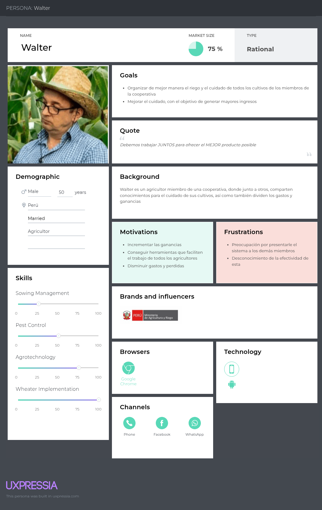

# WaruSmart-Codex-Report

Report of WaruSmart from startup Codex, we are giving information about all lifecycle of this solution. Educational prupouse only.

<h1 style="text-align: center;"> Informe del Trabajo Final </h1>
<h3 style="text-align: center;"> Universidad Peruana de Ciencias Aplicadas </h3>

<tr>
  

    
    

</tr>

<h5 style="text-align: center"> Ingeniería de Software </h5>

<h5 style="text-align: center"> Desarrollo de Soluciones IOT - 1ASI0572 </h5>

<h5 style="text-align: center"> NRC: 2947 </h5>

<h5 style="text-align: center"> Docente: Angel Augusto Velasquez Nuñez </h5>

<h5 style="text-align: center"> Startup: Codex </h5>

<h5 style="text-align: center"> Producto: WaruSmart </h5>

## Team members:

|               Nombre               |  Código  |
| :--------------------------------: | :--------: |
|   Anderson Walter Macedo Calsina   | U20201C179 |
|  Cabrera Camizan, Jeferson Smith  | U20211C211 |
| More Rondon, Christopher Sebastian | U202212199 |
|  Quispe Condori, Fernando Daniel  | U20221C628 |
|      Velasquez Pizarro, Jair      | U202218114 |
| Pingus Rodriguez, Carlos Daniel   | U202113280 |
| Herrera Castillo, Victor Raul     | U20201E188 |

<h5 style="text-align: center"> Ciclo 2025-01 </h5>

### Registro de Informes

| Versión | Fecha     | Autor(es)                                                                                      | Descripción de modificación                                                                 |
|---------|-----------|------------------------------------------------------------------------------------------------|---------------------------------------------------------------------------------------------|
| 0.1     | 04/04/25  | Anderson Walter Macedo Calsina                                                                 | Redacción del Perfil Inicial                                                               |
| 0.2     | 06/04/25  | Cabrera Camizan, Jeferson Smith                                                                | Proceso Lean UX, Mapeo de Eventos, Recolección de Testimonios, Contextos Delimitados       |
| 0.3     | 09/04/25  | More Rondon, Christopher Sebastian                                                              | Modelo C4, Encuesta Inicial                                                                |
| 0.4     | 10/04/25  | Quispe Condori, Fernando Daniel                                                                 | Perfil de Startup, Perfil de Solución, Entrevistas, Mapeo de Impacto, Cartografía de Contexto |
| 0.5     | 11/04/25  | Velasquez Pizarro, Jair                                                                         | Precisión del Context Mapping, Reconocimiento de Ámbitos Delimitados                      |
| 0.6     | 12/04/25  | Pingus Rodriguez, Carlos Daniel                                                                 | Ajustes en el Impact Mapping, Primeros Casos de Uso                                        |
| 0.7     | 14/04/25  | Herrera Castillo, Victor Raul                                                                   | Ajuste de Hipótesis UX, Preparación de Cuestionarios                                       |
| 0.8     | 17/04/25  | Anderson Walter Macedo Calsina, More Rondon, Christopher Sebastian                              | Correcciones al Modelo C4, Creación de Perfiles de Usuario                                 |
| 0.9     | 20/04/25  | Quispe Condori, Fernando Daniel, Velasquez Pizarro, Jair                                        | Escenario As-Is, Elaboración de Mapas de Empatía                                           |
| 1.0     | 22/04/25  | Anderson Walter Macedo Calsina, Cabrera Camizan, Jeferson Smith, More Rondon, Christopher Sebastian, Quispe Condori, Fernando Daniel, Velasquez Pizarro, Jair, Pingus Rodriguez, Carlos Daniel, Herrera Castillo, Victor Raul | Versión final de TB1: Portada, Historial de Cambios, Introducción, Necesidades, Detalles Técnicos, Propuesta de Solución |

### Project Report Collaboration Insights

URL del repositorio para el reporte del proyecto:

TB1
Para el desarrollo del informe perteneciente a la entrega TB1, se dividió la implementación de secciones de la siguiente forma
para cada integrante del equipo:

| Integrante | Tareas Asignadas |
| ---------- | ---------------- |
| ---        | ---              |

## Contenido

1. **Capítulo I: Introducción.**
2. ...

### Student Outcome

| **Criterio específico**                                                                  | **Acciones realizadas** | **Conclusiones** |
| ----------------------------------------------------------------------------------------------- | ----------------------------- | ---------------------- |
| Trabaja en equipo para proporcionar liderazgo en forma conjunta                                 | ---                           | ---                    |
| Crea un entorno colaborativo e inclusivo, establece metas, planifica tareas y cumple objetivos. | ---                           | ---                    |

## Capítulo I: Introducción.

### 1.1 **Startup Profile.**

#### 1.1.1   Descripción del startup

WaruSmart es una startup peruana creada por estudiantes de la Universidad Peruana de Ciencias Aplicadas (UPC) que desarrolla soluciones IoT para optimizar el riego en el sector agrícola mediante sensores de humedad, temperatura, clima, entre otros. Permitiendo a los agricultores gestionar el riego de forma automática o manual, visualizar datos en tiempo real a través de una app móvil y web, recibir alertas por condiciones críticas y acceder a un historial de datos por parcela, con un modelo de negocio basado en la venta de kits IoT y suscripciones para funciones avanzadas.

#### 1.1.2   Perfiles de integrantes del equipo

| Perfil                                                                                                                                                                                                                                                                                                                                                                                                                                                            | Foto                                              |
| ----------------------------------------------------------------------------------------------------------------------------------------------------------------------------------------------------------------------------------------------------------------------------------------------------------------------------------------------------------------------------------------------------------------------------------------------------------------- | ------------------------------------------------- |
| Nombre: Fernando Daniel Quispe Condori Carrera: Ingeniería de Software Código: U20221C628 Descripción: Soy Fernando Daniel Quispe Condori, tengo 20 años y curso la carrera de Ingeniería de Software. Cuento con las habilidades técnicas para apoyar a mi equipo en el desarrollo de nuestra solución IoT en el contexto actual, así mismo cuento cono habilidades para la gestión de equipos y colaborar efectivamente como un equipo. |  |
| Nombre: Anderson Walter Macedo Calsina Carrera: Ingeniería de Software Código: U20201C179 Descripción: Soy Anderson Walter Macedo Calsina, tengo 22 años y actualmente estoy estudiando Ingeniería de Software en la UPC. Me gusta colaborar con mis compañeros y contribuir en proyectos conjuntos. Estoy dispuesto a contribuir a mi equipo en el desarrollo del proyecto con los conocimientos que he ido adquiriendo.                    |                                                   |
| Nombre: Christopher Sebastian More Rondon Carrera Ingeniería de Software: Código: U202212199 Descripción: Soy estudiante del septimo ciclo de Ingenieria de Software, actualmente tengo 20 años. Soy un estudiante que colabora constantemente en el desarrollo de los projectos, asi como dar soluciones creativas a los problemas que surgan durante la creacion de estos. Siempre me esfuerzo por entregar un buen trabajo.                 |                                                   |
| Nombre:Jair Velasquez Pizarro   Carrera: Ingeniería de Software  Código: U202218114   Descripción: Estoy cursando el séptimo ciclo de la carrera de Ingeniería de Software. Manejo los lenguajes de TypeScript, Java, JavaScript a nivel intermedio, cuento con experiencia en desarrollo FullStack como tambien habilidades de trabajo en equipo para colaborar de forma efectiva.                                                                                                                                                                                                                                                                                     |                                                   |
| Nombre: Carlos Daniel Pingus Rodriguez<brr />Carrera: Ingenierría de Software Código: U202113280  Descripción: Soy estudiante de la carrera de ingeniería de Software. Me gusta la tecnología y como esta misma ha cambiado significativamente en mi tiempo de vida. Me considero alguien responsable y comprometido con los proyectos; Trato de estar a la par con mis compañeros y compartir con ellos mis conocimientos en ciertos temas específicos.  |      |
| Nombre:Carrera: Código: Descripción:                                                                                                                                                                                                                                                                                                                                                                                                                       |                                                   |
| Nombre:Victor Raul Herrera Castillo Carrera: Ingeneria de Software Código: U20201E188 Descripción: Soy un estudiante de la carrera de ingeniería de software, apasionado por la tecnología y sus oportunidades en el ámbito de la ciencia, me gusta leer y enseñar a otras personas los conocimientos que aprendí durante el desarrollo de mi carrera.||

### 1.2 **Solution Profile.**

#### 1.2.1   Antecedentes y problemática

###### Antecedentes

En el contexto actual peruano, la agricultura enfrenta desafíos significativos debido al cambio climático, la escasez de agua y la necesidad de aumentar la productividad para satisfacer la creciente demanda de alimentos. Según la FAO, el sector agrícola consume aproximadamente el 70% del agua dulce disponible a nivel mundial, lo que resalta la importancia de optimizar el uso de este recurso. En Perú, donde la agricultura es una actividad económica clave, muchos agricultores aún dependen de métodos tradicionales de riego que no son eficientes y generan desperdicio de agua. Además, el acceso limitado a tecnologías avanzadas dificulta la adopción de prácticas de agricultura inteligente, especialmente en comunidades rurales.

###### Problemática

La problemática principal radica en la falta de herramientas accesibles y efectivas para gestionar el riego de manera eficiente en los campos de cultivo. Esto genera un uso excesivo de agua, costos elevados y una menor productividad agrícola. **Los agricultores necesitan soluciones tecnológicas que les permitan monitorear en tiempo real las condiciones del suelo y el clima, automatizar el riego y recibir alertas ante situaciones críticas.** Sin embargo, las opciones disponibles en el mercado suelen ser costosas o complejas, lo que limita su adopción por parte de pequeños y medianos agricultores. Esta brecha tecnológica afecta no solo la sostenibilidad del sector agrícola, sino también la seguridad alimentaria y el desarrollo económico de las comunidades rurales.

###### Aplicación de las 5 W’s y 2 H’s

-**Who**: Los actores clave involucrados son los agricultores individuales, ONGs y entidades públicas que promueven la agricultura sostenible. Estos grupos han sido identificados en estudios del Ministerio de Agricultura de Perú y del Instituto Nacional de Innovación Agraria como pilares fundamentales para la adopción de tecnologías que impulsen la transformación digital y la eficiencia en el manejo de recursos hídricos. https://www.gob.pe/institucion/midagri/noticias/815784-midagri-inicia-la-transformacion-digital-de-la-agricultura-familiar

-**What**: La propuesta se centra en la optimización del riego a través de una solución IoT accesible y eficiente. Investigaciones publicadas por la FAO y estudios sobre agricultura inteligente en América Latina resaltan la capacidad de estas tecnologías para transformar prácticas tradicionales en métodos de riego más precisos, contribuyendo a una gestión sostenible y a una mayor productividad. https://www.fao.org/family-farming/detail/es/c/1612596/

-**Where**: La implementación se orienta hacia campos de cultivo en Perú, particularmente en zonas rurales donde el acceso a tecnologías avanzadas es limitado. Informes del Banco Mundial y análisis de desarrollo regional destacan que estas áreas requieren intervención tecnológica para mejorar la eficiencia en el uso de recursos y enfrentar desafíos climáticos.

-**When**: La necesidad de esta solución es urgente en el contexto actual marcado por el cambio climático y la creciente demanda de alimentos. Reportes del IPCC y estudios de la FAO subrayan que el momento presente es crítico para implementar soluciones innovadoras que mitiguen el impacto ambiental y aseguren la producción alimentaria a largo plazo.

-**Why**: La motivación principal es reducir el desperdicio de agua, aumentar la productividad agrícola y promover la sostenibilidad en el sector. Comparativas de técnicas de riego y análisis del Ministerio de Agricultura evidencian cómo una gestión más inteligente del agua puede generar beneficios económicos y medioambientales para los agricultores y la sociedad en general.

-**How**: La solución propuesta utiliza sensores IoT para medir variables críticas como la humedad del suelo, temperatura y condiciones climáticas, combinados con un sistema de automatización del riego y una plataforma digital para monitoreo en tiempo real. Casos de éxito en el ámbito del smart farming y estudios técnicos en publicaciones especializadas demuestran la viabilidad y eficacia de esta integración tecnológica.

-**How Much**: El enfoque de monetización se basa en la venta de kits IoT y la oferta de suscripciones accesibles para acceder a funciones avanzadas del sistema. Modelos de negocio analizados en reportes de financiamiento agrícola y tendencias de inversiones en AgTech confirman que esta estructura permite un equilibrio entre financiación inicial y sostenibilidad económica a través de ingresos recurrentes.

#### 1.2.2 Lean UX Process

#### 1.2.2.1 Lean UX Problem Statements

A continuación se presentan los statements del proceso Lean UX donde se incluyen aspectos como domain, customer segments, pain points, gap, visión/strategy e initial segment.

WaruSmart, nuestra herramienta de riego automatizado, fue diseñada para ofrecer a los agricultores, una solución para el control del riego, automatizando este proceso a través de soluciones IoT de manera eficiente y sencilla. El objetivo es garantizar un proceso agrícola automatizado, evitando las fallas humanas que puedan existir, y de esta manera ofrecer servicios de visualización de una data organizada y precisa sobre la gestión de sus cultivos para la toma de mejores decisiones.

La adopción de las tecnologías IoT en la agricultura puede ser un desafío debido a la desconfianza o falta de experiencia en el sector entre los agricultores. A pesar de esto, estudios muestran que quienes utilizan herramientas digitales para gestionar sus cultivos tienden a lograr mejores resultados, como mayores rendimientos y menor desperdicio de recursos. Por lo tanto, nuestro desafío es: **¿Cómo podemos automatizar el proceso de riego agrícola, superando las barreras de confianza y asegurando que los agricultores vean beneficios tangibles, como una mayor productividad y eficiencia?**

Para abordar esta pregunta, necesitamos centrarnos en las siguientes directrices:

- **Enfoque centrado en el cliente:** La solución debe ser fácil de usar y entender para agricultores con cualquier nivel de experiencia tecnológica, siempre priorizando el feedback y mejoras que nuestros clientes puedan brindarnos.
- **Alcance claro:** Nos centraremos en la automatización del riego de cultivos con tecnologías IoT, excluyendo la gestión operativa (cantidad de cultivos, tipos, productos usados, etc.).
- **Medidas de éxito:** El éxito se medirá por la reducción de tiempo en el proceso de riego y la mejora en la cantidad de producción y calidad de producto, recopilando datos que nos permitan visualizar el estado de mejora de los cultivos de nuestros clientes.

#### 1.2.2.2 Lean UX Assumptions

##### **Business Assumptions:**

1. **Creemos que nuestros usuarios necesitan** una gestión automatizada e inteligente del riego de sus cultivos, permitiendo monitorear condiciones ambientales y ajustar el riego en tiempo real.
2. **Estas necesidades se pueden satisfacer con** el desarrollo de WaruSmart, una solución IoT integrada con sensores y una interfaz web que garantice el registro preciso y la automatización del riego.
3. **Nuestros clientes iniciales serán** agricultores que buscan modernizar sus métodos tradicionales de riego, desde pequeños productores hasta empresas agrícolas en expansión, cooperativas y ONG's.
4. **El valor más importante que quiere un cliente de nuestros servicios es** la seguridad de que sus cultivos reciben la cantidad óptima de agua en el momento justo, reduciendo desperdicios y aumentando la productividad.
5. **El cliente también va a obtener** datos en tiempo real, alertas automáticas y análisis estadísticos del desempeño de sus cultivos, facilitando decisiones informadas para la optimización de recursos.
6. **Vamos a obtener la mayoría de los clientes mediante** alianzas estratégicas con asociaciones agrícolas, demostraciones en campo y campañas dirigidas en foros y redes sociales especializadas en tecnología agrícola.
7. **Vamos a obtener ingresos mediante** un modelo de suscripción escalonado que ofrezca planes básicos y avanzados, complementado con la venta de kits de sensores IoT y dispositivos de automatización.
8. **Nuestra competencia en el mercado será** soluciones tradicionales de riego manual y otras plataformas digitales con menor integración IoT, análisis en tiempo real y/o que contengan otras tecnologías
9. **Vamos a tener ventaja frente a nuestra competencia debido a** la integración completa de sensores precisos, análisis predictivo y una interfaz intuitiva, accesible tanto para agricultores novatos como experimentados.
10. **El mayor riesgo del producto es** no lograr que el sector agrícola, usualmente reacio a cambios, confíe en nuevas tecnologías. Este reto se mitigará mediante soporte técnico continuo y capacitaciones prácticas.
11. **Lo resolveremos realizando** pruebas de campo, incorporando feedback de los usuarios y actualizando la plataforma de manera iterativa para garantizar un sistema robusto, confiable y adaptable a las necesidades reales de los agricultores.

##### **User Assumptions**

**¿Quién es el usuario?**
El usuario de WaruSmart es un agricultor que busca modernizar y optimizar el riego de sus cultivos. Este segmento abarca tanto a agricultores tradicionales que desean incursionar en la digitalización, como a productores profesionales(cooperativas, ONG's, entre otros) que quieren maximizar la eficiencia del uso del agua.

**¿Qué problema tiene nuestro producto que resolver?**
El principal reto es la gestión manual del riego, que propicia ineficiencias y errores en la asignación de recursos hídricos. WaruSmart aborda este problema ofreciendo automatización, monitoreo en tiempo real y alertas predictivas para asegurar un riego óptimo y evitar la pérdida de agua en base a sensores de calidad del aire, temperatura y calidad del suelo.

**¿Qué características son importantes?**Es crucial que la plataforma tenga:

- Integración de sensores IoT para monitoreo en tiempo real.
- Funcionalidades de alerta y notificaciones ante condiciones críticas.
- Herramientas de análisis y visualización de datos históricos para la toma de decisiones.
- Un ecosistema amigable con el usuario agrícola, fácil de entender y manejar.

**¿Dónde encaja nuestro producto en su trabajo o vida?**
WaruSmart se integra en las labores diarias del agricultor, facilitando la supervisión remota y el control automatizado del riego, lo que permite dedicar más tiempo a otras tareas esenciales y optimizar la producción así como la calidad agrícola.

**¿Cuándo y cómo es usado nuestro producto?**
El sistema se utiliza durante el ciclo completo del cultivo. Los sensores envían datos continuamente, permitiendo ajustes inmediatos al riego y un control constante de las condiciones ambientales, desde la preparación del terreno hasta la cosecha.

**¿Cómo debe verse nuestro producto y cómo debe comportarse?**
El sistema WaruSmart es un producto de confianza, respaldado por datos precisos. La aplicación ofrecerá una interfaz web robusta y responsiva, que facilitará una navegación intuitiva y garantizará la integridad de cada registro y alerta. Así se asegura una experiencia de usuario de alta calidad y la provisión de datos confiables para análisis avanzados.

##### **Feature Assumptions**

- **Creemos que** la integración de análisis predictivo basado en datos históricos permitirá a los agricultores anticipar las necesidades de riego y optimizar recursos de manera proactiva.
- **Creemos que** la incorporación de notificaciones y alertas automáticas incrementará la efectividad del monitoreo, evitando situaciones de riego excesivo o insuficiente.
- **Creemos que** la posibilidad de visualizar gráficos y tendencias en tiempo real empoderará a los usuarios para tomar decisiones informadas sobre el manejo de sus cultivos.

#### 1.2.2.3 Lean UX Hypothesis Statements

##### Lean UX Hypothesis Statements

**Hypothesis Statement 01:**
**Creemos** que automatizar el riego mediante sensores IoT aumentará la eficiencia en el uso del agua, beneficiando tanto a agricultores tradicionales como modernos.
**Sabremos** que hemos tenido éxito cuando se registre una reducción del consumo de agua en al menos un 20% y una mejora significativa en la productividad de los cultivos en un 30%.

**Hypothesis Statement 02:**
**Creemos** que una interfaz limpia e intuitiva facilitará la adopción del sistema al eliminar barreras tecnológicas para usuarios de distintos niveles de experiencia.
**Sabremos** que hemos tenido éxito cuando al menos el 70% de los usuarios califiquen la interfaz como "muy fácil de usar" en las encuestas de satisfacción.

**Hypothesis Statement 03:**
**Creemos** que la integración de alertas en tiempo real y análisis predictivo reducirá errores manuales y optimizará la productividad de los cultivos.
**Sabremos** que hemos tenido éxito cuando se observe una disminución del 30% en la incidencia de errores durante el riego.

**Hypothesis Statement 04:**
**Hipotetizamos** que el modelo de negocio basado en suscripciones y venta de kits IoT es viable y sostenible, permitiendo la expansión y mejora continua de la plataforma.
**Sabremos** que hemos tenido éxito cuando se registre un crecimiento mensual en ingresos del 15% y se establezcan alianzas estratégicas que impulsen la adopción del sistema.

#### 1.2.2.4 Lean UX Canvas.

A continuación se presenta el Lean UX Canvas realizado para nuestra solución:

Lean UX Canvas:

### 1.3 **Segmentos Objetivos.**

#### Agricultores Individuales

- Representan productores que gestionan sus cultivos de manera autónoma.
- Buscan soluciones tecnológicas para automatizar y optimizar el riego, reduciendo desperdicios y mejorando la productividad.
- Valoran interfaces simples, alertas en tiempo real y herramientas de análisis que faciliten la toma de decisiones.
- Requieren soporte técnico y capacitaciones que faciliten la transición hacia tecnologías IoT.

#### ONG y/o Entidades Públicas

- Agrupan organizaciones enfocadas en promover la agricultura sostenible y la optimización de recursos hídricos.
- Interesadas en impulsar políticas públicas y proyectos de impacto social que favorezcan el desarrollo agrario.
- Buscan soluciones que permitan un monitoreo centralizado y análisis de datos para implementar estrategias de mejora en comunidades rurales.
- Actúan como facilitadoras en la difusión y adopción de innovaciones tecnológicas en el sector agrícola.

## Capítulo II: Requirements Elicitation & Analysis.

### 2.1 **Competidores.**

#### 2.1.1   Análisis competitivo.

|                                                         | WaruSmart                                                                                                                                                                                                                                   | Agrobit                                                                                                                                                                              | Netafirm                                                                                                                                                                                                                                                                | Irritec                                                                                                                                                                                                 |
| ------------------------------------------------------- | ------------------------------------------------------------------------------------------------------------------------------------------------------------------------------------------------------------------------------------------- | ------------------------------------------------------------------------------------------------------------------------------------------------------------------------------------ | ----------------------------------------------------------------------------------------------------------------------------------------------------------------------------------------------------------------------------------------------------------------------- | ------------------------------------------------------------------------------------------------------------------------------------------------------------------------------------------------------- |
| PERFIL                                                  |                                                                                                                                                                                                                                             |                                                                                                                                                                                      |                                                                                                                                                                                                                                                                         |                                                                                                                                                                                                         |
| Overview                                                | Solución digital peruana enfocada en la gestión eficiente del riego para agricultores individuales y cooperativas agrarias.                                                                                                               | Plataforma integral de gestión agrícola que combina datos agronómicos y geo-espaciales para optimizar operaciones desde la siembra hasta la distribución.                        | Empresa israelí líder en soluciones de riego por goteo y fertirrigación, ofreciendo tecnologías avanzadas para maximizar la eficiencia hídrica y nutricional en cultivos a nivel mundial.                                                                          | Empresa italiana especializada en sistemas de riego y fertirrigación, proporcionando soluciones sostenibles y eficientes para la agricultura moderna.                                                  |
| Ventaja competitiva ¿Qué valor ofrece a los clientes? | Solución accesible y adaptada a pequeños y medianos agricultores peruanos, con enfoque en facilidad de uso.                                                                                                                               | Integración de Machine Learning y Big Data para ofrecer planificación inteligente, monitoreo predictivo y trazabilidad con enfoque en sostenibilidad y eficiencia operativa.       | Tecnología de punta con sistemas como DripNet PC™, que integra monitoreo, análisis y control del riego en una sola plataforma, adaptándose a diversas condiciones agrícolas y ofreciendo recomendaciones en tiempo real basadas en modelos dinámicos de cultivos. | Amplia gama de productos de riego que combinan innovación y sostenibilidad, adaptándose a diferentes tipos de cultivos y condiciones, con un enfoque en la eficiencia del uso del agua y la energía. |
| PERFIL DE MARKETING                                     |                                                                                                                                                                                                                                             |                                                                                                                                                                                      |                                                                                                                                                                                                                                                                         |                                                                                                                                                                                                         |
| M4ercado Objetivo                                       | Agricultores individuales y cooperativas agrarias en Perú.                                                                                                                                                                                 | Empresas agrícolas que buscan digitalizar y optimizar sus procesos productivos, con un enfoque en cultivos extensivos, intensivos, frutihortícolas y forestales.                   | Agricultores de todos los tamaños a nivel global, desde pequeños productores hasta grandes explotaciones agrícolas, que buscan soluciones eficientes de riego y fertirrigación.                                                                                     | Agricultores y empresas agrícolas que requieren soluciones de riego eficientes y sostenibles, adaptadas a diversas condiciones y tipos de cultivos.                                                    |
| Estrategias de Marketing                                | Alianzas estratégicas con asociaciones agrícolas, demostraciones en campo y campañas dirigidas en redes sociales y foros especializados. Se incluirán capacitaciones prácticas y soporte técnico como parte del proceso de adopción. | Implementación de pilotos gratuitos en parcelas de agricultores locales para demostrar los beneficios del sistema. Los casos de éxito se usan como referencia en nuevas campañas. | Participación en ferias agrícolas, demostraciones en campo y alianzas con distribuidores locales. Además, ofrecen capacitaciones y soporte técnico para garantizar la correcta implementación de sus sistemas.                                                     | Presencia en ferias y eventos agrícolas, colaboraciones con distribuidores y enfoque en la sostenibilidad como valor diferencial en sus campañas de marketing.                                        |
| PERFIL DE PRODUCTO                                      |                                                                                                                                                                                                                                             |                                                                                                                                                                                      |                                                                                                                                                                                                                                                                         |                                                                                                                                                                                                         |
| Productos & Servicios                                   | Kits IoT para riego, plataforma web y móvil para monitoreo y control, alertas y análisis de datos.                                                                                                                                        | Plataforma digital que integra planificación, monitoreo y análisis de datos para optimizar la producción agrícola.                                                               | Sistemas de riego por goteo, fertirrigación y soluciones digitales como DripNet PC™ para el monitoreo y control del riego.                                                                                                                                            | Sistemas de riego por goteo, microaspersión y soluciones de fertirrigación adaptadas a diferentes cultivos y condiciones agrícolas.                                                                  |
| Precios & Costos                                        | Modelo de suscripción escalonado con kits IoT accesibles para pequeños y medianos agricultores.                                                                                                                                           | Modelo de suscripción basado en el tamaño y necesidades de la operación agrícola.                                                                                                | Precios variables según el tamaño y complejidad del sistema de riego requerido, con opciones personalizadas para diferentes tipos de agricultores.                                                                                                                    | Precios competitivos con opciones personalizadas según las necesidades del cliente y el tipo de cultivo.                                                                                               |
| Canales de distribución (Web y/o Móvil)               | Plataforma web y aplicación móvil para Android e iOS.                                                                                                                                                                                     | Plataforma web y aplicación móvil con funcionalidades online y offline para facilitar el trabajo en campo.                                                                         | Distribuidores autorizados, ventas directas y presencia en línea a través de su sitio web oficial.                                                                                                                                                                    | Distribuidores autorizados y ventas directas a través de su red comercial y sitio web oficial.                                                                                                         |
| ANALISIS SWOT                                           |                                                                                                                                                                                                                                             |                                                                                                                                                                                      |                                                                                                                                                                                                                                                                         |                                                                                                                                                                                                         |
| Fortalezas                                              | Adaptación al contexto local, facilidad de uso, soporte técnico cercano.                                                                                                                                                                  | Integración de tecnologías avanzadas, enfoque en sostenibilidad y amplia experiencia en el sector agrícola.                                                                       | Liderazgo en innovación tecnológica, amplia experiencia global y soluciones adaptadas a diferentes condiciones agrícolas.                                                                                                                                            | Amplia gama de productos, enfoque en sostenibilidad y presencia internacional en el mercado de sistemas de riego.                                                                                       |
| Debilidades                                             | Limitada experiencia en el mercado, recursos limitados para expansión.                                                                                                                                                                     | Dependencia de la conectividad y posibles barreras tecnológicas en zonas rurales.                                                                                                   | Costos iniciales elevados para pequeños agricultores y necesidad de capacitación para el uso de tecnologías avanzadas.                                                                                                                                               | Menor presencia en algunos mercados emergentes y necesidad de adaptación a diferentes normativas locales.                                                                                              |
| Oportunidades                                           | Creciente demanda de soluciones tecnológicas en la agricultura peruana, apoyo gubernamental.                                                                                                                                               | Expansión en mercados emergentes y creciente interés en la digitalización del sector agrícola.                                                                                   | Aumento de la conciencia sobre la eficiencia hídrica y la necesidad de soluciones sostenibles en la agricultura.                                                                                                                                                       | Creciente demanda de sistemas de riego eficientes y sostenibles en diversas regiones del mundo.                                                                                                         |
| Amenazas                                                | Competencia de grandes empresas, resistencia al cambio por parte de agricultores tradicionales.                                                                                                                                             | Competencia de plataformas similares y posibles barreras de entrada en nuevos mercados.                                                                                              | Competencia creciente en el mercado de tecnologías de riego y cambios en las regulaciones ambientales.                                                                                                                                                                 | Fluctuaciones en los precios de los insumos y competencia de nuevas tecnologías emergentes.                                                                                                            |

#### 2.1.2   Estrategias y tácticas frente a competidores.

**AFRONTAR LAS FORTALEZAS (de la competencia):**

- *Diferenciación por enfoque local:* Mientras Netafim e Irritec operan a nivel global, WaruSmart puede destacarse por su conocimiento profundo del contexto agrícola peruano, ofreciendo soluciones adaptadas a las realidades locales.
- *Atención personalizada:* Brindar soporte técnico cercano y capacitaciones prácticas ayuda a compensar la experiencia tecnológica de competidores como Agrobit.

**APROVECHAR LAS DEBILIDADES (de la competencia):**

- *Accesibilidad económica:* Frente a los altos costos de implementación de tecnologías avanzadas como las de Netafim e Irritec, WaruSmart puede posicionarse como una opción más asequible para pequeños y medianos agricultores.
- *Facilidad de uso:* La simplicidad en el diseño de la plataforma permite a WaruSmart destacarse frente a herramientas más complejas como las de Agrobit, facilitando la adopción en zonas rurales con menos experiencia tecnológica.

**OPORTUNIDADES Y AMENAZAS DE LA COMPETENCIA:**

- *Oportunidades:*

  - Establecer alianzas con cooperativas agrícolas y entidades gubernamentales para fortalecer su red de apoyo y validación.
  - Innovar continuamente en nuevas funcionalidades adaptadas al contexto peruano, como monitoreo offline, alertas por SMS, o integración con fuentes de datos locales (clima, suelos, etc.).
- *Amenazas:*

  - Entrada de nuevos competidores con soluciones tecnológicas más sofisticadas o con mayores recursos financieros.
  - Cambios en políticas gubernamentales que puedan afectar la inversión en innovación agrícola o restringir el uso de ciertas tecnologías.

### 2.2 **Entrevistas**

#### 2.2.1   Diseño de entrevistas.

A continuacion se mostrara las preguntas que se le realizaron a los entrevistados en busca de obtener la mejor informacion posible para nuestra solucion

<h4>PREGUNTAS GENERALES:</h4>

1. Presentese con su nombre, lugar de residencia y edad 

2. ¿Suele hacer uso de la tecnología en el día a día? 

3. ¿Tiene dificultades al usar aparatos digitales?

<h4>PREGUNTAS PARA AGRICULTORES INDIVIDUALES:</h4>

4. ¿De que manera lleva el registros de los riegos a sus cultivos?

5. ¿Que datos considera mas relevantes para el cuidado de sus cultivo?

6. ¿En alguna ocasion ha tenido problemas con el registro del riego a sus cultivos?. Si es asi, ¿le ha provocado perdidas economica o de tiempo?

7. ¿Alguna vez ha experimentado problemas para regar sus plantaciones?. Si es asi, ¿que suele hacer en esas situaciones?

8. (Comentar la propuesta) ¿Estaria interesado en este sistema para ayudarle con el riego? ¿Por qué?

9. ¿Cuanto estaria dispuesto a pagar por el servicio?

10. ¿Cree que esta clase de herramientas podrían facilitar el trabajo a otros agricultores?

<h4>PREGUNTAS PARA MIEMBROS DE COOPERATIVAS AGRARIAS:</h4>

4. ¿Como registran las necesidades de los cultivos de la cooperativa?

5. ¿Los miembros suelen tener problemas para la gestion de sus cultivos?

6. ¿De que manera se organizan para conseguir los materiales necesarios con los que cuidar los cultivos?

7. ¿Han tenido perdidas por las dificultades de organizar tantos cultivos?

8. ¿Suelen usar herramientas para facilitar el cuidado de cultivos?. Si es asi, ¿cuales?

9. (Comentar la propuesta) ¿Cree que este sistema ayudaria a facilitar su trabajo?

10. ¿Cuanto estarian dispuestos a pagar por el sistema?

#### 2.2.2   Registro de entrevistas.

#### 2.2.3   Análisis de entrevistas.

### 2.3 **Needfinding.**

#### 2.3.1   User Personas.

**SEGMENTO AGRICULTORES:**

**SEGMENTO COOPERATIVAS:**

#### 2.3.2   User Task Matrix.

| Tareas                                      | Agricultores Importancia | Agricultores Frecuencia | Cooperativas Importancia | Cooperativas Frecuencia |
| ------------------------------------------- | :----------------------: | :---------------------: | :----------------------: | :---------------------: |
| Realizar el riego de los cultivos           |           Alta           |          Alta          |           Alta           |          Alta          |
| Escuchar o indagar recomendaciones          |           Alta           |          Media          |           Alta           |          Media          |
| Verificar humedad del cultivo               |           Alta           |          Media          |           Alta           |          Alta          |
| Conocimiento de problemas en los cultivos   |           Alta           |          Alta          |           Alta           |          Alta          |
| Determinar etapa del desarrollo del cultivo |           Alta           |          Alta          |          Media          |          Media          |
| Revisión de calidad en la cosecha          |           Alta           |          Media          |           Alta           |          Alta          |
| Revisar el registro de los cultivos         |           Alta           |          Alta          |          Media          |          Media          |

#### 2.3.3   User Journey Mapping.

**SEGMENTO AGRICULTORES:**

**SEGMENTO COOPERATIVAS:**

#### 2.3.4   Empathy Mapping.

**SEGMENTO AGRICULTORES:**

**SEGMENTO COOPERATIVAS:**

#### 2.3.5   As-Is Scenario Mapping.

**SEGMENTO AGRICULTORES:**

|          |                 Monitoreo de cultivo                 |                       Riego de cultivo                       |                          Cosecha                          |                  Control de calidad                  |
| -------- | :--------------------------------------------------: | :----------------------------------------------------------: | :-------------------------------------------------------: | :---------------------------------------------------: |
| DOING    |    Monitorea visualmente usando sus conocimientos    |    Riega a una hora determinada usando diversas tecnicas    |        Realiza la cosecha en la fecha determinada        |            Verifica los cultivos fallidos            |
| THINKING | Se ven bien, espero no estar olvidando algun detalle |        Espero no estar regando de más algun cultivo        |             La cosecha parece tener problemas             |    Mi margen de ganancias no sera demasiado grande    |
| FEELING  |           Me preocupa estar ignorando algo           | Me pone ansioso no saber con certeza si el riego es correcto | Me disgusta ver que varios cultivos no se encuentren bien | Me molesta no haber ganado más dinero con mi trabajo |

**SEGMENTO COOPERATIVAS:**

|          |                              División de gastos                              |                        Riego de cultivos                        |                   Cosecha                   |                               Reparto de ganancias                               |
| -------- | :---------------------------------------------------------------------------: | :--------------------------------------------------------------: | :------------------------------------------: | :-------------------------------------------------------------------------------: |
| DOING    | Cada agricultor compra segun lo que creen que van a necesitar en sus cultivos |         Riegan con diversas tecnicas a la hora calculada         |  Realiza la cosecha en la fecha determinada  |                Reparten las ganancias de la venta de sus productos                |
| THINKING |  Espero que hallamos calculado bien para no gastar demasiado dinero de más  | Podremos regar los cultivos con las tecnicas que hemos aprendido | Parece que algunas cosechas tienen problemas |               Al dividir no hemos ganado tanto dinero como esperaba               |
| FEELING  |  Me preocupa no saber que tan bien hemos calculado lo que vamos a necesitar  |     Me genera duda saber si habrá una mejor manera de regar     |    Me disgusta ver cultivos con problemas    | Me molesta ver que pudimos ganar más dinero con un mejor cuidado para la cosecha |

### 2.4 **Ubiquitous Language.**

* **Irrigation System (Sistema de Riego)**: Conjunto de dispositivos y tecnologías que permiten distribuir agua a los cultivos de forma controlada y eficiente.
* **Water Consumption (Consumo de Agua)**: Cantidad de agua utilizada en los procesos de riego de los cultivos, relacionada con el uso eficiente del recurso hídrico.
* **Soil Moisture (Humedad del Suelo)**: Nivel de humedad presente en el suelo, fundamental para determinar el momento adecuado para regar.
* **Smart Irrigation (Riego Inteligente)**: Técnica que emplea sensores y controladores automáticos para optimizar el uso del agua según condiciones específicas del suelo y clima.
* **IoT Sensor (Sensor IoT)**: Dispositivo conectado que recopila datos como temperatura, humedad y otras variables ambientales en tiempo real para apoyar decisiones agrícolas.
* **Climate Data (Datos Climáticos)**: Información sobre el estado del clima, como la temperatura o precipitaciones, utilizada para ajustar el riego según las condiciones ambientales.
* **Water Efficiency (Eficiencia del Agua)**: Relación entre la cantidad de agua utilizada y los beneficios obtenidos en el cultivo; se busca maximizarla para evitar el desperdicio del recurso.
* **Agricultural Cooperative (Cooperativa Agraria)**: Grupo de agricultores que se organiza para mejorar su producción, compartir recursos y facilitar la adopción de nuevas tecnologías.
* **Irrigation Management (Gestión de Riego)**: Conjunto de decisiones y acciones que permiten planificar, monitorear y controlar el riego en los campos agrícolas para mejorar su eficiencia.
* **Automated Control System (Sistema de Control Automatizado)**: Sistema que permite programar y controlar de manera automática el funcionamiento del riego, mejorando la precisión y reduciendo la intervención manual.
* **Water Scarcity (Escasez de Agua)**: Situación en la que la disponibilidad de agua es insuficiente para satisfacer la demanda agrícola, afectando directamente la productividad.

## Capítulo III: Requirements Specification.

### 3.1 **To-Be Scenario Mapping.**

**SEGMENTO AGRICULTORES:**

|          |                 Monitoreo de cultivo                 |                       Riego de cultivo                       |                          Cosecha                          |                  Control de calidad                  |
| -------- | :--------------------------------------------------: | :----------------------------------------------------------: | :-------------------------------------------------------: | :---------------------------------------------------: |
| DOING    |    Utiliza una app para ver el estado del cultivo    |    Activa el sistema de riego automático según sensor    |        Cosecha siguiendo recomendaciones del sistema        |            Usa la app para registrar calidad y fallas            |
| THINKING | Puedo ver todo el estado desde mi celular |        Sé que se está usando el agua de forma eficiente        |             Este año se ve mejor la producción             |    Estoy mejorando mi rentabilidad    |
| FEELING  |           Me siento tranquilo al ver datos confiables           | Me da confianza el sistema automático de riego | Me alegra ver más cultivos en buen estado | Estoy orgulloso del resultado obtenido |

 
 

**SEGMENTO COOPERATIVAS:**

|          |                              División de gastos                              |                        Riego de cultivos                        |                   Cosecha                   |                               Reparto de ganancias                               |
| -------- | :---------------------------------------------------------------------------: | :--------------------------------------------------------------: | :------------------------------------------: | :-------------------------------------------------------------------------------: |
| DOING    | Usan sistema de planificación compartido |         Gestionan riego con sensores y cronogramas         |  Siguen cronograma y predicción de clima  |                Utilizan plataforma para calcular y dividir ganancias                |
| THINKING |  Ahora podemos estimar mejor lo necesario  | Riegos más eficientes = menos desperdicio | Se nota el efecto de mejor planificación |               La ganancia está mejor distribuida y optimizada               |
| FEELING  |  Me siento seguro con la planificación  |     Me da tranquilidad saber que es óptimo     |    Me siento satisfecho con la cosecha    | Me alegra ver que todos ganamos más |

### 3.2 **User Stories.**

<table>
  <colgroup>
    <col style="width: 20px">
    <col style="width: 40px">
    <col style="width: 100px">
    <col style="width: 300px">
    <col style="width: 20px">
  </colgroup>
  <tr>
   <td>
Epic / Story ID
   </td>
   <td>Título
   </td>
   <td>Descripción
   </td>
   <td>Criterio de aceptación
   </td>
   <td>Epic 

ID
   </td>
  </tr>
  <tr>
   <td colspan="5" ><strong>Epic 1: Panel de Monitoreo agrícola \
Como</strong> agricultor o miembro de una cooperativa \
<strong>Quiero</strong> acceder a un panel de control centralizado desde mi aplicación web o móvil \
<strong>Para </strong>monitorear en tiempo real el estado de mis cultivos, el riego y recibir alertas importantes
   </td>
  </tr>
  <tr>
   <td>E1-US101
   </td>
   <td>Visualización de condiciones del cultivo en tiempo real

 
   </td>
   <td><strong>Como</strong> agricultor <strong>quiero </strong>ver los datos en tiempo real sobre humedad del suelo, temperatura, y clima en el panel de control <strong>para </strong>tomar decisiones informadas sobre el riego y cuidado de mis cultivos
   </td>
   <td><strong>Escenario 1: Visualización general \
Dado que</strong> que el agricultor ha iniciado sesión en la aplicación

<strong>Y</strong> tiene sensores IoT instalados en su campo \
<strong>Cuando</strong> accede al panel de monitoreo

<strong>Entonces</strong> puede ver una vista general de los valores actuales de humedad, temperatura, y pronóstico del clima \
  
<strong>Escenario 2: Datos por zona de cultivo \
Dado que</strong> que el agricultor tiene varias zonas de cultivo registradas

<strong>Y</strong> se dirige en la barra de navegación \
<strong>Cuando</strong> selecciona una zona específica en el panel

<strong>Entonces</strong> se muestran los datos de sensores correspondientes solo a esa zona

   </td>
   <td>1
   </td>
  </tr>
  <tr>
<table>

### 3.3 **Impact Mapping.**

### 3.4 **Product Backlog.**

## Capítulo IV: Solution Software Design
