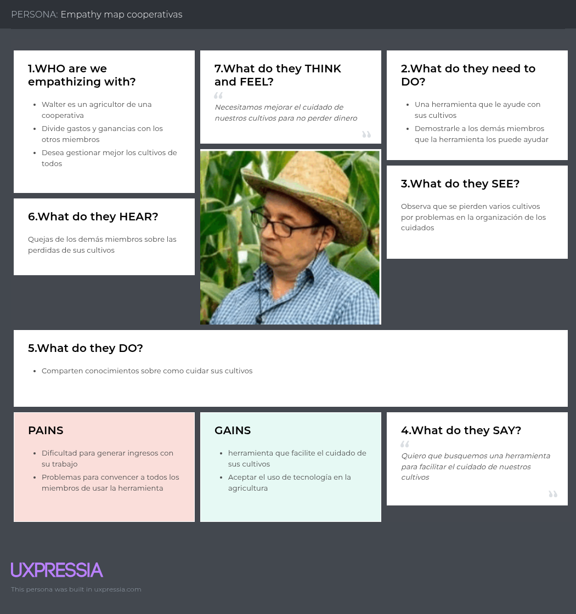

# WaruSmart-Codex-Report

Report of WaruSmart from startup Codex, we are giving information about all lifecycle of this solution. Educational prupouse only.

<h1 style="text-align: center;"> Informe del Trabajo Final </h1>
<h3 style="text-align: center;"> Universidad Peruana de Ciencias Aplicadas </h3>

<tr>
  

    
    

</tr>

<h5 style="text-align: center"> Ingeniería de Software </h5>

<h5 style="text-align: center"> Desarrollo de Soluciones IOT - 1ASI0572 </h5>

<h5 style="text-align: center"> NRC: 2947 </h5>

<h5 style="text-align: center"> Docente: Angel Augusto Velasquez Nuñez </h5>

<h5 style="text-align: center"> Startup: Codex </h5>

<h5 style="text-align: center"> Producto: WaruSmart </h5>

## Team members:

|               Nombre               |  Código  |
| :--------------------------------: | :--------: |
|  Anderson Walter Macedo Calsina  | U20201C179  |
|  Cabrera Camizan, Jeferson Smith  | U20211C211 |
| More Rondon, Christopher Sebastian | U202212199 |
|  Quispe Condori, Fernando Daniel  | U20221C628 |
|      Velasquez Pizarro, Jair      | U202218114 |

<h5 style="text-align: center"> Ciclo 2025-01 </h5>

### Registro de Informes

| Versión | Fecha       | Autor                              | Descripción                                            | Estado     |
| -------- | ----------- | ---------------------------------- | ------------------------------------------------------- | ---------- |
| 1.0      | 10/04/2025  | More Rondon, Christopher Sebastian | Creación del documento de trabajo en formato markdown. | Completado |
| 1.0      | 15/04/(2025 | Quispe Condori, Fernando Daniel    | Redacción del perfil de la solución y startup         | --         |

### Project Report Collaboration Insights

URL del repositorio para el reporte del proyecto:

TB1
Para el desarrollo del informe perteneciente a la entrega TB1, se dividió la implementación de secciones de la siguiente forma
para cada integrante del equipo:

| Integrante | Tareas Asignadas |
| ---------- | ---------------- |
| ---        | ---              |

## Contenido

1. **Capítulo I: Introducción.**
2. ...

### Studen Outcome

| **Criterio específico**                                                                  | **Acciones realizadas** | **Conclusiones** |
| ----------------------------------------------------------------------------------------------- | ----------------------------- | ---------------------- |
| Trabaja en equipo para proporcionar liderazgo en forma conjunta                                 | ---                           | ---                    |
| Crea un entorno colaborativo e inclusivo, establece metas, planifica tareas y cumple objetivos. | ---                           | ---                    |

## Capítulo I: Introducción.

### 1.1 **Startup Profile.**

#### 1.1.1   Descripción del startup

WaruSmart es una startup peruana creada por estudiantes de la Universidad Peruana de Ciencias Aplicadas (UPC) que desarrolla soluciones IoT para optimizar el riego en el sector agrícola mediante sensores de humedad, temperatura, clima, entre otros. Permitiendo a los agricultores gestionar el riego de forma automática o manual, visualizar datos en tiempo real a través de una app móvil y web, recibir alertas por condiciones críticas y acceder a un historial de datos por parcela, con un modelo de negocio basado en la venta de kits IoT y suscripciones para funciones avanzadas.

#### 1.1.2   Perfiles de integrantes del equipo

| Perfil                                                                                                                   | Foto |
| ------------------------------------------------------------------------------------------------------------------------ | ---- |
| Nombre: Fernando Daniel Quispe Condori Carrera: Ingeniería de Software Código: U20221C628 Descripción: |      |
| Nombre: Anderson Walter Macedo Calsina Carrera: Ingeniería de Software Código: U20201C179 Descripción: Soy Anderson Walter Macedo Calsina, tengo 22 años y actualmente estoy estudiando Ingeniería de Software en la UPC. Me gusta colaborar con mis compañeros y contribuir en proyectos conjuntos. Estoy dispuesto a contribuir a mi equipo en el desarrollo del proyecto con los conocimientos que he ido adquiriendo. |      |
| Nombre: Christopher Sebastian More Rondon Carrera Ingeniería de Software: Código: U202212199 Descripción: Soy estudiante del septimo ciclo de Ingenieria de Software, actualmente tengo 20 años. Soy un estudiante que colabora constantemente en el desarrollo de los projectos, asi como dar soluciones creativas a los problemas que surgan durante la creacion de estos. Siempre me esfuerzo por entregar un buen trabajo. |      |
| Nombre:Carrera: Código: Descripción:                                                                              |      |
| Nombre:Carrera: Código: Descripción:                                                                              |      |
| Nombre:Carrera: Código: Descripción:                                                                              |      |
| Nombre: Carrera:  Código:  Descripción:                                                               |      |

### 1.2 **Solution Profile.**

#### 1.2.1   Antecedentes y problemática

###### Antecedentes

En el contexto actual peruano, la agricultura enfrenta desafíos significativos debido al cambio climático, la escasez de agua y la necesidad de aumentar la productividad para satisfacer la creciente demanda de alimentos. Según la FAO, el sector agrícola consume aproximadamente el 70% del agua dulce disponible a nivel mundial, lo que resalta la importancia de optimizar el uso de este recurso. En Perú, donde la agricultura es una actividad económica clave, muchos agricultores aún dependen de métodos tradicionales de riego que no son eficientes y generan desperdicio de agua. Además, el acceso limitado a tecnologías avanzadas dificulta la adopción de prácticas de agricultura inteligente, especialmente en comunidades rurales.

###### Problemática

La problemática principal radica en la falta de herramientas accesibles y efectivas para gestionar el riego de manera eficiente en los campos de cultivo. Esto genera un uso excesivo de agua, costos elevados y una menor productividad agrícola. **Los agricultores necesitan soluciones tecnológicas que les permitan monitorear en tiempo real las condiciones del suelo y el clima, automatizar el riego y recibir alertas ante situaciones críticas.** Sin embargo, las opciones disponibles en el mercado suelen ser costosas o complejas, lo que limita su adopción por parte de pequeños y medianos agricultores. Esta brecha tecnológica afecta no solo la sostenibilidad del sector agrícola, sino también la seguridad alimentaria y el desarrollo económico de las comunidades rurales.

###### Aplicación de las 5 W’s y 2 H’s

-**Who**: Los actores clave involucrados son los agricultores individuales, ONGs y entidades públicas que promueven la agricultura sostenible. Estos grupos han sido identificados en estudios del Ministerio de Agricultura de Perú y del Instituto Nacional de Innovación Agraria como pilares fundamentales para la adopción de tecnologías que impulsen la transformación digital y la eficiencia en el manejo de recursos hídricos. https://www.gob.pe/institucion/midagri/noticias/815784-midagri-inicia-la-transformacion-digital-de-la-agricultura-familiar

-**What**: La propuesta se centra en la optimización del riego a través de una solución IoT accesible y eficiente. Investigaciones publicadas por la FAO y estudios sobre agricultura inteligente en América Latina resaltan la capacidad de estas tecnologías para transformar prácticas tradicionales en métodos de riego más precisos, contribuyendo a una gestión sostenible y a una mayor productividad. https://www.fao.org/family-farming/detail/es/c/1612596/

-**Where**: La implementación se orienta hacia campos de cultivo en Perú, particularmente en zonas rurales donde el acceso a tecnologías avanzadas es limitado. Informes del Banco Mundial y análisis de desarrollo regional destacan que estas áreas requieren intervención tecnológica para mejorar la eficiencia en el uso de recursos y enfrentar desafíos climáticos.

-**When**: La necesidad de esta solución es urgente en el contexto actual marcado por el cambio climático y la creciente demanda de alimentos. Reportes del IPCC y estudios de la FAO subrayan que el momento presente es crítico para implementar soluciones innovadoras que mitiguen el impacto ambiental y aseguren la producción alimentaria a largo plazo.

-**Why**: La motivación principal es reducir el desperdicio de agua, aumentar la productividad agrícola y promover la sostenibilidad en el sector. Comparativas de técnicas de riego y análisis del Ministerio de Agricultura evidencian cómo una gestión más inteligente del agua puede generar beneficios económicos y medioambientales para los agricultores y la sociedad en general.

-**How**: La solución propuesta utiliza sensores IoT para medir variables críticas como la humedad del suelo, temperatura y condiciones climáticas, combinados con un sistema de automatización del riego y una plataforma digital para monitoreo en tiempo real. Casos de éxito en el ámbito del smart farming y estudios técnicos en publicaciones especializadas demuestran la viabilidad y eficacia de esta integración tecnológica.

-**How Much**: El enfoque de monetización se basa en la venta de kits IoT y la oferta de suscripciones accesibles para acceder a funciones avanzadas del sistema. Modelos de negocio analizados en reportes de financiamiento agrícola y tendencias de inversiones en AgTech confirman que esta estructura permite un equilibrio entre financiación inicial y sostenibilidad económica a través de ingresos recurrentes.

#### 1.2.2   Lean UX Process.

#### 1.2.2.1 Lean UX Problem Statements

A continuación se presentan los statements del proceso Lean Ux dónde se incluyen aspectos como domain, customer segments, pain points, gap, visión/strategy, e initial segment.

WaruSmart, nuestra herramienta de riego automatizado, fue diseñada para ofrecer a los agricultores, tanto novatos , expertos y compañias especializadas una solución para un control en el riego, automatizando este proceso a través de tecnologías IoT de manera eficiente y sencilla. El objetivo es garantizar un proceso agrícola automatizado evitando las fallas humanas que puedan existir y de esta manera ofrecer servicios de visualización de una data organizada y precisa de cómo va la gestión de sus cultivos.

La adopción de kas tecnologías IoT en la agricultura puede ser un desafío debido a la desconfianza o falta de experiencia en el sector entre los agricultores. A pesar de esto, estudios muestran que aquellos que utilizan herramientas digitales para gestionar sus cultivos tienden a lograr mejores resultados, como mayores rendimientos y menor desperdicio de recursos. Por lo tanto, nuestro desafío es: **¿Cómo podemos automatizar el proceso de riego agrícola, superando las barreras de confianza y asegurando que los agricultores vean beneficios tangibles, como una mayor productividad y eficiencia?**

Para abordar esta pregunta, necesitamos centrarnos en las siguientes directrices:

* Enfoque centrado en el cliente: La solución debe ser fácil de usar y entender para agricultores para cualquier nivel de experiencia en el área tecnológica que posean, siempre priorizando el feedback y mejoras que nuestros clientes puedan alcanzarnos.
* Alcance claro: Nos centraremos en la automatización del riego de cultvos en tecnologías Iot, excluyendo la gestión operativa (Cantidad de cultivos, tipos, productos usados, etc).
* Medidas de éxito: El éxito se medirá por la reducción de tiempo en el proceso de riego y la mejora en la cantidad de producción y calidad de producto, recopilando data que nos permitirá visualizar el estado de mejora de los cultivos de nuestros clientes.

#### 1.2.2.2 Lean UX Assumptions.

###### **Business Assumptions:**

1. **Creemos que nuestros usuarios necesitan** una gestión automatizada e inteligente del riego de sus cultivos, permitiendo monitorear condiciones ambientales y ajustar el riego en tiempo real.
2. **Estas necesidades se pueden satisfacer con** el desarrollo de WaruSmart, una plataforma IoT integrada con sensores y una interfaz web que garantice el registro preciso y la automatización del riego.
3. **Nuestros clientes iniciales serán** agricultores que buscan modernizar sus métodos tradicionales de riego, desde pequeños productores hasta empresas agrícolas en expansión.
4. **El valor más importante que quiere un cliente de nuestros servicios es** la seguridad de que sus cultivos reciben la cantidad óptima de agua en el momento justo, reduciendo desperdicios y aumentando la productividad.
5. **El cliente también va a obtener** datos en tiempo real, alertas automáticas y análisis estadísticos del desempeño de sus cultivos, facilitando decisiones informadas para la optimización de recursos.
6. **Vamos a obtener la mayoría de los clientes mediante** alianzas estratégicas con asociaciones agrícolas, demostraciones en campo y campañas dirigidas en foros y redes sociales especializadas en tecnología agrícola.
7. **Vamos a obtener ingresos mediante** un modelo de suscripción escalonado que ofrezca planes básicos y avanzados, complementado con la venta de kits de sensores IoT y dispositivos de automatización.
8. **Nuestra competencia en el mercado serán** soluciones tradicionales de riego manual y otras plataformas digitales con menor integración IoT y análisis en tiempo real.
9. **Vamos a tener ventaja frente a nuestra competencia debido a** la integración completa de sensores precisos, análisis predictivo y una interfaz intuitiva, accesible tanto para agricultores novatos como experimentados.
10. **El mayor riesgo del producto es** no lograr que el sector agrícola, usualmente reacio a cambios, confíe en nuevas tecnologías. Este reto se mitigará mediante soporte técnico continuo y capacitaciones prácticas.
11. **Lo resolveremos realizando** pruebas de campo, incorporando feedback de los usuarios y actualizando la plataforma de manera iterativa para garantizar un sistema robusto, confiable y adaptable a las necesidades reales de los agricultores.

###### **User Assumptions:**

###### **¿Quién es el usuario?**

El usuario de WaruSmart es un agricultor que busca modernizar y optimizar el riego de sus cultivos. Este segmento abarca tanto a agricultores tradicionales que desean incursionar en la digitalización, como a productores profesionales que quieren maximizar la eficiencia del uso del agua.

###### **¿Qué problemas tiene nuestro producto? ¿Resolver?**

El principal reto es la gestión manual del riego, que propicia ineficiencias y errores en la asignación de recursos hídricos. WaruSmart aborda este problema ofreciendo automatización, monitoreo en tiempo real y alertas predictivas para asegurar un riego óptimo y evitar la pérdida de agua.

###### **¿Qué características son importantes?**

Es crucial que la plataforma tenga:
- Integración de sensores IoT para monitoreo en tiempo real.
- Funcionalidades de alerta y notificaciones ante condiciones críticas.
- Herramientas de análisis y visualización de datos históricos para la toma de decisiones.
- Un ecosistema amigable con el usuario agrícola factible de entender y manejar.

###### **¿Dónde encaja nuestro producto en su trabajo o vida?**

WaruSmart se integra en las labores diarias del agricultor, facilitando la supervisión remota y el control automatizado del riego, lo que permite dedicar más tiempo a otras tareas esenciales y optimizar la producción y calidad agrícola.

###### **¿Cuándo y cómo es nuestro producto usado?**

El sistema se utiliza durante el ciclo completo del cultivo. Los sensores envían datos continuamente, permitiendo ajustes inmediatos al riego y un control constante de las condiciones ambientales, desde la preparación del terreno hasta la cosecha.

###### **¿Cómo debe verse nuestro producto y cómo debe comportarse?**

El sistema WaruSmart es un producto de confianza respaldado por datos precisos y validados gracias a la integración de tecnologías IoT de última generación. La aplicación ofrecerá una interfaz web robusta y responsiva, que no solo facilitará una navegación intuitiva, sino que además garantizará la integridad y exactitud de cada registro y alerta. De esta forma, se asegura una experiencia de usuario de alta calidad y la provisión de datos confiables para análisis avanzados en data analytics.

###### **Feature Assumptions:**

**Creemos que** la integración de análisis predictivo basado en datos históricos permitirá a los agricultores anticipar las necesidades de riego y optimizar recursos de manera proactiva.

**Creemos que** la incorporación de notificaciones y alertas automáticas incrementará la efectividad del monitoreo, evitando situaciones de riego excesivo o insuficiente.

**Creemos que** la posibilidad de visualizar gráficos y tendencias en tiempo real empoderará a los usuarios para tomar decisiones informadas sobre el manejo de sus cultivos.

#### 1.2.2.3 Lean UX Hypothesis Statements.

## Lean UX Hypothesis Statements

**Hypothesis Statement 01:**

**Creemos** que automatizar el riego mediante sensores IoT aumentará la eficiencia en el uso del agua, beneficiando tanto a agricultores tradicionales como modernos.  
**Sabremos** que hemos tenido éxito cuando se registre una reducción del consumo de agua en al menos un 20% y una mejora significativa en la productividad de los cultivos en 30% más de productividad.

**Hypothesis Statement 02:**

**Creemos** que una interfaz limpia e intuitiva facilitará la adopción del sistema al eliminar barreras tecnológicas para usuarios de distintos niveles de experiencia.  
**Sabremos** que hemos tenido éxito cuando al menos el 70% de los usuarios califiquen la interfaz como "muy fácil de usar" en las encuestas de satisfacción.

**Hypothesis Statement 03:**

**Creemos** que la integración de alertas en tiempo real y análisis predictivo reducirá errores manuales y optimizará la productividad de los cultivos.  
**Sabremos** que hemos tenido éxito cuando se observe una disminución del 30% en la incidencia de errores durante el riego.

**Hypothesis Statement 04:**

**Hipotetizamos** que el modelo de negocio basado en suscripciones y venta de kits IoT es viable y sostenible, permitiendo la expansión y mejora continua de la plataforma.  
**Sabremos** que hemos tenido éxito cuando se registre un crecimiento mensual en ingresos del 15% y se establezcan alianzas estratégicas que impulsen la adopción del sistema.

#### 1.2.2.4 Lean UX Canvas.

A continuación se presenta el Lean UX Canvas realizado para la problemática:

#TODO: Imagen de Lean UX Canvas

### 1.3 **Segmentos Objetivos.**

#### Agricultores Individuales
- Representan productores que gestionan sus cultivos de manera autónoma.
- Buscan soluciones tecnológicas para automatizar y optimizar el riego, reduciendo desperdicios y mejorando la productividad.
- Valoran interfaces simples, alertas en tiempo real y herramientas de análisis que faciliten la toma de decisiones.
- Requieren soporte técnico y capacitaciones que faciliten la transición hacia tecnologías IoT.

#### ONG y/o Entidades Públicas
- Agrupan organizaciones enfocadas en promover la agricultura sostenible y la optimización de recursos hídricos.
- Interesadas en impulsar políticas públicas y proyectos de impacto social que favorezcan el desarrollo agrario.
- Buscan soluciones que permitan un monitoreo centralizado y análisis de datos para implementar estrategias de mejora en comunidades rurales.
- Actúan como facilitadoras en la difusión y adopción de innovaciones tecnológicas en el sector agrícola.

## Capítulo II: Requirements Elicitation & Analysis.

### 2.1 **Competidores.**

#### 2.1.1   Análisis competitivo.

|                                                         | WaruSmart | Agrobit | Netafirm | Irritec |
| ------------------------------------------------------- | --------- | ------- | -------- | ------- |
| PERFIL                                                  |           |         |          |         |
| Overview                                                | Solución digital peruana enfocada en la gestión eficiente del riego para agricultores individuales y cooperativas agrarias.	| ---	| ---	| --- |
| Ventaja competitiva ¿Qué valor ofrece a los clientes? | Solución accesible y adaptada a pequeños y medianos agricultores peruanos, con enfoque en facilidad de uso. | ---     | ---      | ---     |
| PERFIL DE MARKETING                                     |           |         |          |         |
| M4ercado Objetivo                                       | Agricultores individuales y cooperativas agrarias en Perú.	| ---     | ---      | ---     |
| Estrategias de Marketing                                | Implementación de pilotos gratuitos en parcelas de agricultores locales (modelo freemium) para demostrar los beneficios del sistema. Los casos de éxito se usarán como referencia en nuevas campañas. | ---     | ---      | ---     |
| PERFIL DE PRODUCTO                                      |           |         |          |         |
| Productos & Servicios                                   | Kits IoT para riego, plataforma web y móvil para monitoreo y control, alertas y análisis de datos.	| ---     | ---      | ---     |
| Precios & Costos                                        | Modelo de suscripción escalonado con kits IoT accesibles para pequeños y medianos agricultores. | ---     | ---      | ---     |
| Canales de distribución (Web y/o Móvil)               | Plataforma web y aplicación móvil para Android e iOS.	| ---     | ---      | ---     |
| ANALISIS SWOT                                           |           |         |          |         |
| Fortalezas                                              | Adaptación al contexto local, facilidad de uso, soporte técnico cercano.	| ---     | ---      | ---     |
| Debilidades                                             | Limitada experiencia en el mercado, recursos limitados para expansión.	| ---     | ---      | ---     |
| Oportunidades                                           | Creciente demanda de soluciones tecnológicas en la agricultura peruana, apoyo gubernamental. | ---     | ---      | ---     |
| Amenazas                                                | Competencia de grandes empresas, resistencia al cambio por parte de agricultores tradicionales.	| ---     | ---      | ---     |

#### 2.1.2   Estrategias y tácticas frente a competidores.

AFRONTAR LAS FORTALEZAS: Para

APROVECHAR LAS DEBILIDADES: Para

OPORTUNIDADES Y AMENAZAS DE LA COMPETENCIA: Para

### 2.2 **Entrevistas**

#### 2.2.1   Diseño de entrevistas.

A continuacion se mostrara las preguntas que se le realizaron a los entrevistados en busca de obtener la mejor informacion posible para nuestra solucion

<h4>PREGUNTAS GENERALES:</h4>

1. Presentese con su nombre, lugar de residencia y edad 

2. ¿Suele hacer uso de la tecnología en el día a día? 

3. ¿Tiene dificultades al usar aparatos digitales?

<h4>PREGUNTAS PARA AGRICULTORES INDIVIDUALES:</h4>

4. ¿De que manera lleva el registros de los riegos a sus cultivos?

5. ¿Que datos considera mas relevantes para el cuidado de sus cultivo?

6. ¿En alguna ocasion ha tenido problemas con el registro del riego a sus cultivos?. Si es asi, ¿le ha provocado perdidas economica o de tiempo?

7. ¿Alguna vez ha experimentado problemas para regar sus plantaciones?. Si es asi, ¿que suele hacer en esas situaciones?

8. (Comentar la propuesta) ¿Estaria interesado en este sistema para ayudarle con el riego? ¿Por qué?

9. ¿Cuanto estaria dispuesto a pagar por el servicio?

10. ¿Cree que esta clase de herramientas podrían facilitar el trabajo a otros agricultores?

<h4>PREGUNTAS PARA MIEMBROS DE COOPERATIVAS AGRARIAS:</h4>

4. ¿Como registran las necesidades de los cultivos de la cooperativa?

5. ¿Los miembros suelen tener problemas para la gestion de sus cultivos?

6. ¿De que manera se organizan para conseguir los materiales necesarios con los que cuidar los cultivos?

7. ¿Han tenido perdidas por las dificultades de organizar tantos cultivos?

8. ¿Suelen usar herramientas para facilitar el cuidado de cultivos?. Si es asi, ¿cuales?

9. (Comentar la propuesta) ¿Cree que este sistema ayudaria a facilitar su trabajo?

10. ¿Cuanto estarian dispuestos a pagar por el sistema?

#### 2.2.2   Registro de entrevistas.

#### 2.2.3   Análisis de entrevistas.

### 2.3 **Needfinding.**

#### 2.3.1   User Personas.

**SEGMENTO AGRICULTORES:**

**SEGMENTO COOPERATIVAS:**

#### 2.3.2   User Task Matrix.

| Tareas                                                         | Agricultores Importancia | Agricultores Frecuencia | Cooperativas Importancia | Cooperativas Frecuencia |
|----------------------------------------------------------------|:------------------------:|:-----------------------:|:------------------------:|:-----------------------:|
| Realizar el riego de los cultivos                              |           Alta           | Alta                    | Alta                     | Alta                    |
| Escuchar o indagar recomendaciones                             |           Alta           | Media                   | Alta                     | Media                   |
| Verificar humedad del cultivo                                  |           Alta           | Media                   | Alta                     | Alta                    |
| Conocimiento de problemas en los cultivos                      |           Alta           | Alta                    | Alta                     | Alta                    |
| Determinar etapa del desarrollo del cultivo                    |           Alta           | Alta                    | Media                    | Media                   |
| Revisión de calidad en la cosecha                              |           Alta           | Media                   | Alta                     | Alta                    |
| Revisar el registro de los cultivos                            |           Alta           | Alta                    | Media                    | Media                   |

#### 2.3.3   User Journey Mapping.

**SEGMENTO AGRICULTORES:**

**SEGMENTO COOPERATIVAS:**

#### 2.3.4   Empathy Mapping.

**SEGMENTO AGRICULTORES:**

**SEGMENTO COOPERATIVAS:**

#### 2.3.5   As-Is Scenario Mapping.

**SEGMENTO AGRICULTORES:**

|           | Monitoreo de cultivo     | Riego de cultivo       | Cosecha               | Control de calidad              |
|-----------|:------------------------:|:----------------------:|:---------------------:|:-------------------------------:|
| DOING     | Monitorea visualmente usando sus conocimientos | Riega a una hora determinada usando diversas tecnicas | Realiza la cosecha en la fecha determinada | Verifica los cultivos fallidos |
| THINKING  | Se ven bien, espero no estar olvidando algun detalle | Espero no estar regando de más algun cultivo | La cosecha parece tener problemas | Mi margen de ganancias no sera demasiado grande |
| FEELING   | Me preovupa estar ignorando algo | Me pone ansioso no saber con certeza si el riego es correcto | Me disgusta ver que varios cultivos no se encuentren bien | Me molesta no haber ganado más dinero con mi trabajo |

**SEGMENTO COOPERATIVAS:**

|           | ""     | ""       | ""               | ""              |
|-----------|:------------------------:|:----------------------:|:---------------------:|:-------------------------------:|
| DOING     |                     |                  |                |                           |
| THINKING  |                     |                  |                |                           |
| FEELING   |                     |                  |                |                           |

### 2.4 **Ubiquitous Language.**

## Capítulo III: Requirements Specification.

### 3.1 **To-Be Scenario Mapping.**

### 3.2 **User Stories.**

### 3.3 **Impact Mapping.**

### 3.4 **Product Backlog.**

## Capítulo IV: Solution Software Design
